# 23.5.1 Jointed material model


**Product: **Abaqus/Standard  

##### **References**

- ["Orientations," Section 2.2.5](pt01ch02s02aus15.md)
- ["Material library: overview," Section 21.1.1](pt05ch21s01abo18.md)
- ["Inelastic behavior," Section 23.1.1](pt05ch23s01abo20.md)
- [*JOINTED MATERIAL](../key/key-link.md#usb-kws-mjointedmat)

### Overview

The jointed material model:
- is intended to provide a simple continuum model for a material containing a high density of parallel joint surfaces where each system of parallel joints is associated with a particular orientation, such as sedimentary rock;
- assumes that the spacing of the joints of a particular orientation is sufficiently close compared to characteristic dimensions in the domain of the model such that the joints can be smeared into a continuum of slip systems;
- provides for opening or frictional sliding of the joints in each of these systems (a "system" in this context is a joint orientation in a particular direction at a material calculation point); and
- assumes that the elastic behavior of the material is isotropic and linear when all joints at a point are closed (isotropic linear elastic behavior must be included in the material definition; see ["Defining isotropic elasticity" in "Linear elastic behavior," Section 22.2.1](pt05ch22s02abm02.md#usb-mat-clinearelastic-isotropic)).

### Joint opening/closing

The jointed material model is intended primarily for applications where the stresses are mainly compressive. The model provides a joint opening capability when the stress normal to the joint tries to become tensile. In this case the stiffness of the material normal to the joint plane becomes zero instantaneously. Abaqus/Standard uses a stress-based joint opening criterion, whereas joint closing is monitored based on strain. Joint system *a* opens when the estimated pressure stress across the joint (normal to the joint surface) is no longer positive: 


In this case the material is assumed to have no elastic stiffness with respect to direct strain across the joint system. Open joints thus create anisotropic elastic response at a point. The joint system remains open so long as 

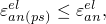

where  is the component of direct elastic strain across the joint and  is the component of direct elastic strain across the joint calculated in plane stress as 


where *E* is the Young's modulus of the material,  is the Poisson's ratio, and 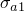, 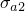 are the direct stresses in the plane of the joint.

The shear response of open joints is governed by the shear retention parameter, 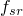, which represents the fraction of the elastic shear modulus retained when the joints are open (=0 means no shear stiffness associated with open joints, while =1 corresponds to elastic shear stiffness in open joints; any value between these two extremes can be used). When a joint opens, the shear behavior may be brittle, depending on the shear retention factor used for open joints. In addition, the stiffness of the material normal to the joint plane suddenly goes to zero. For these reasons, in situations where the confining stresses are low or significant regions experience tensile behavior, the joint systems may experience a sequence of alternate opening and closing states from iteration to iteration. Typically such behavior manifests itself as oscillating global residual forces. The convergence rate associated with such discontinuous behavior may be very slow and, thus, prohibit obtaining a solution. This type of failure is more probable in cases where more than one joint system is modeled.

#### Improving convergence when joints open and close repeatedly

When the repeated opening and closing of joints makes convergence difficult, you can improve convergence by preventing a joint from opening. In this case an elastic stiffness is always associated with the joint. It is most useful when the opening and closing of joints is limited to small regions of the model. You can prevent a joint from opening only when the joint direction is specified, as described below.

| **Input File Usage: ** | ``` [*JOINTED MATERIAL](../key/key-link.md#usb-kws-mjointedmat), NO SEPARATION, JOINT DIRECTION ``` |
| --- | --- |

#### Specifying nonzero shear retention in open joints

You must specify nonzero shear retention in open joints directly. The parameter  can be defined as a tabular function of temperature and predefined field variables.

| **Input File Usage: ** | ``` [*JOINTED MATERIAL](../key/key-link.md#usb-kws-mjointedmat), SHEAR RETENTION ``` |
| --- | --- |

### Compressive joint sliding

The failure surface for sliding on joint system *a* is defined by 

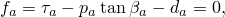

where 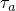 is the magnitude of the shear stress resolved onto the joint surface,  is the normal pressure stress acting across the joint,  is the friction angle for system *a*, and  is the cohesion for system *a*. So long as 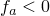, joint system *a* does not slip. When 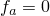, joint system *a* slips. The inelastic (“plastic”) strain on the system is given by 

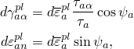

where 

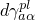

is the rate of inelastic shear strain in direction  on the joint surface ( are orthogonal directions on the joint surface),


is the magnitude of the inelastic strain rate,

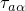

is a component of the shear stress on the joint surface,

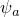

is the dilation angle for this joint system (choosing 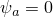 provides pure shear flow on the joint, while  causes dilation of the joint as it slips), and

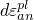

is the inelastic strain normal to the joint surface.

The sliding of the different joint systems at a point is independent, in the sense that sliding on one system does not change the failure criterion or the dilation angle for any other joint system at the same point.

Up to three joint directions can be included in the material description. The orientations of the joint directions are given by referring to the names of user-defined local orientations (["Orientations," Section 2.2.5](pt01ch02s02aus15.md)) that define the joint orientations in the original configuration. Output of stress and strain components is in the global directions unless a local orientation is also used in the material's section definition.

The parameters , , and  can be specified as tabular functions of temperature and/or predefined field variables for each joint direction.

| **Input File Usage: ** | Use both of the following options: |
| --- | --- |
|  | ``` [*ORIENTATION](../key/key-link.md#usb-kws-morientation), NAME=*name* [*JOINTED MATERIAL](../key/key-link.md#usb-kws-mjointedmat), JOINT DIRECTION=*name* ``` Repeat the [*JOINTED MATERIAL](../key/key-link.md#usb-kws-mjointedmat) option for each direction to be specified, up to three times. |

#### Joint directions and finite rotations

In geometrically nonlinear analysis steps the joint directions always remain fixed in space.

### Bulk failure

In addition to the joint systems, the jointed material model includes a bulk material failure mechanism, which is based on the Drucker-Prager failure criterion: 


where 


is the Mises equivalent deviatoric stress,


is the deviatoric stress,

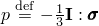

is the equivalent pressure stress,

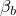

is the friction angle for the bulk material, and


is the cohesion for the bulk material.

If this failure criterion is reached, the bulk inelastic flow is defined by 

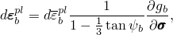

where 

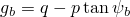

is the flow potential. Here 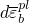 is the magnitude of the inelastic flow rate (chosen so that 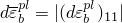 in uniaxial compression in the 1-direction), and  is the dilation angle for the bulk material. This bulk failure model is a simplified version of the extended Drucker-Prager model (["Extended Drucker-Prager models," Section 23.3.1](pt05ch23s03abm30.md)). This bulk failure system is independent of the joint systems in that bulk inelastic flow does not change the behavior of any joint system.

If bulk material failure is to be modeled, a jointed material behavior must be specified to define the parameters associated with bulk material failure behavior. Thus, up to five jointed material behaviors can appear in the same material definition: three joint directions, shear retention in open joints, and bulk material failure.

The parameters , , and  can be specified as a tabular function of temperature and/or predefined field variables.

| **Input File Usage: ** | ``` [*JOINTED MATERIAL](../key/key-link.md#usb-kws-mjointedmat) (the JOINT DIRECTION parameter must be omitted) ``` |
| --- | --- |

### Nonassociated flow

If  in any joint system, whether it be associated with the joint surfaces or the bulk material, the flow in that system is “nonassociated.” The implication is that the material stiffness matrix is not symmetric. Therefore, the unsymmetric matrix solution scheme should be used for the analysis step (["Defining an analysis," Section 6.1.2](pt03ch06s01abo05.md)), especially when large regions of the model are expected to flow plastically and when the difference between  and  is large. If the difference between  and  is not large, a symmetric approximation to the matrix can provide an acceptable rate of convergence of the equilibrium equations and, hence, a lower overall solution cost. Therefore, the unsymmetric matrix solution scheme is not invoked automatically when jointed material behavior is defined.

### Elements

The jointed material model can be used with plane strain, generalized plane strain, axisymmetric, and three-dimensional solid (continuum) elements in Abaqus/Standard. This model cannot be used with elements for which the assumed stress state is plane stress (plane stress, shell, and membrane elements).


