# 23.6.1 Concrete smeared cracking


**Products: **Abaqus/Standard  Abaqus/CAE  

##### **References**

- ["Material library: overview," Section 21.1.1](pt05ch21s01abo18.md)
- ["Inelastic behavior," Section 23.1.1](pt05ch23s01abo20.md)
- [*CONCRETE](../key/key-link.md#usb-kws-mconcrete)
- [*TENSION STIFFENING](../key/key-link.md#usb-kws-mtensionstiff)
- [*SHEAR RETENTION](../key/key-link.md#usb-kws-mshearretention)
- [*FAILURE RATIOS](../key/key-link.md#usb-kws-mfailureratios)
- ["Defining concrete smeared cracking" in "Defining plasticity," Section 12.9.2 of the Abaqus/CAE User's Guide](../usi/usi-link.md#usi-prp-mechanical-plastic-concretesmeared)

### Overview

The smeared crack concrete model in Abaqus/Standard:
- provides a general capability for modeling concrete in all types of structures, including beams, trusses, shells, and solids;
- can be used for plain concrete, even though it is intended primarily for the analysis of reinforced concrete structures;
- can be used with rebar to model concrete reinforcement;
- is designed for applications in which the concrete is subjected to essentially monotonic straining at low confining pressures;
- consists of an isotropically hardening yield surface that is active when the stress is dominantly compressive and an independent "crack detection surface" that determines if a point fails by cracking;
- uses oriented damaged elasticity concepts (smeared cracking) to describe the reversible part of the material's response after cracking failure;
- requires that the linear elastic material model (see ["Linear elastic behavior," Section 22.2.1](pt05ch22s02abm02.md)) be used to define elastic properties; and
- cannot be used with local orientations (see ["Orientations," Section 2.2.5](pt01ch02s02aus15.md)).

See ["Inelastic behavior," Section 23.1.1](pt05ch23s01abo20.md), for a discussion of the concrete models available in Abaqus.

### Reinforcement

Reinforcement in concrete structures is typically provided by means of rebars, which are one-dimensional strain theory elements (rods) that can be defined singly or embedded in oriented surfaces. Rebars are typically used with metal plasticity models to describe the behavior of the rebar material and are superposed on a mesh of standard element types used to model the concrete.

With this modeling approach, the concrete behavior is considered independently of the rebar. Effects associated with the rebar/concrete interface, such as bond slip and dowel action, are modeled approximately by introducing some “tension stiffening” into the concrete modeling to simulate load transfer across cracks through the rebar. Details regarding tension stiffening are provided below.

Defining the rebar can be tedious in complex problems, but it is important that this be done accurately since it may cause an analysis to fail due to lack of reinforcement in key regions of a model. See ["Defining reinforcement," Section 2.2.3](pt01ch02s02aus13.md), for more information regarding rebars.

### Cracking

The model is intended as a model of concrete behavior for relatively monotonic loadings under fairly low confining pressures (less than four to five times the magnitude of the largest stress that can be carried by the concrete in uniaxial compression).

#### Crack detection

Cracking is assumed to be the most important aspect of the behavior, and representation of cracking and of postcracking behavior dominates the modeling. Cracking is assumed to occur when the stress reaches a failure surface that is called the “crack detection surface.” This failure surface is a linear relationship between the equivalent pressure stress, *p*, and the Mises equivalent deviatoric stress, *q*, and is illustrated in [Figure 23.6.1--5](pt05ch23s06abm37.md#cconcrete-yield-p-q). When a crack has been detected, its orientation is stored for subsequent calculations. Subsequent cracking at the same point is restricted to being orthogonal to this direction since stress components associated with an open crack are not included in the definition of the failure surface used for detecting the additional cracks.

Cracks are irrecoverable: they remain for the rest of the calculation (but may open and close). No more than three cracks can occur at any point (two in a plane stress case, one in a uniaxial stress case). Following crack detection, the crack affects the calculations because a damaged elasticity model is used. Oriented, damaged elasticity is discussed in more detail in ["An inelastic constitutive model for concrete," Section 4.5.1 of the Abaqus Theory Guide](../stm/stm-link.md#stm-mat-concrete).

#### Smeared cracking

The concrete model is a smeared crack model in the sense that it does not track individual “macro” cracks. Constitutive calculations are performed independently at each integration point of the finite element model. The presence of cracks enters into these calculations by the way in which the cracks affect the stress and material stiffness associated with the integration point.

### Tension stiffening

The postfailure behavior for direct straining across cracks is modeled with tension stiffening, which allows you to define the strain-softening behavior for cracked concrete. This behavior also allows for the effects of the reinforcement interaction with concrete to be simulated in a simple manner. Tension stiffening is required in the concrete smeared cracking model. You can specify tension stiffening by means of a postfailure stress-strain relation or by applying a fracture energy cracking criterion.

#### Postfailure stress-strain relation

Specification of strain softening behavior in reinforced concrete generally means specifying the postfailure stress as a function of strain across the crack. In cases with little or no reinforcement this specification often introduces mesh sensitivity in the analysis results in the sense that the finite element predictions do not converge to a unique solution as the mesh is refined because mesh refinement leads to narrower crack bands. This problem typically occurs if only a few discrete cracks form in the structure, and mesh refinement does not result in formation of additional cracks. If cracks are evenly distributed (either due to the effect of rebar or due to the presence of stabilizing elastic material, as in the case of plate bending), mesh sensitivity is less of a concern.

In practical calculations for reinforced concrete, the mesh is usually such that each element contains rebars. The interaction between the rebars and the concrete tends to reduce the mesh sensitivity, provided that a reasonable amount of tension stiffening is introduced in the concrete model to simulate this interaction ([Figure 23.6.1--1](pt05ch23s06abm37.md#cconcrete-ten-stiff)). 

**Figure 23.6.1–1** “Tension stiffening” model.

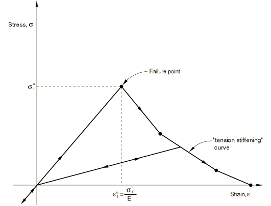

The tension stiffening effect must be estimated; it depends on such factors as the density of reinforcement, the quality of the bond between the rebar and the concrete, the relative size of the concrete aggregate compared to the rebar diameter, and the mesh. A reasonable starting point for relatively heavily reinforced concrete modeled with a fairly detailed mesh is to assume that the strain softening after failure reduces the stress linearly to zero at a total strain of about 10 times the strain at failure. The strain at failure in standard concretes is typically 104, which suggests that tension stiffening that reduces the stress to zero at a total strain of about 103 is reasonable. This parameter should be calibrated to a particular case.

The choice of tension stiffening parameters is important in Abaqus/Standard since, generally, more tension stiffening makes it easier to obtain numerical solutions. Too little tension stiffening will cause the local cracking failure in the concrete to introduce temporarily unstable behavior in the overall response of the model. Few practical designs exhibit such behavior, so that the presence of this type of response in the analysis model usually indicates that the tension stiffening is unreasonably low.

| **Input File Usage: ** | Use both of the following options: |
| --- | --- |
|  | ``` [*CONCRETE](../key/key-link.md#usb-kws-mconcrete) [*TENSION STIFFENING](../key/key-link.md#usb-kws-mtensionstiff), TYPE=STRAIN (default) ``` |

| **Abaqus/CAE Usage: ** | Property module: material editor: ****Mechanical****Plasticity****Concrete Smeared Cracking****: ****Suboptions****Tension Stiffening****: **Type: Strain** |
| --- | --- |

#### Fracture energy cracking criterion

As discussed earlier, when there is no reinforcement in significant regions of a concrete model, the strain softening approach for defining tension stiffening may introduce unreasonable mesh sensitivity into the results. Crisfield (1986) discusses this issue and concludes that Hillerborg's (1976) proposal is adequate to allay the concern for many practical purposes. Hillerborg defines the energy required to open a unit area of crack as a material parameter, using brittle fracture concepts. With this approach the concrete's brittle behavior is characterized by a stress-*displacement* response rather than a stress-*strain* response. Under tension a concrete specimen will crack across some section. After it has been pulled apart sufficiently for most of the stress to be removed (so that the elastic strain is small), its length will be determined primarily by the opening at the crack. The opening does not depend on the specimen's length ([Figure 23.6.1--2](pt05ch23s06abm37.md#cconcrete-frac-ener)).

**Figure 23.6.1–2** Fracture energy cracking model.

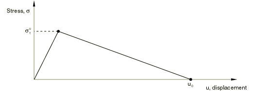

##### Implementation

The implementation of this stress-displacement concept in a finite element model requires the definition of a characteristic length associated with an integration point. The characteristic crack length is based on the element geometry and formulation:  it is a typical length of a line across an element for a first-order element; it is half of the same typical length for a second-order element. For beams and trusses it is a characteristic length along the element axis. For membranes and shells it is a characteristic length in the reference surface. For axisymmetric elements it is a characteristic length in the *r*–*z* plane only. For cohesive elements it is equal to the constitutive thickness. This definition of the characteristic crack length is used because the direction in which cracks will occur is not known in advance. Therefore, elements with large aspect ratios will have rather different behavior depending on the direction in which they crack: some mesh sensitivity remains because of this effect, and elements that are as close to square as possible are recommended.

This approach to modeling the concrete's brittle response requires the specification of the displacement 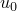 at which a linear approximation to the postfailure strain softening gives zero stress (see [Figure 23.6.1--2](pt05ch23s06abm37.md#cconcrete-frac-ener)).

The failure stress, 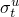, occurs at a failure *strain* (defined by the failure stress divided by the Young's modulus); however, the stress goes to zero at an ultimate *displacement*, , that is independent of the specimen length. The implication is that a displacement-loaded specimen can remain in static equilibrium after failure only if the specimen is short enough so that the strain at failure, 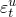, is less than the strain at this value of the displacement: 

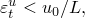

where *L* is the length of the specimen.

| **Input File Usage: ** | Use both of the following options: |
| --- | --- |
|  | ``` [*CONCRETE](../key/key-link.md#usb-kws-mconcrete) [*TENSION STIFFENING](../key/key-link.md#usb-kws-mtensionstiff), TYPE=DISPLACEMENT ``` |

| **Abaqus/CAE Usage: ** | Property module: material editor: ****Mechanical****Plasticity****Concrete Smeared Cracking****: ****Suboptions****Tension Stiffening****: **Type: ** **Displacement** |
| --- | --- |

##### Obtaining the ultimate displacement

The ultimate displacement, , can be estimated from the fracture energy per unit area, 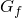, as 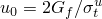, where  is the maximum tensile stress that the concrete can carry. Typical values for  are 0.05 mm (2  103 in) for a normal concrete to 0.08 mm (3  103 in) for a high strength concrete. A typical value for  is about 104, so that the requirement is that 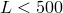 mm (20 in).

##### Critical length

If the specimen is longer than the critical length, *L*, more strain energy is stored in the specimen than can be dissipated by the cracking process when it cracks under fixed displacement. Some of the strain energy must, therefore, be converted into kinetic energy, and the failure event must be dynamic even under prescribed displacement loading. This implies that, when this approach is used in finite elements, characteristic element dimensions must be less than this critical length, or additional (dynamic) considerations must be included. The analysis input file processor checks the characteristic length of each element using this concrete model and will not allow any element to have a characteristic length that exceeds 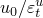. You must remesh with smaller elements where necessary or use the stress-strain definition of tension stiffening. Since the fracture energy approach is generally used only for plain concrete, this rarely places any limit on the meshing.

### Cracked shear retention

As the concrete cracks, its shear stiffness is diminished. This effect is defined by specifying the reduction in the shear modulus as a function of the opening strain across the crack. You can also specify a reduced shear modulus for closed cracks. This reduced shear modulus will also have an effect when the normal stress across a crack becomes compressive. The new shear stiffness will have been degraded by the presence of the crack.

The modulus for shearing of cracks is defined as 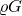, where *G* is the elastic shear modulus of the uncracked concrete and  is a multiplying factor. The shear retention model assumes that the shear stiffness of open cracks reduces linearly to zero as the crack opening increases: 

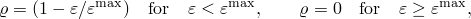

where  is the direct strain across the crack and  is a user-specified value. The model also assumes that cracks that subsequently close have a reduced shear modulus: 

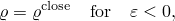

where you specify .

 and  can be defined with an optional dependency on temperature and/or predefined field variables. If shear retention is not included in the material definition for the concrete smeared cracking model, Abaqus/Standard will automatically invoke the default behavior for shear retention such that the shear response is unaffected by cracking (full shear retention). This assumption is often reasonable: in many cases, the overall response is not strongly dependent on the amount of shear retention.

| **Input File Usage: ** | Use both of the following options: |
| --- | --- |
|  | ``` [*CONCRETE](../key/key-link.md#usb-kws-mconcrete) [*SHEAR RETENTION](../key/key-link.md#usb-kws-mshearretention) ``` |

| **Abaqus/CAE Usage: ** | Property module: material editor: ****Mechanical****Plasticity****Concrete Smeared Cracking****: ****Suboptions****Shear Retention**** |
| --- | --- |

### Compressive behavior

When the principal stress components are dominantly compressive, the response of the concrete is modeled by an elastic-plastic theory using a simple form of yield surface written in terms of the equivalent pressure stress, *p*, and the Mises equivalent deviatoric stress, *q*; this surface is illustrated in [Figure 23.6.1--5](pt05ch23s06abm37.md#cconcrete-yield-p-q). Associated flow and isotropic hardening are used. This model significantly simplifies the actual behavior. The associated flow assumption generally over-predicts the inelastic volume strain. The yield surface cannot be matched accurately to data in triaxial tension and triaxial compression tests because of the omission of third stress invariant dependence. When the concrete is strained beyond the ultimate stress point, the assumption that the elastic response is not affected by the inelastic deformation is not realistic. In addition, when concrete is subjected to very high pressure stress, it exhibits inelastic response: no attempt has been made to build this behavior into the model.

The simplifications associated with compressive behavior are introduced for the sake of computational efficiency. In particular, while the assumption of associated flow is not justified by experimental data, it can provide results that are acceptably close to measurements, provided that the range of pressure stress in the problem is not large. From a computational viewpoint, the associated flow assumption leads to enough symmetry in the Jacobian matrix of the integrated constitutive model (the “material stiffness matrix”) such that the overall equilibrium equation solution usually does not require unsymmetric equation solution. All of these limitations could be removed at some sacrifice in computational cost.

You can define the stress-strain behavior of plain concrete in uniaxial compression outside the elastic range. Compressive stress data are provided as a tabular function of plastic strain and, if desired, temperature and field variables. Positive (absolute) values should be given for the compressive stress and strain. The stress-strain curve can be defined beyond the ultimate stress, into the strain-softening regime.

| **Input File Usage: ** | ``` [*CONCRETE](../key/key-link.md#usb-kws-mconcrete) ``` |
| --- | --- |

| **Abaqus/CAE Usage: ** | Property module: material editor: ****Mechanical****Plasticity****Concrete Smeared Cracking**** |
| --- | --- |

### Uniaxial and multiaxial behavior

The cracking and compressive responses of concrete that are incorporated in the concrete model are illustrated by the uniaxial response of a specimen shown in [Figure 23.6.1--3](pt05ch23s06abm37.md#cconcrete-uni-plain).

**Figure 23.6.1–3** Uniaxial behavior of plain concrete.

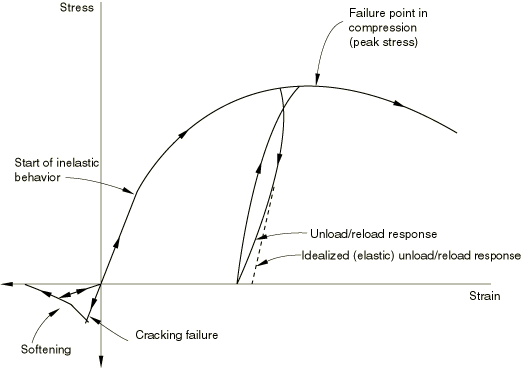

When concrete is loaded in compression, it initially exhibits elastic response. As the stress is increased, some nonrecoverable (inelastic) straining occurs and the response of the material softens. An ultimate stress is reached, after which the material loses strength until it can no longer carry any stress. If the load is removed at some point after inelastic straining has occurred, the unloading response is softer than the initial elastic response: the elasticity has been damaged. This effect is ignored in the model, since we assume that the applications involve primarily monotonic straining, with only occasional, minor unloadings. When a uniaxial concrete specimen is loaded in tension, it responds elastically until, at a stress that is typically 7%–10% of the ultimate compressive stress, cracks form. Cracks form so quickly that, even in the stiffest testing machines available, it is very difficult to observe the actual behavior. The model assumes that cracking causes damage, in the sense that open cracks can be represented by a loss of elastic stiffness. It is also assumed that there is no permanent strain associated with cracking. This will allow cracks to close completely if the stress across them becomes compressive.

In multiaxial stress states these observations are generalized through the concept of surfaces of failure and flow in stress space. These surfaces are fitted to experimental data. The surfaces used are shown in [Figure 23.6.1--4](pt05ch23s06abm37.md#cconcrete-yield-pl-stress) and [Figure 23.6.1--5](pt05ch23s06abm37.md#cconcrete-yield-p-q).

**Figure 23.6.1–4** Yield and failure surfaces in plane stress.

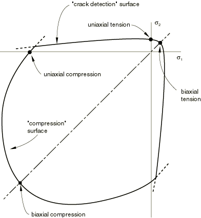

**Figure 23.6.1–5** Yield and failure surfaces in the (*p*–*q*) plane.

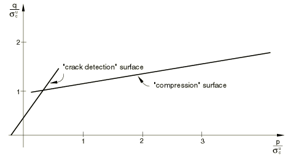

#### Failure surface

You can specify failure ratios to define the shape of the failure surface (possibly as a function of temperature and predefined field variables). Four failure ratios can be specified:
- The ratio of the ultimate biaxial compressive stress to the ultimate uniaxial compressive stress.
- The absolute value of the ratio of the uniaxial tensile stress at failure to the ultimate uniaxial compressive stress.
- The ratio of the magnitude of a principal component of plastic strain at ultimate stress in biaxial compression to the plastic strain at ultimate stress in uniaxial compression.
- The ratio of the tensile principal stress at cracking, in plane stress, when the other principal stress is at the ultimate compressive value, to the tensile cracking stress under uniaxial tension.

Default values of the above ratios are used if you do not specify them.

| **Input File Usage: ** | ``` [*FAILURE RATIOS](../key/key-link.md#usb-kws-mfailureratios) ``` |
| --- | --- |

| **Abaqus/CAE Usage: ** | Property module: material editor: ****Mechanical****Plasticity****Concrete Smeared Cracking****: ****Suboptions****Failure Ratios**** |
| --- | --- |

### Response to strain reversals

Because the model is intended for application to problems involving relatively monotonic straining, no attempt is made to include prediction of cyclic response or of the reduction in the elastic stiffness caused by inelastic straining under predominantly compressive stress. Nevertheless, it is likely that, even in those applications for which the model is designed, the strain trajectories will not be entirely radial, so that the model should predict the response to occasional strain reversals and strain trajectory direction changes in a reasonable way. Isotropic hardening of the “compressive” yield surface forms the basis of this aspect of the model's inelastic response prediction when the principal stresses are dominantly compressive.

### Calibration

A minimum of two experiments, uniaxial compression and uniaxial tension, is required to calibrate the simplest version of the concrete model (using all possible defaults and assuming temperature and field variable independence). Other experiments may be required to gain accuracy in postfailure behavior.

#### Uniaxial compression and tension tests

The uniaxial compression test involves compressing the sample between two rigid platens. The load and displacement in the direction of loading are recorded. From this, you can extract the stress-strain curve required for the concrete model directly. The uniaxial tension test is much more difficult to perform in the sense that it is necessary to have a stiff testing machine to be able to record the postfailure response. Quite often this test is not available, and you make an assumption about the tensile failure strength of the concrete (usually about 7%–10% of the compressive strength). The choice of tensile cracking stress is important; numerical problems may arise if very low cracking stresses are used (less than 1/100 or 1/1000 of the compressive strength).

#### Postcracking tensile behavior

The calibration of the postfailure response depends on the reinforcement present in the concrete. For plain concrete simulations the stress-displacement tension stiffening model should be used. Typical values for  are 0.05 mm (2  103 in) for a normal concrete to 0.08 mm (3  103 in) for a high-strength concrete. For reinforced concrete simulations the stress-strain tension stiffening model should be used. A reasonable starting point for relatively heavily reinforced concrete modeled with a fairly detailed mesh is to assume that the strain softening after failure reduces the stress linearly to zero at a total strain of about 10 times the strain at failure. Since the strain at failure in standard concretes is typically 104, this suggests that tension stiffening that reduces the stress to zero at a total strain of about 103 is reasonable. This parameter should be calibrated to a particular case.

#### Postcracking shear behavior

Combined tension and shear experiments are used to calibrate the postcracking shear behavior in Abaqus/Standard. These experiments are quite difficult to perform. If the test data are not available, a reasonable starting point is to assume that the shear retention factor, , goes linearly to zero at the same crack opening strain used for the tension stiffening model.

#### Biaxial yield and flow parameters

Biaxial experiments are required to calibrate the biaxial yield and flow parameters used to specify the failure ratios. If these are not available, the defaults can be used.

#### Temperature dependence

The calibration of temperature dependence requires the repetition of all the above experiments over the range of interest.

#### Comparison with experimental results

With proper calibration, the concrete model should produce reasonable results for mostly monotonic loadings. Comparison of the predictions of the model with the experimental results of Kupfer and Gerstle (1973) are shown in [Figure 23.6.1--6](pt05ch23s06abm37.md#cconcrete-uni-test) and [Figure 23.6.1--7](pt05ch23s06abm37.md#cconcrete-bi-test).

**Figure 23.6.1–6** Comparison of model prediction and Kupfer and Gerstle's data for a uniaxial compression test.

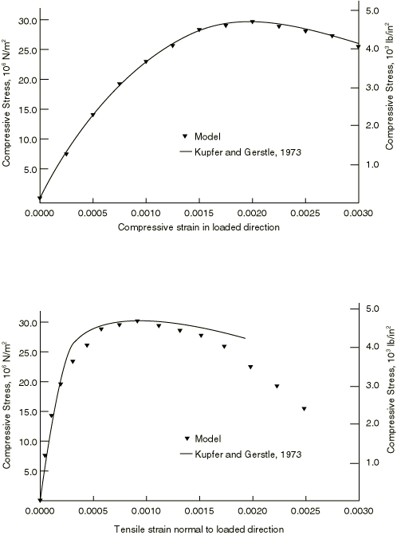

**Figure 23.6.1–7** Comparison of model prediction and Kupfer and Gerstle's data for a biaxial compression test.

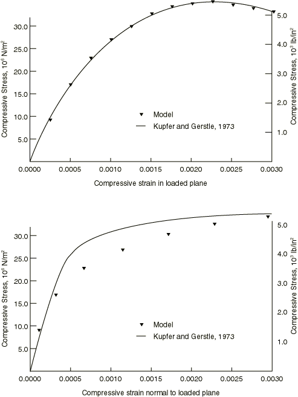

### Elements

Abaqus/Standard offers a variety of elements for use with the smeared crack concrete model: beam, shell, plane stress, plane strain, generalized plane strain, axisymmetric, and three-dimensional elements.

For general shell analysis more than the default number of five integration points through the thickness of the shell should be used; nine thickness integration points are commonly used to model progressive failure of the concrete through the thickness with acceptable accuracy.

### Output

In addition to the standard output identifiers available in Abaqus/Standard (["Abaqus/Standard output variable identifiers," Section 4.2.1](pt02ch04s02abv01.md)), the following variables relate specifically to material points in the smeared crack concrete model:

| CRACK | Unit normal to cracks in concrete. |
| --- | --- |

| CONF | Number of cracks at a concrete material point. |
| --- | --- |

#### Additional references

- Crisfield, M. A., "Snap-Through and Snap-Back Response in Concrete Structures and the Dangers of Under-Integration," International Journal for Numerical Methods in Engineering, vol. 22, pp. 751--767, 1986.
- Hillerborg, A., M. Modeer, and P. E. Petersson, "Analysis of Crack Formation and Crack Growth in Concrete by Means of Fracture Mechanics and Finite Elements," Cement and Concrete Research, vol. 6, pp. 773--782, 1976.
- Kupfer, H. B., and K. H. Gerstle, "Behavior of Concrete under Biaxial Stresses," Journal of Engineering Mechanics Division, ASCE, vol. 99 853, 1973.


