# 23.6.2 Cracking model for concrete


**Products: **Abaqus/Explicit  Abaqus/CAE  

##### **References**

- ["Material library: overview," Section 21.1.1](pt05ch21s01abo18.md)
- ["Inelastic behavior," Section 23.1.1](pt05ch23s01abo20.md)
- [*BRITTLE CRACKING](../key/key-link.md#usb-kws-mcracking)
- [*BRITTLE FAILURE](../key/key-link.md#usb-kws-mbrittlefailure)
- [*BRITTLE SHEAR](../key/key-link.md#usb-kws-mbrittleshear)
- ["Defining brittle cracking" in "Defining other mechanical models," Section 12.9.4 of the Abaqus/CAE User's Guide](../usi/usi-link.md#usi-prp-mechanical-other-brittlecracking)

### Overview

The brittle cracking model in Abaqus/Explicit:
- provides a capability for modeling concrete in all types of structures: beams, trusses, shells and solids;
- can also be useful for modeling other materials such as ceramics or brittle rocks;
- is designed for applications in which the behavior is dominated by tensile cracking;
- assumes that the compressive behavior is always linear elastic;
- must be used with the linear elastic material model (["Linear elastic behavior," Section 22.2.1](pt05ch22s02abm02.md)), which also defines the material behavior completely prior to cracking;
- is most accurate in applications where the brittle behavior dominates such that the assumption that the material is linear elastic in compression is adequate;
- can be used for plain concrete, even though it is intended primarily for the analysis of reinforced concrete structures;
- allows removal of elements based on a brittle failure criterion; and
- is defined in detail in ["A cracking model for concrete and other brittle materials," Section 4.5.3 of the Abaqus Theory Guide](../stm/stm-link.md#stm-mat-cracking).

See ["Inelastic behavior," Section 23.1.1](pt05ch23s01abo20.md), for a discussion of the concrete models available in Abaqus.

### Reinforcement

Reinforcement in concrete structures is typically provided by means of rebars. Rebars are one-dimensional strain theory elements (rods) that can be defined singly or embedded in oriented surfaces. Rebars are discussed in ["Defining rebar as an element property," Section 2.2.4](pt01ch02s02aus14.md). They are typically used with elastic-plastic material behavior and are superposed on a mesh of standard element types used to model the plain concrete. With this modeling approach, the concrete cracking behavior is considered independently of the rebar. Effects associated with the rebar/concrete interface, such as bond slip and dowel action, are modeled approximately by introducing some “tension stiffening” into the concrete cracking model to simulate load transfer across cracks through the rebar.

### Cracking

Abaqus/Explicit uses a smeared crack model to represent the discontinuous brittle behavior in concrete. It does not track individual “macro” cracks: instead, constitutive calculations are performed independently at each material point of the finite element model. The presence of cracks enters into these calculations by the way in which the cracks affect the stress and material stiffness associated with the material point.

For simplicity of discussion in this section, the term “crack” is used to mean a direction in which cracking has been detected at the single material calculation point in question: the closest physical concept is that there exists a continuum of micro-cracks in the neighborhood of the point, oriented as determined by the model. The anisotropy introduced by cracking is assumed to be important in the simulations for which the model is intended.

#### Crack directions

The Abaqus/Explicit cracking model assumes fixed, orthogonal cracks, with the maximum number of cracks at a material point limited by the number of direct stress components present at that material point of the finite element model (a maximum of three cracks in three-dimensional, plane strain, and axisymmetric problems; two cracks in plane stress and shell problems; and one crack in beam or truss problems). Internally, once cracks exist at a point, the component forms of all vector- and tensor-valued quantities are rotated so that they lie in the local system defined by the crack orientation vectors (the normals to the crack faces). The model ensures that these crack face normal vectors will be orthogonal, so that this local crack system is rectangular Cartesian. For output purposes you are offered results of stresses and strains in the global and/or local crack systems.

#### Crack detection

A simple Rankine criterion is used to detect crack initiation. This criterion states that a crack forms when the maximum principal tensile stress exceeds the tensile strength of the brittle material. Although crack detection is based purely on Mode I fracture considerations, ensuing cracked behavior includes both Mode I (tension softening/stiffening) and Mode II (shear softening/retention) behavior, as described later.

As soon as the Rankine criterion for crack formation has been met, we assume that a first crack has formed. The crack surface is taken to be normal to the direction of the maximum tensile principal stress. Subsequent cracks may form with crack surface normals in the direction of maximum principal tensile stress that is orthogonal to the directions of any existing crack surface normals at the same point.

Cracking is irrecoverable in the sense that, once a crack has occurred at a point, it remains throughout the rest of the calculation. However, crack closing and reopening may take place along the directions of the crack surface normals. The model neglects any permanent strain associated with cracking; that is, it is assumed that the cracks can close completely when the stress across them becomes compressive.

### Tension stiffening

You can specify the postfailure behavior for direct straining across cracks by means of a postfailure stress-strain relation or by applying a fracture energy cracking criterion.

#### Postfailure stress-strain relation

In reinforced concrete the specification of postfailure behavior generally means giving the postfailure stress as a function of strain across the crack ([Figure 23.6.2--1](pt05ch23s06abm38.md#cbrittlecracking-strain)). In cases with little or no reinforcement, this introduces mesh sensitivity in the results, in the sense that the finite element predictions do not converge to a unique solution as the mesh is refined because mesh refinement leads to narrower crack bands.

**Figure 23.6.2–1** Postfailure stress-strain curve.

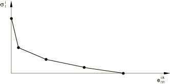

In practical calculations for reinforced concrete, the mesh is usually such that each element contains rebars. In this case the interaction between the rebars and the concrete tends to mitigate this effect, provided that a reasonable amount of “tension stiffening” is introduced in the cracking model to simulate this interaction. This requires an estimate of the tension stiffening effect, which depends on factors such as the density of reinforcement, the quality of the bond between the rebar and the concrete, the relative size of the concrete aggregate compared to the rebar diameter, and the mesh. A reasonable starting point for relatively heavily reinforced concrete modeled with a fairly detailed mesh is to assume that the strain softening after failure reduces the stress linearly to zero at a total strain about ten times the strain at failure. Since the strain at failure in standard concretes is typically 104, this suggests that tension stiffening that reduces the stress to zero at a total strain of about 103 is reasonable. This parameter should be calibrated to each particular case. In static applications too little tension stiffening will cause the local cracking failure in the concrete to introduce temporarily unstable behavior in the overall response of the model. Few practical designs exhibit such behavior, so that the presence of this type of response in the analysis model usually indicates that the tension stiffening is unreasonably low.

| **Input File Usage: ** | ``` [*BRITTLE CRACKING](../key/key-link.md#usb-kws-mcracking), TYPE=STRAIN ``` |
| --- | --- |

| **Abaqus/CAE Usage: ** | Property module: material editor: ****Mechanical****Brittle Cracking****: **Type: Strain** |
| --- | --- |

#### Fracture energy cracking criterion

When there is no reinforcement in significant regions of the model, the tension stiffening approach described above will introduce unreasonable mesh sensitivity into the results. However, it is generally accepted that Hillerborg's (1976) fracture energy proposal is adequate to allay the concern for many practical purposes. Hillerborg defines the energy required to open a unit area of crack in Mode I () as a material parameter, using brittle fracture concepts. With this approach the concrete's brittle behavior is characterized by a stress-*displacement* response rather than a stress-*strain* response. Under tension a concrete specimen will crack across some section; and its length, after it has been pulled apart sufficiently for most of the stress to be removed (so that the elastic strain is small), will be determined primarily by the opening at the crack, which does not depend on the specimen's length.

##### Implementation

In Abaqus/Explicit this fracture energy cracking model can be invoked by specifying the postfailure stress as a tabular function of displacement across the crack, as illustrated in [Figure 23.6.2--2](pt05ch23s06abm38.md#cbrittlecracking-dep).

**Figure 23.6.2–2** Postfailure stress-displacement curve.

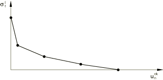

 Alternatively, the Mode I fracture energy, , can be specified directly as a material property; in this case, define the failure stress, , as a tabular function of the associated Mode I fracture energy. This model assumes a linear loss of strength after cracking ([Figure 23.6.2--3](pt05ch23s06abm38.md#cbrittlecracking-gfi)). 

**Figure 23.6.2–3** Postfailure stress-fracture energy curve.

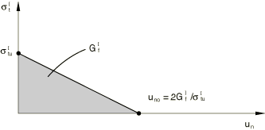

The crack normal displacement at which complete loss of strength takes place is, therefore, 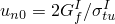. Typical values of  range from 40 N/m (0.22 lb/in) for a typical construction concrete (with a compressive strength of approximately 20 MPa, 2850 lb/in2) to 120 N/m (0.67 lb/in) for a high-strength concrete (with a compressive strength of approximately 40 MPa, 5700 lb/in2).

| **Input File Usage: ** | Use the following option to specify the postfailure stress as a tabular function of displacement: |
| --- | --- |
|  | ``` [*BRITTLE CRACKING](../key/key-link.md#usb-kws-mcracking), TYPE=DISPLACEMENT ``` Use the following option to specify the postfailure stress as a tabular function of the fracture energy: ``` [*BRITTLE CRACKING](../key/key-link.md#usb-kws-mcracking), TYPE=GFI ``` |

| **Abaqus/CAE Usage: ** | Property module: material editor: ****Mechanical****Brittle Cracking****: **Type:** **Displacement** or **GFI** |
| --- | --- |

##### Characteristic crack length

The implementation of the stress-displacement concept in a finite element model requires the definition of a characteristic length associated with a material point. The characteristic crack length is based on the element geometry and formulation: it is a typical length of a line across an element for a first-order element; it is half of the same typical length for a second-order element. For beams and trusses it is a characteristic length along the element axis. For membranes and shells it is a characteristic length in the reference surface. For axisymmetric elements it is a characteristic length in the *r*–*z* plane only. For cohesive elements it is equal to the constitutive thickness. We use this definition of the characteristic crack length because the direction in which cracks will occur is not known in advance. Therefore, elements with large aspect ratios will have rather different behavior depending on the direction in which they crack: some mesh sensitivity remains because of this effect. Elements that are as close to square as possible are, therefore, recommended unless you can predict the direction in which cracks will form. Alternatively, this mesh dependency could be reduced by directly specifying the characteristic length as a function of the element topology and material orientation in user subroutine [`VUCHARLENGTH`](../sub/sub-link.md#sub-xsl-vucharlength) (see ["Defining the characteristic element length at a material point in Abaqus/Explicit" in "Material data definition," Section 21.1.2](pt05ch21s01aus109.md#usb-mat-cmaterialdata-charlength)).

### Shear retention model

An important feature of the cracking model is that, whereas crack initiation is based on Mode I fracture only, postcracked behavior includes Mode II as well as Mode I. The Mode II shear behavior is based on the common observation that the shear behavior depends on the amount of crack opening. More specifically, the cracked shear modulus is reduced as the crack opens. Therefore, Abaqus/Explicit offers a shear retention model in which the postcracked shear stiffness is defined as a function of the opening strain across the crack; the shear retention model must be defined in the cracking model, and zero shear retention should not be used.

In these models the dependence is defined by expressing the postcracking shear modulus, 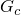, as a fraction of the uncracked shear modulus: 

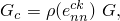

where *G* is the shear modulus of the uncracked material and the shear retention factor, 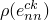, depends on the crack opening strain, . You can specify this dependence in piecewise linear form, as shown in [Figure 23.6.2--4](pt05ch23s06abm38.md#cbrittleshear-ret-fact).

**Figure 23.6.2–4** Piecewise linear form of the shear retention model.

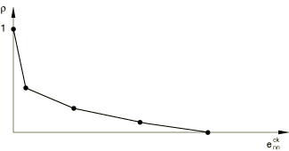

 Alternatively, shear retention can be defined in the power law form: 

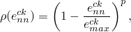

where *p* and  are material parameters. This form, shown in [Figure 23.6.2--5](pt05ch23s06abm38.md#cbrittleshear-power-law), satisfies the requirements that 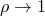 as 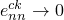 (corresponding to the state before crack initiation) and 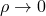 as  (corresponding to complete loss of aggregate interlock). See ["A cracking model for concrete and other brittle materials," Section 4.5.3 of the Abaqus Theory Guide](../stm/stm-link.md#stm-mat-cracking), for a discussion of how shear retention is calculated in the case of two or more cracks.

**Figure 23.6.2–5** Power law form of the shear retention model.

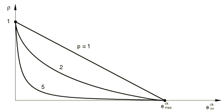

| **Input File Usage: ** | Use the following option to specify the piecewise linear form of the shear retention model: |
| --- | --- |
|  | ``` [*BRITTLE SHEAR](../key/key-link.md#usb-kws-mbrittleshear), TYPE=RETENTION FACTOR ``` Use the following option to specify the power law form of the shear retention model: ``` [*BRITTLE SHEAR](../key/key-link.md#usb-kws-mbrittleshear), TYPE=POWER LAW ``` |

| **Abaqus/CAE Usage: ** | Property module: material editor: ****Mechanical****Brittle Cracking****: ****Suboptions****Brittle Shear**** **Type:** **Retention Factor** or **Power Law** |
| --- | --- |

### Calibration

One experiment, a uniaxial tension test, is required to calibrate the simplest version of the brittle cracking model. Other experiments may be required to gain accuracy in postfailure behavior.

#### Uniaxial tension test

This test is difficult to perform because it is necessary to have a very stiff testing machine to record the postcracking response. Quite often such equipment is not available; in this situation you must make an assumption about the tensile failure strength of the material and the postcracking response. For concrete the assumption usually made is that the tensile strength is 7–10% of the compressive strength. Uniaxial compression tests can be performed much more easily, so the compressive strength of concrete is usually known.

#### Postcracking tensile behavior

The values given for tension stiffening are a very important aspect of simulations using the Abaqus/Explicit brittle cracking model. The postcracking tensile response is highly dependent on the reinforcement present in the concrete. In simulations of unreinforced concrete, the tension stiffening models that are based on fracture energy concepts should be utilized. If reliable experimental data are not available, typical values that can be used were discussed before: common values of  range from 40 N/m (0.22 lb/in) for a typical construction concrete (with a compressive strength of approximately 20 MPa, 2850 lb/in2) to 120 N/m (0.67 lb/in) for a high-strength concrete (with a compressive strength of approximately 40 MPa, 5700 lb/in2). In simulations of reinforced concrete the stress-strain tension stiffening model should be used; the amount of tension stiffening depends on the reinforcement present, as discussed before. A reasonable starting point for relatively heavily reinforced concrete modeled with a fairly detailed mesh is to assume that the strain softening after failure reduces the stress linearly to zero at a total strain about ten times the strain at failure. Since the strain at failure in standard concretes is typically 104, this suggests that tension stiffening that reduces the stress to zero at a total strain of about 103 is reasonable. This parameter should be calibrated to each particular case.

#### Postcracking shear behavior

Calibration of the postcracking shear behavior requires combined tension and shear experiments, which are difficult to perform. If such test data are not available, a reasonable starting point is to assume that the shear retention factor, , goes linearly to zero at the same crack opening strain used for the tension stiffening model.

### Brittle failure criterion

You can define brittle failure of the material. When one, two, or all three local direct cracking strain (displacement) components at a material point reach the value defined as the failure strain (displacement), the material point fails and all the stress components are set to zero. If all of the material points in an element fail, the element is removed from the mesh. For example, removal of a first-order reduced-integration solid element takes place as soon as its only integration point fails. However, all through-the-thickness integration points must fail before a shell element is removed from the mesh.

If the postfailure relation is defined in terms of stress versus strain, the failure strain must be given as the failure criterion. If the postfailure relation is defined in terms of stress versus displacement or stress versus fracture energy, the failure displacement must be given as the failure criterion. The failure strain (displacement) can be specified as a function of temperature and/or predefined field variables.

You can control how many cracks at a material point must fail before the material point is considered to have failed; the default is one crack. The number of cracks that must fail can only be one for beam and truss elements; it cannot be greater than two for plane stress and shell elements; and it cannot be greater than three otherwise.

| **Input File Usage: ** | ``` [*BRITTLE FAILURE](../key/key-link.md#usb-kws-mbrittlefailure), CRACKS=*n* ``` |
| --- | --- |

| **Abaqus/CAE Usage: ** | Property module: material editor: ****Mechanical****Brittle Cracking****: ****Suboptions****Brittle Failure**** and select **Failure Criteria**: **Unidirectional**, **Bidirectional**, or **Tridirectional** to indicate the number of cracks that must fail for the material point to fail. |
| --- | --- |

#### Determining when to use the brittle failure criterion

The brittle failure criterion is a crude way of modeling failure in Abaqus/Explicit and should be used with care. The main motivation for including this capability is to help in computations where not removing an element that can no longer carry stress may lead to excessive distortion of that element and subsequent premature termination of the simulation. For example, in a monotonically loaded structure whose failure mechanism is expected to be dominated by a single tensile macrofracture (Mode I cracking), it may be reasonable to use the brittle failure criterion to remove elements. On the other hand, the fact that the brittle material loses its ability to carry tensile stress does not preclude it from withstanding compressive stress; therefore, it may not be appropriate to remove elements if the material is expected to carry compressive loads after it has failed in tension. An example may be a shear wall subjected to cyclic loading as a result of some earthquake excitation; in this case cracks that develop completely under tensile stress will be able to carry compressive stress when load reversal takes place.

Thus, the effective use of the brittle failure criterion relies on you having some knowledge of the structural behavior and potential failure mechanism. The use of the brittle failure criterion based on an incorrect user assumption of the failure mechanism will generally result in an incorrect simulation.

#### Selecting the number of cracks that must fail before the material point is considered to have failed

When you define brittle failure, you can control how many cracks must open to beyond the failure value before a material point is considered to have failed. The default number of cracks (one) should be used for most structural applications where failure is dominated by Mode I type cracking. However, there are cases in which you should specify a higher number because multiple cracks need to form to develop the eventual failure mechanism. One example may be an unreinforced, deep concrete beam where the failure mechanism is dominated by shear; in this case it is possible that two cracks need to form at each material point for the shear failure mechanism to develop.

Again, the appropriate choice of the number of cracks that must fail relies on your knowledge of the structural and failure behaviors.

#### Using brittle failure with rebar

It is possible to use the brittle failure criterion in brittle cracking elements for which rebar are also defined; the obvious application is the modeling of reinforced concrete. When such elements fail according to the brittle failure criterion, the brittle cracking contribution to the element stress carrying capacity is removed but the rebar contribution to the element stress carrying capacity is not removed. However, if you also include shear failure in the rebar material definition, the rebar contribution to the element stress carrying capacity will also be removed if the shear failure criterion specified for the rebar is satisfied. This allows the modeling of progressive failure of an under-reinforced concrete structure where the concrete fails first followed by ductile failure of the reinforcement.

### Elements

Abaqus/Explicit offers a variety of elements for use with the cracking model: truss; shell; two-dimensional beam; and plane stress, plane strain, axisymmetric, and three-dimensional continuum elements. The model cannot be used with pipe and three-dimensional beam elements. Plane triangular, triangular prism, and tetrahedral elements are not recommended for use in reinforced concrete analysis since these elements do not support the use of rebar.

### Output

In addition to the standard output identifiers available in Abaqus/Explicit (see ["Abaqus/Explicit output variable identifiers," Section 4.2.2](pt02ch04s02xbv01.md)), the following output variables relate directly to material points that use the brittle cracking model:

| CKE | All cracking strain components. |
| --- | --- |

| CKLE | All cracking strain components in local crack axes. |
| --- | --- |

| CKEMAG | Cracking strain magnitude. |
| --- | --- |

| CKLS | All stress components in local crack axes. |
| --- | --- |

| CRACK | Crack orientations. |
| --- | --- |

| CKSTAT | Crack status of each crack. |
| --- | --- |

| STATUS | Status of element (brittle failure model). The status of an element is 1.0 if the element is active and 0.0 if the element is not. |
| --- | --- |

#### Additional reference

- Hillerborg, A., M. Modeer, and P. E. Petersson, "Analysis of Crack Formation and Crack Growth in Concrete by Means of Fracture Mechanics and Finite Elements," Cement and Concrete Research, vol. 6, pp. 773--782, 1976.


