# 23.6.3 Concrete damaged plasticity


**Products: **Abaqus/Standard  Abaqus/Explicit  Abaqus/CAE  

##### **References**

- ["Material library: overview," Section 21.1.1](pt05ch21s01abo18.md)
- ["Inelastic behavior," Section 23.1.1](pt05ch23s01abo20.md)
- [*CONCRETE DAMAGED PLASTICITY](../key/key-link.md#usb-kws-mconcretedamagedplast)
- [*CONCRETE TENSION STIFFENING](../key/key-link.md#usb-kws-mconcretetensstiff)
- [*CONCRETE COMPRESSION HARDENING](../key/key-link.md#usb-kws-mconcretecomphard)
- [*CONCRETE TENSION DAMAGE](../key/key-link.md#usb-kws-mconcretetensdamage)
- [*CONCRETE COMPRESSION DAMAGE](../key/key-link.md#usb-kws-mconcretecompdamage)
- ["Defining concrete damaged plasticity" in "Defining plasticity," Section 12.9.2 of the Abaqus/CAE User's Guide](../usi/usi-link.md#usi-prp-mechanical-plastic-concretedamaged)

### Overview

The concrete damaged plasticity model in Abaqus:
- provides a general capability for modeling concrete and other quasi-brittle materials in all types of structures (beams, trusses, shells, and solids);
- uses concepts of isotropic damaged elasticity in combination with isotropic tensile and compressive plasticity to represent the inelastic behavior of concrete;
- can be used for plain concrete, even though it is intended primarily for the analysis of reinforced concrete structures;
- can be used with rebar to model concrete reinforcement;
- is designed for applications in which concrete is subjected to monotonic, cyclic, and/or dynamic loading under low confining pressures;
- consists of the combination of nonassociated multi-hardening plasticity and scalar (isotropic) damaged elasticity to describe the irreversible damage that occurs during the fracturing process;
- allows user control of stiffness recovery effects during cyclic load reversals;
- can be defined to be sensitive to the rate of straining;
- can be used in conjunction with a viscoplastic regularization of the constitutive equations in Abaqus/Standard to improve the convergence rate in the softening regime;
- requires that the elastic behavior of the material be isotropic and linear (see ["Defining isotropic elasticity" in "Linear elastic behavior," Section 22.2.1](pt05ch22s02abm02.md#usb-mat-clinearelastic-isotropic)); and
- is defined in detail in ["Damaged plasticity model for concrete and other quasi-brittle materials," Section 4.5.2 of the Abaqus Theory Guide](../stm/stm-link.md#stm-mat-concretedamaged).

See ["Inelastic behavior," Section 23.1.1](pt05ch23s01abo20.md), for a discussion of the concrete models available in Abaqus.

### Mechanical behavior

The model is a continuum, plasticity-based, damage model for concrete. It assumes that the main two failure mechanisms are tensile cracking and compressive crushing of the concrete material. The evolution of the yield (or failure) surface is controlled by two hardening variables,  and 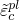, linked to failure mechanisms under tension and compression loading, respectively. We refer to  and  as tensile and compressive equivalent plastic strains, respectively. The following sections discuss the main assumptions about the mechanical behavior of concrete. 

#### Uniaxial tension and compression stress behavior

The model assumes that the uniaxial tensile and compressive response of concrete is characterized by damaged plasticity, as shown in [Figure 23.6.3--1](pt05ch23s06abm39.md#concrete-uniaxial). 

**Figure 23.6.3–1** Response of concrete to uniaxial loading in tension (a) and compression (b).

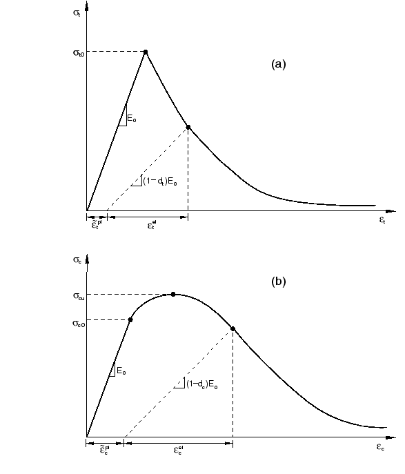

Under uniaxial tension the stress-strain response follows a linear elastic relationship until the value of the failure stress, , is reached. The failure stress corresponds to the onset of micro-cracking in the concrete material. Beyond the failure stress the formation of micro-cracks is represented macroscopically with a softening stress-strain response, which induces strain localization in the concrete structure. Under uniaxial compression the response is linear until the value of initial yield, . In the plastic regime the response is typically characterized by stress hardening followed by strain softening beyond the ultimate stress, 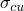. This representation, although somewhat simplified, captures the main features of the response of concrete.

It is assumed that the uniaxial stress-strain curves can be converted into stress versus plastic-strain curves. (This conversion is performed automatically by Abaqus from the user-provided stress versus “inelastic” strain data, as explained below.) Thus,

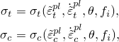

where the subscripts *t* and *c* refer to tension and compression, respectively;  and  are the equivalent plastic strains,  and 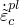 are the equivalent plastic strain rates,  is the temperature, and 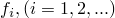 are other predefined field variables.

As shown in [Figure 23.6.3--1](pt05ch23s06abm39.md#concrete-uniaxial), when the concrete specimen is unloaded from any point on the strain softening branch of the stress-strain curves, the unloading response is weakened: the elastic stiffness of the material appears to be damaged (or degraded). The degradation of the elastic stiffness is characterized by two damage variables,  and , which are assumed to be functions of the plastic strains, temperature, and field variables:

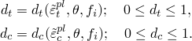

The damage variables can take values from zero, representing the undamaged material, to one, which represents total loss of strength.

If  is the initial (undamaged) elastic stiffness of the material, the stress-strain relations under uniaxial tension and compression loading are, respectively:


We define the “effective” tensile and compressive cohesion stresses as


The effective cohesion stresses determine the size of the yield (or failure) surface.

#### Uniaxial cyclic behavior

Under uniaxial cyclic loading conditions the degradation mechanisms are quite complex, involving the opening and closing of previously formed micro-cracks, as well as their interaction. Experimentally, it is observed that there is some recovery of the elastic stiffness as the load changes sign during a uniaxial cyclic test. The stiffness recovery effect, also known as the “unilateral effect,” is an important aspect of the concrete behavior under cyclic loading. The effect is usually more pronounced as the load changes from tension to compression, causing tensile cracks to close, which results in the recovery of the compressive stiffness.

The concrete damaged plasticity model assumes that the reduction of the elastic modulus is given in terms of a scalar degradation variable *d* as


where  is the initial (undamaged) modulus of the material.

This expression holds both in the tensile () and the compressive (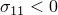) sides of the cycle. The stiffness degradation variable, *d*, is a function of the stress state and the uniaxial damage variables,  and . For the uniaxial cyclic conditions Abaqus assumes that

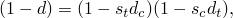

where  and  are functions of the stress state that are introduced to model stiffness recovery effects associated with stress reversals. They are defined according to 

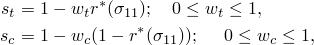

where

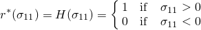

The weight factors  and , which are assumed to be material properties, control the recovery of the tensile and compressive stiffness upon load reversal. To illustrate this, consider the example in [Figure 23.6.3--2](pt05ch23s06abm39.md#concrete-wc), where the load changes from tension to compression. 

**Figure 23.6.3–2** Illustration of the effect of the compression stiffness recovery parameter .

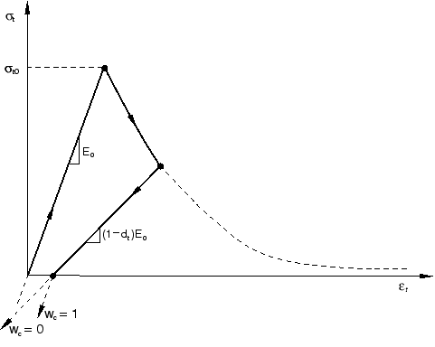

Assume that there was no previous compressive damage (crushing) in the material; that is, 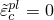 and . Then

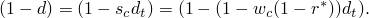

- In tension (), ; therefore,  as expected.
- In compression (), , and . If , then ; therefore, the material fully recovers the compressive stiffness (which in this case is the initial undamaged stiffness, ). If, on the other hand, , then  and there is no stiffness recovery. Intermediate values of  result in partial recovery of the stiffness.

#### Multiaxial behavior

The stress-strain relations for the general three-dimensional multiaxial condition are given by the scalar damage elasticity equation:

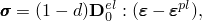

where  is the initial (undamaged) elasticity matrix.

The previous expression for the scalar stiffness degradation variable, *d*, is generalized to the multiaxial stress case by replacing the unit step function 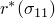 with a multiaxial stress weight factor, 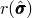, defined as

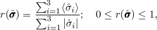

where 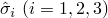 are the principal stress components. The Macauley bracket  is defined by .

See ["Damaged plasticity model for concrete and other quasi-brittle materials," Section 4.5.2 of the Abaqus Theory Guide](../stm/stm-link.md#stm-mat-concretedamaged), for further details of the constitutive model.

### Reinforcement

In Abaqus reinforcement in concrete structures is typically provided by means of rebars, which are one-dimensional rods that can be defined singly or embedded in oriented surfaces. Rebars are typically used with metal plasticity models to describe the behavior of the rebar material and are superposed on a mesh of standard element types used to model the concrete.

With this modeling approach, the concrete behavior is considered independently of the rebar. Effects associated with the rebar/concrete interface, such as bond slip and dowel action, are modeled approximately by introducing some “tension stiffening” into the concrete modeling to simulate load transfer across cracks through the rebar. Details regarding tension stiffening are provided below.

Defining the rebar can be tedious in complex problems, but it is important that this be done accurately since it may cause an analysis to fail due to lack of reinforcement in key regions of a model. See ["Defining rebar as an element property," Section 2.2.4](pt01ch02s02aus14.md), for more information regarding rebars.

### Defining tension stiffening

The postfailure behavior for direct straining is modeled with tension stiffening, which allows you to define the strain-softening behavior for cracked concrete. This behavior also allows for the effects of the reinforcement interaction with concrete to be simulated in a simple manner. Tension stiffening is required in the concrete damaged plasticity model. You can specify tension stiffening by means of a postfailure stress-strain relation or by applying a fracture energy cracking criterion.

#### Postfailure stress-strain relation

In reinforced concrete the specification of postfailure behavior generally means giving the postfailure stress as a function of cracking strain, . The cracking strain is defined as the total strain minus the elastic strain corresponding to the undamaged material; that is, 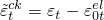, where 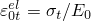, as illustrated in [Figure 23.6.3--3](pt05ch23s06abm39.md#concrete-crackstrain). To avoid potential numerical problems, Abaqus enforces a lower limit on the postfailure stress equal to one-hundreth of the initial failure stress: 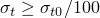.

**Figure 23.6.3–3** Illustration of the definition of the cracking strain  used for the definition of tension stiffening data.

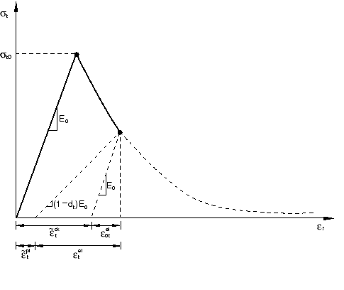

Tension stiffening data are given in terms of the cracking strain, . When unloading data are available, the data are provided to Abaqus in terms of tensile damage curves, 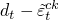, as discussed below. Abaqus automatically converts the cracking strain values to plastic strain values using the relationship

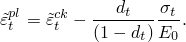

Abaqus will issue an error message if the calculated plastic strain values are negative and/or decreasing with increasing cracking strain, which typically indicates that the tensile damage curves are incorrect. In the absence of tensile damage 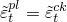.

In cases with little or no reinforcement, the specification of a postfailure stress-strain relation introduces mesh sensitivity in the results, in the sense that the finite element predictions do not converge to a unique solution as the mesh is refined because mesh refinement leads to narrower crack bands. This problem typically occurs if cracking failure occurs only at localized regions in the structure and mesh refinement does not result in the formation of additional cracks. If cracking failure is distributed evenly (either due to the effect of rebar or due to the presence of stabilizing elastic material, as in the case of plate bending), mesh sensitivity is less of a concern.

In practical calculations for reinforced concrete, the mesh is usually such that each element contains rebars. The interaction between the rebars and the concrete tends to reduce the mesh sensitivity, provided that a reasonable amount of tension stiffening is introduced in the concrete model to simulate this interaction. This requires an estimate of the tension stiffening effect, which depends on such factors as the density of reinforcement, the quality of the bond between the rebar and the concrete, the relative size of the concrete aggregate compared to the rebar diameter, and the mesh. A reasonable starting point for relatively heavily reinforced concrete modeled with a fairly detailed mesh is to assume that the strain softening after failure reduces the stress linearly to zero at a total strain of about 10 times the strain at failure. The strain at failure in standard concretes is typically 104, which suggests that tension stiffening that reduces the stress to zero at a total strain of about 103 is reasonable. This parameter should be calibrated to a particular case.

The choice of tension stiffening parameters is important since, generally, more tension stiffening makes it easier to obtain numerical solutions. Too little tension stiffening will cause the local cracking failure in the concrete to introduce temporarily unstable behavior in the overall response of the model. Few practical designs exhibit such behavior, so that the presence of this type of response in the analysis model usually indicates that the tension stiffening is unreasonably low.

| **Input File Usage: ** | ``` [*CONCRETE TENSION STIFFENING](../key/key-link.md#usb-kws-mconcretetensstiff), TYPE=STRAIN (default) ``` |
| --- | --- |

| **Abaqus/CAE Usage: ** | Property module: material editor: ****Mechanical****Plasticity****Concrete Damaged Plasticity****: **Tensile Behavior**: **Type: Strain** |
| --- | --- |

#### Fracture energy cracking criterion

When there is no reinforcement in significant regions of the model, the tension stiffening approach described above will introduce unreasonable mesh sensitivity into the results. However, it is generally accepted that Hillerborg's (1976) fracture energy proposal is adequate to allay the concern for many practical purposes. Hillerborg defines the energy required to open a unit area of crack, , as a material parameter, using brittle fracture concepts. With this approach the concrete's brittle behavior is characterized by a stress-displacement response rather than a stress-strain response. Under tension a concrete specimen will crack across some section. After it has been pulled apart sufficiently for most of the stress to be removed (so that the undamaged elastic strain is small), its length will be determined primarily by the opening at the crack. The opening does not depend on the specimen's length.

This fracture energy cracking model can be invoked by specifying the postfailure stress as a tabular function of cracking displacement, as shown in [Figure 23.6.3--4](pt05ch23s06abm39.md#concretetensstiff-disp).

**Figure 23.6.3–4** Postfailure stress-displacement curve.

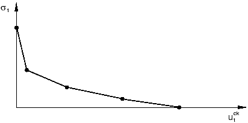

Alternatively, the fracture energy, , can be specified directly as a material property; in this case, define the failure stress, , as a tabular function of the associated fracture energy. This model assumes a linear loss of strength after cracking, as shown in [Figure 23.6.3--5](pt05ch23s06abm39.md#concretetensstiff-gfi). 

**Figure 23.6.3–5** Postfailure stress-fracture energy curve.

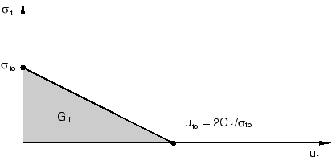

The cracking displacement at which complete loss of strength takes place is, therefore, 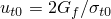. Typical values of  range from 40 N/m (0.22 lb/in) for a typical construction concrete (with a compressive strength of approximately 20 MPa, 2850 lb/in2) to 120 N/m (0.67 lb/in) for a high-strength concrete (with a compressive strength of approximately 40 MPa, 5700 lb/in2).

If tensile damage, , is specified, Abaqus automatically converts the cracking displacement values to “plastic” displacement values using the relationship


where the specimen length, , is assumed to be one unit length, 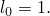

##### Implementation

The implementation of this stress-displacement concept in a finite element model requires the definition of a characteristic length associated with an integration point. The characteristic crack length is based on the element geometry and formulation: it is a typical length of a line across an element for a first-order element; it is half of the same typical length for a second-order element. For beams and trusses it is a characteristic length along the element axis. For membranes and shells it is a characteristic length in the reference surface. For axisymmetric elements it is a characteristic length in the *r*–*z* plane only. For cohesive elements it is equal to the constitutive thickness. This definition of the characteristic crack length is used because the direction in which cracking occurs is not known in advance. Therefore, elements with large aspect ratios will have rather different behavior depending on the direction in which they crack: some mesh sensitivity remains because of this effect, and elements that have aspect ratios close to one are recommended. Alternatively, this mesh dependency could be reduced by directly specifying the characteristic length as a function of the element topology and material orientation in user subroutine [`VUCHARLENGTH`](../sub/sub-link.md#sub-xsl-vucharlength) (see ["Defining the characteristic element length at a material point in Abaqus/Explicit" in "Material data definition," Section 21.1.2](pt05ch21s01aus109.md#usb-mat-cmaterialdata-charlength)).

| **Input File Usage: ** | Use the following option to specify the postfailure stress as a tabular function of displacement: |
| --- | --- |
|  | ``` [*CONCRETE TENSION STIFFENING](../key/key-link.md#usb-kws-mconcretetensstiff), TYPE=DISPLACEMENT ``` Use the following option to specify the postfailure stress as a tabular function of the fracture energy: ``` [*CONCRETE TENSION STIFFENING](../key/key-link.md#usb-kws-mconcretetensstiff), TYPE=GFI ``` |

| **Abaqus/CAE Usage: ** | Property module: material editor: ****Mechanical****Plasticity****Concrete Damaged Plasticity****: **Tensile Behavior**: **Type: Displacement** or **GFI** |
| --- | --- |

### Defining compressive behavior

You can define the stress-strain behavior of plain concrete in uniaxial compression outside the elastic range. Compressive stress data are provided as a tabular function of inelastic (or crushing) strain, 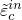, and, if desired, strain rate, temperature, and field variables. Positive (absolute) values should be given for the compressive stress and strain. The stress-strain curve can be defined beyond the ultimate stress, into the strain-softening regime.

Hardening data are given in terms of an inelastic strain, , instead of plastic strain, . The compressive inelastic strain is defined as the total strain minus the elastic strain corresponding to the undamaged material, 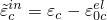, where 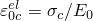, as illustrated in [Figure 23.6.3--6](pt05ch23s06abm39.md#concrete-inelstrain). 

**Figure 23.6.3–6** Definition of the compressive inelastic (or crushing) strain  used for the definition of compression hardening data.

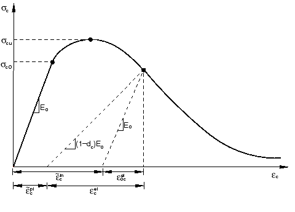

Unloading data are provided to Abaqus in terms of compressive damage curves, 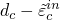, as discussed below. Abaqus automatically converts the inelastic strain values to plastic strain values using the relationship

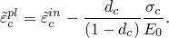

Abaqus will issue an error message if the calculated plastic strain values are negative and/or decreasing with increasing inelastic strain, which typically indicates that the compressive damage curves are incorrect. In the absence of compressive damage 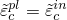.

| **Input File Usage: ** | ``` [*CONCRETE COMPRESSION HARDENING](../key/key-link.md#usb-kws-mconcretecomphard) ``` |
| --- | --- |

| **Abaqus/CAE Usage: ** | Property module: material editor: ****Mechanical****Plasticity****Concrete Damaged Plasticity****: **Compressive Behavior** |
| --- | --- |

### Defining damage and stiffness recovery

Damage,  and/or , can be specified in tabular form. (If damage is not specified, the model behaves as a plasticity model; consequently,  and .)

In Abaqus the damage variables are treated as non-decreasing material point quantities. At any increment during the analysis, the new value of each damage variable is obtained as the maximum between the value at the end of the previous increment and the value corresponding to the current state (interpolated from the user-specified tabular data); that is,

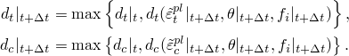

The choice of the damage properties is important since, generally, excessive damage may have a critical effect on the rate of convergence. It is recommended to avoid using values of the damage variables above 0.99, which corresponds to a 99% reduction of the stiffness.

#### Tensile damage

You can define the uniaxial tension damage variable, , as a tabular function of either cracking strain or cracking displacement.

| **Input File Usage: ** | Use the following option to specify tensile damage as a function of cracking strain: |
| --- | --- |
|  | ``` [*CONCRETE TENSION DAMAGE](../key/key-link.md#usb-kws-mconcretetensdamage), TYPE=STRAIN (default) ``` Use the following option to specify tensile damage as a function of cracking displacement: ``` [*CONCRETE TENSION DAMAGE](../key/key-link.md#usb-kws-mconcretetensdamage), TYPE=DISPLACEMENT ``` |

| **Abaqus/CAE Usage: ** | Property module: material editor: ****Mechanical****Plasticity****Concrete Damaged Plasticity****: **Tensile Behavior**: ****Suboptions****Tension Damage****: **Type: Strain** or **Displacement** |
| --- | --- |

#### Compressive damage

You can define the uniaxial compression damage variable, , as a tabular function of inelastic (crushing) strain.

| **Input File Usage: ** | ``` [*CONCRETE COMPRESSION DAMAGE](../key/key-link.md#usb-kws-mconcretecompdamage) ``` |
| --- | --- |

| **Abaqus/CAE Usage: ** | Property module: material editor: ****Mechanical****Plasticity****Concrete Damaged Plasticity****: **Compressive Behavior**: ****Suboptions****Compression Damage**** |
| --- | --- |

#### Stiffness recovery

As discussed above, stiffness recovery is an important aspect of the mechanical response of concrete under cyclic loading. Abaqus allows direct user specification of the stiffness recovery factors  and .

The experimental observation in most quasi-brittle materials, including concrete, is that the compressive stiffness is recovered upon crack closure as the load changes from tension to compression. On the other hand, the tensile stiffness is not recovered as the load changes from compression to tension once crushing micro-cracks have developed. This behavior, which corresponds to  and , is the default used by Abaqus. [Figure 23.6.3--7](pt05ch23s06abm39.md#concrete-cycle) illustrates a uniaxial load cycle assuming the default behavior.

**Figure 23.6.3–7** Uniaxial load cycle (tension-compression-tension) assuming default values for the stiffness recovery factors:  and .


| **Input File Usage: ** | Use the following option to specify the compression stiffness recovery factor, : |
| --- | --- |
|  | ``` [*CONCRETE TENSION DAMAGE](../key/key-link.md#usb-kws-mconcretetensdamage), COMPRESSION RECOVERY= ``` Use the following option to specify the tension stiffness recovery factor, : ``` [*CONCRETE COMPRESSION DAMAGE](../key/key-link.md#usb-kws-mconcretecompdamage), TENSION RECOVERY= ``` |

| **Abaqus/CAE Usage: ** | Property module: material editor: ****Mechanical****Plasticity****Concrete Damaged Plasticity****: **Tensile Behavior**: ****Suboptions****Tension Damage****: **Compression** **recovery:**  **Compressive Behavior**: ****Suboptions****Compression Damage****: **Tension recovery:**  |
| --- | --- |

### Rate dependence

The rate-sensitive behavior of quasi-brittle materials is mainly connected to the retardation effects that high strain rates have on the growth of micro-cracks. The effect is usually more pronounced under tensile loading. As the strain rate increases, the stress-strain curves exhibit decreasing nonlinearity as well as an increase in the peak strength. You can specify tension stiffening as a tabular function of cracking strain (or displacement) rate, and you can specify compression hardening data as a tabular function of inelastic strain rate.

| **Input File Usage: ** | Use the following options: |
| --- | --- |
|  | ``` [*CONCRETE TENSION STIFFENING](../key/key-link.md#usb-kws-mconcretetensstiff) [*CONCRETE COMPRESSION HARDENING](../key/key-link.md#usb-kws-mconcretecomphard) ``` |

| **Abaqus/CAE Usage: ** | Property module: material editor: ****Mechanical****Plasticity****Concrete Damaged Plasticity****: **Tensile Behavior**: **Use strain-rate-dependent data** **Compressive Behavior**: **Use strain-rate-dependent data** |
| --- | --- |

### Concrete plasticity

You can define flow potential, yield surface, and in Abaqus/Standard viscosity parameters for the concrete damaged plasticity material model.

| **Input File Usage: ** | ``` [*CONCRETE DAMAGED PLASTICITY](../key/key-link.md#usb-kws-mconcretedamagedplast) ``` |
| --- | --- |

| **Abaqus/CAE Usage: ** | Property module: material editor: ****Mechanical****Plasticity****Concrete Damaged Plasticity****: **Plasticity** |
| --- | --- |

#### Effective stress invariants

The effective stress is defined as 

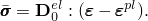

The plastic flow potential function and the yield surface make use of two stress invariants of the effective stress tensor, namely the hydrostatic pressure stress, 

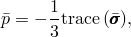

and the Mises equivalent effective stress, 

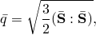

where 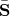 is the effective stress deviator, defined as

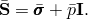

#### Plastic flow

The concrete damaged plasticity model assumes nonassociated potential plastic flow. The flow potential *G* used for this model is the Drucker-Prager hyperbolic function:

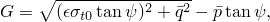

where 

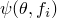

is the dilation angle measured in the *p*–*q* plane at high confining pressure;

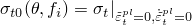

is the uniaxial tensile stress at failure, taken from the user-specified tension stiffening data; and

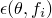

is a parameter, referred to as the eccentricity, that defines the rate at which the function approaches the asymptote (the flow potential tends to a straight line as the eccentricity tends to zero).

This flow potential, which is continuous and smooth, ensures that the flow direction is always uniquely defined. The function approaches the linear Drucker-Prager flow potential asymptotically at high confining pressure stress and intersects the hydrostatic pressure axis at 90. See ["Models for granular or polymer behavior," Section 4.4.2 of the Abaqus Theory Guide](../stm/stm-link.md#stm-mat-granularpoly), for further discussion of this potential.

The default flow potential eccentricity is , which implies that the material has almost the same dilation angle over a wide range of confining pressure stress values. Increasing the value of  provides more curvature to the flow potential, implying that the dilation angle increases more rapidly as the confining pressure decreases. Values of  that are significantly less than the default value may lead to convergence problems if the material is subjected to low confining pressures because of the very tight curvature of the flow potential locally where it intersects the *p*-axis.

#### Yield function

The model makes use of the yield function of Lubliner et. al. (1989), with the modifications proposed by Lee and Fenves (1998) to account for different evolution of strength under tension and compression. The evolution of the yield surface is controlled by the hardening variables,  and . In terms of effective stresses, the yield function takes the form

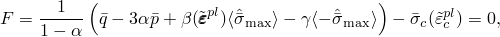

with 

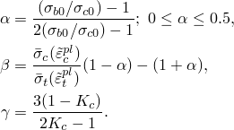

 Here,


is the maximum principal effective stress;

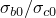

is the ratio of initial equibiaxial compressive yield stress to initial uniaxial compressive yield stress (the default value is );


 is the ratio of the second stress invariant on the tensile meridian, , to that on the compressive meridian, , at initial yield for any given value of the pressure invariant *p* such that the maximum principal stress is negative,  (see [Figure 23.6.3--8](pt05ch23s06abm39.md#concrete-yield-deviatoric)); it must satisfy the condition  (the default value is );


is the effective tensile cohesion stress; and


is the effective compressive cohesion stress.

**Figure 23.6.3–8** Yield surfaces in the deviatoric plane, corresponding to different values of .


Typical yield surfaces are shown in [Figure 23.6.3--8](pt05ch23s06abm39.md#concrete-yield-deviatoric) on the deviatoric plane and in [Figure 23.6.3--9](pt05ch23s06abm39.md#concrete-yield-ps) for plane stress conditions.

**Figure 23.6.3–9** Yield surface in plane stress.


#### Nonassociated flow

Because plastic flow is nonassociated, the use of concrete damaged plasticity results in a nonsymmetric material stiffness matrix. Therefore, to obtain an acceptable rate of convergence in Abaqus/Standard, the unsymmetric matrix storage and solution scheme should be used. Abaqus/Standard will automatically activate the unsymmetric solution scheme if concrete damaged plasticity is used in the analysis. If desired, you can turn off the unsymmetric solution scheme for a particular step (see ["Defining an analysis," Section 6.1.2](pt03ch06s01abo05.md)). 

#### Viscoplastic regularization

Material models exhibiting softening behavior and stiffness degradation often lead to severe convergence difficulties in implicit analysis programs, such as Abaqus/Standard. A common technique to overcome some of these convergence difficulties is the use of a viscoplastic regularization of the constitutive equations, which causes the consistent tangent stiffness of the softening material to become positive for sufficiently small time increments.

The concrete damaged plasticity model can be regularized in Abaqus/Standard using viscoplasticity by permitting stresses to be outside of the yield surface. We use a generalization of the Duvaut-Lions regularization, according to which the viscoplastic strain rate tensor, , is defined as 


Here  is the viscosity parameter representing the relaxation time of the viscoplastic system, and  is the plastic strain evaluated in the inviscid backbone model.

Similarly, a viscous stiffness degradation variable, , for the viscoplastic system is defined as


where *d* is the degradation variable evaluated in the inviscid backbone model. The stress-strain relation of the viscoplastic model is given as


Using the viscoplastic regularization with a small value for the viscosity parameter (small compared to the characteristic time increment) usually helps improve the rate of convergence of the model in the softening regime, without compromising results. The basic idea is that the solution of the viscoplastic system relaxes to that of the inviscid case as , where *t* represents time. You can specify the value of the viscosity parameter as part of the concrete damaged plasticity material behavior definition. If the viscosity parameter is different from zero, output results of the plastic strain and stiffness degradation refer to the viscoplastic values,  and . In Abaqus/Standard the default value of the viscosity parameter is zero, so that no viscoplastic regularization is performed. 

### Material damping

The concrete damaged plasticity model can be used in combination with material damping (see ["Material damping," Section 26.1.1](pt05ch26s01abm51.md)). If stiffness proportional damping is specified, Abaqus calculates the damping stress based on the undamaged elastic stiffness. This may introduce large artificial damping forces on elements undergoing severe damage at high strain rates.

### Visualization of "crack directions"

Unlike concrete models based on the smeared crack approach, the concrete damaged plasticity model does not have the notion of cracks developing at the material integration point. However, it is possible to introduce the concept of an effective crack direction with the purpose of obtaining a graphical visualization of the cracking patterns in the concrete structure. Different criteria can be adopted within the framework of scalar-damage plasticity for the definition of the direction of cracking. Following Lubliner et. al. (1989), we can assume that cracking initiates at points where the tensile equivalent plastic strain is greater than zero, , and the maximum principal plastic strain is positive. The direction of the vector normal to the crack plane is assumed to be parallel to the direction of the maximum principal plastic strain. This direction can be viewed in the Visualization module of Abaqus/CAE.

| **Abaqus/CAE Usage: ** | Visualization module: ****Result****Field Output****: **PE**, **Max. Principal** ****Plot****Symbols**** |
| --- | --- |

### Elements

Abaqus offers a variety of elements for use with the concrete damaged plasticity model: truss, shell, plane stress, plane strain, generalized plane strain, axisymmetric, and three-dimensional elements. Most beam elements can be used; however, beam elements in space that include shear stress caused by torsion and do not include hoop stress (such as B31, B31H, B32, B32H, B33, and B33H) cannot be used. Thin-walled, open-section beam elements and PIPE elements can be used with the concrete damaged plasticity model in Abaqus/Standard. 

For general shell analysis more than the default number of five integration points through the thickness of the shell should be used; nine thickness integration points are commonly used to model progressive failure of the concrete through the thickness with acceptable accuracy.

### Output

In addition to the standard output identifiers available in Abaqus (["Abaqus/Standard output variable identifiers," Section 4.2.1](pt02ch04s02abv01.md), and ["Abaqus/Explicit output variable identifiers," Section 4.2.2](pt02ch04s02xbv01.md)), the following variables relate specifically to material points in the concrete damaged plasticity model:

| DAMAGEC | Compressive damage variable, . |
| --- | --- |

| DAMAGET | Tensile damage variable, . |
| --- | --- |

| PEEQ | Compressive equivalent plastic strain, . |
| --- | --- |

| PEEQT | Tensile equivalent plastic strain, . |
| --- | --- |

| SDEG | Stiffness degradation variable, *d*. |
| --- | --- |

| DMENER | Energy dissipated per unit volume by damage. |
| --- | --- |

| ELDMD | Total energy dissipated in the element by damage. |
| --- | --- |

| ALLDMD | Energy dissipated in the whole (or partial) model by damage. The contribution from ALLDMD is included in the total strain energy ALLIE. |
| --- | --- |

| EDMDDEN | Energy dissipated per unit volume in the element by damage. |
| --- | --- |

| SENER | The recoverable part of the energy per unit volume. |
| --- | --- |

| ELSE | The recoverable part of the energy in the element. |
| --- | --- |

| ALLSE | The recoverable part of the energy in the whole (partial) model. |
| --- | --- |

| ESEDEN | The recoverable part of the energy per unit volume in the element. |
| --- | --- |

#### Additional references

- Hillerborg, A., M. Modeer, and P. E. Petersson, "Analysis of Crack Formation and Crack Growth in Concrete by Means of Fracture Mechanics and Finite Elements," Cement and Concrete Research, vol. 6, pp. 773--782, 1976.
- Lee, J., and G. L. Fenves, "Plastic-Damage Model for Cyclic Loading of Concrete Structures," Journal of Engineering Mechanics, vol. 124, no.8, pp. 892--900, 1998.
- Lubliner, J., J. Oliver, S. Oller, and E. Oate, "A Plastic-Damage Model for Concrete," International Journal of Solids and Structures, vol. 25, pp. 299--329, 1989.


