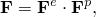
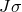

# 23.7.1 Permanent set in rubberlike materials


**Products: **Abaqus/Standard  Abaqus/Explicit  Abaqus/CAE  

##### **References**

- ["Combining material behaviors," Section 21.1.3](pt05ch21s01aus110.md)
- ["Hyperelastic behavior of rubberlike materials," Section 22.5.1](pt05ch22s05abm07.md)
- ["Classical metal plasticity," Section 23.2.1](pt05ch23s02abm17.md)
- [*HYPERELASTIC](../key/key-link.md#usb-kws-mhyperelast)
- [*MULLINS EFFECT](../key/key-link.md#usb-kws-mmullinseffect)
- [*PLASTIC](../key/key-link.md#usb-kws-mplastic)

### Overview

This feature:
- is intended for modeling permanent set observed in filled elastomers and thermoplastics;
- is based on multiplicative split of the deformation gradient;
- is based on the theory of incompressible isotropic hardening plasticity;
- can be used with any isotropic hyperelasticity model;
- can be combined with Mullins effects; and
- cannot be used to model viscoelastic or hysteresis effects or with the steady-state transport procedure.

### Material behavior

The real behavior of filled rubber elastomers under cyclic loading conditions is quite complex as shown in [Figure 23.7.1--1](pt05ch23s07abm40.md#cmullins-test-response2). 

**Figure 23.7.1–1** Typical behavior of a filled elastomer.


The observed mechanical behaviors are progressive damage resulting in a reduction of load carrying capacity with each cycle, stress softening (also known as Mullins effect) upon reloading after the first unloading from a previously attained maximum strain level, hysteretic dissipation of energy, and permanent set. This section is concerned with modeling permanent set; therefore, the idealized representation of permanent set is described below.

#### Idealized material behavior

From [Figure 23.7.1--1](pt05ch23s07abm40.md#cmullins-test-response2) it is clear that the observed permanent set is different for each cycle, but the material has a tendency to stabilize after a number of cycles of loading between zero stress and a given level of strain. For a given load level along the primary loading path shown with the dashed line in [Figure 23.7.1--1](pt05ch23s07abm40.md#cmullins-test-response2), the idealized representation of permanent set will be a single strain value after unloading has taken place. Since rate and time effects are ignored in this model, idealized loading and unloading take place along the same path, whether Mullins effect is included or not.

The permanent set behavior is captured by isotropic hardening Mises plasticity with an associated flow rule. In the context of finite elastic strains associated with the underlying rubberlike material, plasticity is modeled using a multiplicative split of the deformation gradient into elastic and plastic components:



where  is the elastic part of the deformation gradient (representing the hyperelastic behavior) and  is the plastic part of the deformation gradient (representing the stress-free intermediate configuration).

An example of modeling permanent set along with Mullins effect for a rubberlike material can be found in ["Analysis of a solid disc with Mullins effect and permanent set," Section 3.1.7 of the Abaqus Example Problems Guide](../exa/exa-link.md#exa-veh-mullinstire).

### Specifying permanent set

The primary hyperelastic behavior can be defined by using any of the hyperelastic material models (see ["Hyperelastic behavior of rubberlike materials," Section 22.5.1](pt05ch22s05abm07.md)). If test data input is used to define the hyperelastic response of the material, the data must be specified with respect to the stress-free intermediate configuration after unloading has taken place.

Permanent set can be defined through an isotropic hardening function in terms of the yield stress and the equivalent plastic strain. In this case the yield stress is the (effective) Kirchoff stress on the primary loading path from which unloading takes place, and the equivalent plastic strain is the corresponding logarithmic permanent set observed in the material. If  is the true (Cauchy) stress, Kirchoff stress is defined as , where  is the determinant of .

Depending on what is being modeled, permanent set may be defined as the true permanent set seen in the material after recovery of viscoelastic strains or it may include viscoelastic strains. In either case, an initial yield stress is required, below which there will be no permanent set and the behavior of the material will be fully elastic. In the case of filled rubbers this initial yield stress may correspond to a small nonzero stress; whereas for the family of thermoplastic materials, there may be a more marked value of initial yield stress.

| **Input File Usage: ** | ``` [*PLASTIC](../key/key-link.md#usb-kws-mplastic), HARDENING=ISOTROPIC ``` |
| --- | --- |

| **Abaqus/CAE Usage: ** | Property module: material editor: ****Mechanical****Plasticity****Plastic**** |
| --- | --- |

#### Processing test data

If you have uniaxial and/or biaxial test data, as shown in [Figure 23.7.1--1](pt05ch23s07abm40.md#cmullins-test-response2), you can use an interactive Abaqus/CAE plug-in to obtain the hyperelasticity, plasticity, and Mullins effect data. For information about the plug-in and instructions about its usage, see “Abaqus/CAE plug-in application for processing cyclic test data of filled elastomers and thermoplastics” in the Dassault Systmes Knowledge Base at [www.3ds.com/support/knowledge-base](http://www.3ds.com/support/knowledge-base).

### Limitations

The model is intended to capture permanent set under multiaxial stress states and mild reverse loading conditions, as illustrated by Govindarajan, Hurtado, and Mars (2007). This model is not intended to capture deformation under complete reverse loading. Any rate effects apply only to the plastic part of the material definition.

### Elements

Permanent set can be modeled with all element types that support the use of the hyperelastic material model.

### Procedures

Permanent set modeling can be carried out in all procedures that support the use of the hyperelastic material model with the exception of the steady-state transport procedure. In linear perturbation steps in Abaqus/Standard, the current material tangent stiffness corresponding to the elastic part is used to determine the response, while ignoring any plasticity effects.

### Output

The standard output identifiers available in Abaqus (["Abaqus/Standard output variable identifiers," Section 4.2.1](pt02ch04s02abv01.md), and ["Abaqus/Explicit output variable identifiers," Section 4.2.2](pt02ch04s02xbv01.md)) corresponding to other isotropic hardening plasticity models can be obtained for permanent set models.

#### Additional references

- Govindarajan, S. M., J. A. Hurtado, and W. V. Mars, "Simulation of Mullins Effect in Filled Elastomers Using Multiplicative Decomposition," European Conference for Constitutive Models for Rubber, September 2007, Paris, France.
- Simo, J. C., "Algorithms for Static and Dynamic Multiplicative Plasticity that Preserve the Classical Return Mapping Schemes of the Infinitesimal Theory," Computer Methods in Applied Mechanics and Engineering, vol. 99 61--112, 1992.
- Weber, G., and L. Anand, "Finite Deformation Constitutive Equations and Time Integration Procedure for Isotropic Hyperelastic-Viscoplastic Solids," Computer Methods in Applied Mechanics and Engineering, vol. 79 173--202, 1990.


