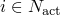
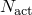

# 24.2.1 Damage and failure for ductile metals: overview


**Products: **Abaqus/Standard  Abaqus/Explicit  Abaqus/CAE  

##### **References**

- ["Progressive damage and failure," Section 24.1.1](pt05ch24s01abo21.md)
- ["Damage initiation for ductile metals," Section 24.2.2](pt05ch24s02abm42.md)
- ["Damage evolution and element removal for ductile metals," Section 24.2.3](pt05ch24s02abm43.md)
- [*DAMAGE INITIATION](../key/key-link.md#usb-kws-mdamageinitiation)
- [*DAMAGE EVOLUTION](../key/key-link.md#usb-kws-mdamageevolution)
- ["Defining damage," Section 12.9.3 of the Abaqus/CAE User's Guide](../usi/usi-link.md#usi-prp-mechanical-damage)

### Overview

Abaqus/Standard and Abaqus/Explicit offer a general capability for predicting the onset of failure and a capability for modeling progressive damage and failure of ductile metals. In the most general case this requires the specification of the following:
- the undamaged elastic-plastic response of the material (["Classical metal plasticity," Section 23.2.1](pt05ch23s02abm17.md));
- a damage initiation criterion (["Damage initiation for ductile metals," Section 24.2.2](pt05ch24s02abm42.md)); and
- a damage evolution response, including a choice of element removal (["Damage evolution and element removal for ductile metals," Section 24.2.3](pt05ch24s02abm43.md)).

A summary of the general framework for progressive damage and failure in Abaqus is given in ["Progressive damage and failure," Section 24.1.1](pt05ch24s01abo21.md). This section provides an overview of the damage initiation criteria and damage evolution law for ductile metals. In addition, Abaqus/Explicit offers dynamic failure models that are suitable for high-strain-rate dynamic problems (["Dynamic failure models," Section 23.2.8](pt05ch23s02abm24.md)).

### Damage initiation criterion

Abaqus offers a variety of choices of damage initiation criteria for ductile metals, each associated with distinct types of material failure. They can be classified in the following categories:
- Damage initiation criteria for the fracture of metals, including ductile and shear criteria.
- Damage initiation criteria for the necking instability of sheet metal. These include forming limit diagrams (FLD, FLSD, and MSFLD) intended to assess the formability of sheet metal and the Marciniak-Kuczynski (M-K) criterion (available only in Abaqus/Explicit) to numerically predict necking instability in sheet metal taking into account the deformation history.

These criteria are discussed in ["Damage initiation for ductile metals," Section 24.2.2](pt05ch24s02abm42.md). Each damage initiation criterion has an associated output variable to indicate whether the criterion has been met during the analysis. A value of 1.0 or higher indicates that the initiation criterion has been met.

More than one damage initiation criterion can be specified for a given material. If multiple damage initiation criteria are specified for the same material, they are treated independently. Once a particular initiation criterion is satisfied, the material stiffness is degraded according to the specified damage evolution law for that criterion; in the absence of a damage evolution law, however, the material stiffness is not degraded. A failure mechanism for which no damage evolution response is specified is said to be inactive. Abaqus will evaluate the initiation criterion for an inactive mechanism for output purposes only, but the mechanism will have no effect on the material response.

| **Input File Usage: ** | Use the following option to define each damage initiation criterion (repeat as needed to define multiple criteria): |
| --- | --- |
|  | ``` [*DAMAGE INITIATION](../key/key-link.md#usb-kws-mdamageinitiation), CRITERION=*criterion 1* ``` |

| **Abaqus/CAE Usage: ** | Property module: material editor: ****Mechanical****Damage for Ductile Metals*****criterion***** |
| --- | --- |

### Damage evolution

The damage evolution law describes the rate of degradation of the material stiffness once the corresponding initiation criterion has been reached.  For damage in ductile metals Abaqus assumes that the degradation of the stiffness associated with each active failure mechanism can be modeled using a scalar damage variable,  (), where  represents the set of active mechanisms. At any given time during the analysis the stress tensor in the material is given by the scalar damage equation 


where *D* is the overall damage variable and  is the effective (or undamaged) stress tensor computed in the current increment.  are the stresses that would exist in the material in the absence of damage. The material has lost its load-carrying capacity when . By default, an element is removed from the mesh if all of the section points at any one integration location have lost their load-carrying capacity.

The overall damage variable, *D*, captures the combined effect of all active mechanisms and is computed in terms of the individual damage variables, , according to a user-specified rule.

Abaqus supports different models of damage evolution in ductile metals and provides controls associated with element deletion due to material failure, as described in ["Damage evolution and element removal for ductile metals," Section 24.2.3](pt05ch24s02abm43.md). All of the available models use a formulation intended to alleviate the strong mesh dependency of the results that can arise from strain localization effects during progressive damage.

| **Input File Usage: ** | Use the following option immediately after the corresponding [*DAMAGE INITIATION](../key/key-link.md#usb-kws-mdamageinitiation) option to specify the damage evolution behavior: |
| --- | --- |
|  | ``` [*DAMAGE EVOLUTION](../key/key-link.md#usb-kws-mdamageevolution) ``` |

| **Abaqus/CAE Usage: ** | Property module: material editor: ****Mechanical****Damage for Ductile Metals*****criterion*****: ****Suboptions****Damage Evolution**** |
| --- | --- |

### Elements

The failure modeling capability for ductile metals can be used with any elements in Abaqus that include mechanical behavior (elements that have displacement degrees of freedom). 

For coupled temperature-displacement elements the thermal properties of the material are not affected by the progressive damage of the material stiffness until the condition for element deletion is reached; at this point the thermal contribution of the element is also removed.

The damage initiation criteria for sheet metal necking instability (FLD, FLSD, MSFLD, and M-K) are available only for elements that include mechanical behavior and use a plane stress formulation (i.e., plane stress, shell, continuum shell, and membrane elements).


