# 24.2.2 Damage initiation for ductile metals


**Products: **Abaqus/Standard  Abaqus/Explicit  Abaqus/CAE  

##### **References**

- ["Progressive damage and failure," Section 24.1.1](pt05ch24s01abo21.md)
- [*DAMAGE INITIATION](../key/key-link.md#usb-kws-mdamageinitiation)
- ["Defining damage," Section 12.9.3 of the Abaqus/CAE User's Guide](../usi/usi-link.md#usi-prp-mechanical-damage)

### Overview

The material damage initiation capability for ductile metals:
- is intended as a general capability for predicting initiation of damage in metals, including sheet, extrusion, and cast metals as well as other materials;
- can be used in combination with the damage evolution models for ductile metals described in ["Damage evolution and element removal for ductile metals," Section 24.2.3](pt05ch24s02abm43.md);
- allows the specification of more than one damage initiation criterion;
- includes ductile, shear, forming limit diagram (FLD), forming limit stress diagram (FLSD) and Mschenborn-Sonne forming limit diagram (MSFLD) criteria for damage initiation;
- includes in Abaqus/Explicit the Marciniak-Kuczynski (M-K) and Johnson-Cook criteria for damage initiation;
- can be used in Abaqus/Standard in conjunction with Mises, Johnson-Cook, Hill, and Drucker-Prager plasticity (ductile, shear, FLD, FLSD, and MSFLD criteria); and
- can be used in Abaqus/Explicit in conjunction with Mises and Johnson-Cook plasticity (ductile, shear, FLD, FLSD, MSFLD, Johnson-Cook, and MK criteria) and in conjunction with Hill and Drucker-Prager plasticity (ductile, shear, FLD, FLSD, MSFLD, and Johnson-Cook criteria).

### Damage initiation criteria for fracture of metals

Two main mechanisms can cause the fracture of a ductile metal: ductile fracture due to the nucleation, growth, and coalescence of voids; and shear fracture due to shear band localization. Based on phenomenological observations, these two mechanisms call for different forms of the criteria for the onset of damage ([Hooputra et al., 2004](pt05ch24s02abm42.md#usb-mat-ref-hooputra)). The functional forms provided by Abaqus for these criteria are discussed below. These criteria can be used in combination with the damage evolution models for ductile metals discussed in ["Damage evolution and element removal for ductile metals," Section 24.2.3](pt05ch24s02abm43.md), to model fracture of a ductile metal. (See ["Progressive failure analysis of thin-wall aluminum extrusion under quasi-static and dynamic loads," Section 2.1.16 of the Abaqus Example Problems Guide](../exa/exa-link.md#exa-dyn-failurealuminumextrusion), for an example.)

#### Ductile criterion

The ductile criterion is a phenomenological model for predicting the onset of damage due to nucleation, growth, and coalescence of voids. The model assumes that the equivalent plastic strain at the onset of damage, 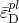, is a function of stress triaxiality and strain rate:

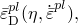

where  is the stress triaxiality, *p* is the pressure stress, *q* is the Mises equivalent stress, and 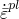 is the equivalent plastic strain rate. The criterion for damage initiation is met when the following condition is satisfied:

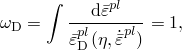

where 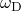 is a state variable that increases monotonically with plastic deformation. At each increment during the analysis the incremental increase in  is computed as 

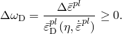

In Abaqus/Standard the ductile criterion can be used in conjunction with the Mises, Johnson-Cook, Hill, and Drucker-Prager plasticity models and in Abaqus/Explicit in conjunction with the Mises, Johnson-Cook, Hill, and Drucker-Prager plasticity models, including equation of state.

| **Input File Usage: ** | Use the following option to specify the equivalent plastic strain at the onset of damage as a tabular function of stress triaxality, strain rate, and, optionally, temperature and predefined field variables: |
| --- | --- |
|  | ``` [*DAMAGE INITIATION](../key/key-link.md#usb-kws-mdamageinitiation), CRITERION=DUCTILE, DEPENDENCIES=*n* ``` |

| **Abaqus/CAE Usage: ** | Property module: material editor: ****Mechanical****Damage for Ductile Metals****Ductile Damage**** |
| --- | --- |

##### Defining dependency of ductile criterion on Lode angle in Abaqus/Explicit

Recent experimental results for aluminum alloys and other metals ([Bai and Wierzbicki, 2008](pt05ch24s02abm42.md#usb-mat-ref-bai)) reveal that, in addition to stress triaxility and strain rate, ductile fracture can also depend on the third invariant of deviatoric stress, which is related to the Lode angle (or deviatoric polar angle). Abaqus/Explicit allows the definition of the equivalent plastic strain at the onset of ductile damage, , as a function of the Lode angle, , by way of the functional form 

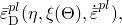

where 

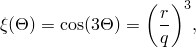

*q* is the Mises equivalent stress, and *r* is the third invariant of deviatoric stress, . The function 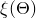 can take values from 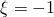, for stress states on the compressive meridian, to 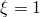, for stress states on the tensile meridian.

| **Input File Usage: ** | Use the following option to indicate that the equivalent plastic strain at the onset of ductile damage is a function of the Lode angle: |
| --- | --- |
|  | ``` [*DAMAGE INITIATION](../key/key-link.md#usb-kws-mdamageinitiation), CRITERION=DUCTILE, LODE DEPENDENT ``` |

| **Abaqus/CAE Usage: ** | Defining dependency of ductile criterion on Lode angle is not supported in Abaqus/CAE. |
| --- | --- |

##### Johnson-Cook criterion

The Johnson-Cook criterion (available only in Abaqus/Explicit) is a special case of the ductile criterion in which the equivalent plastic strain at the onset of damage, , is assumed to be of the form

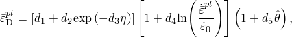

where –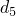 are failure parameters and  is the reference strain rate. This expression differs from the original formula published by [Johnson and Cook (1985)](pt05ch24s02abm42.md#usb-mat-ref-johnsoncook) in the sign of the parameter 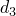. This difference is motivated by the fact that most materials experience a decrease in   with increasing stress triaxiality; therefore,  in the above expression will usually take positive values.  is the nondimensional temperature defined as

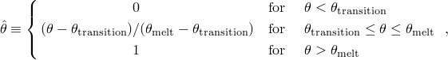

where  is the current temperature,  is the melting temperature, and  is the transition temperature defined as the one at or below which there is no temperature dependence on the expression of the damage strain .  The material parameters must be measured at or below the transition temperature.

The Johnson-Cook criterion can be used in conjunction with the Mises, Johnson-Cook, Hill, and Drucker-Prager plasticity models, including equation of state. When used in conjunction with the Johnson-Cook plasticity model, the specified values of the melting and transition temperatures should be consistent with the values specified in the plasticity definition. The Johnson-Cook damage initiation criterion can also be specified together with any other initiation criteria, including the ductile criteria; each initiation criterion is treated independently.

| **Input File Usage: ** | Use the following option to specify the parameters for the Johnson-Cook initiation criterion: |
| --- | --- |
|  | ``` [*DAMAGE INITIATION](../key/key-link.md#usb-kws-mdamageinitiation), CRITERION=JOHNSON COOK ``` |

| **Abaqus/CAE Usage: ** | Property module: material editor: ****Mechanical****Damage for Ductile Metals****Johnson-Cook Damage**** |
| --- | --- |

#### Shear criterion

The shear criterion is a phenomenological model for predicting the onset of damage due to shear band localization. The model assumes that the equivalent plastic strain at the onset of damage, 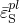, is a function of the shear stress ratio and strain rate:

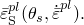

Here  is the shear stress ratio,  is the maximum shear stress, and 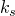 is a material parameter. A typical value of  for aluminum is  = 0.3 (Hooputra et al., 2004). The criterion for damage initiation is met when the following condition is satisfied:

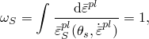

where 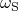 is a state variable that increases monotonically with plastic deformation proportional to the incremental change in equivalent plastic strain. At each increment during the analysis the incremental increase in  is computed as 

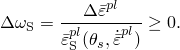

In Abaqus/Explicit the shear criterion can be used in conjunction with the Mises, Johnson-Cook, Hill, and Drucker-Prager plasticity models, including equation of state. In Abaqus/Standard it can be used with the Mises, Johnson-Cook, Hill, and Drucker-Prager models.

| **Input File Usage: ** | Use the following option to specify  and to specify the equivalent plastic strain at the onset of damage as a tabular function of the shear stress ratio, strain rate, and, optionally, temperature and predefined field variables: |
| --- | --- |
|  | ``` [*DAMAGE INITIATION](../key/key-link.md#usb-kws-mdamageinitiation), CRITERION=SHEAR, KS=, DEPENDENCIES=*n* ``` |

| **Abaqus/CAE Usage: ** | Property module: material editor: ****Mechanical****Damage for Ductile Metals****Shear Damage**** |
| --- | --- |

#### Initial conditions

Optionally, you can specify the initial work hardened state of the material by providing the initial equivalent plastic strain values (see ["Defining initial values of state variables for plastic hardening" in "Initial conditions in Abaqus/Standard and Abaqus/Explicit," Section 34.2.1](pt07ch34s02aus116.md#usb-prc-pinitialcond-hardening)) and, if residual stresses are also present, the initial stress values (see ["Defining initial stresses" in "Initial conditions in Abaqus/Standard and Abaqus/Explicit," Section 34.2.1](pt07ch34s02aus116.md#usb-prc-pinitialcond-stress)). Abaqus uses this information to initialize the values of the ductile and shear damage initiation criteria,  and , assuming constant values of stress triaxiality and shear shear ratio (linear stress path).

| **Input File Usage: ** | Use the following options to specify that material hardening and residual stresses have occurred prior to the current analysis: |
| --- | --- |
|  | ``` [*INITIAL CONDITIONS](../key/key-link.md#usb-kws-minitialcond), TYPE=HARDENING [*INITIAL CONDITIONS](../key/key-link.md#usb-kws-minitialcond), TYPE=STRESS ``` |

| **Abaqus/CAE Usage: ** | Use the following options to specify that material hardening and residual stresses have occurred prior to the current analysis: |
| --- | --- |
|  | Load module: **Create Predefined Field**: **Step: Initial**, choose **Mechanical** for the **Category** and **Hardening** and **Stress** for the **Types for Selected Step** |

### Damage initiation criteria for sheet metal instability

Necking instability plays a determining factor in sheet metal forming processes: the size of the local neck region is typically of the order of the thickness of the sheet, and local necks can rapidly lead to fracture. Localized necking cannot be modeled with traditional shell elements used in sheet metal forming simulations because the size of the neck is of the order of the thickness of the element. Abaqus supports four criteria for predicting the onset of necking instability in sheet metals: forming limit diagram (FLD); forming limit stress diagram (FLSD); Mschenborn-Sonne forming limit diagram (MSFLD); and Marciniak-Kuczynski (M-K) criteria, which is available only in Abaqus/Explicit. These criteria apply only to elements with a plane stress formulation (plane stress, shell, continuum shell, and membrane elements); Abaqus ignores these criteria for other elements. The initiation criteria for necking instability can be used in combination with the damage evolution models discussed in ["Damage evolution and element removal for ductile metals," Section 24.2.3](pt05ch24s02abm43.md), to account for the damage induced by necking.

Classical strain-based forming limit diagrams (FLDs) are known to be dependent on the strain path. Changes in the deformation mode (e.g., equibiaxial loading followed by uniaxial tensile strain) may result in major modifications in the level of the limit strains. Therefore, the FLD damage initiation criterion should be used with care if the strain paths in the analysis are nonlinear. In practical industrial applications, significant changes in the strain path may be induced by multistep forming operations, complex geometry of the tooling, and interface friction, among other factors. For problems with highly nonlinear strain paths Abaqus offers three additional damage initiation criteria: the forming limit stress diagram (FLSD) criterion, the Mschenborn-Sonne forming limit diagram (MSFLD) criterion, and in Abaqus/Explicit the Marciniak-Kuczynski (M-K) criterion; these alternatives to the FLD damage initiation criterion are intended to minimize load path dependence.

The characteristics of each criterion available in Abaqus for predicting damage initiation in sheet metals are discussed below.

#### Forming limit diagram (FLD) criterion

The forming limit diagram (FLD) is a useful concept introduced by Keeler and Backofen (1964) to determine the amount of deformation that a material can withstand prior to the onset of necking instability. The maximum strains that a sheet material can sustain prior to the onset of necking are referred to as the forming limit strains.  A FLD is a plot of the forming limit strains in the space of principal (in-plane) logarithmic strains. In the discussion that follows *major* and *minor* limit strains refer to the maximum and minimum values of the in-plane principal limit strains, respectively. The major limit strain is usually represented on the vertical axis and the minor strain on the horizontal axis, as illustrated in [Figure 24.2.2--1](pt05ch24s02abm42.md#forming-limit-diagram). The line connecting the states at which deformation becomes unstable is referred to as the forming limit curve (FLC). The FLC gives a sense of the formability of a sheet of material. Strains computed numerically by Abaqus can be compared to a FLC to determine the feasibility of the forming process under analysis. 

**Figure 24.2.2–1** Forming limit diagram (FLD).

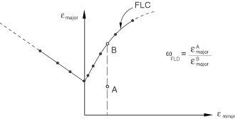

The FLD damage initiation criterion requires the specification of the FLC in tabular form by giving the major principal strain at damage initiation as a tabular function of the minor principal strain and, optionally, temperature and predefined field variables, 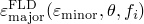. The damage initiation criterion for the FLD is given by the condition  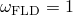, where the variable  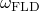 is a function of the current deformation state and is defined as the ratio of the current major principal strain, 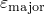, to the major limit strain on the FLC evaluated at the current values of the minor principal strain, 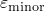; temperature, ; and predefined field variables, :

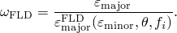

For example, for the deformation state given by point A in [Figure 24.2.2--1](pt05ch24s02abm42.md#forming-limit-diagram) the damage initiation criterion is evaluated as 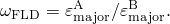

If the value of the minor strain lies outside the range of the specified tabular values, Abaqus will extrapolate the value of the major limit strain on the FLC by assuming that the slope at the endpoint of the curve remains constant. Extrapolation with respect to temperature and field variables follows the standard conventions: the property is assumed to be constant outside the specified range of temperature and field variables (see ["Material data definition," Section 21.1.2](pt05ch21s01aus109.md)).

Experimentally, FLDs are measured under conditions of biaxial stretching of a sheet, without bending effects. Under bending loading, however, most materials can achieve limit strains that are much greater than those on the FLC. To avoid the prediction of early failure under bending deformation, Abaqus evaluates the FLD criterion using the strains at the midplane through the thickness of the element. For composite shells with several layers the criterion is evaluated at the midplane of each layer for which a FLD curve has been specified, which ensures that only biaxial stretching effects are taken into account. Therefore, the FLD criterion is not suitable for modeling failure under bending loading; other failure models (such as ductile and shear failure) are more appropriate for such loading. Once the FLD damage initiation criterion is met, the evolution of damage is driven independently at each material point through the thickness of the element based on the local deformation at that point. Thus, although bending effects do not affect the evaluation of the FLD criterion, they may affect the rate of evolution of damage.

| **Input File Usage: ** | Use the following option to specify the limit major strain as a tabular function of minor strain: |
| --- | --- |
|  | ``` [*DAMAGE INITIATION](../key/key-link.md#usb-kws-mdamageinitiation), CRITERION=FLD ``` |

| **Abaqus/CAE Usage: ** | Property module: material editor: ****Mechanical****Damage for Ductile Metals****FLD Damage**** |
| --- | --- |

#### Forming limit stress diagram (FLSD) criterion

When strain-based FLCs are converted into stress-based FLCs, the resulting stress-based curves have been shown to be minimally affected by changes to the strain path (Stoughton, 2000); that is, different strain-based FLCs, corresponding to different strain paths, are mapped onto a single stress-based FLC. This property makes forming limit stress diagrams (FLSDs) an attractive alternative to FLDs for the prediction of necking instability under arbitrary loading. However, the apparent independence of the stress-based limit curves on the strain path may simply reflect the small sensitivity of the yield stress to changes in plastic deformation. This topic is still under discussion in the research community.

A FLSD is the stress counterpart of the FLD, with the major and minor principal in-plane stresses corresponding to the onset of necking localization plotted on the vertical and horizontal axes, respectively. In Abaqus the FLSD damage initiation criterion requires the specification of the major principal in-plane stress at damage initiation as a tabular function of the minor principal in-plane stress and, optionally, temperature and predefined field variables, 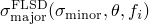. The damage initiation criterion for the FLSD is met when the condition  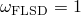 is satisfied, where the variable  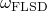 is a function of the current stress state and is defined as the ratio of the current major principal stress, 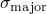, to the major stress on the FLSD evaluated at the current values of minor stress, 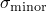; temperature, ; and predefined field variables, :

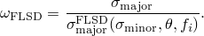

If the value of the minor stress lies outside the range of specified tabular values, Abaqus will extrapolate the value of the major limit stress assuming that the slope at the endpoints of the curve remains constant. Extrapolation with respect to temperature and field variables follows the standard conventions: the property is assumed to be constant outside the specified range of temperature and field variables (see ["Material data definition," Section 21.1.2](pt05ch21s01aus109.md)).

For reasons similar to those discussed earlier for the FLD criterion, Abaqus evaluates the FLSD criterion using the stresses averaged through the thickness of the element (or the layer, in the case of composite shells with several layers), ignoring bending effects. Therefore, the FLSD criterion cannot be used to model failure under bending loading; other failure models (such as ductile and shear failure) are more suitable for such loading. Once the FLSD damage initiation criterion is met, the evolution of damage is driven independently at each material point through the thickness of the element based on the local deformation at that point. Thus, although bending effects do not affect the evaluation of the FLSD criterion, they may affect the rate of evolution of damage.

| **Input File Usage: ** | Use the following option to specify the limit major stress as a tabular function of minor stress: |
| --- | --- |
|  | ``` [*DAMAGE INITIATION](../key/key-link.md#usb-kws-mdamageinitiation), CRITERION=FLSD ``` |

| **Abaqus/CAE Usage: ** | Property module: material editor: ****Mechanical****Damage for Ductile Metals****FLSD Damage**** |
| --- | --- |

#### Marciniak-Kuczynski (M-K) criterion

 Another approach available in Abaqus/Explicit for accurately predicting the forming limits for arbitrary loading paths is based on the localization analysis proposed by Marciniak and Kuczynski (1967). The approach can be used with the Mises and Johnson-Cook plasticity models, including kinematic hardening. In M-K analysis, virtual thickness imperfections are introduced as grooves simulating preexisting defects in an otherwise uniform sheet material. The deformation field is computed inside each groove as a result of the applied loading outside the groove. Necking is considered to occur when the ratio of the deformation in the groove relative to the nominal deformation (outside the groove) is greater than a critical value.

[Figure 24.2.2--2](pt05ch24s02abm42.md#mk-imperfection-geometry) shows schematically the geometry of the groove considered for M-K analysis. In the figure *a* denotes the nominal region in the shell element outside the imperfection, and *b* denotes the weak groove region. The initial thickness of the imperfection relative to the nominal thickness is given by the ratio 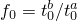, with the subscript 0 denoting quantities in the initial, strain-free state. The groove is oriented at a zero angle with respect to the 1-direction of the local material orientation.

**Figure 24.2.2–2** Imperfection model for the M-K analysis.

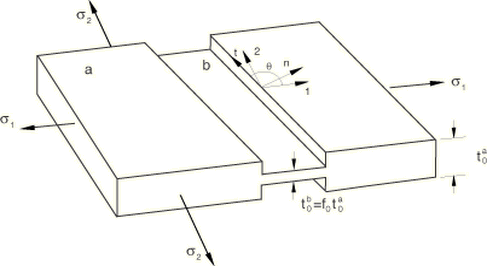

Abaqus/Explicit allows the specification of an anisotropic distribution of thickness imperfections as a function of angle with respect to the local material orientation, 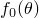. Abaqus/Explicit first solves for the stress-strain field in the nominal area ignoring the presence of imperfections; then it considers the effect of each groove alone. The deformation field inside each groove is computed by enforcing the strain compatibility condition

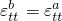

and the force equilibrium equations 

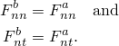

The subscripts *n* and *t* refer to the directions normal and tangential to the groove. In the above equilibrium equations  and  are forces per unit width in the *t*-direction. 

The onset of necking instability is assumed to occur when the ratio of the rate of deformation inside a groove relative to the rate of deformation if no groove were present is greater than a critical value. In addition, it may not be possible to find a solution that satisfies equilibrium and compatibility conditions once localization initiates at a particular groove; consequently, failure to find a converged solution is also an indicator of the onset of localized necking. For the evaluation of the damage initiation criterion Abaqus/Explicit uses the following measures of deformation severity:

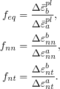

These deformation severity factors are evaluated on each of the specified groove directions and compared with the critical values. (The evaluation is performed only if the incremental deformation is primarily plastic; the M-K criterion will not predict damage initiation if the deformation increment is elastic.) The most unfavorable groove direction is used for the evaluation of the damage initiation criterion, which is given as

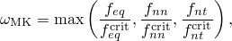

where 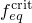, , and  are the critical values of the deformation severity indices. Damage initiation occurs when 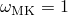 or when a converged solution to the equilibrium and compatibility equations cannot be found. By default, Abaqus/Explicit assumes 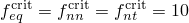; you can specify different values. If one of these parameters is set equal to zero, its corresponding deformation severity factor is not included in the evaluation of the damage initiation criterion. If all of these parameters are set equal to zero, the M-K criterion is based solely on nonconvergence of the equilibrium and compatibility equations.

You must specify the fraction, 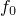, equal to the initial thickness at the virtual imperfection divided by the nominal thickness (see [Figure 24.2.2--2](pt05ch24s02abm42.md#mk-imperfection-geometry)), as well as the number of imperfections to be used for the evaluation of the M-K damage initiation criterion. It is assumed that these directions are equally spaced angularly. By default, Abaqus/Explicit uses four imperfections located at 0, 45, 90, and 135 with respect to the local 1-direction of the material. The initial imperfection size can be defined as a tabular function of angular direction, ; this allows the modeling of an anisotropic distribution of flaws in the material. Abaqus/Explicit will use this table to evaluate the thickness of each of the imperfections that will be used for the evaluation of the M-K analysis method. In addition, the initial imperfection size can also be a function of initial temperature and field variables; this allows defining a nonuniform spatial distribution of imperfections. Abaqus/Explicit will compute the initial imperfection size based on the values of temperature and field variables at the beginning of the analysis. The initial size of the imperfection remains a constant property during the rest of the analysis.

A general recommendation is to choose the value of  such that the forming limit predicted numerically for uniaxial strain loading conditions (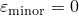) matches the experimental result.

The virtual grooves are introduced to evaluate the onset of necking instability; they do not influence the results in the underlying element. Once the criterion for necking instability is met, the material properties in the element are degraded according to the specified damage evolution law.

| **Input File Usage: ** | Use the following option to specify the initial imperfection thickness relative to the nominal thickness as a tabular function of the angle with respect to the 1-direction of the local material orientation and, optionally, initial temperature and field variables: |
| --- | --- |
|  | ``` [*DAMAGE INITIATION](../key/key-link.md#usb-kws-mdamageinitiation), CRITERION=MK, DEPENDENCIES=*n* ``` Use the following option to specify critical deformation severity factors: ``` [*DAMAGE INITIATION](../key/key-link.md#usb-kws-mdamageinitiation), CRITERION=MK, FEQ=, FNN=, FNT= ``` |

| **Abaqus/CAE Usage: ** | Property module: material editor: ****Mechanical****Damage for Ductile Metals****M-K Damage**** |
| --- | --- |

##### Performance considerations for the M-K criterion

There can be a substantial increase in the overall computational cost when the M-K criterion is used. For example, the cost of processing a shell element with three section points through the thickness and four imperfections, which is the default for the M-K criterion, increases by approximately a factor of two compared to the cost without the M-K criterion. You can mitigate the cost of evaluating this damage initiation criterion by reducing the number of flaw directions considered or by increasing the number of increments between M-K computations, as explained below. Of course, the effect on the overall analysis cost depends on the fraction of the elements in the model that use this damage initiation criterion. The computational cost per element with the M-K criterion increases by approximately a factor of 

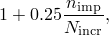

where 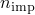 is the number of imperfections specified for the evaluation of the M-K criterion and 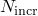 is the frequency, in number of increments, at which the M-K computations are performed. The coefficient of  in the above formula gives a reasonable estimate of the cost increase in most cases, but the actual cost increase may vary from this estimate. By default, Abaqus/Explicit performs the M-K computations on each imperfection at each time increment, . Care must be taken to ensure that the M-K computations are performed frequently enough to ensure the accurate integration of the deformation field on each imperfection.

| **Input File Usage: ** | Use the following option to specify the number of imperfections and frequency of the M-K analysis: |
| --- | --- |
|  | ``` [*DAMAGE INITIATION](../key/key-link.md#usb-kws-mdamageinitiation), CRITERION=MK, NUMBER IMPERFECTIONS=, FREQUENCY=  ``` |

| **Abaqus/CAE Usage: ** | Property module: material editor: ****Mechanical****Damage for Ductile Metals****M-K Damage****: **Number of imperfections** and **Frequency** |
| --- | --- |

#### Mschenborn-Sonne forming limit diagram (MSFLD) criterion

Mschenborn and Sonne (1975) proposed a method to predict the influence of the deformation path on the forming limits of sheet metals on the basis of the equivalent plastic strain, by assuming that the forming limit curve represents the sum of the highest attainable equivalent plastic strains. Abaqus makes use of a generalization of this idea to establish a criterion of necking instability of sheet metals for arbitrary deformation paths. The approach requires transforming the original forming limit curve (without predeformation effects) from the space of major versus minor strains to the space of equivalent plastic strain, , versus ratio of principal strain rates,  . 

For linear strain paths, assuming plastic incompressibility and neglecting elastic strains:


As illustrated in [Figure 24.2.2--3](pt05ch24s02abm42.md#ms-forming-limit-diagram), linear deformation paths in the FLD transform onto vertical paths in the – diagram (constant value of  ).

**Figure 24.2.2–3** Transformation of the forming limit curve from traditional FLD representation (a) to MSFLD representation (b). Linear deformation paths transform onto vertical paths.


According to the MSFLD criterion, the onset of localized necking occurs when the sequence of deformation states in the – diagram intersects the forming limit curve, as discussed below. It is emphasized that for linear deformation paths both FLD and MSFLD representations are identical and give rise to the same predictions. For arbitrary loading, however, the MSFLD representation takes into account the effects of the history of deformation through the use of the accumulated equivalent plastic strain.

For the specification of the MSFLD damage initiation criterion in Abaqus, you can directly provide the equivalent plastic strain at damage initiation as a tabular function of  and, optionally, equivalent plastic strain rate, temperature, and predefined field variables, . Alternatively, you can specify the curve in the traditional FLD format (in the space of major and minor strains) by providing a tabular function of the form . In this case Abaqus will automatically transform the data into the – format.

Let  represent the ratio of the current equivalent plastic strain, , to the equivalent plastic strain on the limit curve evaluated at the current values of ; strain rate, ; temperature, ; and predefined field variables, :


The MSFLD criterion for necking instability is met when the condition  is satisfied. Necking instability also occurs if the sequence of deformation states in the – diagram intersects the limit curve due to a sudden change in the straining direction. This situation is illustrated in [Figure 24.2.2--4](pt05ch24s02abm42.md#msfld-example). As  changes from  to , the line connecting the corresponding points in the – diagram intersects with the forming limit curve. When this situation occurs, the MSFLD criterion is reached despite the fact that . For output purposes Abaqus sets the value of  equal to one to indicate that the criterion has been met.

**Figure 24.2.2–4** Illustration of how a sudden change in the straining direction, from  to , can produce a horizontal intersection with the limit curve and lead to onset of necking.


The equivalent plastic strain  used for the evaluation of the MSFLD criterion in Abaqus is accumulated only over increments that result in an increase of the element area. Strain increments associated with a reduction of the element area cannot cause necking and do not contribute toward the evaluation of the MSFLD criterion. 

If the value of  lies outside the range of specified tabular values, Abaqus extrapolates the value of equivalent plastic strain for initiation of necking assuming that the slope at the endpoints of the curve remains constant. Extrapolation with respect to strain rate, temperature, and field variables follows the standard conventions: the property is assumed to be constant outside the specified range of strain rate, temperature, and field variables (see ["Material data definition," Section 21.1.2](pt05ch21s01aus109.md)).

As discussed in ["Progressive damage and failure of ductile metals," Section 2.2.21 of the Abaqus Verification Guide](../ver/ver-link.md#ver-mat-damage), predictions of necking instability based on the MSFLD criterion agree remarkably well with predictions based on the Marciniak and Kuczynski criterion, at significantly less computational cost than the Marciniak and Kuczynski criterion. There are some situations, however, in which the MSFLD criterion may overpredict the amount of formability left in the material. This occurs in situations when, sometime during the loading history, the material reaches a state that is very close to the point of necking instability and is subsequently strained in a direction along which it can sustain further deformation. In this case the MSFLD criterion may predict that the amount of additional formability in the new direction is greater than that predicted with the Marciniak and Kuczynski criterion. However, this situation is often not a concern in practical forming applications where safety factors in the forming limit diagrams are commonly used to ensure that the material state is sufficiently far away from the point of necking. Refer to ["Progressive damage and failure of ductile metals," Section 2.2.21 of the Abaqus Verification Guide](../ver/ver-link.md#ver-mat-damage), for a comparative analysis of these two criteria.

For reasons similar to those discussed earlier for the FLD criterion, Abaqus evaluates the MSFLD criterion using the strains at the midplane through the thickness of the element (or the layer, in the case of composite shells with several layers), ignoring bending effects. Therefore, the MSFLD criterion cannot be used to model failure under bending loading; other failure models (such as ductile and shear failure) are more suitable for such loading. Once the MSFLD damage initiation criterion is met, the evolution of damage is driven independently at each material point through the thickness of the element based on the local deformation at that point. Thus, although bending effects do not affect the evaluation of the MSFLD criterion, they may affect the rate of evolution of damage.

| **Input File Usage: ** | Use the following option to specify the MSFLD damage initiation criterion by providing the limit equivalent plastic strain as a tabular function of  (default): |
| --- | --- |
|  | ``` [*DAMAGE INITIATION](../key/key-link.md#usb-kws-mdamageinitiation), CRITERION=MSFLD, DEFINITION=MSFLD ``` Use the following option to specify the MSFLD damage initiation criterion by providing the limit major strain as a tabular function of minor strain: ``` [*DAMAGE INITIATION](../key/key-link.md#usb-kws-mdamageinitiation), CRITERION=MSFLD, DEFINITION=FLD ``` |

| **Abaqus/CAE Usage: ** | Property module: material editor: ****Mechanical****Damage for Ductile Metals****MSFLD Damage**** |
| --- | --- |

##### Numerical evaluation of the principal strain rates ratio

The ratio of principal strain rates, , can jump in value due to sudden changes in the deformation path. Special care is required during explicit dynamic simulations to avoid nonphysical jumps in  triggered by numerical noise, which may cause a horizontal intersection of the deformation state with the forming limit curve and lead to the premature prediction of necking instability. 

To overcome this problem, rather than computing  as a ratio of instantaneous strain rates, Abaqus/Explicit periodically updates  based on accumulated strain increments after small but significant changes in the equivalent plastic strain. The threshold value for the change in equivalent plastic strain triggering an update of  is denoted as , and  is approximated as


where  and  are principal values of the accumulated plastic strain since the previous update of . The default value of  is 0.002 (0.2%).

In addition, Abaqus/Explicit supports the following filtering method for the computation of :


where  represents the accumulated time over the analysis increments required to have an increase in equivalent plastic strain of at least . The factor  () facilitates filtering high-frequency oscillations. This filtering method is usually not necessary provided that an appropriate value of  is used. You can specify the value of  directly. The default value is  (no filtering).

In Abaqus/Standard  is computed at every analysis increment as , without using either of the above filtering methods. However, you can still specify values for  and ; and these values can be imported into any subsequent analysis in Abaqus/Explicit.

| **Input File Usage: ** | ``` [*DAMAGE INITIATION](../key/key-link.md#usb-kws-mdamageinitiation), CRITERION=MSFLD, PEINC=, OMEGA= ``` |
| --- | --- |

| **Abaqus/CAE Usage: ** | Property module: material editor: ****Mechanical****Damage for Ductile Metals****MSFLD Damage****: **Omega:**  |
| --- | --- |
|  | The value for  cannot be specified directly in Abaqus/CAE. |

##### Initial conditions

When we need to study the behavior of a material that has been previously subjected to deformations, such as those originated during the manufacturing process, initial equivalent plastic strain values can be provided to specify the initial work hardened state of the material (see ["Defining initial values of state variables for plastic hardening" in "Initial conditions in Abaqus/Standard and Abaqus/Explicit," Section 34.2.1](pt07ch34s02aus116.md#usb-prc-pinitialcond-hardening)). 

In addition, when the initial equivalent plastic strain is greater than the minimum value on the forming limit curve, the initial value of  plays an important role in determining whether the MSFLD damage initiation criterion will be met during subsequent deformation. It is, therefore, important to specify the initial value of  in these situations. To this end, you can specify initial values of the plastic strain tensor (see ["Defining initial values of plastic strain" in "Initial conditions in Abaqus/Standard and Abaqus/Explicit," Section 34.2.1](pt07ch34s02aus116.md#usb-prc-pinitialcond-pe)). Abaqus will use this information to compute the initial value of  as the ratio of the minor and major principal plastic strains; that is, neglecting the elastic component of deformation and assuming a linear deformation path.

| **Input File Usage: ** | Use both of the following options to specify that material hardening and plastic strain have occurred prior to the current analysis: |
| --- | --- |
|  | ``` [*INITIAL CONDITIONS](../key/key-link.md#usb-kws-minitialcond), TYPE=HARDENING [*INITIAL CONDITIONS](../key/key-link.md#usb-kws-minitialcond), TYPE=PLASTIC STRAIN ``` |

| **Abaqus/CAE Usage: ** | Load module: **Create Predefined Field**: **Step: Initial**, choose **Mechanical** for the **Category** and **Hardening** for the **Types for Selected Step** |
| --- | --- |
|  | Initial plastic strain conditions are not supported in Abaqus/CAE. |

### Elements

The damage initiation criteria for ductile metals can be used with any elements in Abaqus that include mechanical behavior (elements that have displacement degrees of freedom) except for the pipe elements in Abaqus/Explicit.

The models for sheet metal necking instability (FLD, FLSD, MSFLD, and M-K) are available only with elements that include mechanical behavior and use a plane stress formulation (i.e., plane stress, shell, continuum shell, and membrane elements).

### Output

In addition to the standard output identifiers available in Abaqus (["Output variables," Section 4.2](pt02ch04s02.md)), the following variables have special meaning when a damage initiation criterion is specified:

| ERPRATIO | Ratio of principal strain rates, , used for the MSFLD damage initiation criterion. |
| --- | --- |

| SHRRATIO | Shear stress ratio, , used for the evaluation of the shear damage initiation criterion. |
| --- | --- |

| TRIAX | Stress triaxiality,  (available in Abaqus/Standard only in conjunction with damage initiation). |
| --- | --- |

| DMICRT | All damage initiation criteria components listed below. |
| --- | --- |

| DUCTCRT | Ductile damage initiation criterion, . |
| --- | --- |

| JCCRT | Johnson-Cook damage initiation criterion (available only in Abaqus/Explicit). |
| --- | --- |

| SHRCRT | Shear damage initiation criterion, . |
| --- | --- |

| FLDCRT | Maximum value of the FLD damage initiation criterion, , during the analysis. |
| --- | --- |

| FLSDCRT | Maximum value of the FLSD damage initiation criterion, , during the analysis. |
| --- | --- |

| MSFLDCRT | Maximum value of the MSFLD damage initiation criterion, , during the analysis. |
| --- | --- |

| MKCRT | Marciniak-Kuczynski damage initiation criterion (available only in Abaqus/Explicit), . |
| --- | --- |

A value of 1 or greater for output variables associated with a damage initiation criterion indicates that the criterion has been met. Abaqus will limit the maximum value of the output variable to 1 if a damage evolution law has been prescribed for that criterion (see ["Damage evolution and element removal for ductile metals," Section 24.2.3](pt05ch24s02abm43.md)). However, if no damage evolution is specified, the criterion for damage initiation will continue to be computed beyond the point of damage initiation; in this case the output variable can take values greater than 1, indicating by how much the initiation criterion has been exceeded.

#### Additional references

- Hooputra, H., H. Gese, H. Dell, and H. Werner, "A Comprehensive Failure Model for Crashworthiness Simulation of Aluminium Extrusions," International Journal of Crashworthiness, vol. 9, no.5, pp. 449--464, 2004.
- Bai, Y., and T. Wierzbicki, "A New Model of Metal Plasticity and Fracture with Pressure and Lode Dependence," International Journal of Plasticity, vol. 24, no.6, pp. 1071--1096, 2008.
- Johnson, G. R., and W. H. Cook, "Fracture Characteristics of Three Metals Subjected to Various Strains, Strain rates, Temperatures and Pressures," Engineering Fracture Mechanics, vol. 21, no.1, pp. 31--48, 1985.
- Keeler, S. P., and W. A. Backofen, "Plastic Instability and Fracture in Sheets Stretched over Rigid Punches," ASM Transactions Quarterly, vol. 56, pp. 25--48, 1964.
- Marciniak, Z., and K. Kuczynski, "Limit Strains in the Processes of Stretch Forming Sheet Metal," International Journal of Mechanical Sciences, vol. 9, pp. 609--620, 1967.
- Mschenborn, W., and H. Sonne, "Influence of the Strain Path on the Forming Limits of Sheet Metal," Archiv fur das Eisenhttenwesen, vol. 46, no.9, pp. 597--602, 1975.
- Stoughton, T. B., "A General Forming Limit Criterion for Sheet Metal Forming," International Journal of Mechanical Sciences, vol. 42, pp. 1--27, 2000.


