# 24.2.3 Damage evolution and element removal for ductile metals


**Products: **Abaqus/Standard  Abaqus/Explicit  Abaqus/CAE  

##### **References**

- ["Progressive damage and failure," Section 24.1.1](pt05ch24s01abo21.md)
- [*DAMAGE EVOLUTION](../key/key-link.md#usb-kws-mdamageevolution)
- ["Damage evolution" in "Defining damage," Section 12.9.3 of the Abaqus/CAE User's Guide](../usi/usi-link.md#usi-prp-mechanical-damage-evolution)

### Overview

The damage evolution capability for ductile metals:
- assumes that damage is characterized by the progressive degradation of the material stiffness, leading to material failure;
- must be used in combination with a damage initiation criterion for ductile metals (["Damage initiation for ductile metals," Section 24.2.2](pt05ch24s02abm42.md));
- uses mesh-independent measures (either plastic displacement or physical energy dissipation) to drive the evolution of damage after damage initiation;
- takes into account the combined effect of different damage mechanisms acting simultaneously on the same material and includes options to specify how each mechanism contributes to the overall material degradation; and
- offers options for what occurs upon failure, including the removal of elements from the mesh.

### Damage evolution

[Figure 24.2.3--1](pt05ch24s02abm43.md#damaged-response) illustrates the characteristic stress-strain behavior of a material undergoing damage. In the context of an elastic-plastic material with isotropic hardening, the damage manifests itself in two forms: softening of the yield stress and degradation of the elasticity. The solid curve in the figure represents the damaged stress-strain response, while the dashed curve is the response in the absence of damage. As discussed later, the damaged response depends on the element dimensions such that mesh dependency of the results is minimized.

**Figure 24.2.3–1** Stress-strain curve with progressive damage degradation.

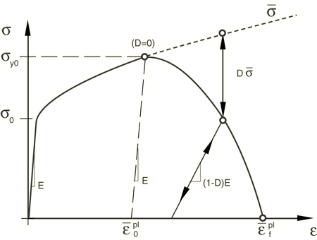

In the figure  and  are the yield stress and equivalent plastic strain at the onset of damage, and  is the equivalent plastic strain at failure; that is, when the overall damage variable reaches the value . The overall damage variable, *D*, captures the combined effect of all active damage mechanisms and is computed in terms of the individual damage variables, , as discussed later in this section (see ["Evaluating overall damage when multiple criteria are active](pt05ch24s02abm43.md#usb-mat-cdamageevol-multcrit)”).

The value of the equivalent plastic strain at failure, , depends on the characteristic length of the element and cannot be used as a material parameter for the specification of the damage evolution law. Instead, the damage evolution law is specified in terms of equivalent plastic displacement, , or in terms of fracture energy dissipation, ; these concepts are defined next. 

#### Mesh dependency and characteristic length

When material damage occurs, the stress-strain relationship no longer accurately represents the material's behavior. Continuing to use the stress-strain relation introduces a strong mesh dependency based on strain localization, such that the energy dissipated decreases as the mesh is refined. A different approach is required to follow the strain-softening branch of the stress-strain response curve. Hillerborg's (1976) fracture energy proposal is used to reduce mesh dependency by creating a stress-displacement response after damage is initiated. Using brittle fracture concepts, Hillerborg defines the energy required to open a unit area of crack, , as a material parameter. With this approach, the softening response after damage initiation is characterized by a stress-displacement response rather than a stress-strain response. 

The implementation of this stress-displacement concept in a finite element model requires the definition of a characteristic length, *L*, associated with an integration point. The fracture energy is then given as

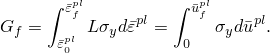

This expression introduces the definition of the equivalent plastic displacement, , as the fracture work conjugate of the yield stress after the onset of damage (work per unit area of the crack). Before damage initiation 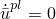; after damage initiation 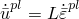.

The definition of the characteristic length depends on the element geometry and formulation: it is a typical length of a line across an element for a first-order element; it is half of the same typical length for a second-order element. For beams and trusses it is a characteristic length along the element axis. For membranes and shells it is a characteristic length in the reference surface. For axisymmetric elements it is a characteristic length in the *r*–*z* plane only. For cohesive elements it is equal to the constitutive thickness. This definition of the characteristic length is used because the direction in which fracture occurs is not known in advance. Therefore, elements with large aspect ratios will have rather different behavior depending on the direction in which they crack: some mesh sensitivity remains because of this effect, and elements that have aspect ratios close to unity are recommended. Alternatively, this mesh dependency could be reduced by directly specifying the characteristic length as a function of the element topology and material orientation in user subroutine [`VUCHARLENGTH`](../sub/sub-link.md#sub-xsl-vucharlength) (see ["Defining the characteristic element length at a material point in Abaqus/Explicit" in "Material data definition," Section 21.1.2](pt05ch21s01aus109.md#usb-mat-cmaterialdata-charlength)).

Each damage initiation criterion described in ["Damage initiation for ductile metals," Section 24.2.2](pt05ch24s02abm42.md), may have an associated damage evolution law. The damage evolution law can be specified in terms of equivalent plastic displacement, , or in terms of fracture energy dissipation, . Both of these options take into account the characteristic length of the element to alleviate mesh dependency of the results.

#### Evaluating overall damage when multiple criteria are active

The overall damage variable, *D*, captures the combined effect of all active mechanisms and is computed in terms of individual damage variables, , for each mechanism. You can choose to combine some of the damage variables in a multiplicative sense to form an intermediate variable, 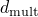, as follows:

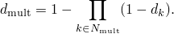

Then, the overall damage variable is computed as the maximum of  and the remaining damage variables:

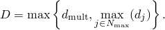

In the above expressions 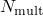 and 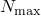 represent the sets of active mechanisms that contribute to the overall damage in a multiplicative and a maximum sense, respectively,  with 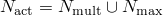.

| **Input File Usage: ** | Use the following option to specify that the damage associated with a particular criterion contributes to the overall damage variable in a maximum sense (default): |
| --- | --- |
|  | ``` [*DAMAGE EVOLUTION](../key/key-link.md#usb-kws-mdamageevolution), DEGRADATION=MAXIMUM ``` Use the following option to specify that the damage associated with a particular criterion contributes to the overall damage variable in a multiplicative sense: ``` [*DAMAGE EVOLUTION](../key/key-link.md#usb-kws-mdamageevolution), DEGRADATION=MULTIPLICATIVE ``` |

| **Abaqus/CAE Usage: ** | Use the following options to specify that the damage associated with a particular criterion contributes to the overall damage variable in a maximum sense (default) or in a multiplicative sense, respectively: |
| --- | --- |
|  | Property module: material editor: ****Mechanical****Damage for Ductile Metals*****criterion*****: ****Suboptions****Damage Evolution****: **Degradation:** **Maximum** or **Multiplicative** |

### Defining damage evolution based on effective plastic displacement

As discussed previously, once the damage initiation criterion has been reached, the effective plastic displacement, , is defined with the evolution equation

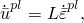

where *L* is the characteristic length of the element.

The evolution of the damage variable with the relative plastic displacement can be specified in tabular, linear, or exponential form. Instantaneous failure will occur if the plastic displacement at failure, , is specified as 0; however, this choice is not recommended and should be used with care because it causes a sudden drop of the stress at the material point that can lead to dynamic instabilities.

#### Tabular form

You can specify the damage variable directly as a tabular function of equivalent plastic displacement, 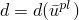, as shown in [Figure 24.2.3--2](pt05ch24s02abm43.md#dmgevol-plastic-disp)(a).

| **Input File Usage: ** | ``` [*DAMAGE EVOLUTION](../key/key-link.md#usb-kws-mdamageevolution), TYPE=DISPLACEMENT, SOFTENING=TABULAR ``` |
| --- | --- |

| **Abaqus/CAE Usage: ** | Property module: material editor: ****Mechanical****Damage for Ductile Metals*****criterion*****: ****Suboptions****Damage Evolution****: **Type:** **Displacement**: **Softening:** **Tabular** |
| --- | --- |

**Figure 24.2.3–2** Different definitions of damage evolution based on plastic displacement: (a) tabular, (b) linear, and (c) exponential.

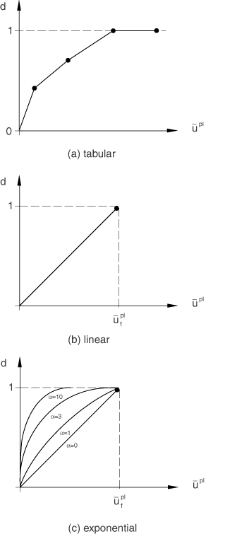

#### Linear form

Assume a linear evolution of the damage variable with effective plastic displacement, as shown in [Figure 24.2.3--2](pt05ch24s02abm43.md#dmgevol-plastic-disp)(b). You can specify the effective plastic displacement, , at the point of failure (full degradation). Then, the damage variable increases according to


This definition ensures that when the effective plastic displacement reaches the value 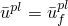, the material stiffness will be fully degraded (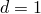). The linear damage evolution law defines a truly linear stress-strain softening response only if the effective response of the material is perfectly plastic (constant yield stress) after damage initiation.

| **Input File Usage: ** | ``` [*DAMAGE EVOLUTION](../key/key-link.md#usb-kws-mdamageevolution), TYPE=DISPLACEMENT, SOFTENING=LINEAR ``` |
| --- | --- |

| **Abaqus/CAE Usage: ** | Property module: material editor: ****Mechanical****Damage for Ductile Metals*****criterion*****: ****Suboptions****Damage Evolution****: **Type:** **Displacement**: **Softening:** **Linear** |
| --- | --- |

#### Exponential form

Assume an exponential evolution of the damage variable with plastic displacement, as shown in [Figure 24.2.3--2](pt05ch24s02abm43.md#dmgevol-plastic-disp)(c). You can specify the relative plastic displacement at failure, , and the exponent . The damage variable is given as

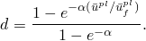

| **Input File Usage: ** | ``` [*DAMAGE EVOLUTION](../key/key-link.md#usb-kws-mdamageevolution), TYPE=DISPLACEMENT, SOFTENING=EXPONENTIAL ``` |
| --- | --- |

| **Abaqus/CAE Usage: ** | Property module: material editor: ****Mechanical****Damage for Ductile Metals*****criterion*****: ****Suboptions****Damage Evolution****: **Type:** **Displacement**: **Softening:** **Exponential** |
| --- | --- |

### Defining damage evolution based on energy dissipated during the damage process

You can specify the fracture energy per unit area, , to be dissipated during the damage process directly. Instantaneous failure will occur if  is specified as 0. However, this choice is not recommended and should be used with care because it causes a sudden drop in the stress at the material point that can lead to dynamic instabilities.

The evolution in the damage can be specified in linear or exponential form.

#### Linear form

Assume a linear evolution of the damage variable with plastic displacement. You can specify the fracture energy per unit area, . Then, once the damage initiation criterion is met, the damage variable increases according to

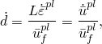

where the equivalent plastic displacement at failure is computed as

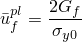

and 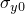 is the value of the yield stress at the time when the failure criterion is reached. Therefore, the model becomes equivalent to that shown in [Figure 24.2.3--2](pt05ch24s02abm43.md#dmgevol-plastic-disp)(b). The model ensures that the energy dissipated during the damage evolution process is equal to  only if the effective response of the material is perfectly plastic (constant yield stress) beyond the onset of damage.

| **Input File Usage: ** | ``` [*DAMAGE EVOLUTION](../key/key-link.md#usb-kws-mdamageevolution), TYPE=ENERGY, SOFTENING=LINEAR ``` |
| --- | --- |

| **Abaqus/CAE Usage: ** | Property module: material editor: ****Mechanical****Damage for Ductile Metals*****criterion*****: ****Suboptions****Damage Evolution****: **Type:** **Energy**: **Softening:** **Linear** |
| --- | --- |

#### Exponential form

Assume an exponential evolution of the damage variable given as

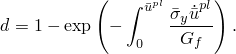

 The formulation of the model ensures that the energy dissipated during the damage evolution process is equal to , as shown in [Figure 24.2.3--3](pt05ch24s02abm43.md#dmgevol-energy-exp)(a). In theory, the damage variable reaches a value of 1 only asymptotically at infinite equivalent plastic displacement ([Figure 24.2.3--3](pt05ch24s02abm43.md#dmgevol-energy-exp)(b)). In practice, Abaqus/Explicit will set *d* equal to one when the dissipated energy reaches a value of 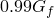.

| **Input File Usage: ** | ``` [*DAMAGE EVOLUTION](../key/key-link.md#usb-kws-mdamageevolution), TYPE=ENERGY, SOFTENING=EXPONENTIAL ``` |
| --- | --- |

| **Abaqus/CAE Usage: ** | Property module: material editor: ****Mechanical****Damage for Ductile Metals*****criterion*****: ****Suboptions****Damage Evolution****: **Type:** **Energy**: **Softening:** **Exponential** |
| --- | --- |

**Figure 24.2.3–3** Energy-based damage evolution with exponential law: evolution of (a) yield stress and (b) damage variable.

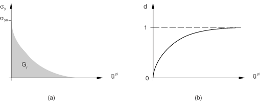

### Maximum degradation and choice of element removal

You have control over how Abaqus treats elements with severe damage. You can specify an upper bound, , to the overall damage variable, *D*; and you can choose whether to delete an element once maximum degradation is reached. The latter choice also affects which stiffness components are damaged.

#### Specifying the value of maximum degradation

The default setting of  depends on whether elements are to be deleted upon reaching maximum degradation (discussed next). For the default case of element deletion and in all cases for cohesive elements, 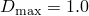; otherwise, 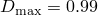. The output variable SDEG contains the value of *D*. No further damage is accumulated at an integration point once *D* reaches  (except, of course, any remaining stiffness is lost upon element deletion).

| **Input File Usage: ** | Use the following option to specify : |
| --- | --- |
|  | ``` [*SECTION CONTROLS](../key/key-link.md#usb-kws-msectioncontrols), MAX DEGRADATION= ``` |

#### Removing the element from the mesh

Elements are deleted by default upon reaching maximum degradation. Except for cohesive elements with traction-separation response (see ["Defining the constitutive response of cohesive elements using a traction-separation description," Section 32.5.6](pt06ch32s05alm45.md)), Abaqus applies damage to all stiffness components equally for elements that may eventually be removed:

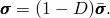

In Abaqus/Standard an element is removed from the mesh if *D* reaches  at all of the section points at all the integration locations of an element except for cohesive elements (for cohesive elements the conditions for element deletion are that *D* reaches  at all integration points and, for traction-separation response, none of the integration points are in compression). 

In Abaqus/Explicit an element is removed from the mesh if *D* reaches  at all of the section points at any one integration location of an element except for cohesive elements (for cohesive elements the conditions for element deletion are that *D* reaches  at all integration points and, for traction-separation response, none of the integration points are in compression). For example, removal of a solid element takes place, by default, when maximum degradation is reached at any one integration point. However, in a shell element all through-the-thickness section points at any one integration location of an element must fail before the element is removed from the mesh. In the case of second-order reduced-integration beam elements, reaching maximum degradation at all section points through the thickness at either of the two element integration locations along the beam axis leads, by default, to element removal. Similarly, in modified triangular and tetrahedral solid elements and fully integrated membrane elements *D* reaching  at any one integration point leads, by default, to element removal.

In a heat transfer analysis the thermal properties of the material are not affected by the progressive damage of the material stiffness until the condition for element deletion is reached; at this point the thermal contribution of the element is also removed.

| **Input File Usage: ** | Use the following option to delete the element from the mesh (default): |
| --- | --- |
|  | ``` [*SECTION CONTROLS](../key/key-link.md#usb-kws-msectioncontrols), ELEMENT DELETION=YES ``` |

#### Keeping the element in the computations

Optionally, you may choose not to remove the element from the mesh, except in the case of three-dimensional beam elements. With element deletion turned off, the overall damage variable is enforced to be 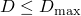. The default value is  if element deletion is turned off, which ensures that elements will remain active in the simulation with a residual stiffness of at least 1% of the original stiffness. The dimensionality of the stress state of the element affects which stiffness components can become damaged, as discussed below.

In a heat transfer analysis the thermal properties of the material are not affected by damage of the material stiffness.

| **Input File Usage: ** | Use the following option to keep the element in the computation: |
| --- | --- |
|  | ``` [*SECTION CONTROLS](../key/key-link.md#usb-kws-msectioncontrols), ELEMENT DELETION=NO ``` |

##### Elements with three-dimensional stress states in Abaqus/Explicit

For elements with three-dimensional stress states (including generalized plane strain elements) the shear stiffness will be degraded up to a maximum value, , leading to softening of the deviatoric stress components. The bulk stiffness, however, will be degraded only while the material is subjected to negative pressures (i.e., hydrostatic tension); there is no bulk degradation under positive pressures. This corresponds to a fluid-like behavior. Therefore, the degraded deviatoric, , and pressure, *p*, stresses are computed as

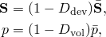

where the deviatoric and volumetric damage variables are given as 

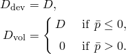

In this case the output variable SDEG contains the value of 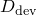.

##### Elements with three-dimensional stress states in Abaqus/Standard

For elements with three-dimensional stress states (including generalized plane strain elements) the stiffness will be degraded uniformly until the maximum degradation, , is reached. Output variable SDEG contains the value of *D*.

##### Elements with plane stress states

For elements with a plane stress formulation (plane stress, shell, continuum shell, and membrane elements) the stiffness will be degraded uniformly until the maximum degradation, , is reached. Output variable SDEG contains the value of *D*.

##### Elements with one-dimensional stress states

For elements with a one-dimensional stress state (i.e., truss elements, rebar, and cohesive elements with gasket behavior) their only stress component will be degraded if it is positive (tension). The material stiffness will remain unaffected under compression loading. The stress is, therefore, given by 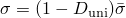, where the uniaxial damage variable is computed as

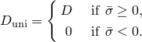

 In this case  determines the maximum allowed degradation in uniaxial tension (). Output variable SDEG contains the value of 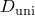.

### Convergence difficulties in Abaqus/Standard

Material models exhibiting softening behavior and stiffness degradation often lead to severe convergence difficulties in implicit analysis programs, such as Abaqus/Standard. Some techniques are available in Abaqus/Standard to improve convergence for analyses involving these materials.

#### Viscous regularization in Abaqus/Standard

You can overcome some of the convergence difficulties associated with softening and stiffness degradation by using the viscous regularization scheme, which causes the tangent stiffness matrix of the softening material to be positive for sufficiently small time increments.

In this regularization scheme a viscous damage variable is defined by the evolution equation:


where  is the viscosity coefficient representing the relaxation time of the viscous system and *d* is the damage variable evaluated in the inviscid base model. The damaged response of the viscous material is computed using the viscous value of the damage variable. Using viscous regularization with a small value of the viscosity parameter (small compared to the characteristic time increment) usually helps improve the rate of convergence of the model in the softening regime, without compromising results. The basic idea is that the solution of the viscous system relaxes to that of the inviscid case as , where *t* represents time.

In Abaqus/Standard you can specify the viscous coefficients as part of a section controls definition. For more information, see ["Using viscous regularization with cohesive elements, connector elements, and elements that can be used with the damage evolution models for ductile metals and fiber-reinforced composites in Abaqus/Standard" in "Section controls," Section 27.1.4](pt06ch27s01aus113.md#usb-elm-esectioncontrol-viscosity).

#### Unsymmetric equation solver

In general, if any of the ductile evolution models is used, the material Jacobian matrix will be nonsymmetric. To improve convergence, it is recommended that the unsymmetric equation solver is used in this case.

### Using the damage models with rebar

It is possible to use material damage models in elements for which rebar are also defined. The base material contribution to the element stress-carrying capacity diminishes according to the behavior described previously in this section. The rebar contribution to the element stress-carrying capacity will not be affected unless damage is also included in the rebar material definition; in that case the rebar contribution to the element stress-carrying capacity will also be degraded after the damage initiation criterion specified for the rebar is met. For the default choice of element deletion, the element is removed from the mesh when at any one integration location all section points in the base material and rebar are fully degraded.

### Elements

Damage evolution for ductile metals can be defined for any element that can be used with the damage initiation criteria for ductile metals in Abaqus (["Damage initiation for ductile metals," Section 24.2.2](pt05ch24s02abm42.md)).

### Output

In addition to the standard output identifiers available in Abaqus (["Abaqus/Standard output variable identifiers," Section 4.2.1](pt02ch04s02abv01.md), and ["Abaqus/Explicit output variable identifiers," Section 4.2.2](pt02ch04s02xbv01.md)), the following variables have special meaning when damage evolution is specified:

| STATUS | Status of element (the status of an element is 1.0 if the element is active, 0.0 if the element is not). |
| --- | --- |

| SDEG | Overall scalar stiffness degradation, *D*. |
| --- | --- |

#### Additional reference

- Hillerborg, A., M. Modeer, and P. E. Petersson, "Analysis of Crack Formation and Crack Growth in Concrete by Means of Fracture Mechanics and Finite Elements," Cement and Concrete Research, vol. 6, pp. 773--782, 1976.


