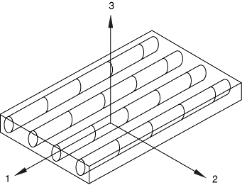

# 24.3.1 Damage and failure for fiber-reinforced composites: overview

**Products: **Abaqus/Standard  Abaqus/Explicit  Abaqus/CAE  

##### **References**

- ["Progressive damage and failure," Section 24.1.1](pt05ch24s01abo21.md)
- ["Damage initiation for fiber-reinforced composites," Section 24.3.2](pt05ch24s03abm45.md)
- ["Damage evolution and element removal for fiber-reinforced composites," Section 24.3.3](pt05ch24s03abm46.md)
- [*DAMAGE INITIATION](../key/key-link.md#usb-kws-mdamageinitiation)
- [*DAMAGE EVOLUTION](../key/key-link.md#usb-kws-mdamageevolution)
- [*DAMAGE STABILIZATION](../key/key-link.md#usb-kws-mdamagestabilization)
- ["Hashin damage" in "Defining damage," Section 12.9.3 of the Abaqus/CAE User's Guide](../usi/usi-link.md#usi-prp-mechanical-damage-hashin)

### Overview

Abaqus offers a damage model enabling you to predict the onset of damage and to model damage evolution for elastic-brittle materials with anisotropic behavior. The model is primarily intended to be used with fiber-reinforced materials since they typically exhibit such behavior.

This damage model requires specification of the following:
- the undamaged response of the material, which must be linearly elastic (see ["Linear elastic behavior," Section 22.2.1](pt05ch22s02abm02.md));
- a damage initiation criterion (see ["Progressive damage and failure," Section 24.1.1](pt05ch24s01abo21.md), and ["Damage initiation for fiber-reinforced composites," Section 24.3.2](pt05ch24s03abm45.md)); and
- a damage evolution response, including a choice of element removal (see ["Progressive damage and failure," Section 24.1.1](pt05ch24s01abo21.md), and ["Damage evolution and element removal for fiber-reinforced composites," Section 24.3.3](pt05ch24s03abm46.md)).

### General concepts of damage in unidirectional lamina

Damage is characterized by the degradation of material stiffness. It plays an important role in the analysis of fiber-reinforced composite materials. Many such materials exhibit elastic-brittle behavior; that is, damage in these materials is initiated without significant plastic deformation. Consequently, plasticity can be neglected when modeling behavior of such materials.

The fibers in the fiber-reinforced material are assumed to be parallel, as depicted in [Figure 24.3.1--1](pt05ch24s03abm44.md#usb-mat-fiberreinforcedmaterial). 

**Figure 24.3.1–1** Unidirectional lamina.

You must specify material properties in a local coordinate system defined by the user. The lamina is in the 1–2 plane, and the local 1 direction corresponds to the fiber direction. You must specify the undamaged material response using one of the methods for defining an orthotropic linear elastic material (["Linear elastic behavior," Section 22.2.1](pt05ch22s02abm02.md)); the most convenient of which is the method for defining an orthotropic material in plane stress (["Defining orthotropic elasticity in plane stress" in "Linear elastic behavior," Section 22.2.1](pt05ch22s02abm02.md#usb-mat-clinearelastic-planestress)). However, the material response can also be defined in terms of the engineering constants or by specifying the elastic stiffness matrix directly.

The Abaqus anisotropic damage model is based on the work of [Matzenmiller et. al (1995)](#cdmagefibercomposite-matzenmiller), [Hashin and Rotem (1973)](#cdmagefibercomposite-hashin73), [Hashin (1980)](#cdmagefibercomposite-hashin80), and [Camanho and Davila (2002)](#cdmagefibercomposite-camanho).

 Four different modes of failure are considered:
- fiber rupture in tension;
- fiber buckling and kinking in compression;
- matrix cracking under transverse tension and shearing; and
- matrix crushing under transverse compression and shearing.

In Abaqus the onset of damage is determined by the initiation criteria proposed by [Hashin and Rotem (1973)](#cdmagefibercomposite-hashin73) and [Hashin (1980)](#cdmagefibercomposite-hashin80), in which the failure surface is expressed in the effective stress space (the stress acting over the area that effectively resists the force). These criteria are discussed in detail in ["Damage initiation for fiber-reinforced composites," Section 24.3.2](pt05ch24s03abm45.md).

The response of the material is computed from 

where  is the strain and  is the elasticity matrix, which reflects any damage and has the form

where ,  reflects the current state of fiber damage,  reflects the current state of matrix damage,   reflects the current state of shear damage,  is the Young's modulus in the fiber direction,  is the Young's modulus in the direction perpendicular to the fibers,  is the shear modulus, and  and  are Poisson's ratios.

The evolution of the elasticity matrix due to damage is discussed in more detail in ["Damage evolution and element removal for fiber-reinforced composites," Section 24.3.3](pt05ch24s03abm46.md); that section also discusses:
- options for treating severe damage (["Maximum degradation and choice of element removal" in "Damage evolution and element removal for fiber-reinforced composites," Section 24.3.3](pt05ch24s03abm46.md#usb-mat-cdamagefibercomposite-deletion)); and
- viscous regularization (["Viscous regularization" in "Damage evolution and element removal for fiber-reinforced composites," Section 24.3.3](pt05ch24s03abm46.md#usb-mat-cdamagefibercomposite-regularize)).

### Elements

The fiber-reinforced composite damage model must be used with elements with a plane stress formulation, which include plane stress, shell, continuum shell, and membrane elements.

#### Additional references

- Camanho, P. P., and C. G. Davila, "Mixed-Mode Decohesion Finite Elements for the Simulation of Delamination in Composite Materials," NASA/TM-2002--211737, pp. 1--37, 2002.
- Hashin, Z., "Failure Criteria for Unidirectional Fiber Composites," Journal of Applied Mechanics, vol. 47, pp. 329--334, 1980.
- Hashin, Z., and A. Rotem, "A Fatigue Criterion for Fiber-Reinforced Materials," Journal of Composite Materials, vol. 7, pp. 448--464, 1973.
- Lapczyk, I., and J. A. Hurtado, "Progressive Damage Modeling in Fiber-Reinforced Materials," Composites Part A: Applied Science and Manufacturing, vol. 38, no.11, pp. 2333--2341, 2007.
- Matzenmiller, A., J. Lubliner, and R. L. Taylor, "A Constitutive Model for Anisotropic Damage in Fiber-Composites," Mechanics of Materials, vol. 20, pp. 125--152, 1995.

