# 24.3.2 Damage initiation for fiber-reinforced composites


**Products: **Abaqus/Standard  Abaqus/Explicit  Abaqus/CAE  

##### **References**

- ["Progressive damage and failure," Section 24.1.1](pt05ch24s01abo21.md)
- ["Damage evolution and element removal for fiber-reinforced composites," Section 24.3.3](pt05ch24s03abm46.md)
- [*DAMAGE INITIATION](../key/key-link.md#usb-kws-mdamageinitiation)
- ["Hashin damage" in "Defining damage," Section 12.9.3 of the Abaqus/CAE User's Guide](../usi/usi-link.md#usi-prp-mechanical-damage-hashin)

### Overview

The material damage initiation capability for fiber-reinforced materials:
- requires that the behavior of the undamaged material is linearly elastic (see ["Linear elastic behavior," Section 22.2.1](pt05ch22s02abm02.md));
- is based on Hashin's theory ([Hashin and Rotem, 1973](#cdmagefibercomposite-hashin73), and [Hashin, 1980](#cdmagefibercomposite-hashin80));
- takes into account four different failure modes: fiber tension, fiber compression, matrix tension, and matrix compression; and
- can be used in combination with the damage evolution model described in ["Damage evolution and element removal for fiber-reinforced composites," Section 24.3.3](pt05ch24s03abm46.md) (see ["Failure of blunt notched fiber metal laminates," Section 1.4.6 of the Abaqus Example Problems Guide](../exa/exa-link.md#exa-sta-damagefailfml)).

### Damage Initiation

Damage initiation refers to the onset of degradation at a material point. In Abaqus the damage initiation criteria for fiber-reinforced composites are based on Hashin's theory (see [Hashin and Rotem, 1973](#cdmagefibercomposite-hashin73), and [Hashin, 1980](#cdmagefibercomposite-hashin80)).  These criteria consider four different damage initiation mechanisms: fiber tension, fiber compression, matrix tension, and matrix compression.

The initiation criteria have the following general forms:

Fiber tension 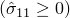: 

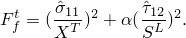

Fiber compression : 

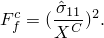

Matrix tension : 

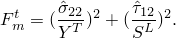

Matrix compression 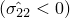: 

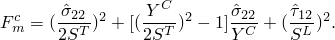

In the above equations 

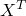

 denotes the longitudinal tensile strength;

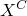

denotes the longitudinal compressive strength;

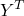

denotes the transverse tensile strength;

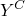

denotes the transverse compressive strength;

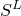

denotes the longitudinal shear strength;

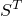

denotes the transverse shear strength;


 is a coefficient that determines the contribution of the shear stress to the fiber tensile initiation criterion; and

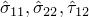

are components of the effective stress tensor, 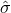, that is used to evaluate the initiation criteria and which is computed from:

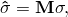

where  is the true stress and  is the damage operator:

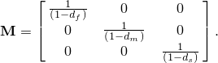

, , and  are internal (damage) variables that characterize fiber, matrix, and shear damage, which are derived from damage variables , , , and , corresponding to the four modes previously discussed, as follows:

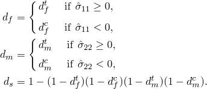

Prior to any damage initiation and evolution the damage operator, , is equal to the identity matrix, so 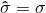. Once damage initiation and evolution has occurred for at least one mode, the damage operator becomes significant in the criteria for damage initiation of other modes (see ["Damage evolution and element removal for fiber-reinforced composites," Section 24.3.3](pt05ch24s03abm46.md), for discussion of damage evolution). The effective stress, 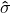, is intended to represent the stress acting over the damaged area that effectively resists the internal forces.

The initiation criteria presented above can be specialized to obtain the model proposed in Hashin and Rotem (1973) by setting  and 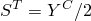 or the model proposed in Hashin (1980) by setting .

An output variable is associated with each initiation criterion (fiber tension, fiber compression, matrix tension, matrix compression) to indicate whether the criterion has been met. A value of 1.0 or higher indicates that the initiation criterion has been met (see ["Output](pt05ch24s03abm45.md#usb-mat-cdamageinitfibercomposite-output)” for further details). If you define a damage initiation model without defining an associated evolution law, the initiation criteria will affect only output. Thus, you can use these criteria to evaluate the propensity of the material to undergo damage without modeling the damage process.

| **Input File Usage: ** | Use the following option to define the Hashin damage initiation criterion: |
| --- | --- |
|  | ``` [*DAMAGE INITIATION](../key/key-link.md#usb-kws-mdamageinitiation), CRITERION=HASHIN, ALPHA= , , , , ,  ``` |

| **Abaqus/CAE Usage: ** | Property module: material editor: ****Mechanical****Damage for Fiber-Reinforced Composites****Hashin Damage**** |
| --- | --- |

### Elements

The damage initiation criteria must be used with elements with a plane stress formulation, which include plane stress, shell, continuum shell, and membrane elements.

### Output

In addition to the standard output identifiers available in Abaqus (["Abaqus/Standard output variable identifiers," Section 4.2.1](pt02ch04s02abv01.md), and, ["Abaqus/Explicit output variable identifiers," Section 4.2.2](pt02ch04s02xbv01.md)), the following variables relate specifically to damage initiation at a material point in the fiber-reinforced composite damage model:

| DMICRT | All damage initiation criteria components. |
| --- | --- |

| HSNFTCRT | Maximum value of the fiber tensile initiation criterion experienced during the analysis. |
| --- | --- |

| HSNFCCRT | Maximum value of the fiber compressive initiation criterion experienced during the analysis. |
| --- | --- |

| HSNMTCRT | Maximum value of the matrix tensile initiation criterion experienced during the analysis. |
| --- | --- |

| HSNMCCRT | Maximum value of the matrix compressive initiation criterion experienced during the analysis. |
| --- | --- |

For the variables above that indicate whether an initiation criterion in a damage mode has been satisfied or not, a value that is less than 1.0 indicates that the criterion has not been satisfied, while a value of 1.0 or higher indicates that the criterion has been satisfied. If you define a damage evolution model, the maximum value of this variable does not exceed 1.0. However, if you do not define a damage evolution model, this variable can have values higher than 1.0, which indicates by how much the criterion has been exceeded.

#### Additional references

- Hashin, Z., "Failure Criteria for Unidirectional Fiber Composites," Journal of Applied Mechanics, vol. 47, pp. 329--334, 1980.
- Hashin, Z., and A. Rotem, "A Fatigue Criterion for Fiber-Reinforced Materials," Journal of Composite Materials, vol. 7, pp. 448--464, 1973.
- Lapczyk, I., and J. A. Hurtado, "Progressive Damage Modeling in Fiber-Reinforced Materials," Composites Part A: Applied Science and Manufacturing, vol. 38, no.11, pp. 2333--2341, 2007.


