# 24.3.3 Damage evolution and element removal for fiber-reinforced composites


**Products: **Abaqus/Standard  Abaqus/Explicit  Abaqus/CAE  

##### **References**

- ["Progressive damage and failure," Section 24.1.1](pt05ch24s01abo21.md)
- ["Damage initiation for fiber-reinforced composites," Section 24.3.2](pt05ch24s03abm45.md)
- [*DAMAGE EVOLUTION](../key/key-link.md#usb-kws-mdamageevolution)
- ["Damage evolution" in "Defining damage," Section 12.9.3 of the Abaqus/CAE User's Guide](../usi/usi-link.md#usi-prp-mechanical-damage-evolution)

### Overview

The damage evolution capability for fiber-reinforced materials in Abaqus:
- assumes that damage is characterized by progressive degradation of material stiffness, leading to material failure;
- requires linearly elastic behavior of the undamaged material (see ["Linear elastic behavior," Section 22.2.1](pt05ch22s02abm02.md));
- takes into account four different failure modes: fiber tension, fiber compression, matrix tension, and matrix compression;
- uses four damage variables to describe damage for each failure mode;
- must be used in combination with Hashin's damage initiation criteria (["Damage initiation for fiber-reinforced composites," Section 24.3.2](pt05ch24s03abm45.md));
- is based on energy dissipation during the damage process;
- offers options for what occurs upon failure, including the removal of elements from the mesh; and
- can be used in conjunction with a viscous regularization of the constitutive equations to improve the convergence rate in the softening regime.

### Damage evolution

The previous section (["Damage initiation for fiber-reinforced composites," Section 24.3.2](pt05ch24s03abm45.md)) discussed the damage initiation in plane stress fiber-reinforced composites. This section will discuss the post-damage initiation behavior for cases in which a damage evolution model has been specified. Prior to damage initiation the material is linearly elastic, with the stiffness matrix of a plane stress orthotropic material. Thereafter, the response of the material is computed from 

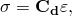

where  is the strain and 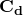 is the damaged elasticity matrix, which has the form

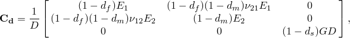

where 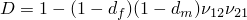, 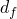 reflects the current state of fiber damage,  reflects the current state of matrix damage,   reflects the current state of shear damage,  is the Young's modulus in the fiber direction,  is the Young's modulus in the matrix direction,  is the shear modulus, and  and 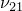 are Poisson's ratios.

 The damage variables , , and  are derived from damage variables 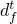, 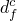, 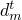, and 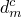, corresponding to the four failure modes previously discussed, as follows:

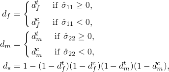

 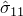 and 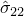 are components of the effective stress tensor. The effective stress tensor is primarily used to evaluate damage initiation criteria; see ["Damage initiation for fiber-reinforced composites," Section 24.3.2](pt05ch24s03abm45.md), for a description of how the effective stress tensor is computed.

#### Evolution of damage variables for each mode

To alleviate mesh dependency during material softening, Abaqus introduces a characteristic length into the formulation, so that the constitutive law is expressed as a stress-displacement relation. The damage variable will evolve such that the stress-displacement behaves as shown in  [Figure 24.3.3--1](pt05ch24s03abm46.md#cdamagefibercomposite-stressdisp) in each of the four failure modes. The positive slope of the stress-displacement curve prior to damage initiation corresponds to linear elastic material behavior; the negative slope after damage initiation is achieved by evolution of the respective damage variables according to the equations shown below.

**Figure 24.3.3–1** Equivalent stress versus equivalent displacement.

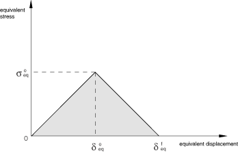

Equivalent displacement and stress for each of the four damage modes are defined as follows:

Fiber tension :

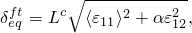

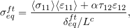

Fiber compression 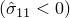:

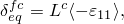

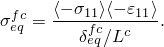

Matrix tension 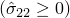:

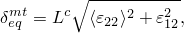

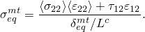

Matrix compression 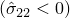:

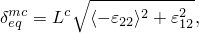

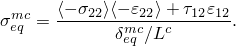

 The characteristic length, , is based on the element geometry and formulation: it is a typical length of a line across an element for a first-order element; it is half of the same typical length for a second-order element. For membranes and shells it is a characteristic length in the reference surface, computed as the square root of the area. Alternatively, this characteristic length could be defined as a function of the element topology and material orientation in user subroutine [`VUCHARLENGTH`](../sub/sub-link.md#sub-xsl-vucharlength) (see ["Defining the characteristic element length at a material point in Abaqus/Explicit" in "Material data definition," Section 21.1.2](pt05ch21s01aus109.md#usb-mat-cmaterialdata-charlength)). The symbol  in the equations above represents the Macaulay bracket operator, which is defined for every 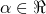 as 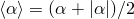.

After damage initiation (i.e., 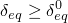) for the behavior shown in [Figure 24.3.3--1](pt05ch24s03abm46.md#cdamagefibercomposite-stressdisp), the damage variable for a particular mode is given by the following expression

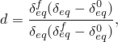

 where 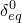 is the initial equivalent displacement at which the initiation criterion for that mode was met and 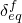 is the displacement at which the material is completely damaged in this failure mode. The above relation is presented graphically in [Figure 24.3.3--2](pt05ch24s03abm46.md#cdamagefibercomposite-damagevar). 

**Figure 24.3.3–2** Damage variable as a function of equivalent displacement.

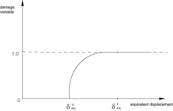

The values of  for the various modes depend on the elastic stiffness and the strength parameters specified as part of the damage initiation definition (see ["Damage initiation for fiber-reinforced composites," Section 24.3.2](pt05ch24s03abm45.md)). For each failure mode you must specify the energy dissipated due to failure, 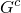, which corresponds to the area of the triangle OAC in [Figure 24.3.3--3](pt05ch24s03abm46.md#cdamagefibercomposite-energy). The values of  for the various modes depend on the respective  values.

Unloading from a partially damaged state, such as point B in [Figure 24.3.3--3](pt05ch24s03abm46.md#cdamagefibercomposite-energy), occurs along a linear path toward the origin in the plot of equivalent stress vs. equivalent displacement; this same path is followed back to point B upon reloading as shown in the figure.

**Figure 24.3.3–3** Linear damage evolution.

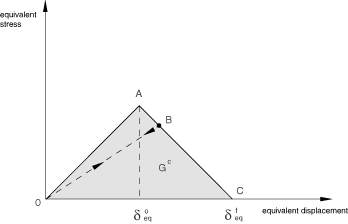

| **Input File Usage: ** | Use the following option to define the damage evolution law: |
| --- | --- |
|  | ``` [*DAMAGE EVOLUTION](../key/key-link.md#usb-kws-mdamageevolution), TYPE=ENERGY, SOFTENING=LINEAR , , ,  ``` where 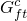, 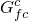, 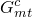, and 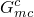 are energies dissipated during damage for fiber tension, fiber compression, matrix tension, and matrix compression failure modes, respectively. |

| **Abaqus/CAE Usage: ** | Property module: material editor: ****Mechanical****Damage for Fiber-Reinforced Composites****Hashin Damage****: ****Suboptions****Damage Evolution****: **Type:** **Energy**: **Softening:** **Linear** |
| --- | --- |

### Maximum degradation and choice of element removal

You have control over how Abaqus treats elements with severe damage. By default, the upper bound to all damage variables at a material point is . You can reduce this upper bound as discussed in ["Controlling element deletion and maximum degradation for materials with damage evolution" in "Section controls," Section 27.1.4](pt06ch27s01aus113.md#usb-elm-esectioncontrol-deletion). 

 By default, in Abaqus/Standard an element is removed (deleted) once damage variables for all failure modes at all material points reach  (see ["Controlling element deletion and maximum degradation for materials with damage evolution" in "Section controls," Section 27.1.4](pt06ch27s01aus113.md#usb-elm-esectioncontrol-deletion)). In Abaqus/Explicit a material point is assumed to fail when either of the damage variables associated with fiber failure modes (tensile or compressive) reaches  and the element is removed from the mesh when this condition is satisfied at all of the section points at any one integration location of an element; for example, in the case of shell elements all through-the-thickness section points at any one integration location of the element must fail before the element is removed from the mesh. If an element is removed, the output variable STATUS is set to zero for the element, and it offers no resistance to subsequent deformation. Elements that have been removed are not displayed when you view the deformed model in the Visualization module of Abaqus/CAE (Abaqus/Viewer). However, the elements still remain in the Abaqus model. You can choose to display removed elements by suppressing use of the STATUS variable (see ["Selecting the status field output variable," Section 42.5.6 of the Abaqus/CAE User's Guide](../usi/usi-link.md#usv-res-statustabbtn), in the HTML version of this guide). 

 Alternatively, you can specify that an element should remain in the model even after all of the damage variables reach . In this case, once all the damage variables reach the maximum value, the stiffness, , remains constant (see the expression for  earlier in this section).

#### Difficulties associated with element removal in Abaqus/Standard

When  elements are removed from the model, their nodes will still remain in the model even if they are not attached to any active elements. When the solution progresses, these nodes might undergo non-physical displacements due to the extrapolation scheme used in Abaqus/Standard to speed up the solution (see ["Convergence criteria for nonlinear problems," Section 7.2.3](pt03ch07s02aus51.md)). These non-physical displacements can be prevented by turning off the extrapolation. In addition, applying a point load to a node that is not attached to an active element will cause convergence difficulties since there is no stiffness to resist the load. It is the responsibility of the user to prevent such situations.

### Viscous regularization

Material models exhibiting softening behavior and stiffness degradation often lead to severe convergence difficulties in implicit analysis programs, such as Abaqus/Standard. You can overcome some of these convergence difficulties by using the viscous regularization scheme, which causes the tangent stiffness matrix of the softening material to be positive for sufficiently small time increments.

In this regularization scheme a viscous damage variable is defined by the evolution equation:

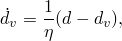

where  is the viscosity coefficient representing the relaxation time of the viscous system and *d* is the damage variable evaluated in the inviscid backbone model. The damaged response of the viscous material is given as

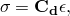

where the damaged elasticity matrix, , is computed using viscous values of damage variables for each failure mode. Using viscous regularization with a small value of the viscosity parameter (small compared to the characteristic time increment) usually helps improve the rate of convergence of the model in the softening regime, without compromising results. The basic idea is that the solution of the viscous system relaxes to that of the inviscid case as 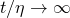, where *t* represents time.

Viscous regularization is also available in Abaqus/Explicit. Viscous regularization slows down the rate of increase of damage and leads to increased fracture energy with increasing deformation rates, which can be exploited as an effective method of modeling rate-dependent material behavior.

In Abaqus/Standard the approximate amount of energy associated with viscous regularization over the whole model or over an element set is available using output variable ALLCD.

#### Defining viscous regularization coefficients

You can specify different values of viscous coefficients for different failure modes.

| **Input File Usage: ** | Use the following option to define viscous coefficients: |
| --- | --- |
|  | ``` [*DAMAGE STABILIZATION](../key/key-link.md#usb-kws-mdamagestabilization) , , ,  ``` where 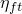, 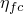, 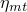, 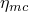 are viscosity coefficients for fiber tension, fiber compression, matrix tension, and matrix compression failure modes, respectively. |

| **Abaqus/CAE Usage: ** | Use the following input to define the viscous coefficients for fiber-reinforced materials: |
| --- | --- |
|  | Property module: material editor: ****Mechanical****Damage for Fiber-Reinforced Composites****Hashin Damage****: ****Suboptions****Damage Stabilization**** |

##### Applying a single viscous coefficient in Abaqus/Standard

Alternatively, in Abaqus/Standard you can specify the viscous coefficients as part of a section controls definition. In this case the same viscous coefficient will be applied to all failure modes.  For more information, see ["Using viscous regularization with cohesive elements, connector elements, and elements that can be used with the damage evolution models for ductile metals and fiber-reinforced composites in Abaqus/Standard" in "Section controls," Section 27.1.4](pt06ch27s01aus113.md#usb-elm-esectioncontrol-viscosity).

### Material damping

If stiffness proportional damping is specified in combination with the damage evolution law for fiber-reinforced materials, Abaqus calculates the damping stresses using the damaged elastic stiffness.

### Elements

The damage evolution law for fiber-reinforced materials must be used with elements with a plane stress formulation, which include plane stress, shell, continuum shell, and membrane elements.

### Output

In addition to the standard output identifiers available in Abaqus (["Abaqus/Standard output variable identifiers," Section 4.2.1](pt02ch04s02abv01.md)), the following variables relate specifically to damage evolution in the fiber-reinforced composite damage model:

| STATUS | Status of the element (the status of an element is 1.0 if the element is active, 0.0 if the element is not). The value of this variable is set to 0.0 only if damage has occurred in all the damage modes. |
| --- | --- |

| DAMAGEFT | Fiber tensile damage variable. |
| --- | --- |

| DAMAGEFC | Fiber compressive damage variable. |
| --- | --- |

| DAMAGEMT | Matrix tensile damage variable. |
| --- | --- |

| DAMAGEMC | Matrix compressive damage variable. |
| --- | --- |

| DAMAGESHR | Shear damage variable. |
| --- | --- |

| EDMDDEN | Energy dissipated per unit volume in the element by damage. |
| --- | --- |

| ELDMD | Total energy dissipated in the element by damage. |
| --- | --- |

| DMENER | Energy dissipated per unit volume by damage. |
| --- | --- |

| ALLDMD | Energy dissipated in the whole (or partial) model by damage. |
| --- | --- |

| ECDDEN | Energy per unit volume in the element that is associated with viscous regularization. |
| --- | --- |

| ELCD | Total energy in the element that is associated with viscous regularization. |
| --- | --- |

| CENER | Energy per unit volume that is associated with viscous regularization. |
| --- | --- |

| ALLCD | The approximate amount of energy over the whole model or over an element set that is associated with viscous regularization. |
| --- | --- |

#### Additional reference

- Lapczyk, I., and J. A. Hurtado, "Progressive Damage Modeling in Fiber-Reinforced Materials," Composites Part A: Applied Science and Manufacturing, vol. 38, no.11, pp. 2333--2341, 2007.


