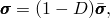
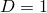

# 24.4.1 Damage and failure for ductile materials in low-cycle fatigue analysis: overview

**Product: **Abaqus/Standard  

##### **References**

- ["Progressive damage and failure," Section 24.1.1](pt05ch24s01abo21.md)
- ["Damage initiation for ductile materials in low-cycle fatigue," Section 24.4.2](pt05ch24s04abm48.md)
- ["Damage evolution for ductile materials in low-cycle fatigue," Section 24.4.3](pt05ch24s04abm49.md)
- ["Low-cycle fatigue analysis using the direct cyclic approach," Section 6.2.7](pt03ch06s02at06.md)
- [*DAMAGE INITIATION](../key/key-link.md#usb-kws-mdamageinitiation)
- [*DAMAGE EVOLUTION](../key/key-link.md#usb-kws-mdamageevolution)

### Overview

Abaqus/Standard offers a general capability for modeling progressive damage and failure of ductile materials due to stress reversals and the accumulation of inelastic strain energy in a low-cycle fatigue analysis using the direct cyclic approach. In the most general case this requires the specification of the following:
- the undamaged ductile materials in any elements (including cohesive elements based on a continuum approach) whose response is defined in terms of a continuum-based constitutive model (["Material library: overview," Section 21.1.1](pt05ch21s01abo18.md));
- a damage initiation criterion (["Damage initiation for ductile materials in low-cycle fatigue," Section 24.4.2](pt05ch24s04abm48.md)); and
- a damage evolution response (["Damage evolution for ductile materials in low-cycle fatigue," Section 24.4.3](pt05ch24s04abm49.md)).

A summary of the general framework for progressive damage and failure in Abaqus is given in ["Progressive damage and failure," Section 24.1.1](pt05ch24s01abo21.md). This section provides an overview of the damage initiation criteria and damage evolution law for ductile materials in a low-cycle fatigue analysis using the direct cyclic approach. 

### General concepts of damage of ductile materials in low-cycle fatigue

Accurately and effectively predicting the fatigue life for an inelastic structure, such as a solder joint in an electronic chip packaging, subjected to sub-critical cyclic loading is a challenging problem. Cyclic thermal or mechanical loading often leads to stress reversals and the accumulation of inelastic strain, which may in turn lead to the initiation and propagation of a crack. The low-cycle fatigue analysis capability in Abaqus/Standard uses a direct cyclic approach (["Low-cycle fatigue analysis using the direct cyclic approach," Section 6.2.7](pt03ch06s02at06.md)) to model progressive damage and failure based on a continuum damage approach. The damage initiation (["Damage initiation for ductile materials in low-cycle fatigue," Section 24.4.2](pt05ch24s04abm48.md)) and evolution (["Damage evolution for ductile materials in low-cycle fatigue," Section 24.4.3](pt05ch24s04abm49.md)) are characterized by the stabilized accumulated inelastic hysteresis strain energy per cycle proposed by [Darveaux (2002)](pt05ch24s04abm47.md#cdamagefatigue-darveaux2002) and [Lau (2002)](pt05ch24s04abm47.md#cdamagefatigue-lau2002).

The damage evolution law describes the rate of degradation of the material stiffness per cycle once the corresponding initiation criterion has been reached.  For damage in ductile materials Abaqus/Standard assumes that the degradation of the stiffness can be modeled using a scalar damage variable, . At any given cycle during the analysis the stress tensor in the material is given by the scalar damage equation 

where  is the effective (or undamaged) stress tensor that would exist in the material in the absence of damage computed in the current increment. The material has lost its load carrying capacity when .

### Elements

The failure modeling capability for ductile materials can be used with any elements (including cohesive elements based on a continuum approach) in Abaqus/Standard that include mechanical behavior (elements that have displacement degrees of freedom).

#### Additional references

- Darveaux, R., "Effect of Simulation Methodology on Solder Joint Crack Growth Correlation and Fatigue Life Prediction," Journal of Electronic Packaging, vol. 124, pp. 147--154, 2002.
- Lau, J., S. Pan, and C. Chang, "A New Thermal-Fatigue Life Prediction Model for Wafer Level Chip Scale Package (WLCSP) Solder Joints," Journal of Electronic Packaging, vol. 124, pp. 212--220, 2002.

