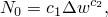

# 24.4.2 Damage initiation for ductile materials in low-cycle fatigue


**Product: **Abaqus/Standard  

##### **References**

- ["Progressive damage and failure," Section 24.1.1](pt05ch24s01abo21.md)
- [*DAMAGE INITIATION](../key/key-link.md#usb-kws-mdamageinitiation)

### Overview

The material damage initiation capability for ductile materials based on inelastic hysteresis energy:
- is intended as a general capability for predicting initiation of damage in ductile materials in a low-cycle fatigue analysis;
- can be used in combination with the damage evolution law for ductile materials described in ["Damage evolution for ductile materials in low-cycle fatigue," Section 24.4.3](pt05ch24s04abm49.md); and
- can be used only in a low-cycle fatigue analysis using the direct cyclic approach (["Low-cycle fatigue analysis using the direct cyclic approach," Section 6.2.7](pt03ch06s02at06.md)).

### Damage initiation criteria for ductile materials

The damage initiation criterion is a phenomenological model for predicting the onset of damage due to stress reversals and the accumulation of inelastic strain in a low-cycle fatigue analysis. It is characterized by the accumulated inelastic hysteresis energy per cycle, , in a material point when the structure response is stabilized in the cycle. The cycle number in which damage is initiated is given by



where  and  are material constants.  The value of  is dependent on the system of units in which you are working; some care is required to modify  when converting to a different system of units.

The initiation criterion can be used in conjunction with any ductile material.

| **Input File Usage: ** | ``` [*DAMAGE INITIATION](../key/key-link.md#usb-kws-mdamageinitiation), CRITERION=HYSTERESIS ENERGY ``` |
| --- | --- |

### Elements

The damage initiation criteria for ductile materials can be used with any elements in Abaqus/Standard that include mechanical behavior (elements that have displacement degrees of freedom). This includes cohesive elements based on a continuum approach (["Modeling of an adhesive layer of finite thickness" in "Defining the constitutive response of cohesive elements using a continuum approach," Section 32.5.5](pt06ch32s05alm44.md#usb-elm-ecohesivematbehavior-continuum)).

### Output

In addition to the standard output identifiers available in Abaqus/Standard (["Abaqus/Standard output variable identifiers," Section 4.2.1](pt02ch04s02abv01.md)), the following variable has special meaning when a damage initiation criterion is specified:

| CYCLEINI | Number of cycles to initialize the damage at the material point. |
| --- | --- |


