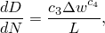

# 24.4.3 Damage evolution for ductile materials in low-cycle fatigue


**Product: **Abaqus/Standard  

##### **References**

- ["Progressive damage and failure," Section 24.1.1](pt05ch24s01abo21.md)
- [*DAMAGE EVOLUTION](../key/key-link.md#usb-kws-mdamageevolution)

### Overview

The damage evolution capability for ductile materials based on inelastic hysteresis energy:
- assumes that damage is characterized by the progressive degradation of the material stiffness, leading to material failure;
- must be used in combination with a damage initiation criterion for ductile materials in low-cycle fatigue analysis (["Damage initiation for ductile materials in low-cycle fatigue," Section 24.4.2](pt05ch24s04abm48.md));
- uses the inelastic hysteresis energy per stabilized cycle to drive the evolution of damage after damage initiation; and
- must be used in conjunction with the linear elastic material model (["Linear elastic behavior," Section 22.2.1](pt05ch22s02abm02.md)), the porous elastic material model (["Elastic behavior of porous materials," Section 22.3.1](pt05ch22s03abm05.md)), or the hypoelastic material model (["Hypoelastic behavior," Section 22.4.1](pt05ch22s04abm06.md)).

### Damage evolution based on accumulated inelastic hysteresis energy

Once the damage initiation criterion (["Damage initiation for ductile materials in low-cycle fatigue," Section 24.4.2](pt05ch24s04abm48.md)) is satisfied at a material point, the damage state is calculated and updated based on the inelastic hysteresis energy for the stabilized cycle. The rate of the damage in a material point per cycle is given by 



 where  and  are material constants, and  is the characteristic length associated with an integration point. The value of  is dependent on the system of units in which you are working; some care is required to modify  when converting to a different system of units.

For damage in ductile materials Abaqus/Standard assumes that the degradation of the elastic stiffness can be modeled using the scalar damage variable, . At any given loading cycle during the analysis the stress tensor in the material is given by the scalar damage equation 


where  is the effective (or undamaged) stress tensor that would exist in the material in the absence of damage computed in the current increment. The material has completely lost its load carrying capacity when . You can remove the element from the mesh if all of the section points at all integration locations have lost their loading carrying capability. 

| **Input File Usage: ** | ``` [*DAMAGE EVOLUTION](../key/key-link.md#usb-kws-mdamageevolution), TYPE=HYSTERESIS ENERGY ``` |
| --- | --- |

#### Mesh dependency and characteristic length

The implementation of the damage evolution model requires the definition of a characteristic length associated with an integration point. The characteristic length is based on the element geometry and formulation: it is a typical length of a line across an element for a first-order element; it is half of the same typical length for a second-order element. For beams and trusses it is a characteristic length along the element axis. For membranes and shells it is a characteristic length in the reference surface. For axisymmetric elements it is a characteristic length in the *r*–*z* plane only. For cohesive elements it is equal to the constitutive thickness. This definition of the characteristic length is used because the direction in which fracture occurs is not known in advance. Therefore, elements with large aspect ratios will have rather different behavior depending on the direction in which the damage occurs: some mesh sensitivity remains because of this effect, and elements that are as close to square as possible are recommended. However, since the damage evolution law is energy based, mesh dependency of the results may be alleviated.

### Maximum degradation and element removal

You can control how Abaqus/Standard treats elements with severe damage. 

#### Defining the upper bound to the damage variable

By default, the upper bound to all damage variables at a material point is . You can reduce this upper bound as discussed in ["Controlling element deletion and maximum degradation for materials with damage evolution" in "Section controls," Section 27.1.4](pt06ch27s01aus113.md#usb-elm-esectioncontrol-deletion). 

| **Input File Usage: ** | ``` [*SECTION CONTROLS](../key/key-link.md#usb-kws-msectioncontrols), MAX DEGRADATION= ``` |
| --- | --- |

#### Controlling element removal for damaged elements

 By default, in Abaqus/Standard an element is removed (deleted) once *D* reaches  at all of the section points at all integration locations in the element. If an element is removed, the output variable STATUS is set to zero for the element, and it offers no resistance to subsequent deformation. However, the element still remains in the Abaqus/Standard model and may be visible during postprocessing. In the Visualization module of Abaqus/CAE, you can suppress the display of elements based on their status (see ["Selecting the status field output variable," Section 42.5.6 of the Abaqus/CAE User's Guide](../usi/usi-link.md#usv-res-statustabbtn), in the HTML version of this guide).

 Alternatively, you can specify that an element should remain in the model even after all of the damage variables reach . In this case, once all the damage variables reach the maximum value, the stiffness remains constant.

| **Input File Usage: ** | Use the following option to delete failed elements from the mesh (default): |
| --- | --- |
|  | ``` [*SECTION CONTROLS](../key/key-link.md#usb-kws-msectioncontrols), ELEMENT DELETION=YES ``` Use the following option to keep failed elements in the mesh computations: ``` [*SECTION CONTROLS](../key/key-link.md#usb-kws-msectioncontrols), ELEMENT DELETION=NO ``` |

##### Difficulties associated with element removal in Abaqus/Standard

When  elements are removed from the model, their nodes remain in the model even if they are not attached to any active elements. When the solution progresses, these nodes might undergo non-physical displacements in Abaqus/Standard. In addition, applying a point load to a node that is not attached to an active element will cause convergence difficulties since there is no stiffness to resist the load. It is the responsibility of the user to prevent such situations.

### Elements

Damage evolution for ductile materials can be defined for any element that can be used with the damage initiation criteria for a low-cycle fatigue analysis in Abaqus/Standard (["Damage initiation for ductile materials in low-cycle fatigue," Section 24.4.2](pt05ch24s04abm48.md)).

### Output

In addition to the standard output identifiers available in Abaqus/Standard (["Abaqus/Standard output variable identifiers," Section 4.2.1](pt02ch04s02abv01.md)), the following variables have special meaning when damage evolution is specified:

| STATUS | Status of element (the status of an element is 1.0 if the element is active, 0.0 if the element is not). |
| --- | --- |

| SDEG | Overall scalar stiffness degradation, *D*. |
| --- | --- |


