# 25.2.1 Equation of state


**Products: **Abaqus/Explicit  Abaqus/CAE  

##### **References**

- ["Hydrodynamic behavior: overview," Section 25.1.1](pt05ch25s01abo22.md)
- ["Material library: overview," Section 21.1.1](pt05ch21s01abo18.md)
- ["VUEOS," Section 1.2.13 of the Abaqus User Subroutines Reference Guide](../sub/sub-link.md#sub-rtn-uexpueos)
- [*EOS](../key/key-link.md#usb-kws-meos)
- [*EOS COMPACTION](../key/key-link.md#usb-kws-meoscompaction)
- [*ELASTIC](../key/key-link.md#usb-kws-melastic)
- [*VISCOSITY](../key/key-link.md#usb-kws-mviscosity)
- [*DETONATION POINT](../key/key-link.md#usb-kws-mdetonationpt)
- [*GAS SPECIFIC HEAT](../key/key-link.md#usb-kws-mgasspeccheat)
- [*REACTION RATE](../key/key-link.md#usb-kws-mreactionrate)
- [*TENSILE FAILURE](../key/key-link.md#usb-kws-mtensilefailure)
- ["Defining equations of state" in "Defining other mechanical models," Section 12.9.4 of the Abaqus/CAE User's Guide](../usi/usi-link.md#usi-prp-mechanical-other-eos)

### Overview

Equations of state:
- provide a hydrodynamic material model in which the material's volumetric strength is determined by an equation of state;
- determine the pressure (positive in compression) as a function of the density, , and the specific energy (the internal energy per unit mass), : 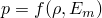;
- are available as Mie-Grneisen equations of state (thus providing the linear  Hugoniot form);
- are available as tabulated equations of state linear in energy;
- are available as  equations of state for the compaction of ductile porous materials and must be used in conjunction with either the Mie-Grneisen or the tabulated equation of state for the solid phase;
- are available as JWL high explosive equations of state;
- are available as ignition and growth equations of state;
- are available in the form of an ideal gas;
- are available in the form of user-defined equations of state ([`VUEOS`](../sub/sub-link.md#sub-xsl-vueos));
- assume an adiabatic condition unless a dynamic fully coupled temperature-displacement analysis is used;
- can be used to model a material that has only volumetric strength (the material is assumed to have no shear strength) or a material that also has isotropic elastic or viscous deviatoric behavior;
- can be used with the Mises (["Classical metal plasticity," Section 23.2.1](pt05ch23s02abm17.md)) or the Johnson-Cook (["Johnson-Cook plasticity," Section 23.2.7](pt05ch23s02abm23.md)) plasticity models;
- can be used with the extended Drucker-Prager (["Extended Drucker-Prager models," Section 23.3.1](pt05ch23s03abm30.md)) plasticity models (without plastic dilation); and
- can be used with the tensile failure model (["Dynamic failure models," Section 23.2.8](pt05ch23s02abm24.md)) to model dynamic spall or a pressure cutoff.

### Energy equation and Hugoniot curve

The equation for conservation of energy equates the increase in internal energy per unit mass, , to the rate at which work is being done by the stresses and the rate at which heat is being added. In the absence of heat conduction the energy equation can be written as 

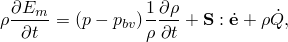

where *p* is the pressure stress defined as positive in compression, 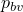 is the pressure stress due to the bulk viscosity,  is the deviatoric stress tensor, 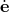 is the deviatoric part of strain rate, and 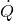 is the heat rate per unit mass.

The equation of state is assumed for the pressure as a function of the current density, , and the internal energy per unit mass, :


which defines all the equilibrium states that can exist in a material. The internal energy can be eliminated from the above equation to obtain a *p* versus *V* relationship (where *V* is the current volume) or, equivalently, a *p* versus 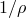 relationship that is unique to the material described by the equation of state model. This unique relationship is called the Hugoniot curve and is the locus of *p*–*V* states achievable behind a shock (see [Figure 25.2.1--1](pt05ch25s02abm50.md#ceos-model)). 

**Figure 25.2.1–1** A schematic representation of a Hugoniot curve.

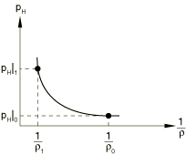

The Hugoniot pressure, , is a function of density only and can be defined, in general, from fitting experimental data.

An equation of state is said to be linear in energy when it can be written in the form 


where 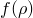 and 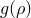 are functions of density only and depend on the particular equation of state model.

### Mie-Grneisen equations of state

A Mie-Grneisen equation of state is linear in energy. The most common form is 

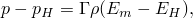

where 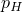 and  are the Hugoniot pressure and specific energy (per unit mass) and are functions of density only, and 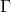 is the Grneisen ratio defined as


where  is a material constant and  is the reference density.

The Hugoniot energy, 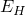, is related to the Hugoniot pressure by 

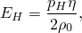

where 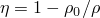 is the nominal volumetric compressive strain. Elimination of  and  from the above equations yields 


The equation of state and the energy equation represent coupled equations for pressure and internal energy. Abaqus/Explicit solves these equations simultaneously at each material point.

#### Linear *Us Up* Hugoniot form

A common fit to the Hugoniot data is given by 


where  and *s* define the linear relationship between the shock velocity, 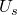, and the particle velocity, 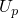, as follows: 

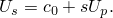

With the above assumptions the linear  Hugoniot form is written as


where 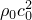 is equivalent to the elastic bulk modulus at small nominal strains.

There is a limiting compression given by the denominator of this form of the equation of state 

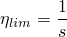

or 


At this limit there is a tensile minimum; thereafter, negative sound speeds are calculated for the material.

| **Input File Usage: ** | Use both of the following options: |
| --- | --- |
|  | ``` [*DENSITY](../key/key-link.md#usb-kws-mdensity) *(to specify the reference density )* [*EOS](../key/key-link.md#usb-kws-meos), TYPE=USUP *(to specify the variables , *s*, and )* ``` |

| **Abaqus/CAE Usage: ** | Property module: material editor: ****General****Density**** *(to specify the reference density )*****Mechanical****Eos****: **Type: Us - Up** *(to specify the variables , *s*, and )* |
| --- | --- |

##### Initial state

The initial state of the material is determined by the initial values of specific energy, , and pressure stress, *p*. Abaqus/Explicit will automatically compute the initial density, , that satisfies the equation of state, . You can define the initial specific energy and initial stress state (see ["Initial conditions in Abaqus/Standard and Abaqus/Explicit," Section 34.2.1](pt07ch34s02aus116.md)). The initial pressure used by the equation of state is inferred from the specified stress states. If no initial conditions are specified, Abaqus/Explicit will assume that the material is at its reference state: 


| **Input File Usage: ** | Use either or both of the following options, as required: |
| --- | --- |
|  | ``` [*INITIAL CONDITIONS](../key/key-link.md#usb-kws-minitialcond), TYPE=SPECIFIC ENERGY [*INITIAL CONDITIONS](../key/key-link.md#usb-kws-minitialcond), TYPE=STRESS ``` |

| **Abaqus/CAE Usage: ** | Load module: **Create Predefined Field**: **Step: Initial**: choose **Mechanical** for the **Category** and **Stress** for the **Types for Selected Step** |
| --- | --- |
|  | Initial specific energy is not supported in Abaqus/CAE. |

### Tabulated equation of state

The tabulated equation of state provides flexibility in modeling the hydrodynamic response of materials that exhibit sharp transitions in the pressure-density relationship, such as those induced by phase transformations. The tabulated equation of state is linear in energy and assumes the form 


where  and 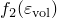 are functions of the logarithmic volumetric strain  only, with 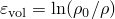, and  is the reference density.

You can specify the functions  and  directly in tabular form. The tabular entries must be given in descending values of the volumetric strain (that is, from the most tensile to the most compressive states). Abaqus/Explicit will use a piecewise linear relationship between data points. Outside the range of specified values of volumetric strains, the functions are extrapolated based on the last slope computed from the data. 

| **Input File Usage: ** | Use both of the following options: |
| --- | --- |
|  | ``` [*DENSITY](../key/key-link.md#usb-kws-mdensity) *(to specify the reference density )* [*EOS](../key/key-link.md#usb-kws-meos), TYPE=TABULAR *(to specify  and  as functions of )* ``` |

| **Abaqus/CAE Usage: ** | Property module: material editor: ****General****Density**** *(to specify the reference density )*****Mechanical****Eos****: **Type: Tabular** *(to specify  and  as functions of )* |
| --- | --- |

#### Initial state

The initial state of the material is determined by the initial values of specific energy, , and pressure stress, *p*. Abaqus/Explicit automatically computes the initial density, , that satisfies the equation of state. You can define the initial specific energy and initial stress state (see ["Initial conditions in Abaqus/Standard and Abaqus/Explicit," Section 34.2.1](pt07ch34s02aus116.md)). The initial pressure used by the equation of state is inferred from the specified stress states. If no initial conditions are specified, Abaqus/Explicit assumes that the material is at its reference state: 

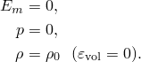

| **Input File Usage: ** | Use either or both of the following options, as required: |
| --- | --- |
|  | ``` [*INITIAL CONDITIONS](../key/key-link.md#usb-kws-minitialcond), TYPE=SPECIFIC ENERGY [*INITIAL CONDITIONS](../key/key-link.md#usb-kws-minitialcond), TYPE=STRESS ``` |

| **Abaqus/CAE Usage: ** | Load module: **Create Predefined Field**: **Step: Initial**: choose **Mechanical** for the **Category** and **Stress** for the **Types for Selected Step** |
| --- | --- |
|  | Initial specific energy is not supported in Abaqus/CAE. |

### User-defined equation of state

The user-defined equation of state provides a general capability for modeling the volumetric response of materials through user subroutine [`VUEOS`](../sub/sub-link.md#sub-xsl-vueos) (see ["VUEOS," Section 1.2.13 of the Abaqus User Subroutines Reference Guide](../sub/sub-link.md#sub-rtn-uexpueos)). The equation of state defines the pressure as a function of the current density, , and the internal energy per unit mass, : . Abaqus/Explicit solves the energy equation together with the equation of state using an iterative method. The pressure stress, , and the derivatives of the pressure with respect to the internal energy  and to the density,  and , must be provided by user subroutine [`VUEOS`](../sub/sub-link.md#sub-xsl-vueos). The latter is needed for the evaluation of the effective bulk modulus of the material, which is necessary for the stable time increment calculation.

Optionally, you can also specify the number of property values needed as data in the user subroutine as well as the number of solution-dependent variables  (see ["User subroutines: overview," Section 18.1.1](pt04ch18s01aus104.md)).

| **Input File Usage: ** | Use the following option: |
| --- | --- |
|  | ``` [*EOS](../key/key-link.md#usb-kws-meos), TYPE=USER, PROPERTIES=*n* ``` |

| **Abaqus/CAE Usage: ** | The user-defined equation of state is not supported in Abaqus/CAE. |
| --- | --- |

#### Initial state

 You need to make sure that the initial specific energy, the initial stress, and the initial density satisfy the equation of state. If you do not specify the initial conditions, Abaqus/Explicit assumes that the material is at its reference state: 


| **Input File Usage: ** | Use either or both of the following options to define the initial specific energy and/or initial pressure stress: |
| --- | --- |
|  | ``` [*INITIAL CONDITIONS](../key/key-link.md#usb-kws-minitialcond), TYPE=SPECIFIC ENERGY [*INITIAL CONDITIONS](../key/key-link.md#usb-kws-minitialcond), TYPE=STRESS ``` Use the following option to define the initial density: ``` [*DENSITY](../key/key-link.md#usb-kws-mdensity) ``` |

| **Abaqus/CAE Usage: ** | Load module: **Create Predefined Field**: **Step: Initial**: choose **Mechanical** for the **Category** and **Stress** for the **Types for Selected Step** |
| --- | --- |
|  | Initial specific energy is not supported in Abaqus/CAE. |

### *P--α* equation of state

The  equation of state is designed for modeling the compaction of ductile porous materials. The implementation in Abaqus/Explicit is based on the model proposed by Hermann (1968) and Carroll and Holt (1972). The constitutive model provides a detailed description of the irreversible compaction behavior at low stresses and predicts the correct thermodynamic behavior at high pressures for the fully compacted solid material. In Abaqus/Explicit the solid phase is assumed to be governed by either the Mie-Grneisen equation of state or the tabulated equation of state. The relevant properties of the porous material in the virgin state, to be discussed later, and the material properties of the solid phase are specified separately.

The porosity of the material, *n*, is defined as the ratio of pore volume, 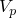, to total volume, 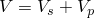, where  is the solid volume. The porosity remains in the range 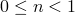, with *0* indicating full compaction. It is convenient to introduce a scalar variable , sometimes referred to as “distension,” defined as the ratio of the density of the solid material, , to the density of the porous material, , both evaluated at the same temperature and pressure:


For a fully compacted material ; otherwise,  is greater than *1*. Assuming that the density of the pores is negligible compared to that of the solid phase,  can be expressed in terms of the porosity *n* as


An equation of state is assumed for the pressure of the porous material as a function of ; current density, ; and internal energy per unit mass, , in the form

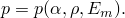

Assuming that the pores carry no pressure, it follows from equilibrium considerations that when a pressure *p* is applied to the porous material, it gives rise to a volume-average pressure in the solid phase equal to . Assuming that the specific internal energies of the porous material and the solid matrix are the same (i.e., neglecting the surface energy of the pores), the equation of state of the porous material can be expressed as

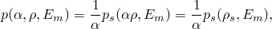

where 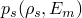 is the equation of state of the solid material. For the fully compacted material (that is, when ), the  equation of state reduces to that of the solid phase, therefore predicting the correct thermodynamic behavior at high pressures.

The  equation of state must be supplemented by an equation that describes the behavior of  as a function of the thermodynamic state. This equation takes the form

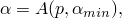

where   is a state variable corresponding to the minimum value attained by  during plastic (irreversible) compaction of the material. The state variable is initialized to the elastic limit 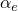 for a material that is at its virgin state. The specific form of the function 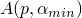 used by Abaqus/Explicit is illustrated in [Figure 25.2.1--2](pt05ch25s02abm50.md#ceos-palpha) and is discussed next.

**Figure 25.2.1–2**  elastic and plastic curves for the description of compaction of ductile porous materials.

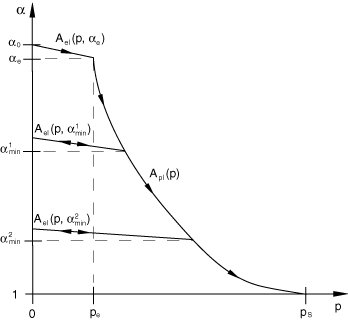

The function  captures the general behavior to be expected in a ductile porous material. The unloaded virgin state corresponds to the value 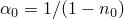, where  is the reference porosity of the material. Initial compression of the porous material is assumed to be elastic. Recall that decreasing porosity corresponds to a reduction in . As the pressure increases beyond the elastic limit, 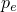, the pores in the material start to crush, leading to irreversible compaction and permanent (plastic) volume change. Unloading from a partially compacted state follows a new elastic curve that depends on the maximum compaction (or, alternatively, the minimum value of ) ever attained during the deformation history of the material. The absolute value of the slope of the elastic curve decreases as  decreases, as will be quantified later. The material becomes fully compacted when the pressure reaches the compaction pressure ; at that point 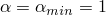, a value that is retained forever. The function  therefore has multiple branches: a plastic branch, 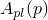, and multiple elastic branches, 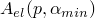, corresponding to elastic unloading from partially compacted states. The appropriate branch of *A* is selected according to the following rule:

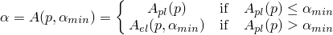

These expressions can be inverted to solve for *p*:


The equation for the plastic curve takes the form

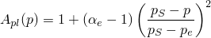

or, alternatively,

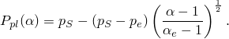

The elastic curve originally proposed by Hermann (1968) is given by the differential equation 


where 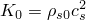 is the elastic bulk modulus of the solid material at small nominal strains;  is the reference density of the solid; and 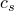 and  are the reference sound speeds in the solid and virgin (porous) materials, respectively. 

If the solid phase is modeled using the Mie-Grneisen equation of state,  is given directly by the reference sound speed, . On the other hand, if the solid phase is modeled using the tabulated equation of state,  is computed from the initial bulk modulus and reference density of the solid material, 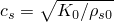. In this case the reference density is required to be constant; it cannot be a function of temperature or field variables.

Following Wardlaw et al. (1996), the above equation for the elastic curve in Abaqus/Explicit is simplified and replaced by the linear relations

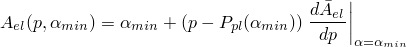

and 

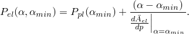

| **Input File Usage: ** | Use the following option to specify the reference density of the solid phase, : |
| --- | --- |
|  | ``` [*DENSITY](../key/key-link.md#usb-kws-mdensity) ``` Use one of the following options to specify additional material properties for the solid phase: ``` [*EOS](../key/key-link.md#usb-kws-meos), TYPE=USUP *(if the solid phase is modeled using the Mie-Grneisen equation of state)* [*EOS](../key/key-link.md#usb-kws-meos), TYPE=TABULAR *(if the solid phase is modeled using the tabulated equation of state)* ``` Use the following option to specify the properties of the porous material (the reference sound speed, ; the reference porosity, ; the elastic limit, ; and the compaction pressure, ): ``` [*EOS COMPACTION](../key/key-link.md#usb-kws-meoscompaction) ``` |

| **Abaqus/CAE Usage: ** | Property module: material editor: ****General****Density**** *(to specify the reference density )* |
| --- | --- |
|  | Use one of the following options to specify additional material properties for the solid phase: ****Mechanical****Eos****: **Type: Us - Up** *(if the solid phase is modeled using the Mie-Grneisen equation of state)* ****Mechanical****Eos****: **Type: Tabular** *(if the solid phase is modeled using the tabulated equation of state)* Use the following option to specify the properties of the porous material: ****Mechanical****Eos****: ****Suboptions**** Eos Compaction**** *(to specify the reference sound speed, ; the porosity of the unloaded material, ; the pressure required to initialize plastic behavior, ; and the pressure at which all pores are crushed, )* |

#### Initial state

The initial state of the porous material is determined from the initial values of porosity, 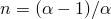; specific energy, ; and pressure stress, *p*. Abaqus/Explicit automatically computes the initial density, , that satisfies the equation of state, 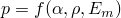. You can define the initial porosity, initial specific energy, and initial stress state (see ["Initial conditions in Abaqus/Standard and Abaqus/Explicit," Section 34.2.1](pt07ch34s02aus116.md)). If no initial conditions are given, Abaqus/Explicit assumes that the material is at its virgin state: 

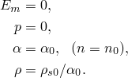

Abaqus/Explicit will issue an error message if the initial 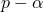 state lies outside the region of allowed states (see [Figure 25.2.1--2](pt05ch25s02abm50.md#ceos-palpha)). When initial conditions are specified only for *p* (or for ), Abaqus/Explicit will compute  (or *p*) assuming that the  state lies on the primary (monotonic loading) curve.

| **Input File Usage: ** | Use some or all of the following options, as required: |
| --- | --- |
|  | ``` [*INITIAL CONDITIONS](../key/key-link.md#usb-kws-minitialcond), TYPE=SPECIFIC ENERGY [*INITIAL CONDITIONS](../key/key-link.md#usb-kws-minitialcond), TYPE=STRESS [*INITIAL CONDITIONS](../key/key-link.md#usb-kws-minitialcond), TYPE=POROSITY ``` |

| **Abaqus/CAE Usage: ** | Load module: **Create Predefined Field**: **Step: Initial**: choose **Mechanical** for the **Category** and **Stress** for the **Types for Selected Step** |
| --- | --- |
|  | Initial specific energy and initial porosity are not supported in Abaqus/CAE. |

### JWL high explosive equation of state

The Jones-Wilkins-Lee (or JWL) equation of state models the pressure generated by the release of chemical energy in an explosive. This model is implemented in a form referred to as a programmed burn, which means that the reaction and initiation of the explosive is not determined by shock in the material. Instead, the initiation time is determined by a geometric construction using the detonation wave speed and the distance of the material point from the detonation points.

The JWL equation of state can be written in terms of the internal energy per unit mass, , as 


where  and  are user-defined material constants;  is the user-defined density of the explosive; and  is the density of the detonation products.

| **Input File Usage: ** | Use both of the following options: |
| --- | --- |
|  | ``` [*DENSITY](../key/key-link.md#usb-kws-mdensity) *(to specify the density of the explosive )* [*EOS](../key/key-link.md#usb-kws-meos), TYPE=JWL *(to specify the material constants  and )* ``` |

| **Abaqus/CAE Usage: ** | Property module: material editor: ****General****Density**** *(to specify the density of the explosive )*****Mechanical****Eos****: **Type: JWL** *(to specify the material constants   and )* |
| --- | --- |

#### Arrival time of detonation wave

Abaqus/Explicit calculates the arrival time of the detonation wave at a material point  as the distance from the material point to the nearest detonation point divided by the detonation wave speed: 


where  is the position of the material point,  is the position of the *N*th detonation point,  is the detonation delay time of the *N*th detonation point, and  is the detonation wave speed of the explosive material. The minimum in the above formula is over the *N* detonation points that apply to the material point.

#### Burn fraction

To spread the burn wave over several elements, a burn fraction, , is computed as 


where  is a constant that controls the width of the burn wave (set to a value of 2.5) and  is the characteristic length of the element. If the time is less than , the pressure is zero in the explosive; otherwise, the pressure is given by the product of  and the pressure determined from the JWL equation above.

#### Defining detonation points

You can define any number of detonation points for the explosive material. Coordinates of the points must be defined along with a detonation delay time. Each material point responds to the first detonation point that it sees. The detonation arrival time at a material point is based upon the time that it takes a detonation wave (traveling at the detonation wave speed ) to reach the material point plus the detonation delay time for the detonation point. If there are multiple detonation points, the arrival time is based on the minimum arrival time for all the detonation points. In a body with curved surfaces care should be taken that the detonation arrival times are meaningful. The detonation arrival times are based on the straight line of sight from the material point to the detonation point. In a curved body the line of sight may pass outside of the body.

| **Input File Usage: ** | Use both of the following options to define the detonation points: |
| --- | --- |
|  | ``` [*EOS](../key/key-link.md#usb-kws-meos), TYPE=JWL [*DETONATION POINT](../key/key-link.md#usb-kws-mdetonationpt) ``` |

| **Abaqus/CAE Usage: ** | Property module: material editor: ****Mechanical****Eos****: **Type: JWL**: ****Suboptions****Detonation Point**** |
| --- | --- |

#### Initial state

Explosive materials generally have some nominal volumetric stiffness before detonation. It may be useful to incorporate this stiffness when elements modeled with a JWL equation of state are subjected to stress before initiation of detonation by the arriving detonation wave. You can define the pre-detonation bulk modulus, . The pressure will be computed from the volumetric strain and  until detonation, at which time the pressure will be determined by the procedure outlined above. The initial relative density () used in the JWL equation is assumed to be unity. The initial specific energy  is assumed to be equal to the user-defined detonation energy . 

If you specify a nonzero value of , you can also define an initial stress state for the explosive materials.

| **Input File Usage: ** | Use the following option to define the initial stress: |
| --- | --- |
|  | ``` [*INITIAL CONDITIONS](../key/key-link.md#usb-kws-minitialcond), TYPE=STRESS ``` Optionally, you can also define the initial specific energy directly: ``` [*INITIAL CONDITIONS](../key/key-link.md#usb-kws-minitialcond), TYPE=SPECIFIC ENERGY ``` |

| **Abaqus/CAE Usage: ** | Load module: **Create Predefined Field**: **Step: Initial**: choose **Mechanical** for the **Category** and **Stress** for the **Types for Selected Step** |
| --- | --- |
|  | Initial specific energy is not supported in Abaqus/CAE. |

### Ignition and growth equation of state

The ignition and growth equation of state models shock initiation and detonation wave propagation of solid high explosives. The heterogeneous explosive is modeled as a homogeneous mixture of two phases: the unreacted solid explosive and the reacted gas products. Separate JWL equations of state are prescribed for each phase:


where 


 and


 The subscript *s* refers to the unreacted solid explosive, and *g* refers to the reacted gas products.  and  are user-defined material constants used in the JWL equations;  is the detonation energy;  is the user-defined reference density of the explosive, and  is the density of the unreacted explosive or the reacted products.

| **Input File Usage: ** | Use both of the following options: |
| --- | --- |
|  | ``` [*DENSITY](../key/key-link.md#usb-kws-mdensity)*(to specify the density of the explosive )* [*EOS](../key/key-link.md#usb-kws-meos), TYPE=IGNITION AND GROWTH, DETONATION ENERGY= *(to specify the material constants   and  of the unreacted solid explosive and the reacted gas product)* ``` |

| **Abaqus/CAE Usage: ** | Property module: material editor: ****General****Density**** *(to specify the density of the explosive )* ****Mechanical****Eos****: **Type: Ignition and growth**: **Detonation energy**: ; **Solid Phase** tabbed page and **Gas Phase** tabbed page *(to specify the material constants   and  of the unreacted solid explosive and the reacted gas product)* |
| --- | --- |

#### The mass fraction

The mixture of unreacted solid explosive and reacted gas products is defined by the mass fraction 


where  is the mass of the unreacted explosive, and  is the mass of the reacted products. It is assumed that the two phases are in thermo-mechanical equilibrium:


It is also assumed that the volumes are additive:


 Similarly, the internal energy is assumed to be additive:


where 


Hence, the specific heat of the mixture is given by 


| **Input File Usage: ** | Use the following options to define the specific heat of the unreacted solid explosive: |
| --- | --- |
|  | ``` [*EOS](../key/key-link.md#usb-kws-meos), TYPE=IGNITION AND GROWTH [*SPECIFIC HEAT](../key/key-link.md#usb-kws-mspecificheat), DEPENDENCIES=*n* ``` Use the following options to define the specific heat of the reacted gas product: ``` [*EOS](../key/key-link.md#usb-kws-meos), TYPE=IGNITION AND GROWTH [*GAS SPECIFIC HEAT](../key/key-link.md#usb-kws-mgasspeccheat), DEPENDENCIES=*n* ``` |

| **Abaqus/CAE Usage: ** | Use the following options to define the specific heat of the unreacted solid explosive: |
| --- | --- |
|  | Property module: material editor: ****Mechanical****Eos****: **Type: Ignition and Growth******Thermal****Specific Heat**** Use the following options to define the specific heat of the reacted gas product: Property module: material editor: ****Mechanical****Eos****: **Type: Ignition and growth**: **Gas Specific** tabbed page: **Specific Heat** You can toggle on **Use temperature-dependent data** to define the specific heat as a function of temperature and/or select the **Number of field variables** to define the specific heat as a function of field variables. |

#### The reaction rate

The conversion of unreacted solid explosive to reacted gas products is governed by the reaction rate. The reaction rate equation in the ignition and growth model is a pressure-driven rule, which includes three terms:


These three terms are defined as follows:


where , and *z* are reaction rate constants. 

The first term, , describes hot spot ignition by igniting some of the material relatively quickly but limiting it to a small proportion of the total solid . The second term, , represents the growth of reaction from the hot spot sites into the material and describes the inward and outward grain burning phenomena; this term is limited to a proportion of the total solid . The third term, , is used to describe the rapid transition to detonation observed in some energetic materials.


| **Input File Usage: ** | Use both of the following options to define the reaction rate: |
| --- | --- |
|  | ``` [*EOS](../key/key-link.md#usb-kws-meos), TYPE=IGNITION AND GROWTH [*REACTION RATE](../key/key-link.md#usb-kws-mreactionrate) ``` |

| **Abaqus/CAE Usage: ** | Property module: material editor: ****Mechanical****Eos****: **Type: Ignition and growth**: **Reaction Rate** tabbed page |
| --- | --- |

#### Initial state

The initial mass fraction of the unreacted solid explosive is assumed to be one. The initial relative density () used in the ignition and growth equation is assumed to be unity. The initial specific energy can be defined for the unreacted explosive. 

| **Input File Usage: ** | Use the following option to define the initial specific energy: |
| --- | --- |
|  | ``` [*INITIAL CONDITIONS](../key/key-link.md#usb-kws-minitialcond), TYPE=SPECIFIC ENERGY ``` |

| **Abaqus/CAE Usage: ** | Initial specific energy is not supported in Abaqus/CAE. |
| --- | --- |

### Ideal gas equation of state

An ideal gas equation of state can be written in the form of


where  is the ambient pressure, *R* is the gas constant,  is the current temperature, and  is the absolute zero on the temperature scale being used. It is an idealization to real gas behavior and can be used to model any gases approximately under appropriate conditions (e.g., low pressure and high temperature).

One of the important features of an ideal gas is that its specific energy depends only upon its temperature; therefore, the specific energy can be integrated numerically as 


where  is the initial specific energy at the initial temperature  and  is the specific heat at constant volume (or the constant volume heat capacity), which depends only upon temperature for an ideal gas.

Modeling with an ideal gas equation of state is typically performed adiabatically; the temperature increase is calculated directly at the material integration points according to the adiabatic thermal energy increase caused by the work , where *v* is the specific volume (the volume per unit mass, ). Therefore, unless a fully coupled temperature-displacement analysis is performed, an adiabatic condition is always assumed in Abaqus/Explicit.

When performing a fully coupled temperature-displacement analysis, the pressure stress and specific energy are updated based on the evolving temperature field. The energy increase due to the change in state will be accounted for in the heat equation and will be subject to heat conduction.

For the ideal gas model in Abaqus/Explicit you define the gas constant, *R*, and the ambient pressure, . For an ideal gas *R* can be determined from the universal gas constant, , and the molecular weight, , as follows:


In general, the value *R* for any gas can be estimated by plotting  as a function of state (e.g., pressure or temperature). The ideal gas approximation is adequate in any region where this value is constant. You must specify the specific heat at constant volume, . For an ideal gas  is related to the specific heat at constant pressure, , by 


| **Input File Usage: ** | Use both of the following options: |
| --- | --- |
|  | ``` [*EOS](../key/key-link.md#usb-kws-meos), TYPE=IDEAL GAS [*SPECIFIC HEAT](../key/key-link.md#usb-kws-mspecificheat), DEPENDENCIES=*n* ``` |

| **Abaqus/CAE Usage: ** | Property module: material editor: ****Mechanical****Eos****: **Type: Ideal Gas******Thermal****Specific Heat**** |
| --- | --- |

#### Initial state

There are different methods to define the initial state of the gas. You can specify the initial density, , and either the initial pressure stress, , or the initial temperature, . The initial value of the unspecified field (temperature or pressure) is determined from the equation of state. Alternatively, you can specify both the initial pressure stress and the initial temperature. In this case the user-specified initial density is replaced by that derived from the equation of state in terms of initial pressure and temperature.

By default, Abaqus/Explicit automatically computes the initial specific energy, , from the initial temperature by numerically integrating the equation


Optionally, you can override this default behavior by defining the initial specific energy for the ideal gas directly.

| **Input File Usage: ** | Use some or all of the following options, as required: |
| --- | --- |
|  | ``` [*DENSITY](../key/key-link.md#usb-kws-mdensity), DEPENDENCIES=*n* [*INITIAL CONDITIONS](../key/key-link.md#usb-kws-minitialcond), TYPE=STRESS [*INITIAL CONDITIONS](../key/key-link.md#usb-kws-minitialcond), TYPE=TEMPERATURE ``` Use the following option to specify the initial specific energy directly: ``` [*INITIAL CONDITIONS](../key/key-link.md#usb-kws-minitialcond), TYPE=SPECIFIC ENERGY ``` |

| **Abaqus/CAE Usage: ** | Property module: material editor: ****General****Density**** |
| --- | --- |
|  | Load module: **Create Predefined Field**: **Step: Initial**: choose **Other** for the **Category** and **Temperature** for the **Types for Selected Step** Load module: **Create Predefined Field**: **Step: Initial**: choose **Mechanical** for the **Category** and **Stress** for the **Types for Selected Step** Initial specific energy is not supported in Abaqus/CAE. |

#### The value of absolute zero

When a non-absolute temperature scale is used, you must specify the value of absolute zero temperature.

| **Input File Usage: ** | ``` [*PHYSICAL CONSTANTS](../key/key-link.md#usb-kws-mphysicalconsts), ABSOLUTE ZERO= ``` |
| --- | --- |

| **Abaqus/CAE Usage: ** | Any module: ****Model****Edit Attributes*****model_name*****: **Absolute zero temperature** |
| --- | --- |

#### A special case

In the case of an adiabatic analysis with constant specific heat (both  and  are constant), the specific energy is linear in temperature


The pressure stress can, therefore, be recast in the common form of


where  is the ratio of specific heats and can be defined as


where 


for a monatomic;


for a diatomic; and


for a polyatomic gas.

#### Comparison with the hydrostatic fluid model

The ideal gas equation of state can be used to model wave propagation effects and the dynamics of a spatially varying state of a gaseous region. For cases in which the inertial effects of the gas are not important and the state of the gas can be assumed to be uniform throughout a region, the hydrostatic fluid model (["Surface-based fluid cavities: overview," Section 11.5.1](pt04ch11s05aus70.md)) is a simpler, more computationally efficient alternative.

### Deviatoric behavior

The equation of state defines only the material's hydrostatic behavior. It can be used by itself, in which case the material has only volumetric strength (the material is assumed to have no shear strength). Alternatively, Abaqus/Explicit allows you to define deviatoric behavior, assuming that the deviatoric and volumetric responses are uncoupled. Two models are available for the deviatoric response: a linear isotropic elastic model and a viscous model. The material's volumetric response is governed then by the equation of state model, while its deviatoric response is governed by either the linear isotropic elastic model or the viscous fluid model.

#### Elastic shear behavior

For the elastic shear behavior the deviatoric stress is related to the deviatoric strain as


where  is the deviatoric stress and  is the deviatoric elastic strain. See ["Defining isotropic shear elasticity for equations of state in Abaqus/Explicit" in "Linear elastic behavior," Section 22.2.1](pt05ch22s02abm02.md#usb-mat-clinearelastic-shear), for more details.

| **Input File Usage: ** | Use both of the following options to define elastic shear behavior: |
| --- | --- |
|  | ``` [*EOS](../key/key-link.md#usb-kws-meos) [*ELASTIC](../key/key-link.md#usb-kws-melastic), TYPE=SHEAR ``` |

| **Abaqus/CAE Usage: ** | Property module: material editor: ****Mechanical****Elasticity****Elastic****; **Type: Shear**; **Shear Modulus** |
| --- | --- |

#### Viscous shear behavior

For the viscous shear behavior the deviatoric stress is related to the deviatoric strain rate as


where  is the deviatoric stress,  is the deviatoric part of the strain rate,  is the viscosity, and  is the engineering shear strain rate.

Abaqus/Explicit provides a wide range of viscosity models to describe both Newtonian and non-Newtonian fluids. These are described in ["Viscosity," Section 26.1.4](pt05ch26s01abm54.md).

| **Input File Usage: ** | Use both of the following options to define viscous shear behavior: |
| --- | --- |
|  | ``` [*EOS](../key/key-link.md#usb-kws-meos) [*VISCOSITY](../key/key-link.md#usb-kws-mviscosity) ``` |

| **Abaqus/CAE Usage: ** | Property module: material editor: ****Mechanical****Viscosity**** |
| --- | --- |

### Use with the Mises or the Johnson-Cook plasticity models

An equation of state model can be used with the Mises (["Classical metal plasticity," Section 23.2.1](pt05ch23s02abm17.md)) or the Johnson-Cook (["Johnson-Cook plasticity," Section 23.2.7](pt05ch23s02abm23.md)) plasticity models to model elastic-plastic behavior. In this case you must define the elastic part of the shear behavior. The material's volumetric response is governed by the equation of state model, while the deviatoric response is governed by the linear elastic shear and the plasticity model.

| **Input File Usage: ** | Use the following options: |
| --- | --- |
|  | ``` [*EOS](../key/key-link.md#usb-kws-meos) [*ELASTIC](../key/key-link.md#usb-kws-melastic), TYPE=SHEAR [*PLASTIC](../key/key-link.md#usb-kws-mplastic) ``` |

| **Abaqus/CAE Usage: ** | Property module: material editor:****Mechanical****Elasticity****Elastic****; **Type: Shear******Mechanical****Plasticity****Plastic**** |
| --- | --- |

#### Initial conditions

You can specify initial conditions for the equivalent plastic strain,  (["Initial conditions in Abaqus/Standard and Abaqus/Explicit," Section 34.2.1](pt07ch34s02aus116.md)).

| **Input File Usage: ** | ``` [*INITIAL CONDITIONS](../key/key-link.md#usb-kws-minitialcond), TYPE=HARDENING ``` |
| --- | --- |

| **Abaqus/CAE Usage: ** | Load module: **Create Predefined Field**: **Step: Initial**, choose **Mechanical** for the **Category** and **Hardening** for the **Types for Selected Step** |
| --- | --- |

### Use with the extended Drucker-Prager plasticity models

An equation of state model can be used in conjunction with the extended Drucker-Prager (["Extended Drucker-Prager models," Section 23.3.1](pt05ch23s03abm30.md)) plasticity models to model pressure-dependent plasticity behavior. This approach can be appropriate for modeling the response of ceramics and other brittle materials under high velocity impact conditions. In this case you must define the elastic part of the shear behavior. The material's deviatoric response is governed by the linear elastic shear and the pressure-dependent plasticity model, while the volumetric response is governed by the equation of state model. In particular, no plastic dilation effects are taken into account (if you specify a dilation angle other than zero, the value is ignored and Abaqus/Explicit issues a warning message).

["High-velocity impact of a ceramic target," Section 2.1.18 of the Abaqus Example Problems Guide](../exa/exa-link.md#exa-dyn-impactceramictarget) illustrates the use of an equation of state model with the extended Drucker-Prager plasticity models.

| **Input File Usage: ** | Use the following options: |
| --- | --- |
|  | ``` [*EOS](../key/key-link.md#usb-kws-meos) [*ELASTIC](../key/key-link.md#usb-kws-melastic), TYPE=SHEAR [*DRUCKER PRAGER](../key/key-link.md#usb-kws-mdruckerprager) [*DRUCKER PRAGER HARDENING](../key/key-link.md#usb-kws-mdruckerhardening) ``` |

| **Abaqus/CAE Usage: ** | Property module: material editor:****Mechanical****Elasticity****Elastic****; **Type: Shear******Mechanical****Plasticity****Drucker Prager****: ****Suboptions****Drucker Prager Hardening**** |
| --- | --- |

#### Initial conditions

You can specify initial conditions for the equivalent plastic strain,  (["Initial conditions in Abaqus/Standard and Abaqus/Explicit," Section 34.2.1](pt07ch34s02aus116.md)).

| **Input File Usage: ** | ``` [*INITIAL CONDITIONS](../key/key-link.md#usb-kws-minitialcond), TYPE=HARDENING ``` |
| --- | --- |

| **Abaqus/CAE Usage: ** | Load module: **Create Predefined Field**: **Step: Initial**, choose **Mechanical** for the **Category** and **Hardening** for the **Types for Selected Step** |
| --- | --- |

### Use with the tensile failure model

An equation of state model (except the ideal gas equation of state) can also be used with the tensile failure model (["Dynamic failure models," Section 23.2.8](pt05ch23s02abm24.md)) to model dynamic spall or a pressure cutoff. The tensile failure model uses the hydrostatic pressure stress as a failure measure and offers a number of failure choices. You must provide the hydrostatic cutoff stress.

You can specify that the deviatoric stresses should fail when the tensile failure criterion is met. In the case where the material's deviatoric behavior is not defined, this specification is meaningless and is, therefore, ignored.

The tensile failure model in Abaqus/Explicit is designed for high-strain-rate dynamic problems in which inertia effects are important. Therefore, it should be used only for such situations. Improper use of the tensile failure model may result in an incorrect simulation.

| **Input File Usage: ** | Use the following options: |
| --- | --- |
|  | ``` [*EOS](../key/key-link.md#usb-kws-meos) [*TENSILE FAILURE](../key/key-link.md#usb-kws-mtensilefailure) ``` |

| **Abaqus/CAE Usage: ** | The tensile failure model is not supported in Abaqus/CAE. |
| --- | --- |

### Adiabatic assumption

An adiabatic condition is always assumed for materials modeled with an equation of state unless a dynamic coupled temperature-displacement procedure is used. The adiabatic condition is assumed irrespective of whether an adiabatic dynamic stress analysis step has been specified. The temperature increase is calculated directly at the material integration points according to  the adiabatic thermal energy increase caused by the mechanical work


where  is the specific heat at constant volume. Specifying temperature as a predefined field has no effect on the behavior of this model. 

When performing a fully coupled temperature-displacement analysis, the specific energy is updated based on the evolving temperature field using


### Modeling fluids

A linear  equation of state model can be used to model incompressible viscous and inviscid laminar flow governed by the Navier-Stokes equation of motion. The volumetric response is governed by the equations of state, where the bulk modulus acts as a penalty parameter for the incompressible constraint.

To model a viscous laminar flow that follows the Navier-Poisson law of a Newtonian fluid, use the Newtonian viscous deviatoric model and define the viscosity as the real linear viscosity of the fluid. To model non-Newtonian viscous flow, use one of the nonlinear viscosity models available in Abaqus/Explicit. Appropriate initial conditions for velocity and stress are essential to get an accurate solution for this class of problems.

To model an incompressible inviscid fluid such as water in Abaqus/Explicit, it is useful to define a small amount of shear resistance to suppress shear modes that can otherwise tangle the mesh. Here the shear stiffness or shear viscosity acts as a penalty parameter. The shear modulus or viscosity should be small because flow is inviscid; a high shear modulus or viscosity will result in an overly stiff response. To avoid an overly stiff response, the internal forces arising due to the deviatoric response of the material should be kept several orders of magnitude below the forces arising due to the volumetric response. This can be done by choosing an elastic shear modulus that is several orders of magnitude lower than the bulk modulus. If the viscous model is used, the shear viscosity specified should be on the order of the shear modulus, calculated as above, scaled by the stable time increment. The expected stable time increment can be obtained from a data check analysis of the model. This method is a convenient way to approximate a shear resistance that will not introduce excessive viscosity in the material.

If a shear model is defined, the hourglass control forces are calculated based on the shear resistance of the material. Thus, in materials with extremely low or zero shear strengths such as inviscid fluids, the hourglass forces calculated based on the default parameters are insufficient to prevent spurious hourglass modes. Therefore, a sufficiently high hourglass scaling factor is recommended to increase the resistance to such modes.

### Elements

Equations of state can be used with any solid (continuum) elements in Abaqus/Explicit except plane stress elements. For three-dimensional applications exhibiting high confinement, the default kinematic formulation is recommended with reduced-integration solid elements (see ["Section controls," Section 27.1.4](pt06ch27s01aus113.md)). 

### Output

In addition to the standard output identifiers available in Abaqus (["Abaqus/Explicit output variable identifiers," Section 4.2.2](pt02ch04s02xbv01.md)), the following variables have special meaning for the equation of state models: 

| PALPH | Distension, , of the  porous material. The current porosity is equal to one minus the inverse of :  |
| --- | --- |

| PALPHMIN | Minimum value, , of the distension attained during plastic compaction of the  porous material. |
| --- | --- |

| PEEQ | Equivalent plastic strain,  where  is the initial equivalent plastic strain (zero or user-specified; see ["Initial conditions](pt05ch25s02abm50.md#usb-mat-ceos-initialcond)"). This is relevant only if the equation of state model is used in combination with the Mises, Johnson-Cook, or extended Drucker-Prage plasticity models. |
| --- | --- |

#### Additional references

- Carroll, M., and A. C. Holt, "Suggested Modification of the  Model for Porous Materials," Journal of Applied Physics, vol. 43, no.2, pp. 759--761, 1972.
- Dobratz, B. M., "LLNL Explosives Handbook, Properties of Chemical Explosives and Explosive Simulants," UCRL-52997, Lawrence Livermore National Laboratory, Livermore, California, January 1981.
- Herrmann, W., "Constitutive Equation for the Dynamic Compaction of Ductile Porous Materials," Journal of Applied Physics, vol. 40, no.6, pp. 2490--2499, 1968.
- Lee, E., M. Finger, and W. Collins, "JWL Equation of State Coefficients for High Explosives," UCID-16189, Lawrence Livermore National Laboratory, Livermore, California, January 1973.
- Wardlaw, A. B., R. McKeown, and H. Chen, "Implementation and Application of the  Equation of State in the DYSMAS Code," Naval Surface Warfare Center, Dahlgren Division, Report Number: NSWCDD/TR-95/107, May 1996.


