# 26.1.1 Material damping


**Products: **Abaqus/Standard  Abaqus/Explicit  Abaqus/CAE  

##### **References**

- ["Dynamic analysis procedures: overview," Section 6.3.1](pt03ch06s03abo07.md)
- ["Material library: overview," Section 21.1.1](pt05ch21s01abo18.md)
- [*DAMPING](../key/key-link.md#usb-kws-mdamping)
- ["Defining damping" in "Defining other mechanical models," Section 12.9.4 of the Abaqus/CAE User's Guide](../usi/usi-link.md#usi-prp-mechanical-other-damping)

### Overview

Material damping can be defined:
- for direct-integration (nonlinear, implicit or explicit), subspace-based direct-integration, direct-solution steady-state, and subspace-based steady-state dynamic analysis; or
- for mode-based (linear) dynamic analysis in Abaqus/Standard.

### Rayleigh damping

In direct-integration dynamic analysis you very often define energy dissipation mechanisms—dashpots, inelastic material behavior, etc.—as part of the basic model. In such cases there is usually no need to introduce additional damping: it is often unimportant compared to these other dissipative effects. However, some models do not have such dissipation sources (an example is a linear system with chattering contact, such as a pipeline in a seismic event). In such cases it is often desirable to introduce some general damping. Abaqus provides “Rayleigh” damping for this purpose. It provides a convenient abstraction to damp lower (mass-dependent) and higher (stiffness-dependent) frequency range behavior.

Rayleigh damping can also be used in direct-solution steady-state dynamic analyses and subspace-based steady-state dynamic analyses to get quantitatively accurate results, especially near natural frequencies. 

To define material Rayleigh damping, you specify two Rayleigh damping factors:  for mass proportional damping and  for stiffness proportional damping. In general, damping is a material property specified as part of the material definition. For the cases of rotary inertia, point mass elements, and substructures, where there is no reference to a material definition, the damping can be defined in conjunction with the property references. Any mass proportional damping also applies to nonstructural features (see ["Nonstructural mass definition," Section 2.7.1](pt01ch02s07aus25.md)).

For a given mode *i* the fraction of critical damping, , can be expressed in terms of the damping factors  and  as:

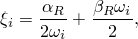

where  is the natural frequency at this mode. This equation implies that, generally speaking, the mass proportional Rayleigh damping, , damps the lower frequencies and the stiffness proportional Rayleigh damping, , damps the higher frequencies.

#### Mass proportional damping

The  factor introduces damping forces caused by the absolute velocities of the model and so simulates the idea of the model moving through a viscous “ether” (a permeating, still fluid, so that any motion of any point in the model causes damping). This damping factor defines mass proportional damping, in the sense that it gives a damping contribution proportional to the mass matrix for an element. If the element contains more than one material in Abaqus/Standard, the volume average value of  is used to multiply the element's mass matrix to define the damping contribution from this term. If the element contains more than one material in Abaqus/Explicit, the mass average value of  is used to multiply the element's lumped mass matrix to define the damping contribution from this term.  has units of (1/time).

| **Input File Usage: ** | ``` [*DAMPING](../key/key-link.md#usb-kws-mdamping), ALPHA= ``` |
| --- | --- |

| **Abaqus/CAE Usage: ** | Property module: material editor: ****Mechanical****Damping****: **Alpha**:  |
| --- | --- |

##### Defining variable mass proportional damping in Abaqus/Explicit

In Abaqus/Explicit you can define  as a tabular function of temperature and/or field variables. Therefore, mass proportional damping can vary during an Abaqus/Explicit analysis.

| **Input File Usage: ** | ``` [*DAMPING](../key/key-link.md#usb-kws-mdamping), ALPHA=TABULAR ``` |
| --- | --- |

#### Stiffness proportional damping

The  factor introduces damping proportional to the strain rate, which can be thought of as damping associated with the material itself.  defines damping proportional to the elastic material stiffness. Since the model may have quite general nonlinear response, the concept of “stiffness proportional damping” must be generalized, since it is possible for the tangent stiffness matrix to have negative eigenvalues (which would imply negative damping). To overcome this problem,  is interpreted as defining viscous material damping in Abaqus, which creates an additional “damping stress,” 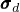, proportional to the total strain rate: 


where  is the strain rate. For hyperelastic (["Hyperelastic behavior of rubberlike materials," Section 22.5.1](pt05ch22s05abm07.md)) and hyperfoam (["Hyperelastic behavior in elastomeric foams," Section 22.5.2](pt05ch22s05abm08.md)) materials  is defined as the elastic stiffness in the strain-free state. For all other linear elastic materials in Abaqus/Standard and all other materials in Abaqus/Explicit,  is the material's current elastic stiffness.  will be calculated based on the current temperature during the analysis.

This damping stress is added to the stress caused by the constitutive response at the integration point when the dynamic equilibrium equations are formed, but it is not included in the stress output. As a result, damping can be introduced for any nonlinear case and provides standard Rayleigh damping for linear cases; for a linear case stiffness proportional damping is exactly the same as defining a damping matrix equal to  times the (elastic) material stiffness matrix. Other contributions to the stiffness matrix (e.g., hourglass, transverse shear, and drill stiffnesses) are not included when computing stiffness proportional damping.  has units of (time).

| **Input File Usage: ** | ``` [*DAMPING](../key/key-link.md#usb-kws-mdamping), BETA= ``` |
| --- | --- |

| **Abaqus/CAE Usage: ** | Property module: material editor: ****Mechanical****Damping****: **Beta**:  |
| --- | --- |

##### Defining variable stiffness proportional damping in Abaqus/Explicit

In Abaqus/Explicit you can define  as a tabular function of temperature and/or field variables. Therefore, stiffness proportional damping can vary during an Abaqus/Explicit analysis.

| **Input File Usage: ** | ``` [*DAMPING](../key/key-link.md#usb-kws-mdamping), BETA=TABULAR ``` |
| --- | --- |

### Structural damping

Structural damping assumes that the damping forces are proportional to the forces caused by stressing of the structure and are opposed to the velocity. Therefore, this form of damping can be used only when the displacement and velocity are exactly 90 out of phase. Structural damping is best suited for frequency domain dynamic procedures (see ["Damping in modal superposition procedures](pt05ch26s01abm51.md#usb-mat-cdampingopt-modal)” below). The damping forces are then


where  are the damping forces, , *s* is the user-defined structural damping factor, and 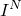 are the forces caused by stressing of the structure. The damping forces due to structural damping are intended to represent frictional effects (as distinct from viscous effects). Thus, structural damping is suggested for models involving materials that exhibit frictional behavior or where local frictional effects are present throughout the model, such as dry rubbing of joints in a multi-link structure.

Structural damping can be added to the model as mechanical dampers such as connector damping or as a complex stiffness on spring elements.

Structural damping can be used in steady-state dynamic procedures that allow for nondiagonal damping.

| **Input File Usage: ** | Use the following option to define structural damping: |
| --- | --- |
|  | ``` [*DAMPING](../key/key-link.md#usb-kws-mdamping), STRUCTURAL= ``` |

| **Abaqus/CAE Usage: ** | Property module: material editor: ****Mechanical****Damping****: **Structural**:  |
| --- | --- |

### Artificial damping in direct-integration dynamic analysis

In Abaqus/Standard the operators used for implicit direct time integration introduce some artificial damping in addition to Rayleigh damping. Damping associated with the Hilber-Hughes-Taylor and hybrid operators is usually controlled by the Hilber-Hughes-Taylor parameter , which is not the same as the  parameter controlling the mass proportional part of Rayleigh damping. The  and  parameters of the Hilber-Hughes-Taylor and hybrid operators also affect numerical damping. The , , and  parameters are not available for the backward Euler operator. See ["Implicit dynamic analysis using direct integration," Section 6.3.2](pt03ch06s03at07.md), for more information about this other form of damping.

### Artificial damping in explicit dynamic analysis

Rayleigh damping is meant to reflect physical damping in the actual material. In Abaqus/Explicit a small amount of numerical damping is introduced by default in the form of bulk viscosity to control high frequency oscillations; see ["Explicit dynamic analysis," Section 6.3.3](pt03ch06s03at08.md), for more information about this other form of damping.

### Effects of damping on the stable time increment in Abaqus/Explicit

As the fraction of critical damping for the highest mode (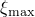) increases, the stable time increment for Abaqus/Explicit decreases according to the equation


where (by substituting , the frequency of the highest mode, into the equation for  given previously)


These equations indicate a tendency for stiffness proportional damping to have a greater effect on the stable time increment than mass proportional damping.

To illustrate the effect that damping has on the stable time increment, consider a cantilever in bending modeled with continuum elements. The lowest frequency is  1 rad/sec, while for the particular mesh chosen, the highest frequency is 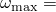 1000 rad/sec. The lowest mode in this problem corresponds to the cantilever in bending, and the highest frequency is related to the dilation of a single element.

With no damping the stable time increment is 

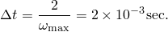

If we use stiffness proportional damping to create 1% of critical damping in the lowest mode, the damping factor is given by 

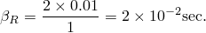

This corresponds to a critical damping factor in the highest mode of 


The stable time increment with damping is, thus, reduced by a factor of 


and becomes 

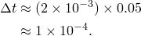

Thus, introducing 1% critical damping in the lowest mode reduces the stable time increment by a factor of twenty.

However, if we use mass proportional damping to damp out the lowest mode with 1% of critical damping, the damping factor is given by 


which corresponds to a critical damping factor in the highest mode of 

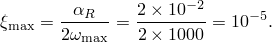

The stable time increment with damping is reduced by a factor of 

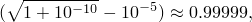

which is almost negligible.

This example demonstrates that it is generally preferable to damp out low frequency response with mass proportional damping rather than stiffness proportional damping. However, mass proportional damping can significantly affect rigid body motion, so large  is often undesirable. To avoid a dramatic drop in the stable time increment, the stiffness proportional damping factor, , should be less than or of the same order of magnitude as the initial stable time increment without damping. With 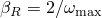, the stable time increment is reduced by about 52%.

### Damping in modal superposition procedures

Damping can be specified as part of the step definition for modal superposition procedures. ["Damping in a linear dynamic analysis" in "Dynamic analysis procedures: overview," Section 6.3.1](pt03ch06s03abo07.md#usb-anl-adynamicproc-linear), describes the availability of damping types, which depends on the procedure type and the architecture used to perform the analysis, and provides details on the following types of damping:
- Viscous modal damping (Rayleigh damping and fraction of critical damping)
- Structural modal damping
- Composite modal damping

### Material options

The  factor applies to all elements that use a linear elastic material definition (["Linear elastic behavior," Section 22.2.1](pt05ch22s02abm02.md)) and to Abaqus/Standard beam and shell elements that use general sections. In the latter case, if a nonlinear beam section definition is provided, the  factor is multiplied by the slope of the force-strain (or moment-curvature) relationship at zero strain or curvature. In addition, the  factor applies to all Abaqus/Explicit elements that use a hyperelastic material definition (["Hyperelastic behavior of rubberlike materials," Section 22.5.1](pt05ch22s05abm07.md)), a hyperfoam material definition (["Hyperelastic behavior in elastomeric foams," Section 22.5.2](pt05ch22s05abm08.md)), or general shell sections (["Using a general shell section to define the section behavior," Section 29.6.6](pt06ch29s06alm20.md)).

In the case of a no tension elastic material the  factor is not used in tension, while for a no compression elastic material the  factor is not used in compression (see ["No compression or no tension," Section 22.2.2](pt05ch22s02abm03.md)). In other words, these modified elasticity models exhibit damping only when they have stiffness.

### Elements

The  factor is applied to all elements that have mass including point mass elements (discrete DASHPOTA elements in each global direction, each with one node fixed, can also be used to introduce this type of damping). For point mass and rotary inertia elements mass proportional or composite modal damping are defined as part of the point mass or rotary inertia definitions (["Point masses," Section 30.1.1](pt06ch30s01alm21.md), and ["Rotary inertia," Section 30.2.1](pt06ch30s02alm22.md)).

The  factor is not available for spring elements: discrete dashpot elements should be used in parallel with spring elements instead.

The  factor is also not applied to the transverse shear terms in Abaqus/Standard beams and shells.

In Abaqus/Standard composite modal damping cannot be used with or within substructures. Rayleigh damping can be introduced for substructures. When Rayleigh damping is used within a substructure,  and  are averaged over the substructure to define single values of  and  for the substructure. These are weighted averages, using the mass as the weighting factor for  and the volume as the weighting factor for . These averaged damping values can be superseded by providing them directly in a second damping definition. See ["Using substructures," Section 10.1.1](pt04ch10s01aus58.md).


