# 26.1.2 Thermal expansion


**Products: **Abaqus/Standard  Abaqus/Explicit  Abaqus/CFD  Abaqus/CAE  

##### **References**

- ["Material library: overview," Section 21.1.1](pt05ch21s01abo18.md)
- ["UEXPAN," Section 1.1.30 of the Abaqus User Subroutines Reference Guide](../sub/sub-link.md#sub-rtn-uuexpan)
- [*EXPANSION](../key/key-link.md#usb-kws-mexpansion)
- ["Defining other mechanical models," Section 12.9.4 of the Abaqus/CAE User's Guide](../usi/usi-link.md#usi-prp-mechanical-other)
- ["Defining a fluid-filled porous material," Section 12.12.3 of the Abaqus/CAE User's Guide](../usi/usi-link.md#usi-prp-other-porefluid)

### Overview

Thermal expansion effects:
- can be defined by specifying thermal expansion coefficients so that Abaqus can compute thermal strains and, in Abaqus/CFD, buoyancy forces;
- can be isotropic, orthotropic, or fully anisotropic;
- are defined as total expansion from a reference temperature;
- can be specified as a function of temperature and/or field variables;
- can be defined with a distribution for solid continuum elements in Abaqus/Standard; and
- in Abaqus/Standard can be specified directly in user subroutine [`UEXPAN`](../sub/sub-link.md#sub-xsl-uexpan) (if the thermal strains are complicated functions of field variables and state variables).

### Defining thermal expansion coefficients

Thermal expansion is a material property included in a material definition (see ["Material data definition," Section 21.1.2](pt05ch21s01aus109.md)) except when it refers to the expansion of a gasket whose material properties are not defined as part of a material definition. In that case expansion must be used in conjunction with the gasket behavior definition (see ["Defining the gasket behavior directly using a gasket behavior model," Section 32.6.6](pt06ch32s06alm51.md)).

In an Abaqus/Standard analysis a spatially varying thermal expansion can be defined for homogeneous solid continuum elements by using a distribution (["Distribution definition," Section 2.8.1](pt01ch02s08aus26.md)). The distribution must include default values for the thermal expansion. If a distribution is used, no dependencies on temperature and/or field variables for the thermal expansion can be defined. 

In an Abaqus/CFD analysis the thermal expansion coefficient, , can be defined for computation of thermal strains in solid materials and the volumetric thermal expansion coefficient, , can be defined for computation of buoyancy forces in fluid materials. See ["Computation of thermal strains](pt05ch26s01abm52.md#usb-mat-cthermalstrains),” and ["Computation of buoyancy forces in Abaqus/CFD](pt05ch26s01abm52.md#usb-mat-cthermalbuoyancy)” below, for a detailed description of each of these coefficients.

| **Input File Usage: ** | Use the following options to define thermal expansion for most materials: |
| --- | --- |
|  | ``` [*MATERIAL](../key/key-link.md#usb-kws-mmaterial) [*EXPANSION](../key/key-link.md#usb-kws-mexpansion) ``` Use the following options to define thermal expansion for gaskets whose constitutive response is defined directly as gasket behavior: ``` [*GASKET BEHAVIOR](../key/key-link.md#usb-kws-mgasketbehavior) [*EXPANSION](../key/key-link.md#usb-kws-mexpansion) ``` |

| **Abaqus/CAE Usage: ** | Use the following option in conjunction with other material behaviors, including gasket behavior, to include thermal expansion effects: |
| --- | --- |
|  | Property module: material editor: ****Mechanical****Expansion**** |

#### Computation of thermal strains

Abaqus requires thermal expansion coefficients, , that define the total thermal expansion from a reference temperature, , as shown in [Figure 26.1.2--1](pt05ch26s01abm52.md#cthermalexpan-def). 

**Figure 26.1.2–1** Definition of the thermal expansion coefficient.

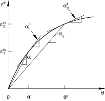

They generate thermal strains according to the formula


where 


is the thermal expansion coefficient;


is the current temperature;


is the initial temperature;


are the current values of the predefined field variables;


are the initial values of the field variables; and


is the reference temperature for the thermal expansion coefficient.

The second term in the above equation represents the strain due to the difference between the initial temperature, , and the reference temperature, . This term is necessary to enforce the assumption that there is no initial thermal strain for cases in which the reference temperature does not equal the initial temperature.

##### Defining the reference temperature

If the coefficient of thermal expansion, , is not a function of temperature or field variables, the value of the reference temperature, , is not needed. If  is a function of temperature or field variables, you can define .

| **Input File Usage: ** | ``` [*EXPANSION](../key/key-link.md#usb-kws-mexpansion), ZERO= ``` |
| --- | --- |

| **Abaqus/CAE Usage: ** | Property module: material editor: ****Mechanical****Expansion****: **Reference temperature:**  |
| --- | --- |

#### Computation of buoyancy forces in Abaqus/CFD

Buoyancy forces driving natural convection in Abaqus/CFD fluids are computed using the Boussinesq approximation

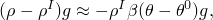

 where


is the density;


is the initial density;


is the acceleration due to gravity;


is the temperature;


is the reference temperature, and;


is the volumetric thermal expansion coefficient.

The volumetric thermal expansion coefficient, , is defined as 


 and is related to the thermal expansion coefficient, , by the expression


#### Converting thermal expansion coefficients from differential form to total form

Total thermal expansion coefficients are commonly available in tables of material properties. However, sometimes you are given thermal expansion data in differential form: 


that is, the tangent to the strain-temperature curve is provided (see [Figure 26.1.2--1](pt05ch26s01abm52.md#cthermalexpan-def)). To convert to the total thermal expansion form required by Abaqus, this relationship must be integrated from a suitably chosen reference temperature, : 


For example, suppose 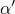 is a series of constant values: 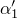 between  and ; 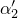 between  and ; 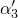 between  and 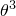; etc. Then, 

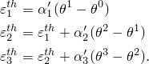

The corresponding total expansion coefficients required by Abaqus are then obtained as 

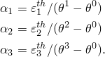

### Defining increments of thermal strain in user subroutine [`UEXPAN`](../sub/sub-link.md#sub-xsl-uexpan)

Increments of thermal strain can be specified in Abaqus/Standard user subroutine [`UEXPAN`](../sub/sub-link.md#sub-xsl-uexpan) as functions of temperature and/or predefined field variables. User subroutine [`UEXPAN`](../sub/sub-link.md#sub-xsl-uexpan) must be used if the thermal strain increments depend on state variables.

| **Input File Usage: ** | ``` [*EXPANSION](../key/key-link.md#usb-kws-mexpansion), USER ``` |
| --- | --- |

| **Abaqus/CAE Usage: ** | Property module: material editor: ****Mechanical****Expansion****: **Use user subroutine UEXPAN** |
| --- | --- |

### Defining the initial temperature and field variable values

If the coefficient of thermal expansion, , is a function of temperature or field variables, the initial temperature and initial field variable values,  and , are given as described in ["Initial conditions in Abaqus/Standard and Abaqus/Explicit," Section 34.2.1](pt07ch34s02aus116.md).

#### Element removal and reactivation

If an element has been removed and subsequently reactivated in Abaqus/Standard (["Element and contact pair removal and reactivation," Section 11.2.1](pt04ch11s02aus66.md)),  and  in the equation for the thermal strains represent temperature and field variable values as they were at the moment of reactivation.

### Defining directionally dependent thermal expansion

Isotropic or orthotropic thermal expansion can be defined in Abaqus. In addition, fully anisotropic thermal expansion can be defined in Abaqus/Standard.

Orthotropic and anisotropic thermal expansion can be used only with materials where the material directions are defined with local orientations (see ["Orientations," Section 2.2.5](pt01ch02s02aus15.md)).

Orthotropic thermal expansion in Abaqus/Explicit is allowed only with anisotropic elasticity (including orthotropic elasticity) and anisotropic yield (see ["Anisotropic yield/creep," Section 23.2.6](pt05ch23s02abm22.md)).

Only isotropic thermal expansion is allowed in Abaqus/CFD, for adiabatic stress analysis, and with the hyperelastic and hyperfoam material models.

#### Isotropic expansion

If the thermal expansion coefficient is defined directly, only one value of  is needed at each temperature. If user subroutine [`UEXPAN`](../sub/sub-link.md#sub-xsl-uexpan) is used, only one isotropic thermal strain increment (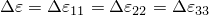) must be defined.

| **Input File Usage: ** | Use the following option to define the thermal expansion coefficient directly: |
| --- | --- |
|  | ``` [*EXPANSION](../key/key-link.md#usb-kws-mexpansion), TYPE=ISO ``` Use the following option to define the thermal expansion with user subroutine [`UEXPAN`](../sub/sub-link.md#sub-xsl-uexpan): ``` [*EXPANSION](../key/key-link.md#usb-kws-mexpansion), TYPE=ISO, USER ``` |

| **Abaqus/CAE Usage: ** | Use the following input to define the thermal expansion coefficient directly: |
| --- | --- |
|  | Property module: material editor: ****Mechanical****Expansion****: **Type: Isotropic** Use the following input to define the thermal expansion with user subroutine [`UEXPAN`](../sub/sub-link.md#sub-xsl-uexpan): Property module: material editor: ****Mechanical****Expansion****: **Type: Isotropic**, **Use user subroutine UEXPAN** |

#### Orthotropic expansion

If the thermal expansion coefficients are defined directly, the three expansion coefficients in the principal material directions (, 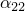, and ) should be given as functions of temperature. If user subroutine [`UEXPAN`](../sub/sub-link.md#sub-xsl-uexpan) is used, the three components of thermal strain increment in the principal material directions (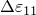, 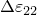, and ) must be defined.

| **Input File Usage: ** | Use the following option to define the thermal expansion coefficient directly: |
| --- | --- |
|  | ``` [*EXPANSION](../key/key-link.md#usb-kws-mexpansion), TYPE=ORTHO ``` Use the following option to define the thermal expansion with user subroutine [`UEXPAN`](../sub/sub-link.md#sub-xsl-uexpan): ``` [*EXPANSION](../key/key-link.md#usb-kws-mexpansion), TYPE=ORTHO, USER ``` |

| **Abaqus/CAE Usage: ** | Use the following input to define the thermal expansion coefficient directly: |
| --- | --- |
|  | Property module: material editor: ****Mechanical****Expansion****: **Type: Orthotropic** Use the following input to define the thermal expansion with user subroutine [`UEXPAN`](../sub/sub-link.md#sub-xsl-uexpan): Property module: material editor: ****Mechanical****Expansion****: **Type: Orthotropic**, **Use user subroutine UEXPAN** |

#### Anisotropic expansion

If the thermal expansion coefficients are defined directly, all six components of  (, , , , , 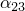) must be given as functions of temperature. If user subroutine [`UEXPAN`](../sub/sub-link.md#sub-xsl-uexpan) is used, all six components of the thermal strain increment (, , , 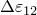, 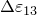, 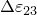) must be defined.

In an Abaqus/Standard analysis if a distribution is used to define the thermal expansion, the number of expansion coefficients given for each element in the distribution, which is determined by the associated distribution table (["Distribution definition," Section 2.8.1](pt01ch02s08aus26.md)), must be consistent with the level of anisotropy specified for the expansion behavior. For example, if orthotropic behavior is specified, three expansion coefficients must be defined for each element in the distribution.

| **Input File Usage: ** | Use the following option to define the thermal expansion coefficient directly: |
| --- | --- |
|  | ``` [*EXPANSION](../key/key-link.md#usb-kws-mexpansion), TYPE=ANISO ``` Use the following option to define the thermal expansion with user subroutine [`UEXPAN`](../sub/sub-link.md#sub-xsl-uexpan): ``` [*EXPANSION](../key/key-link.md#usb-kws-mexpansion), TYPE=ANISO, USER ``` |

| **Abaqus/CAE Usage: ** | Use the following input to define the thermal expansion coefficient directly: |
| --- | --- |
|  | Property module: material editor: ****Mechanical****Expansion****: **Type: Anisotropic** Use the following input to define the thermal expansion with user subroutine [`UEXPAN`](../sub/sub-link.md#sub-xsl-uexpan): Property module: material editor: ****Mechanical****Expansion****: **Type: Anisotropic**, **Use user subroutine UEXPAN** |

### Thermal stress

When a structure is not free to expand, a change in temperature will cause stress. For example, consider a single two-node truss of length *L* that is completely restrained at both ends. The cross-sectional area; the Young's modulus, *E*; and the thermal expansion coefficient, , are all constant. The stress in this one-dimensional problem can then be calculated from Hooke's Law as 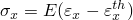, where  is the total strain and 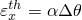 is the thermal strain, where 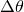 is the temperature change. Since the element is fully restrained, . If the temperature at both nodes is the same, we obtain the stress 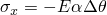.

Constrained thermal expansion can cause significant stress. For typical structural metals, temperature changes of about 150C (300F) can cause yield. Therefore, it is often important to define boundary conditions with particular care for problems involving thermal loading to avoid overconstraining the thermal expansion.

#### Energy balance considerations

Abaqus does not account for thermal expansion effects in the total energy balance equation, which can lead to an apparent imbalance of the total energy of the model. For example, in the example above of a two-node truss restrained at both ends, constrained thermal expansion introduces strain energy that will result in an equivalent increase in the total energy of the model.

### Use with other material properties or behaviors

Thermal expansion can be combined with any other (mechanical) material (see ["Combining material behaviors," Section 21.1.3](pt05ch21s01aus110.md)) behavior in Abaqus.

#### Using thermal expansion with other material models

For most materials thermal expansion is defined by a single coefficient or set of orthotropic or anisotropic coefficients or, in Abaqus/Standard, by defining the incremental thermal strains in user subroutine [`UEXPAN`](../sub/sub-link.md#sub-xsl-uexpan). For porous media in Abaqus/Standard, such as soils or rock, thermal expansion can be defined for the solid grains and for the permeating fluid (when using the coupled pore fluid diffusion/stress procedure—see ["Coupled pore fluid diffusion and stress analysis," Section 6.8.1](pt03ch06s08at26.md)). In such a case the thermal expansion definition should be repeated to define the different thermal expansion effects.

#### Using thermal expansion with gasket behaviors

Thermal expansion can be used in conjunction with any gasket behavior definition. Thermal expansion will affect the expansion of the gasket in the membrane direction and/or the expansion in the gasket's thickness direction.

### Elements

Thermal expansion can be used with any stress/displacement or fluid element in Abaqus.


