# 26.1.3 Field expansion


**Product: **Abaqus/Standard  

##### **References**

- ["Material library: overview," Section 21.1.1](pt05ch21s01abo18.md)
- ["UEXPAN," Section 1.1.30 of the Abaqus User Subroutines Reference Guide](../sub/sub-link.md#sub-rtn-uuexpan)
- [*EXPANSION](../key/key-link.md#usb-kws-mexpansion)

### Overview

Field expansion effects:
- can be defined by specifying field expansion coefficients so that Abaqus/Standard can compute field expansion strains that are driven by changes in predefined field variables;
- can be isotropic, orthotropic, or fully anisotropic;
- are defined as total expansion from a reference value of the predefined field variable;
- can be specified as a function of temperature and/or predefined field variables;
- can be specified directly in user subroutine [`UEXPAN`](../sub/sub-link.md#sub-xsl-uexpan) (if the field expansion strains are complicated functions of field variables and state variables); and
- can be defined for more than one predefined field variable.

### Defining field expansion coefficients

Field expansion is a material property included in a material definition (see ["Material data definition," Section 21.1.2](pt05ch21s01aus109.md)) except when it refers to the expansion of a gasket whose material properties are not defined as part of a material definition. In that case field expansion must be used in conjunction with the gasket behavior definition (see ["Defining the gasket behavior directly using a gasket behavior model," Section 32.6.6](pt06ch32s06alm51.md)).

| **Input File Usage: ** | Use the following options to define field expansion associated with predefined field variable number *n* for most materials: |
| --- | --- |
|  | ``` [*MATERIAL](../key/key-link.md#usb-kws-mmaterial) [*EXPANSION](../key/key-link.md#usb-kws-mexpansion), FIELD=*n* ``` The [*EXPANSION](../key/key-link.md#usb-kws-mexpansion) option can be repeated with different values of the predefined field variable number *n* to define field expansion associated with more than one field. Use the following options to define field expansion associated with predefined field variable number *n* for gaskets whose constitutive response is defined directly as gasket behavior: ``` [*GASKET BEHAVIOR](../key/key-link.md#usb-kws-mgasketbehavior) [*EXPANSION](../key/key-link.md#usb-kws-mexpansion), FIELD=*n* ``` The [*EXPANSION](../key/key-link.md#usb-kws-mexpansion) option can be repeated with different values of the predefined field variable number *n* to define field expansion associated with more than one field. |

#### Computation of field expansion strains

Abaqus/Standard requires field expansion coefficients, 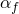, that define the total field expansion from a reference value of the predefined field variable *n*, , as shown in [Figure 26.1.3--1](pt05ch26s01abm53.md#cfieldexpan-def).

**Figure 26.1.3–1** Definition of the field expansion coefficient.


The field expansion for each specified field generates field expansion strains according to the formula


where 


is the field expansion coefficient;


is the current value of the predefined field variable *n*;


is the initial value of the predefined field variable *n*;


are the current values of the predefined field variables;

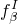

are the initial values of the predefined field variables; and


is the reference value of the predefined field variable *n* for the field expansion coefficient.

The second term in the above equation represents the strain due to the difference between the initial value of the predefined field variable*n*, , and the corresponding reference value, . This term is necessary to enforce the assumption that there is no initial field expansion strain for cases in which the reference value of the predefined field variable *n* does not equal the corresponding initial value.

##### Defining the reference value of the predefined field variable

If the coefficient of field expansion, , is not a function of temperature or field variables, the reference value of the predefined field variable, , is not needed. If  is a function of temperature or field variables, you can define .

| **Input File Usage: ** | ``` [*EXPANSION](../key/key-link.md#usb-kws-mexpansion), FIELD=*n*, ZERO= ``` |
| --- | --- |

#### Converting field expansion coefficients from differential form to total form

Total field expansion coefficients can be provided directly as outlined in the previous section. However, you may have field expansion data available in differential form: 


that is, the tangent to the strain-field variable curve is provided (see [Figure 26.1.3--1](pt05ch26s01abm53.md#cfieldexpan-def)). To convert to the total field expansion form required by Abaqus, this relationship must be integrated from a suitably chosen reference value of the field variable, : 

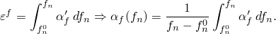

For example, suppose 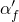 is a series of constant values: 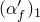 between  and 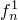; 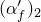 between  and 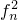; 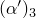 between  and 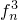; etc. Then, 

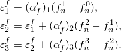

The corresponding total expansion coefficients required by Abaqus are then obtained as 

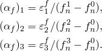

### Defining increments of field expansion strain in user subroutine [`UEXPAN`](../sub/sub-link.md#sub-xsl-uexpan)

Increments of field expansion strain can be specified in user subroutine [`UEXPAN`](../sub/sub-link.md#sub-xsl-uexpan) as functions of temperature and/or predefined field variables. User subroutine [`UEXPAN`](../sub/sub-link.md#sub-xsl-uexpan) must be used if the field expansion strain increments depend on state variables.

You can use user subroutine [`UEXPAN`](../sub/sub-link.md#sub-xsl-uexpan) only once within a single material definition. In particular, you cannot define both thermal and field expansions or multiple field expansions within the same material definition using user subroutine [`UEXPAN`](../sub/sub-link.md#sub-xsl-uexpan).

| **Input File Usage: ** | ``` [*EXPANSION](../key/key-link.md#usb-kws-mexpansion), FIELD=*n*, USER ``` |
| --- | --- |

### Defining the initial temperature and field variable values

If the coefficient of field expansion, , is a function of temperature and/or predefined field variables, the initial temperature and initial predefined field variable values,  and , are given as described in ["Initial conditions in Abaqus/Standard and Abaqus/Explicit," Section 34.2.1](pt07ch34s02aus116.md).

#### Element removal and reactivation

If an element has been removed and subsequently reactivated (["Element and contact pair removal and reactivation," Section 11.2.1](pt04ch11s02aus66.md)),  and  in the equation for the field expansion strains represent temperature and predefined field variable values as they were at the moment of reactivation.

### Defining directionally dependent field expansion

Isotropic, orthotropic, or fully anisotropic field expansion can be defined.

Orthotropic and anisotropic field expansion can be used only with materials where the material directions are defined with local orientations (see ["Orientations," Section 2.2.5](pt01ch02s02aus15.md)).

Only isotropic field expansion is allowed with the hyperelastic and hyperfoam material models.

#### Isotropic expansion

If the field expansion coefficient is defined directly, only one value of  is needed at each temperature and/or predefined field variable. If user subroutine [`UEXPAN`](../sub/sub-link.md#sub-xsl-uexpan) is used, only one isotropic field expansion strain increment (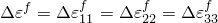) must be defined.

| **Input File Usage: ** | Use the following option to define the field expansion coefficient directly: |
| --- | --- |
|  | ``` [*EXPANSION](../key/key-link.md#usb-kws-mexpansion), FIELD=*n*, TYPE=ISO ``` Use the following option to define the field expansion with user subroutine [`UEXPAN`](../sub/sub-link.md#sub-xsl-uexpan): ``` [*EXPANSION](../key/key-link.md#usb-kws-mexpansion), FIELD=*n*, TYPE=ISO, USER ``` |

#### Orthotropic expansion

If the field expansion coefficients are defined directly, the three expansion coefficients in the principal material directions (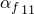, 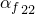, and 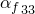) should be given as functions of temperature and/or predefined field variables. If user subroutine [`UEXPAN`](../sub/sub-link.md#sub-xsl-uexpan) is used, the three components of field expansion strain increment in the principal material directions (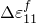, 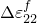, and 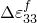) must be defined.

| **Input File Usage: ** | Use the following option to define the field expansion coefficients directly: |
| --- | --- |
|  | ``` [*EXPANSION](../key/key-link.md#usb-kws-mexpansion), FIELD=*n*, TYPE=ORTHO ``` Use the following option to define the field expansion with user subroutine [`UEXPAN`](../sub/sub-link.md#sub-xsl-uexpan): ``` [*EXPANSION](../key/key-link.md#usb-kws-mexpansion), FIELD=*n*, TYPE=ORTHO, USER ``` |

#### Anisotropic expansion

If the field expansion coefficients are defined directly, all six components of  (, , , 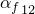, 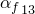, 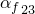) must be given as functions of temperature and/or predefined field variables. If user subroutine [`UEXPAN`](../sub/sub-link.md#sub-xsl-uexpan) is used, all six components of the field expansion strain increment (, , , 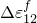, 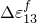, 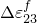) must be defined.

| **Input File Usage: ** | Use the following option to define the field expansion coefficients directly: |
| --- | --- |
|  | ``` [*EXPANSION](../key/key-link.md#usb-kws-mexpansion), FIELD=*n*, TYPE=ANISO ``` Use the following option to define the field expansion with user subroutine [`UEXPAN`](../sub/sub-link.md#sub-xsl-uexpan): ``` [*EXPANSION](../key/key-link.md#usb-kws-mexpansion), FIELD=*n*, TYPE=ANISO, USER ``` |

### Field expansion stress

When a structure is not free to expand, a change in a predefined field variable will cause stress if there is field expansion associated with that predefined field variable. For example, consider a single 2-node truss of length *L* that is completely restrained at both ends. The cross-sectional area; the Young's modulus, *E*; and the field expansion coefficient, , are all constants. The stress in this one-dimensional problem can then be calculated from Hooke's Law as 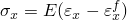, where  is the total strain and 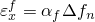 is the field expansion strain, where 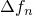 is the change in the value of the predefined field variable number *n*. Since the element is fully restrained, 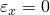. If the values of the field variable at both nodes are the same, we obtain the stress 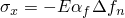.

Depending on the value of the field expansion coefficient and the change in the value of the corresponding predefined field variable, a constrained field expansion can cause significant stress and introduce strain energy that will result in an equivalent increase in the total energy of the model. Therefore, it is often important to define boundary conditions with particular care for problems involving this property to avoid overconstraining the field expansion.

### Use with other material properties or behaviors

Field expansion can be combined with any other (mechanical) material (see ["Combining material behaviors," Section 21.1.3](pt05ch21s01aus110.md)) behavior in Abaqus/Standard.

#### Using field expansion with other material models

For most materials field expansion is defined by a single coefficient or a set of orthotropic or anisotropic coefficients or by defining the incremental field expansion strains in user subroutine [`UEXPAN`](../sub/sub-link.md#sub-xsl-uexpan).

#### Using field expansion with gasket behavior

Field expansion can be used in conjunction with any gasket behavior definition. Field expansion will affect the expansion of the gasket in the membrane direction and/or the expansion in the gasket's thickness direction.

### Elements

Field expansion can be used with any stress/displacement element in Abaqus/Standard, except for beam and shell elements using a general section behavior.


