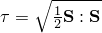
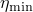
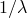
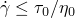
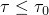
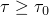

# 26.1.4 Viscosity


**Products: **Abaqus/Explicit  Abaqus/CFD  Abaqus/CAE  

##### **References**

- ["Viscous shear behavior" in "Equation of state," Section 25.2.1](pt05ch25s02abm50.md#usb-mat-ceos-deviatoricviscous)
- [*VISCOSITY](../key/key-link.md#usb-kws-mviscosity)
- [*EOS](../key/key-link.md#usb-kws-meos)
- [*TRS](../key/key-link.md#usb-kws-mtrs)
- ["Defining viscosity" in "Defining other mechanical models," Section 12.9.4 of the Abaqus/CAE User's Guide](../usi/usi-link.md#usi-prp-mechanical-other-viscosity)

### Overview

Material shear viscosity is an internal property of a fluid that offers resistance to flow. It can be specified in Abaqus/Explicit and Abaqus/CFD. 

Material shear viscosity in Abaqus/Explicit:
- can be a function of temperature and shear strain rate; and
- must be used in combination with an equation of state (["Equation of state," Section 25.2.1](pt05ch25s02abm50.md)).

Material shear viscosity in Abaqus/CFD:- can be a function of temperature only for the Newtonian model;
- can be a function of shear strain rate; and
- is not supported for field-dependent variants.

### Viscous shear behavior

The resistance to flow of a viscous fluid is described by the following relationship between deviatoric stress and strain rate


where  is the deviatoric stress,  is the deviatoric part of the strain rate,  is the viscosity, and  is the engineering shear strain rate.

Newtonian fluids are characterized by a viscosity that only depends on temperature, . In the more general case of non-Newtonian fluids the viscosity  is a function of the temperature and shear strain rate:


where  is the equivalent shear strain rate. In terms of the equivalent shear stress, , we have:


Non-Newtonian fluids can be classified as shear-thinning (or pseudoplastic), when the apparent viscosity decreases with increasing shear rate, and shear-thickening (or dilatant), when the viscosity increases with strain rate.

In addition to the Newtonian viscous fluid model, Abaqus/CFD and Abaqus/Explicit support several models of nonlinear viscosity to describe non-Newtonian fluids: power law, Carreau-Yasuda, Cross, Herschel-Bulkley, Powell-Eyring, and Ellis-Meter. Other functional forms of the viscosity can also be specified in tabular format. In addition, in Abaqus/Explicit user subroutine [`VUVISCOSITY`](../sub/sub-link.md#sub-xsl-vuviscosity) can be used.

#### Newtonian

The Newtonian model is useful to model viscous laminar flow governed by the Navier-Poisson law of a Newtonian fluid, . Newtonian fluids are characterized by a viscosity that depends only on temperature, . You need to specify the viscosity as a tabular function of temperature when you define the Newtonian viscous deviatoric behavior.

| **Input File Usage: ** | ``` [*VISCOSITY](../key/key-link.md#usb-kws-mviscosity), DEFINITION=NEWTONIAN (default) ``` |
| --- | --- |

| **Abaqus/CAE Usage: ** | Property module: material editor: ****Mechanical****Viscosity**** |
| --- | --- |

#### Power law

The power law model is commonly used to describe the viscosity of non-Newtonian fluids. The viscosity is expressed as


where  is the flow consistency index and  is the flow behavior index. When , the fluid is shear-thinning (or pseudoplastic): the apparent viscosity decreases with increasing shear rate. When , the fluid is shear-thickening (or dilatant); and when , the fluid is Newtonian. Optionally, you can place a lower limit, , and/or an upper limit, , on the value of the viscosity computed from the power law.

| **Input File Usage: ** | ``` [*VISCOSITY](../key/key-link.md#usb-kws-mviscosity), DEFINITION=POWER LAW ``` |
| --- | --- |

| **Abaqus/CAE Usage: ** | The power law model is not supported in Abaqus/CAE. |
| --- | --- |

#### Carreau-Yasuda

The Carreau-Yasuda model describes the shear thinning behavior of polymers. This model often provides a better fit than the power law model for both high and low shear strain rates. The viscosity is expressed as


where  is the low shear rate Newtonian viscosity,  is the infinite shear viscosity (at high shear strain rates),  is the natural time constant of the fluid ( is the critical shear rate at which the fluid changes from Newtonian to power law behavior), and   represents the flow behavior index in the power law regime. The coefficient  is a material parameter. The original Carreau model is recovered when =2. 

| **Input File Usage: ** | ``` [*VISCOSITY](../key/key-link.md#usb-kws-mviscosity), DEFINITION=CARREAU-YASUDA ``` |
| --- | --- |

| **Abaqus/CAE Usage: ** | The Carreau-Yasuda model is not supported in Abaqus/CAE. |
| --- | --- |

#### Cross

The Cross model is commonly used when it is necessary to describe the low-shear-rate behavior of the viscosity. The viscosity is expressed as


where  is the Newtonian viscosity,  is the infinite shear viscosity (usually assumed to be zero for the Cross model),  is the natural time constant of the fluid ( is the critical shear rate at which the fluid changes from Newtonian to power-law behavior), and   is the flow behavior index in the power law regime. 

| **Input File Usage: ** | ``` [*VISCOSITY](../key/key-link.md#usb-kws-mviscosity), DEFINITION=CROSS ``` |
| --- | --- |

| **Abaqus/CAE Usage: ** | The Cross model is not supported in Abaqus/CAE. |
| --- | --- |

#### Herschel-Bulkley

The Herschel-Bulkley model can be used to describe the behavior of viscoplastic fluids, such as Bingham plastics, that exhibit a yield response. The viscosity is expressed as


Here  is the “yield” stress and  is a penalty viscosity to model the “rigid-like” behavior in the very low strain rate regime (), when the stress is below the yield stress, . With increasing strain rates, the viscosity transitions into a power law model once the yield threshold is reached, . The parameters  and   are the flow consistency and the flow behavior indexes in the power law regime, respectively. Bingham plastics correspond to the case =1.

| **Input File Usage: ** | ``` [*VISCOSITY](../key/key-link.md#usb-kws-mviscosity), DEFINITION=HERSCHEL-BULKLEY ``` |
| --- | --- |

| **Abaqus/CAE Usage: ** | The Herschel-Bulkley model is not supported in Abaqus/CAE. |
| --- | --- |

#### Powell-Eyring

This model, which is derived from the theory of rate processes, is relevant primarily to molecular fluids but can be used in some cases to describe the viscous behavior of polymer solutions and viscoelastic suspensions over a wide range of shear rates. The viscosity is expressed as


where  is the Newtonian viscosity,  is the infinite shear viscosity, and  represents a characteristic time of the measured system. 

| **Input File Usage: ** | ``` [*VISCOSITY](../key/key-link.md#usb-kws-mviscosity), DEFINITION=POWELL-EYRING ``` |
| --- | --- |

| **Abaqus/CAE Usage: ** | The Powell-Eyring model is not supported in Abaqus/CAE. |
| --- | --- |

#### Ellis-Meter

The Ellis-Meter model expresses the viscosity in terms of the effective shear stress, , as:


where  is the effective shear stress at which the viscosity is 50% between the Newtonian limit, , and the infinite shear viscosity, , and   represents the flow index in the power law regime.

| **Input File Usage: ** | ``` [*VISCOSITY](../key/key-link.md#usb-kws-mviscosity), DEFINITION=ELLIS-METER ``` |
| --- | --- |

| **Abaqus/CAE Usage: ** | The Ellis-Meter model is not supported in Abaqus/CAE. |
| --- | --- |

#### Tabular

In Abaqus/Explicit the viscosity can be specified directly as a tabular function of shear strain rate and temperature. In Abaqus/CFD only shear strain rate dependence is supported.

| **Input File Usage: ** | ``` [*VISCOSITY](../key/key-link.md#usb-kws-mviscosity), DEFINITION=TABULAR ``` |
| --- | --- |

| **Abaqus/CAE Usage: ** | Specifying the viscosity directly as a tabular function is not supported in Abaqus/CAE. |
| --- | --- |

#### User-defined (Abaqus/Explicit only)

In Abaqus/Explicit you can specify a user-defined viscosity in user subroutine [`VUVISCOSITY`](../sub/sub-link.md#sub-xsl-vuviscosity) (see ["VUVISCOSITY," Section 1.2.24 of the Abaqus User Subroutines Reference Guide](../sub/sub-link.md#sub-rtn-uexpuviscosity)).

| **Input File Usage: ** | ``` [*VISCOSITY](../key/key-link.md#usb-kws-mviscosity), DEFINITION=USER ``` |
| --- | --- |

| **Abaqus/CAE Usage: ** | User-defined viscosity is not supported in Abaqus/CAE. |
| --- | --- |

### Temperature dependence of viscosity (Abaqus/Explicit only)

The temperature-dependence of the viscosity of many polymer materials of industrial interest obeys a time-temperature shift relationship in the form:


where  is the shift function and  is the reference temperature at which the viscosity versus shear strain rate relationship is known. This concept for temperature dependence is usually referred to as thermo-rheologically simple (TRS) temperature dependence.  In the Newtonian limit for low shear rates, when , we have


Thus, the shift function is defined as the ratio of the Newtonian viscosity at the temperature of interest to that of the chosen reference state: .

See ["Thermo-rheologically simple temperature effects" in "Time domain viscoelasticity," Section 22.7.1](pt05ch22s07abm12.md#usb-mat-ctimevisco-trs), for a description of the different forms of the shift function available in Abaqus.

| **Input File Usage: ** | Use the following options to define a thermo-rheologically simple (TRS) temperature-dependent viscosity: |
| --- | --- |
|  | ``` [*VISCOSITY](../key/key-link.md#usb-kws-mviscosity) [*TRS](../key/key-link.md#usb-kws-mtrs) ``` |

| **Abaqus/CAE Usage: ** | Defining a thermo-rheologically simple temperature-dependent viscosity is not supported in Abaqus/CAE. |
| --- | --- |

### Material options

Material shear viscosity in Abaqus/Explicit must be used in combination with an equation of state to define the material's volumetric mechanical behavior (see ["Equation of state," Section 25.2.1](pt05ch25s02abm50.md)).

### Elements

Material shear viscosity can be used with any solid (continuum) elements in Abaqus/Explicit except plane stress elements and with any fluid (continuum) elements in Abaqus/CFD.


