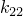
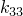
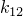
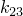

# 26.2.2 Conductivity


**Products: **Abaqus/Standard  Abaqus/Explicit  Abaqus/CFD  Abaqus/CAE  

##### **References**

- ["Material library: overview," Section 21.1.1](pt05ch21s01abo18.md)
- ["Thermal properties: overview," Section 26.2.1](pt05ch26s02abo23.md)
- [*CONDUCTIVITY](../key/key-link.md#usb-kws-mconductivity)
- ["Specifying thermal conductivity," Section 12.10.1 of the Abaqus/CAE User's Guide](../usi/usi-link.md#usi-prp-thermal-conductivity)

### Overview

A material's thermal conductivity:
- must be defined for ["Uncoupled heat transfer analysis," Section 6.5.2](pt03ch06s05at18.md); ["Fully coupled thermal-stress analysis," Section 6.5.3](pt03ch06s05at19.md); and ["Coupled thermal-electrical analysis," Section 6.7.3](pt03ch06s07at22.md);
- must be defined for an Abaqus/CFD analysis when the energy equation is active (["Energy equation" in "Incompressible fluid dynamic analysis," Section 6.6.2](pt03ch06s06aus48.md#usb-anl-aifluiddyn-energy));
- can be linear or nonlinear (by defining it as a function of temperature);
- can be isotropic, orthotropic, or fully anisotropic; and
- can be specified as a function of temperature and/or field variables.

### Directional dependence of thermal conductivity

Isotropic, orthotropic, or fully anisotropic thermal conductivity can be defined. Only isotropic thermal conductivity can be defined for an incompressible fluid dynamic analysis that includes an energy equation. For orthotropic or anisotropic thermal conductivity, a local orientation (["Orientations," Section 2.2.5](pt01ch02s02aus15.md)) must be used to specify the material directions used to define the conductivity.

#### Isotropic conductivity

For isotropic conductivity only one value of conductivity is needed at each temperature and field variable value. Isotropic conductivity is the default.

| **Input File Usage: ** | ``` [*CONDUCTIVITY](../key/key-link.md#usb-kws-mconductivity), TYPE=ISO ``` |
| --- | --- |

| **Abaqus/CAE Usage: ** | Property module: material editor: ****Thermal****Conductivity****: **Type: Isotropic** |
| --- | --- |

#### Orthotropic conductivity

For orthotropic conductivity three values of conductivity (, , ) are needed at each temperature and field variable value.

| **Input File Usage: ** | ``` [*CONDUCTIVITY](../key/key-link.md#usb-kws-mconductivity), TYPE=ORTHO ``` |
| --- | --- |

| **Abaqus/CAE Usage: ** | Property module: material editor: ****Thermal****Conductivity****: **Type: Orthotropic** |
| --- | --- |

#### Anisotropic conductivity

For fully anisotropic conductivity six values of conductivity (, , , , , ) are needed at each temperature and field variable value.

| **Input File Usage: ** | ``` [*CONDUCTIVITY](../key/key-link.md#usb-kws-mconductivity), TYPE=ANISO ``` |
| --- | --- |

| **Abaqus/CAE Usage: ** | Property module: material editor: ****Thermal****Conductivity****: **Type: Anisotropic** |
| --- | --- |

### Elements

Thermal conductivity is active in all heat transfer, coupled temperature-displacement, coupled thermal-electrical-structural, and coupled thermal-electrical elements in Abaqus. Isotropic thermal conductivity is active in fluid (continuum) elements in Abaqus/CFD for incompressible fluid dynamic analyses that include an energy equation.


