# 26.3.1 Acoustic medium


**Products: **Abaqus/Standard  Abaqus/Explicit  Abaqus/CAE  

##### **References**

- ["Acoustic, shock, and coupled acoustic-structural analysis," Section 6.10.1](pt03ch06s10at29.md)
- ["Acoustic and shock loads," Section 34.4.6](pt07ch34s04aus125.md)
- ["Material library: overview," Section 21.1.1](pt05ch21s01abo18.md)
- ["Initial conditions in Abaqus/Standard and Abaqus/Explicit," Section 34.2.1](pt07ch34s02aus116.md)
- [*ACOUSTIC MEDIUM](../key/key-link.md#usb-kws-macousticmed)
- [*DENSITY](../key/key-link.md#usb-kws-mdensity)
- [*INITIAL CONDITIONS](../key/key-link.md#usb-kws-minitialcond)
- ["Defining an acoustic medium," Section 12.12.1 of the Abaqus/CAE User's Guide](../usi/usi-link.md#usi-prp-other-acousticmedium)

### Overview

An acoustic medium:
- is used to model sound propagation problems;
- can be used in a purely acoustic analysis or in a coupled acoustic-structural analysis such as the calculation of shock waves in a fluid or noise levels in a vibration problem;
- is an elastic medium (usually a fluid) in which stress is purely hydrostatic (no shear stress) and pressure is proportional to volumetric strain;
- is specified as part of a material definition;
- must appear in conjunction with a density definition (see ["Density," Section 21.2.1](pt05ch21s02abm01.md));
- can include fluid cavitation in Abaqus/Explicit when the absolute pressure drops to a limit value;
- can be defined as a function of temperature and/or field variables;
- can include dissipative effects;
- can model small pressure changes (small amplitude excitation);
- can model waves in the presence of steady underlying flow of the medium; and
- is active only during dynamic analysis procedures (["Dynamic analysis procedures: overview," Section 6.3.1](pt03ch06s03abo07.md)).

### Defining an acoustic medium

The equilibrium equation for small motions of a compressible, inviscid fluid flowing through a resisting matrix material is taken to be 


where *p* is the dynamic pressure in the fluid (the pressure in excess of any initial static pressure),  is the spatial position of the fluid particle,  is the fluid particle velocity,  is the fluid particle acceleration,  is the density of the fluid, and  is the “volumetric drag” (force per unit volume per velocity) caused by the fluid flowing through the matrix material. The d'Alembert term has been written without convection on the assumption that there is no steady flow of the fluid, which is usually considered to be sufficiently accurate for steady fluid velocities up to Mach 0.1.

The constitutive behavior of the fluid is assumed to be inviscid and compressible, so that the bulk modulus of an acoustic medium relates the dynamic pressure in the medium to the volumetric strain by 

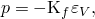

where 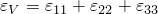 is the volumetric strain. Both the bulk modulus  and the density  of an acoustic medium must be defined.

The bulk modulus  can be defined as a function of temperature and field variables but does not vary in value during an implicit dynamic analysis using the subspace projection method (["Implicit dynamic analysis using direct integration," Section 6.3.2](pt03ch06s03at07.md)) or a direct-solution steady-state dynamic analysis (["Direct-solution steady-state dynamic analysis," Section 6.3.4](pt03ch06s03at09.md)); for these procedures the value of the bulk modulus at the beginning of the step is used.

| **Input File Usage: ** | Use both of the following options to define an acoustic medium: |
| --- | --- |
|  | ``` [*ACOUSTIC MEDIUM](../key/key-link.md#usb-kws-macousticmed), BULK MODULUS [*DENSITY](../key/key-link.md#usb-kws-mdensity) ``` |

| **Abaqus/CAE Usage: ** | Property module: material editor: ****Other****Acoustic Medium****: **Bulk Modulus******General****Density**** |
| --- | --- |

### Volumetric drag

Dissipation of energy (and attenuation of acoustic waves) may occur in an acoustic medium due to a variety of factors. Such dissipation effects are phenomenologically characterized in the frequency domain by the imaginary part of the propagation constant, which gives an exponential decay in amplitude as a function of distance. In Abaqus the simplest way to model this effect is through a “volumetric drag coefficient,”  (force per unit volume per velocity).

In frequency-domain procedures,  may be frequency dependent.  can be entered as a function of frequency—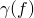, where *f* is the frequency in cycles per time (usually Hz)—in addition to temperature and/or field variables only when the acoustic medium is used in a steady-state dynamics procedure. If the acoustic medium is used in a direct-integration dynamic procedure (including Abaqus/Explicit), the volumetric drag coefficient is assumed to be independent of frequency and the first value entered for the current temperature and/or field variable is used. 

In all procedures except direct steady-state dynamics the gradient of  is assumed to be small.

| **Input File Usage: ** | ``` [*ACOUSTIC MEDIUM](../key/key-link.md#usb-kws-macousticmed), VOLUMETRIC DRAG ``` |
| --- | --- |

| **Abaqus/CAE Usage: ** | Property module: material editor: ****Other****Acoustic Medium****: **Volumetric Drag**: **Include volumetric drag** |
| --- | --- |

### Porous acoustic material models

Porous materials are commonly used to suppress acoustic waves; this attenuating effect arises from a number of effects as the acoustic fluid interacts with the solid matrix. For many categories of materials, the solid matrix can be approximated as either fully rigid compared to the acoustic fluid or fully limp. In these cases a mechanical model that resolves only acoustic waves will suffice. The acoustic behavior of porous materials can be modeled in a variety of ways in Abaqus/Standard. 

#### Craggs model

The model discussed in [Craggs (1978)](pt05ch26s03abm58.md#craggs78) is readily accommodated in Abaqus. Applying this model results in the dynamic equilibrium equation for the fluid expressed in this form:


where  is the real-valued resistivity,  is the real-valued dimensionless porosity,  is the dimensionless “structure factor,” and 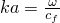 is the dimensionless wave number. This equation can be rewritten as


This model, therefore, can be applied straightforwardly in Abaqus by setting the material density equal to 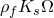, the volumetric drag equal to 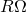, and the bulk modulus equal to 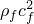. The Craggs model is supported for all acoustic procedures in Abaqus.

#### Delany-Bazley and Delany-Bazley-Miki models

Abaqus/Standard supports the well-known empirical model proposed in [Delany & Bazley (1970)](pt05ch26s03abm58.md#delany), which determines the material properties as a function of frequency and user-defined flow resistivity, ; density, ; and bulk modulus, . A variation on this model, proposed by [Miki (1990)](pt05ch26s03abm58.md#miki) is also available. These models are supported only for steady-state dynamic procedures.

Both models compute frequency-dependent material characteristic impedance, 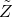, and wavenumber or propagation constant, 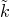, according to the following formula:


where 

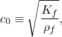

and

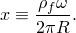

The constants are as given in the table below:

|  |  |  | 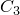 |  |  |  | 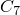 | 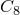 |
| --- | --- | --- | --- | --- | --- | --- | --- | --- |
| Delany- Bazley | 0.0978 | --0.7 | 0.189 | --0.595 | 0.0571 | --0.754 | 0.087 | --0.732 |
| Miki | 0.1227 | --0.618 | 0.1792 | --0.618 | 0.0786 | --0.632 | 0.1205 | --0.632 |

The material characteristic impedance and the wavenumber are converted internally to complex density and complex bulk modulus for use in Abaqus. The signs of the imaginary parts in these formulae are consistent with the Abaqus sign convention for time-harmonic dynamics.

| **Input File Usage: ** | ``` Use the following options to use the Delany-Bazley model: [*DENSITY](../key/key-link.md#usb-kws-mdensity) [*ACOUSTIC MEDIUM](../key/key-link.md#usb-kws-macousticmed), BULK MODULUS [*ACOUSTIC MEDIUM](../key/key-link.md#usb-kws-macousticmed), POROUS MODEL=DELANY BAZLEY Use the following options to use the Miki model: [*DENSITY](../key/key-link.md#usb-kws-mdensity) [*ACOUSTIC MEDIUM](../key/key-link.md#usb-kws-macousticmed), BULK MODULUS [*ACOUSTIC MEDIUM](../key/key-link.md#usb-kws-macousticmed), POROUS MODEL=MIKI ``` |
| --- | --- |

| **Abaqus/CAE Usage: ** | Porous acoustic material models are not supported in Abaqus/CAE. |
| --- | --- |

#### General frequency-dependent models

For steady-state dynamic procedures, Abaqus/Standard supports general frequency-dependent complex bulk modulus and complex density. Using these parameters, data from a wide range of models can be accommodated in an analysis; for example, see [Allard, et. al (1998)](pt05ch26s03abm58.md#allard98), [Attenborough (1982)](pt05ch26s03abm58.md#atten82), [Song & Bolton (1999)](pt05ch26s03abm58.md#song99), and [Wilson (1993)](pt05ch26s03abm58.md#wilson93). These models are used in a variety of applications, such as ocean acoustics, aerospace, automotive, and architectural acoustic engineering. 

The signs of these parameters must be consistent with the sign conventions used in Abaqus, and with conservation of energy. Abaqus uses a Fourier transform pair formally equivalent to assuming 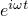 time dependence. Consequently, the real parts of the density and bulk modulus are positive for all values of frequency, the imaginary part of the bulk modulus must be positive, and the imaginary part of the density must be negative.

A linear isotropic acoustic material can be fully described with the two frequency-dependent parameters: bulk modulus, 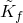, and density, 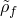. It is common, however, to encounter materials defined in terms of other parameter pairs, such as characteristic impedance, , wave number or propagation constant, , or speed of sound, . Data defined with the pair 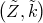 or 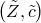 can be converted into the complex density and bulk modulus form, beginning from the following standard formulae:

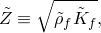


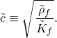

Consistent with the Abaqus sign conventions, the real parts of  and  must be positive; the imaginary part of  must be negative, and the imaginary part of  must be positive. In commonly observed materials, the ratio of the magnitude of the imaginary part to the real part for each of these constants is usually much less than one.

| **Input File Usage: ** | ``` Use the following option to use the general frequency-dependent model: [*ACOUSTIC MEDIUM](../key/key-link.md#usb-kws-macousticmed), COMPLEX BULK MODULUS [*ACOUSTIC MEDIUM](../key/key-link.md#usb-kws-macousticmed), COMPLEX DENSITY ``` |
| --- | --- |
|  | If desired, either complex material option can be used instead in conjunction with a real-valued, frequency-independent material option: ``` [*ACOUSTIC MEDIUM](../key/key-link.md#usb-kws-macousticmed), COMPLEX BULK MODULUS [*DENSITY](../key/key-link.md#usb-kws-mdensity) ``` or, alternatively, ``` [*ACOUSTIC MEDIUM](../key/key-link.md#usb-kws-macousticmed), BULK MODULUS [*ACOUSTIC MEDIUM](../key/key-link.md#usb-kws-macousticmed), COMPLEX DENSITY ``` |

| **Abaqus/CAE Usage: ** | General frequency-dependent acoustic material models are not supported in Abaqus/CAE. |
| --- | --- |

##### Conversion from complex material impedance and wavenumber

Since 


and 


the real and imaginary parts of  are, respectively:

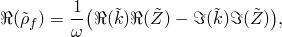


and the real and imaginary parts of  are, respectively:

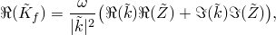

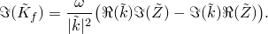

. 

##### Conversion from complex impedance and speed of sound

Since 

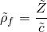

and 

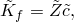

the real and imaginary parts of  are, respectively:

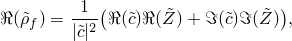


and the real and imaginary parts of  are, respectively: 

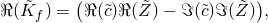


. 

### Fluid cavitation

In general, fluids cannot withstand any significant tensile stress and are likely to undergo large volume expansion when the absolute pressure is close to or less than zero. Abaqus/Explicit allows modeling of this phenomenon through a cavitation pressure limit for the acoustic medium. When the fluid absolute pressure (sum of the dynamic and initial static pressures) reduces to this limit, the fluid undergoes free volume expansion (i.e., cavitation), without a further drop in the pressure. If this limit is not defined, the fluid is assumed not to undergo cavitation even under a tensile, negative absolute pressure, condition.

The constitutive behavior for an acoustic medium capable of undergoing cavitation can be stated as 

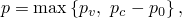

where a pseudo-pressure , a measure of the volumetric strain, is defined as 


where  is the fluid cavitation limit and   is the initial acoustic static pressure. A total wave formulation is used for a nonlinear acoustic medium undergoing cavitation. This formulation is very similar to the scattered wave formulation except that the pseudo-pressure, defined as the product of the bulk modulus and the compressive volumetric strain, plays the role of the material state variable instead of the acoustic dynamic pressure and the acoustic dynamic pressure is readily available from this pseudo-pressure subject to the cavitation condition.

| **Input File Usage: ** | ``` [*ACOUSTIC MEDIUM](../key/key-link.md#usb-kws-macousticmed), CAVITATION LIMIT ``` |
| --- | --- |

| **Abaqus/CAE Usage: ** | Fluid cavitation is not supported in Abaqus/CAE. |
| --- | --- |

#### Defining the wave formulation

In the presence of cavitation in Abaqus/Explicit the fluid mechanical behavior is nonlinear. Hence, for an acoustic problem with incident wave loading and possible cavitation in the fluid, the scattered wave formulation, which provides a solution for only a scattered wave dynamic acoustic pressure, may not be appropriate. For these cases the total wave formulation, which solves for the total dynamic acoustic pressure, should be selected. See ["Acoustic and shock loads," Section 34.4.6](pt07ch34s04aus125.md), for details.

| **Input File Usage: ** | ``` [*ACOUSTIC WAVE FORMULATION](../key/key-link.md#usb-kws-macousticwaveform), TYPE=TOTAL WAVE ``` |
| --- | --- |

| **Abaqus/CAE Usage: ** | Any module: ****Model****Edit Attributes*****model_name*****. Toggle on **Specify acoustic wave formulation**: **Total wave** |
| --- | --- |

#### Defining the initial acoustic static pressure

Cavitation occurs when the absolute pressure reaches the cavitation limit value. Abaqus/Explicit allows for an initial linearly varying hydrostatic pressure in the fluid medium (see ["Defining initial acoustic static pressure" in "Initial conditions in Abaqus/Standard and Abaqus/Explicit," Section 34.2.1](pt07ch34s02aus116.md#usb-prc-pinitialcond-acousticstaticpressure)). You can specify pressure values at two locations and a node set of the acoustic medium nodes. Abaqus/Explicit interpolates from these data to initialize the static pressure at all the nodes in the specified node set. If the pressure at only one location is specified, the hydrostatic pressure in the fluid is assumed to be uniform. The acoustic static pressure is used only for determining the cavitation status of the acoustic element nodes and does not apply any static loads to the acoustic or structural mesh at their common wetted interface. 

| **Input File Usage: ** | ``` [*INITIAL CONDITIONS](../key/key-link.md#usb-kws-minitialcond), TYPE=ACOUSTIC STATIC PRESSURE ``` |
| --- | --- |

| **Abaqus/CAE Usage: ** | Initial acoustic pressures are not supported in Abaqus/CAE. |
| --- | --- |

### Defining a steady flow field

Acoustic finite elements can be used to simulate time-harmonic wave propagation and natural frequency analysis in the presence of a steady mean flow of the medium. For example, air may move at a speed large enough to affect the propagation speed of waves in the direction of flow and against it. These effects are modeled in Abaqus/Standard by specifying an acoustic flow velocity during the linear perturbation analysis step definition; you do not need to alter the acoustic material properties. See ["Acoustic, shock, and coupled acoustic-structural analysis," Section 6.10.1](pt03ch06s10at29.md), for details.

### Elements

An acoustic material definition can be used only with the acoustic elements in Abaqus (see ["Choosing the appropriate element for an analysis type," Section 27.1.3](pt06ch27s01aus112.md)). 

In Abaqus/Standard second-order acoustic elements are more accurate than first-order elements. Use at least six nodes per wavelength  in the acoustic medium to obtain accurate results.

### Output

Nodal output variable POR (pressure magnitude) is available for an acoustic medium in Abaqus (in Abaqus/CAE this output variable is called PAC). When the scattered wave formulation is used with incident wave loading in Abaqus/Explicit, output variable POR represents only the scattered pressure response of the model and does not include the incident wave loading itself. When the total wave formulation is used, output variable POR represents the total dynamic acoustic pressure, which includes contributions from both incident and scattered waves as well as the dynamic effects of fluid cavitation. For either formulation output variable POR does not include the acoustic static pressure, which is used only to evaluate the cavitation status in the acoustic medium.

In addition, in Abaqus/Standard nodal output variable PPOR (the pressure phase) is available for an acoustic medium. In Abaqus/Explicit nodal output variable PABS (the absolute pressure, equal to the sum of POR and the acoustic static pressure) is available for an acoustic medium.

#### Additional references

- Allard, J. F., M. Henry, J. Tizianel, L. Kelders, and W. Lauriks, "Sound Propagation in Air-Saturated Random Packings of Beads," Journal of the Acoustical Society of America, vol. 104, no.4 2004, 1998.
- Attenborough, K. F., "Acoustical Characterisitics of Rigid Fibrous Absorbents and Granular Materials," Journal of the Acoustical Society of America, vol. 73, no.3 785, 1982.
- Craggs, A., "A Finite Element Model for Rigid Porous Absorbing Materials," Journal of Sound and Vibration, vol. 61, no.1 101, 1978.
- Craggs, A., "Coupling of Finite Element Acoustic Absorption Models," Journal of Sound and Vibration, vol. 66, no.4 605, 1979.
- Delany, M. E., and E. N. Bazley, "Acoustic Properties of Fibrous Absorbent Materials," Applied Acoustics, vol. 3 105, 1970.
- Miki, Y., "Acoustical Properties of Porous Materials - Modifications of Delany-Bazley Models," Journal of the Acoustical Society of Japan (E), vol. 11, no.1 19, 1990.
- Song, B. H., and J. S. Bolton, "A Transfer-Matrix Approach for Estimating the Characteristic Impedance and Wavenumbers of Limp and Rigid Porous Materials," Journal of the Acoustical Society of America, vol. 107, no.3 1131, 1999.
- Wilson, D. K., "Relaxation-Matched Modeling of Propagation through Porous Media, Including Fractal Pore Structure," Journal of the Acoustical Society of America, vol. 94, no.2 1136, 1993.


