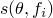
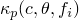
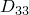
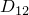
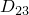
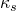

# 26.4.1 Diffusivity


**Products: **Abaqus/Standard  Abaqus/CAE  

##### **References**

- ["Mass diffusion analysis," Section 6.9.1](pt03ch06s09at28.md)
- ["Material library: overview," Section 21.1.1](pt05ch21s01abo18.md)
- [*DIFFUSIVITY](../key/key-link.md#usb-kws-mdiffusivity)
- [*KAPPA](../key/key-link.md#usb-kws-mkappa)
- ["Defining mass diffusion," Section 12.12.2 of the Abaqus/CAE User's Guide](../usi/usi-link.md#usi-prp-other-massdiffusion)

### Overview

Diffusivity:
- defines the diffusion or movement of one material through another, such as the diffusion of hydrogen through a metal;
- must always be defined for mass diffusion analysis;
- must be defined in conjunction with ["Solubility," Section 26.4.2](pt05ch26s04abm60.md);
- can be defined as a function of concentration, temperature, and/or predefined field variables;
- can be used in conjunction with a "Soret effect" factor to introduce mass diffusion caused by temperature gradients;
- can be used in conjunction with a pressure stress factor to introduce mass diffusion caused by gradients of equivalent pressure stress (hydrostatic pressure); and
- can produce a nonlinear mass diffusion analysis when dependence on concentration is included (the same can be said for the Soret effect factor and the pressure stress factor).

### Defining diffusivity

Diffusivity is the relationship between the concentration flux, , of the diffusing material and the gradient of the chemical potential that is assumed to drive the mass diffusion process. Either general mass diffusion behavior or Fick's diffusion law can be used to define diffusivity, as discussed below.

#### General chemical potential

Diffusive behavior provides the following general chemical potential: 


where 


is the diffusivity;



is the solubility (see ["Solubility," Section 26.4.2](pt05ch26s04abm60.md));


is the Soret effect factor, providing diffusion because of temperature gradient (see below);



is the pressure stress factor, providing diffusion because of the gradient of the equivalent pressure stress (see below);


is the normalized concentration;

*c*

is the concentration of the diffusing material;


is the temperature;


is the temperature at absolute zero (see below);


is the equivalent pressure stress; and


are any predefined field variables.

| **Input File Usage: ** | ``` [*DIFFUSIVITY](../key/key-link.md#usb-kws-mdiffusivity), LAW=GENERAL (default) ``` |
| --- | --- |

| **Abaqus/CAE Usage: ** | Property module: material editor: ****Other****Mass Diffusion****Diffusivity****: **Law: General** |
| --- | --- |

#### Fick's law

An extended form of Fick's law can be used as an alternative to the general chemical potential: 


| **Input File Usage: ** | ``` [*DIFFUSIVITY](../key/key-link.md#usb-kws-mdiffusivity), LAW=FICK ``` |
| --- | --- |

| **Abaqus/CAE Usage: ** | Property module: material editor: ****Other****Mass Diffusion****Diffusivity****: **Law: Fick** |
| --- | --- |

### Directional dependence of diffusivity

Isotropic, orthotropic, or fully anisotropic diffusivity can be defined. For non-isotropic diffusivity a local orientation of the material directions must be specified (see ["Orientations," Section 2.2.5](pt01ch02s02aus15.md)).

#### Isotropic diffusivity

For isotropic diffusivity only one value of diffusivity is needed at each concentration, temperature, and field variable value.

| **Input File Usage: ** | ``` [*DIFFUSIVITY](../key/key-link.md#usb-kws-mdiffusivity), TYPE=ISO ``` |
| --- | --- |

| **Abaqus/CAE Usage: ** | Property module: material editor: ****Other****Mass Diffusion****Diffusivity****: **Type: Isotropic** |
| --- | --- |

#### Orthotropic diffusivity

For orthotropic diffusivity three values of diffusivity (, , ) are needed at each concentration, temperature, and field variable value.

| **Input File Usage: ** | ``` [*DIFFUSIVITY](../key/key-link.md#usb-kws-mdiffusivity), TYPE=ORTHO ``` |
| --- | --- |

| **Abaqus/CAE Usage: ** | Property module: material editor: ****Other****Mass Diffusion****Diffusivity****: **Type: Orthotropic** |
| --- | --- |

#### Anisotropic diffusivity

For fully anisotropic diffusivity six values of diffusivity (, , , , , ) are needed at each concentration, temperature, and field variable value.

| **Input File Usage: ** | ``` [*DIFFUSIVITY](../key/key-link.md#usb-kws-mdiffusivity), TYPE=ANISO ``` |
| --- | --- |

| **Abaqus/CAE Usage: ** | Property module: material editor: ****Other****Mass Diffusion****Diffusivity****: **Type: Anisotropic** |
| --- | --- |

### Temperature-driven mass diffusion

The Soret effect factor, , governs temperature-driven mass diffusion. It can be defined as a function of concentration, temperature, and/or field variables in the context of the constitutive equation presented above. The Soret effect factor cannot be specified in conjunction with Fick's law since it is calculated automatically in this case (see ["Mass diffusion analysis," Section 6.9.1](pt03ch06s09at28.md)).

| **Input File Usage: ** | Use both of the following options to specify general temperature-driven mass diffusion: |
| --- | --- |
|  | ``` [*DIFFUSIVITY](../key/key-link.md#usb-kws-mdiffusivity), LAW=GENERAL [*KAPPA](../key/key-link.md#usb-kws-mkappa), TYPE=TEMP ``` Use the following option to specify temperature-driven diffusion governed by Fick's law: ``` [*DIFFUSIVITY](../key/key-link.md#usb-kws-mdiffusivity), LAW=FICK ``` |

| **Abaqus/CAE Usage: ** | Use the following options to specify general temperature-driven mass diffusion: |
| --- | --- |
|  | Property module: material editor: ****Other****Mass Diffusion****Diffusivity****: **Law: General**: ****Suboptions****Soret Effect**** Use the following option to specify temperature-driven diffusion governed by Fick's law: Property module: material editor: ****Other****Mass Diffusion****Diffusivity****: **Law: Fick** |

### Pressure stress-driven mass diffusion

The pressure stress factor, , governs mass diffusion driven by the gradient of the equivalent pressure stress. It can be defined as a function of concentration, temperature, and/or field variables in the context of the constitutive equation presented above.

| **Input File Usage: ** | Use both of the following options: |
| --- | --- |
|  | ``` [*DIFFUSIVITY](../key/key-link.md#usb-kws-mdiffusivity), LAW=GENERAL [*KAPPA](../key/key-link.md#usb-kws-mkappa), TYPE=PRESS ``` |

| **Abaqus/CAE Usage: ** | Property module: material editor: ****Other****Mass Diffusion****Diffusivity****: **Law: General**: ****Suboptions****Pressure Effect**** |
| --- | --- |

### Mass diffusion driven by both temperature and pressure stress

Specifying both  and  causes gradients of temperature and equivalent pressure stress to drive mass diffusion.

| **Input File Usage: ** | Use all of the following options to specify general diffusion driven by gradients of temperature and pressure stress: |
| --- | --- |
|  | ``` [*DIFFUSIVITY](../key/key-link.md#usb-kws-mdiffusivity), LAW=GENERAL [*KAPPA](../key/key-link.md#usb-kws-mkappa), TYPE=TEMP [*KAPPA](../key/key-link.md#usb-kws-mkappa), TYPE=PRESS ``` Use both of the following options to specify diffusion driven by the extended form of Fick's law: ``` [*DIFFUSIVITY](../key/key-link.md#usb-kws-mdiffusivity), LAW=FICK [*KAPPA](../key/key-link.md#usb-kws-mkappa), TYPE=PRESS ``` |

| **Abaqus/CAE Usage: ** | Use the following options to specify general diffusion driven by gradients of temperature and pressure stress: |
| --- | --- |
|  | Property module: material editor: ****Other****Mass Diffusion****Diffusivity****: **Law: General**: ****Suboptions****Soret Effect**** and ****Suboptions****Pressure Effect**** Use the following options to specify diffusion driven by the extended form of Fick's law: Property module: material editor: ****Other****Mass Diffusion****Diffusivity****: **Law: Fick**: ****Suboptions****Pressure Effect**** |

### Specifying the value of absolute zero

You can specify the value of absolute zero as a physical constant.

| **Input File Usage: ** | ``` [*PHYSICAL CONSTANTS](../key/key-link.md#usb-kws-mphysicalconsts), ABSOLUTE ZERO= ``` |
| --- | --- |

| **Abaqus/CAE Usage: ** | Any module: ****Model****Edit Attributes*****model_name*****: **Absolute zero temperature** |
| --- | --- |

### Elements

The mass diffusion law can be used only with the two-dimensional, three-dimensional, and axisymmetric solid elements that are included in the heat transfer/mass diffusion element library.


