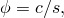

# 26.4.2 Solubility


**Products: **Abaqus/Standard  Abaqus/CAE  

##### **References**

- ["Mass diffusion analysis," Section 6.9.1](pt03ch06s09at28.md)
- ["Material library: overview," Section 21.1.1](pt05ch21s01abo18.md)
- [*SOLUBILITY](../key/key-link.md#usb-kws-msolubility)
- ["Defining solubility" in "Defining mass diffusion," Section 12.12.2 of the Abaqus/CAE User's Guide](../usi/usi-link.md#usi-prp-other-massdiffusion-solubility)

### Overview

Solubility:
- is needed only for mass diffusion analysis;
- is also known as Sievert's parameter (in Sievert's law);
- must always accompany a diffusivity definition (see ["Diffusivity," Section 26.4.1](pt05ch26s04abm59.md)); and
- can be defined as a function of temperature and/or predefined field variables.

### Defining solubility

Solubility, *s*, is used to define the “normalized concentration,” , of the diffusing phase in a mass diffusion process: 



where *c* is the concentration. The normalized concentration is often also referred to as the “activity” of the diffusing material, and the gradients of the normalized concentration, along with gradients of temperature and pressure stress, drive the diffusion process (see ["Diffusivity," Section 26.4.1](pt05ch26s04abm59.md)).

| **Input File Usage: ** | ``` [*SOLUBILITY](../key/key-link.md#usb-kws-msolubility) ``` |
| --- | --- |

| **Abaqus/CAE Usage: ** | Property module: material editor: ****Other****Mass Diffusion****Solubility**** |
| --- | --- |

### Elements

The mass diffusion law can be used only with the two-dimensional, three-dimensional, and axisymmetric solid elements that are included in the heat transfer/mass diffusion element library.


