# 26.5.2 Piezoelectric behavior


**Products: **Abaqus/Standard  Abaqus/CAE  

##### **References**

- ["Piezoelectric analysis," Section 6.7.2](pt03ch06s07at21.md)
- ["Material library: overview," Section 21.1.1](pt05ch21s01abo18.md)
- [*DIELECTRIC](../key/key-link.md#usb-kws-mdielectric)
- [*PIEZOELECTRIC](../key/key-link.md#usb-kws-mpiezoelect)
- ["Defining dielectric material properties," Section 12.11.2 of the Abaqus/CAE User's Guide](../usi/usi-link.md#usi-prp-electrical-dielectric)
- ["Defining piezoelectric properties," Section 12.11.3 of the Abaqus/CAE User's Guide](../usi/usi-link.md#usi-prp-electrical-piezoelectric)

### Overview

A piezoelectric material:
- is one in which an electrical field causes the material to strain, while stress causes an electric potential gradient;
- provides linear relations between mechanical and electrical fields; and
- is used in piezoelectric elements, which have both displacement and electrical potential as nodal variables.

### Defining a piezoelectric material

A piezoelectric material responds to an electric potential gradient by straining, while stress causes an electric potential gradient in the material. This coupling between electric potential gradient and strain is the material's piezoelectric property. The material will also have a dielectric property so that an electrical charge exists when the material has a potential gradient. Piezoelectric material behavior is discussed in ["Piezoelectric analysis," Section 2.10.1 of the Abaqus Theory Guide](../stm/stm-link.md#stm-anl-piezoelectric).

The mechanical properties of the material must be modeled by linear elasticity (["Linear elastic behavior," Section 22.2.1](pt05ch22s02abm02.md)). The mechanical behavior can be defined by 

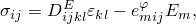

in terms of the piezoelectric stress coefficient matrix, 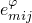, or by 

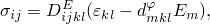

in terms of the piezoelectric strain coefficient matrix, . The electrical behavior is defined by 


where

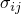

is the mechanical stress tensor;


is the strain tensor;


is the electric “displacement” vector;


is the material's elastic stiffness matrix defined at zero electrical potential gradient (short circuit condition);


is the material's piezoelectric stress coefficient matrix, defining the stress  caused by the electrical potential gradient 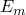 in a fully constrained material (it can also be interpreted as the electrical displacement  caused by the applied strain  at a zero electrical potential gradient);


is the material's piezoelectric strain coefficient matrix, defining the strain 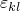 caused by the electrical potential gradient  in an unconstrained material (an alternative interpretation is given later in this section);


is the electrical potential;


is the material's dielectric property, defining the relation between the electric displacement  and the electric potential gradient 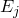 for a fully constrained material; and


is the electrical potential gradient vector, .

The material's electrical and electro-mechanical coupling behaviors are, thus, defined by its dielectric property, , and its piezoelectric stress coefficient matrix, , or its piezoelectric strain coefficient matrix, . These properties are defined as part of the material definition (["Material data definition," Section 21.1.2](pt05ch21s01aus109.md)).

### Alternative forms of the constitutive equations

Alternative forms of the piezoelectric constitutive equations are presented in this section. These forms of the equations involve material properties that cannot be used directly as input for Abaqus/Standard. However, they are related to the Abaqus/Standard input through simple relations that are presented in ["Piezoelectric analysis," Section 2.10.1 of the Abaqus Theory Guide](../stm/stm-link.md#stm-anl-piezoelectric). The intent of this section is to draw connections between the Abaqus/Standard terminology and input to that used commonly in the piezoelectricity community. The mechanical behavior can also be defined by

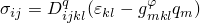

in terms of the piezoelectric coefficient matrix 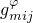, and the stiffness matrix 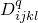, which defines the mechanical properties at zero electrical displacement (open circuit condition). Likewise, the electrical behavior can also be defined by 

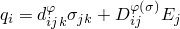

 in terms of the dielectric matrix  for an unconstrained material or by 

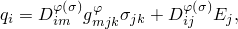

where


is the material's elastic stiffness matrix defined at zero electrical displacement;


is the material's piezoelectric strain coefficient matrix used earlier, and based on the equations, may alternatively be interpreted as the electrical displacement  caused by the stress 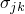 at zero electrical potential gradient;

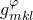

is the material's piezoelectric coefficient matrix, which can be interpreted as defining either the strain  caused by the electrical displacement  in an unconstrained material or the electrical potential gradient  caused by the stress  at zero electrical displacement; and


is the material's dielectric property, defining the relation between the electric displacement  and the electric potential gradient  for an unconstrained material.

These are useful relationships that are often seen in the piezoelectric literature. In ["Piezoelectric analysis," Section 2.10.1 of the Abaqus Theory Guide](../stm/stm-link.md#stm-anl-piezoelectric), the properties , , and  are expressed in terms of the properties , , and , that are used as input for Abaqus/Standard.

### Specifying dielectric material properties

The dielectric matrix can be isotropic, orthotropic, or fully anisotropic. For non-isotropic dielectric materials a local orientation for the material directions must be specified (["Orientations," Section 2.2.5](pt01ch02s02aus15.md)). The entries of the dielectric matrix (what are referred to as “dielectric constants” in Abaqus) refer to what is more commonly known in the literature as the permittivity of the material.

#### Isotropic dielectric properties

The dielectric matrix  can be fully isotropic, so that 

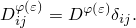

You specify the single value 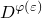 for the dielectric constant.  must be determined for a constrained material. Isotropic behavior is the default.

| **Input File Usage: ** | ``` [*DIELECTRIC](../key/key-link.md#usb-kws-mdielectric), TYPE=ISO ``` |
| --- | --- |

| **Abaqus/CAE Usage: ** | Property module: material editor: ****Electrical/Magnetic****Dielectric (Electrical Permittivity)****: **Type: Isotropic** |
| --- | --- |

#### Orthotropic dielectric properties

For orthotropic behavior you must specify three values in the dielectric matrix (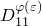, 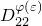, and 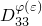).

| **Input File Usage: ** | ``` [*DIELECTRIC](../key/key-link.md#usb-kws-mdielectric), TYPE=ORTHO ``` |
| --- | --- |

| **Abaqus/CAE Usage: ** | Property module: material editor: ****Electrical/Magnetic****Dielectric (Electrical Permittivity)****: **Type: Orthotropic** |
| --- | --- |

#### Anisotropic dielectric properties

For fully anisotropic behavior you must specify six values in the dielectric matrix (, 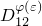, , 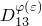, 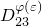, and ).

| **Input File Usage: ** | ``` [*DIELECTRIC](../key/key-link.md#usb-kws-mdielectric), TYPE=ANISO ``` |
| --- | --- |

| **Abaqus/CAE Usage: ** | Property module: material editor: ****Electrical/Magnetic****Dielectric (Electrical Permittivity)****: **Type: Anisotropic** |
| --- | --- |

### Specifying piezoelectric material properties

The piezoelectric material properties can be defined by giving the stress coefficients,  (this is the default), or by giving the strain coefficients, . In either case, 18 components must be given in the following order (substitute *d* for *e* for strain coefficients): 


The first index on these coefficients refers to the component of electric displacement (sometimes called the electric flux), while the last pair of indices refers to the component of mechanical stress or strain.

Thus, the piezoelectric components causing electrical displacement in the 1-direction are all given first, then those causing electrical displacement in the 2-direction, and then those causing electrical displacement in the 3-direction. (Some references list these coupling terms in a different order.)

| **Input File Usage: ** | Use the following option to give the stress coefficients: |
| --- | --- |
|  | ``` [*PIEZOELECTRIC](../key/key-link.md#usb-kws-mpiezoelect), TYPE=S ``` Use the following option to give the strain coefficients: ``` [*PIEZOELECTRIC](../key/key-link.md#usb-kws-mpiezoelect), TYPE=E ``` |

| **Abaqus/CAE Usage: ** | Property module: material editor: ****Electrical/Magnetic****Piezoelectric****: **Type: Stress** or **Strain** |
| --- | --- |

#### Converting double index notation to triple index notation

Industry-supplied piezoelectric data often use a double index notation. A double index notation can be converted easily to the required triple index notation in Abaqus/Standard by noting the convention followed in Abaqus for the correspondence between (second-order) tensor and vector notations: the 11, 22, 33, 12, 13, and 23 components of the tensor correspond to the 1, 2, 3, 4, 5, and 6 components, respectively, of the corresponding vector.

### Energy balance considerations

Abaqus does not account for piezoelectric effects in the total energy balance equation, which can lead to an apparent imbalance of the total energy of the model in some situations. For example, if a piezoelectric truss is fixed at one end point and subjected to a potential difference between its two end points, it deforms due to the piezoelectric effect. Subsequently if the truss is held fixed in this deformed configuration and the potential difference removed, strain energy will be generated due to the constraints. This results in an equivalent increase in the total energy of the model.

### Elements

Piezoelectric coupling is active only in piezoelectric elements (those with displacement degrees of freedom and electrical potential degree of freedom 9). See ["Choosing the appropriate element for an analysis type," Section 27.1.3](pt06ch27s01aus112.md).


