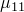
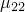
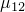
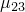
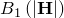

# 26.5.3 Magnetic permeability


**Products: **Abaqus/Standard  Abaqus/CAE  

##### **References**

- ["Material library: overview," Section 21.1.1](pt05ch21s01abo18.md)
- [*MAGNETIC PERMEABILITY](../key/key-link.md#usb-kws-mmagpermeability)
- [*NONLINEAR BH](../key/key-link.md#usb-kws-mnonlinearbh)
- [*PERMANENT MAGNETIZATION](../key/key-link.md#usb-kws-mpermanentmagnetization)
- ["Defining magnetic permeability," Section 12.11.4 of the Abaqus/CAE User's Guide](../usi/usi-link.md#usi-prp-electrical-magneticpermeability)

### Overview

A material's magnetic permeability:
- must be defined for ["Eddy current analysis," Section 6.7.5](pt03ch06s07at24.md), and ["Magnetostatic analysis," Section 6.7.6](pt03ch06s07at25.md);
- can be specified directly for linear magnetic behavior or through one or more B--H curves for nonlinear magnetic behavior;
- can be isotropic, orthotropic, or (in the case of linear behavior) fully anisotropic;
- can be specified as a function of temperature and/or field variables;
- can be specified as a function of frequency in a time-harmonic eddy current procedure; and
- can be combined with permanent magnetization.

### Linear magnetic behavior

Linear magnetic behavior is defined by direct specification of magnetic permeability.

#### Directional dependence of magnetic permeability

Isotropic, orthotropic, or fully anisotropic magnetic permeability can be defined. For non-isotropic magnetic permeability a local orientation for the material directions must be specified (["Orientations," Section 2.2.5](pt01ch02s02aus15.md)).

##### Isotropic magnetic permeability

For isotropic magnetic permeability only one value of magnetic permeability is needed at each temperature and field variable value. Isotropic magnetic permeability is the default.

| **Input File Usage: ** | ``` [*MAGNETIC PERMEABILITY](../key/key-link.md#usb-kws-mmagpermeability), TYPE=ISOTROPIC ``` |
| --- | --- |

| **Abaqus/CAE Usage: ** | Property module: material editor: ****Electrical/Magnetic****Magnetic Permeability****: **Type: Isotropic** |
| --- | --- |

##### Orthotropic magnetic permeability

For orthotropic magnetic permeability three values of magnetic permeability (, , ) are needed at each temperature and field variable value.

| **Input File Usage: ** | ``` [*MAGNETIC PERMEABILITY](../key/key-link.md#usb-kws-mmagpermeability), TYPE=ORTHOTROPIC ``` |
| --- | --- |

| **Abaqus/CAE Usage: ** | Property module: material editor: ****Electrical/Magnetic****Magnetic Permeability****: **Type: Orthotropic** |
| --- | --- |

##### Anisotropic magnetic permeability

For fully anisotropic magnetic permeability six values (, , , , , ) are needed at each temperature and field variable value.

| **Input File Usage: ** | ``` [*MAGNETIC PERMEABILITY](../key/key-link.md#usb-kws-mmagpermeability), TYPE=ANISOTROPIC ``` |
| --- | --- |

| **Abaqus/CAE Usage: ** | Property module: material editor: ****Electrical/Magnetic****Magnetic Permeability****: **Type: Anisotropic** |
| --- | --- |

#### Frequency-dependent magnetic permeability

Magnetic permeability can be defined as a function of frequency in a time-harmonic eddy current analysis.

| **Input File Usage: ** | ``` [*MAGNETIC PERMEABILITY](../key/key-link.md#usb-kws-mmagpermeability), FREQUENCY ``` |
| --- | --- |

| **Abaqus/CAE Usage: ** | Property module: material editor: ****Electrical/Magnetic****Magnetic Permeability****: Toggle on **Use frequency-dependent data** |
| --- | --- |

### Nonlinear magnetic behavior

Nonlinear magnetic behavior is characterized by magnetic permeability that depends on the strength of the magnetic field. The nonlinear magnetic material model in Abaqus is suitable for ideally soft magnetic materials without any hysteresis effects (see [Figure 26.5.3--1](pt05ch26s05abm63.md#cmagpermeability-hardsoft)) characterized by a monotonically increasing response in B–H space, where B and H refer to the strengths of the magnetic flux density vector and the magnetic field vector, respectively. Nonlinear magnetic behavior is defined through direct specification of one or more B–H curves that provide B as a function of H and, optionally, temperature and/or predefined field variables, in one or more directions. Nonlinear magnetic behavior can be isotropic, orthotropic, or transversely isotropic (which is a special case of the more general orthotropic behavior). More than one B–H curve is needed to define the nonlinear magnetic behavior if it is not isotropic.

#### Directional dependence of nonlinear magnetic behavior

Isotropic, orthotropic, or transversely isotropic nonlinear magnetic behavior can be defined. For non-isotropic nonlinear magnetic behavior a local orientation for the material directions must be specified (["Orientations," Section 2.2.5](pt01ch02s02aus15.md)).

##### Isotropic nonlinear magnetic behavior

For isotropic nonlinear magnetic response only one B–H curve is needed at each temperature and field variable value. Isotropic magnetic permeability is the default. Abaqus assumes that the nonlinear magnetic behavior is governed by


| **Input File Usage: ** | You define  through a B--H curve: |
| --- | --- |
|  | ``` [*MAGNETIC PERMEABILITY](../key/key-link.md#usb-kws-mmagpermeability), NONLINEAR, TYPE=ISOTROPIC [*NONLINEAR BH](../key/key-link.md#usb-kws-mnonlinearbh), DIR=*direction* ``` The B--H curve in any direction (i.e., the nonlinear behavior in global direction 1, 2, or 3) will suffice as the nonlinear magnetic behavior is assumed to be the same in all directions. |

| **Abaqus/CAE Usage: ** | Property module: material editor: ****Electrical/Magnetic****Magnetic Permeability****: Toggle on **Specify using nonlinear B-H curve**: **Type: Isotropic** |
| --- | --- |

##### Orthotropic nonlinear magnetic behavior

For orthotropic nonlinear magnetic response three B–H curves (one curve to define the behavior in each of the local directions 1, 2, and 3) are needed at each temperature and field variable value. Abaqus assumes that the nonlinear magnetic behavior in the local material directions is governed by


where  refers to a diagonal matrix.

Transversely isotropic nonlinear magnetic behavior is a special case of orthotropic behavior, in which the behavior in any two directions is the same and is different from that in the third direction.

| **Input File Usage: ** | You define , , and , respectively, through three independent B--H curves, one in each of the directions 1, 2, and 3: |
| --- | --- |
|  | ``` [*MAGNETIC PERMEABILITY](../key/key-link.md#usb-kws-mmagpermeability), NONLINEAR, TYPE=ORTHOTROPIC [*NONLINEAR BH](../key/key-link.md#usb-kws-mnonlinearbh), DIR=1 … [*NONLINEAR BH](../key/key-link.md#usb-kws-mnonlinearbh), DIR=2 … [*NONLINEAR BH](../key/key-link.md#usb-kws-mnonlinearbh), DIR=3 … ``` |

| **Abaqus/CAE Usage: ** | Property module: material editor: ****Electrical/Magnetic****Magnetic Permeability****: Toggle on **Specify using nonlinear B-H curve**: **Type: Orthotropic** |
| --- | --- |

### Permanent magnetization

Ferromagnetic materials can be magnetized by placing them in a magnetic field, which is typically created by applying currents in a system of coil windings surrounding the material being magnetized. These materials can be classified into soft and hard magnetic materials (see [Figure 26.5.3--1](pt05ch26s05abm63.md#cmagpermeability-hardsoft)). Soft magnetic materials lose their magnetization after removal of the applied currents (see ["Nonlinear magnetic behavior](pt05ch26s05abm63.md#usb-cmagpermeabiltiy-nonlinear)”). Hard magnetic materials retain their magnetization permanently after removal of the applied currents. The leftover magnetization in a permanent magnet is called remanence, denoted by  in [Figure 26.5.3--2](pt05ch26s05abm63.md#cmagpermeability-hard). This magnetization can be removed by applying currents in the opposite direction; the strength of the opposing magnetic fields that remove magnetization entirely is called coercivity, denoted by  in [Figure 26.5.3--2](pt05ch26s05abm63.md#cmagpermeability-hard).

**Figure 26.5.3–1** Response of hard and soft magnetic materials.


**Figure 26.5.3–2** Remanence and coercivity in permanent magnets.


Permanent magnetization in Abaqus is suitable for hard magnetic materials when the magnets are operating around the point of remanence. This behavior captures the response of magnetization or demagnetization around the point of remanence, as shown by the darker descending line of the hysteresis loop in [Figure 26.5.3--2](pt05ch26s05abm63.md#cmagpermeability-hard). The underlying magnetic permeability can be linear or nonlinear. In either case, permanent magnetization is defined by its coercivity such that


 for linear isotropic, orthotropic, or anisotropic magnetic behavior and


 for nonlinear isotropic - response.

| **Input File Usage: ** | To specify permanent magnetization with underlying linear magnetic permeability: |
| --- | --- |
|  | ``` [*MAGNETIC PERMEABILITY](../key/key-link.md#usb-kws-mmagpermeability) [*PERMANENT MAGNETIZATION](../key/key-link.md#usb-kws-mpermanentmagnetization) *direction of magnetization in the global system* *magnitude of coercivity* ``` To specify permanent magnetization with underlying nonlinear magnetic permeability (nonlinear response of the left top portion of the hysteresis curve): ``` [*MAGNETIC PERMEABILITY](../key/key-link.md#usb-kws-mmagpermeability), NONLINEAR [*NONLINEAR BH](../key/key-link.md#usb-kws-mnonlinearbh) *input* - *by shifting the response to the right by*  [*PERMANENT MAGNETIZATION](../key/key-link.md#usb-kws-mpermanentmagnetization) *direction of magnetization in the global system* *magnitude of coercivity* ``` |

| **Abaqus/CAE Usage: ** | Permanent magnetization is not supported in Abaqus/CAE. |
| --- | --- |

### Elements

Magnetic material behavior is active only in electromagnetic elements (see ["Choosing the appropriate element for an analysis type," Section 27.1.3](pt06ch27s01aus112.md)).


