# 26.6.2 Permeability


**Products: **Abaqus/Standard  Abaqus/CFD  Abaqus/CAE  

##### **References**

- ["Pore fluid flow properties," Section 26.6.1](pt05ch26s06abo24.md)
- ["Material library: overview," Section 21.1.1](pt05ch21s01abo18.md)
- [*PERMEABILITY](../key/key-link.md#usb-kws-mpermeabil)
- ["Defining permeability" in "Defining a fluid-filled porous material," Section 12.12.3 of the Abaqus/CAE User's Guide](../usi/usi-link.md#usi-prp-other-porefluid-permeability-over)

### Overview

Permeability is the relationship between the volumetric flow rate per unit area of a particular wetting liquid through a porous medium and the gradient of the effective fluid pressure. It can be specified in Abaqus/Standard and Abaqus/CFD.

Permeability in Abaqus/Standard:
- must be specified for a wetting liquid for an effective stress/wetting liquid diffusion analysis (see ["Coupled pore fluid diffusion and stress analysis," Section 6.8.1](pt03ch06s08at26.md));
- is defined, in general, by Forchheimer's law, which accounts for changes in permeability as a function of fluid flow velocity; and
- can be isotropic, orthotropic, or fully anisotropic and can be given as a function of void ratio, saturation, temperature, and field variables.

Permeability in Abaqus/CFD:- must be specified for porous media flows (see ["Incompressible fluid dynamic analysis," Section 6.6.2](pt03ch06s06aus48.md)); and
- can be isotropic and specified as a function of porosity only or can be specified through the Carman-Kozeny permeability-porosity relation.

### Permeability in Abaqus/Standard

Permeability is defined for pore fluid flow.

#### Forchheimer's law

According to Forchheimer's law, high flow velocities have the effect of reducing the effective permeability and, therefore, “choking” pore fluid flow. As the fluid flow velocity reduces, Forchheimer's law approximates the well-known Darcy's law. Darcy's law can, therefore, be used directly in Abaqus/Standard by omitting the velocity-dependent term in Forchheimer's law.

Forchheimer's law is written as 

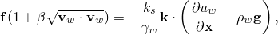

where


is the volumetric flow rate of wetting liquid per unit area of the porous medium (the effective velocity of the wetting liquid);

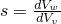

is the fluid saturation ( for a fully saturated medium,  for a completely dry medium);


is the porosity of the porous medium;


is the void ratio;

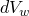

is the wetting fluid volume in the medium;


is the void volume in the medium;


is the volume of grains of solid material in the medium;


is the volume of trapped wetting liquid in the medium;

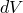

is the total volume of the medium;


is the fluid velocity;


is a “velocity coefficient,” which may be dependent on the void ratio of the material;


is the dependence of permeability on saturation of the wetting liquid such that 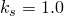 at ;

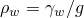

is the density of the fluid;


is the specific weight of the wetting liquid;

*g*

is the magnitude of the gravitational acceleration;


is the permeability of the fully saturated medium, which can be a function of void ratio (*e*, common in soil consolidation problems), temperature (), and/or field variables ();


is the wetting liquid pore pressure;


is position; and


is the gravitational acceleration.

#### Permeability definitions

Permeability can be defined in different ways by different authors; caution should, therefore, be used to ensure that the specified input data are consistent with the definitions used in Abaqus/Standard.

Permeability in Abaqus/Standard is defined as 

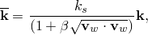

so that Forchheimer's law can also be written as 

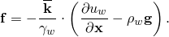

The fully saturated permeability, , is typically obtained from experiments under low fluid velocity conditions.  can be defined as a function of void ratio, *e*, (common in soil consolidation problems) and/or temperature, . The void ratio can be derived from the porosity, *n*, using the relationship . Up to six variables may be needed to define the fully saturated permeability, depending on whether isotropic, orthotropic, or fully anisotropic permeability is to be modeled (discussed below).

##### Alternative definition of permeability

Some authors refer to the definition of permeability used in Abaqus/Standard, 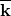 (units of ), as the “hydraulic conductivity” of the porous medium and define the permeability as 


where  is the kinematic viscosity of the wetting liquid (the ratio of the liquid's dynamic viscosity to its mass density), *g* is the magnitude of the gravitational acceleration, and  has dimensions  (or Darcy). If the permeability is available in this form, it must be converted such that the appropriate values of  are used in Abaqus/Standard.

#### Specifying the permeability

Permeability in Abaqus/Standard can be isotropic, orthotropic, or fully anisotropic. For non-isotropic permeability a local orientation (see ["Orientations," Section 2.2.5](pt01ch02s02aus15.md)) must be used to specify the material directions.

##### Isotropic permeability

For isotropic permeability in Abaqus/Standard define one value of the fully saturated permeability at each value of the void ratio.

| **Input File Usage: ** | ``` [*PERMEABILITY](../key/key-link.md#usb-kws-mpermeabil), TYPE=ISOTROPIC ``` |
| --- | --- |

| **Abaqus/CAE Usage: ** | Property module: material editor: ****Other****Pore Fluid****Permeability****: **Type: Isotropic** |
| --- | --- |

##### Orthotropic permeability

For orthotropic permeability in Abaqus/Standard define three values of the fully saturated permeability (, , and ) at each value of the void ratio.

| **Input File Usage: ** | ``` [*PERMEABILITY](../key/key-link.md#usb-kws-mpermeabil), TYPE=ORTHOTROPIC ``` |
| --- | --- |

| **Abaqus/CAE Usage: ** | Property module: material editor: ****Other****Pore Fluid****Permeability****: **Type: Orthotropic** |
| --- | --- |

##### Anisotropic permeability

For fully anisotropic permeability in Abaqus/Standard define six values of the fully saturated permeability (, , , , , and ) at each value of the void ratio.

| **Input File Usage: ** | ``` [*PERMEABILITY](../key/key-link.md#usb-kws-mpermeabil), TYPE=ANISOTROPIC ``` |
| --- | --- |

| **Abaqus/CAE Usage: ** | Property module: material editor: ****Other****Pore Fluid****Permeability****: **Type: Anisotropic** |
| --- | --- |

#### Velocity coefficient

Abaqus/Standard assumes that  by default, meaning that Darcy's law is used. If Forchheimer's law is required (),  must be defined in tabular form.

| **Input File Usage: ** | ``` [*PERMEABILITY](../key/key-link.md#usb-kws-mpermeabil), TYPE=VELOCITY ``` |
| --- | --- |
|  | This must be a repeated use of the [*PERMEABILITY](../key/key-link.md#usb-kws-mpermeabil) option for the same material, since  must also be defined. |

| **Abaqus/CAE Usage: ** | Property module: material editor: ****Other****Pore Fluid****Permeability****: ****Suboptions****Velocity Dependence**** |
| --- | --- |

#### Saturation dependence

In Abaqus/Standard you can define the dependence of permeability, , on saturation, *s*, by specifying . Abaqus/Standard assumes by default that 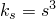 for 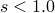;  for . The tabular definition of  must specify  for .

| **Input File Usage: ** | ``` [*PERMEABILITY](../key/key-link.md#usb-kws-mpermeabil), TYPE=SATURATION ``` |
| --- | --- |
|  | This must be a repeated use of the [*PERMEABILITY](../key/key-link.md#usb-kws-mpermeabil) option for the same material, since  must also be defined. |

| **Abaqus/CAE Usage: ** | Property module: material editor: ****Other****Pore Fluid****Permeability****: ****Suboptions****Saturation Dependence**** |
| --- | --- |

#### Specific weight of the wetting liquid

In Abaqus/Standard the specific weight of the fluid, , must be specified correctly even if the analysis does not consider the weight of the wetting liquid (i.e., if excess pore fluid pressure is calculated).

| **Input File Usage: ** | ``` [*PERMEABILITY](../key/key-link.md#usb-kws-mpermeabil), TYPE=*type*, SPECIFIC= ``` |
| --- | --- |
|  | The SPECIFIC parameter must be defined in conjunction with the fully saturated [*PERMEABILITY](../key/key-link.md#usb-kws-mpermeabil) option for a given medium. |

| **Abaqus/CAE Usage: ** | Property module: material editor: ****Other****Pore Fluid****Permeability****: **Specific weight of wetting liquid:**  |
| --- | --- |

### Permeability in Abaqus/CFD

For flows in fluid-saturated porous medium, the momentum equation in its simplest form can be written as

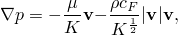

 where the first term on the right-hand side is the Darcy drag and the second term is the inertial drag (also called form drag or Forchheimer drag). In the above equation 


is the intrinsic average of the pressure (average taken over the fluid-phase only);


is the extrinsic or superficial velocity vector, where the average is taken over a representative volume incorporating both the solid (matrix) and the fluid phases;


is the density of the fluid;


is the viscosity of the fluid;


is the permeability of the porous medium (units of [L2](../popups/usb-int-iconventions-unitsym.md)); and

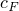

is the dimensionless inertial or form drag coefficient and, in general, is a function of the porosity .

 The inertial drag coefficient, , is usually a function of the porosity . In Abaqus/CFD the Ergun's relation is used, which is given by 

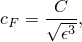

where the constant  is set by default as .

A widely used model to specify the permeability  as a function of porosity is the Carman-Kozeny relation, which is given by

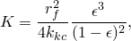

 where  represents the Carman-Kozeny constant (parameter that is geometry dependent) and  represents the average radius of the porous particles/fibers.

#### Specifying the permeability

Permeability in Abaqus/CFD can be isotropic (with dependence only on porosity) or specified using a Carman-Kozeny relation.

##### Isotropic permeability

For isotropic permeability define one value of the fully saturated permeability at each value of the porosity.

| **Input File Usage: ** | ``` [*PERMEABILITY](../key/key-link.md#usb-kws-mpermeabil), TYPE=ISOTROPIC ``` |
| --- | --- |

| **Abaqus/CAE Usage: ** | Property module: material editor: ****Other****Pore Fluid****Permeability****: **Type: Isotropic (CFD)** |
| --- | --- |

##### Carman-Kozeny model

For the Carman-Kozeny relation, you can define the permeability  by specifying , the Carman-Kozeny constant, and , the average pore-particle/fiber radius.

| **Input File Usage: ** | ``` [*PERMEABILITY](../key/key-link.md#usb-kws-mpermeabil), TYPE=CARMAN KOZENY ``` |
| --- | --- |

| **Abaqus/CAE Usage: ** | Property module: material editor: ****Other****Pore Fluid****Permeability****: **Type: Carman-Kozeny** |
| --- | --- |

#### Inertial drag coefficient

The value of the constant  in the expression for the inertial drag coefficient, , can be set to any user-specified value. By default, the value of  is 0.142887.

| **Input File Usage: ** | ``` [*PERMEABILITY](../key/key-link.md#usb-kws-mpermeabil), TYPE=*type*, INERTIAL DRAG COEFFICIENT= ``` |
| --- | --- |

| **Abaqus/CAE Usage: ** | Property module: material editor: ****Other****Pore Fluid****Permeability****: **Inertial drag coefficient:**  |
| --- | --- |

### Elements

In Abaqus/Standard permeability can be used only in elements that allow for pore pressure (see ["Choosing the appropriate element for an analysis type," Section 27.1.3](pt06ch27s01aus112.md)). Permeability can be used with any fluid element in Abaqus/CFD.


