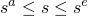
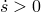
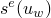
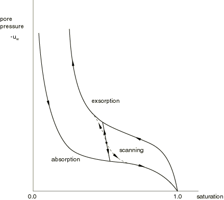
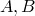
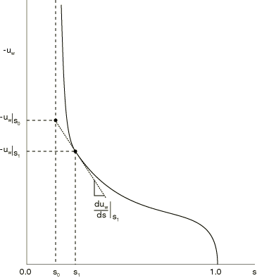
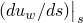

# 26.6.4 Sorption


**Products: **Abaqus/Standard  Abaqus/CAE  

##### **References**

- ["Pore fluid flow properties," Section 26.6.1](pt05ch26s06abo24.md)
- ["Material library: overview," Section 21.1.1](pt05ch21s01abo18.md)
- [*SORPTION](../key/key-link.md#usb-kws-msorption)
- ["Defining sorption" in "Defining a fluid-filled porous material," Section 12.12.3 of the Abaqus/CAE User's Guide](../usi/usi-link.md#usi-prp-other-porefluid-sorption)

### Overview

Sorption:
- defines a porous material's absorption/exsorption behavior under partially saturated flow conditions; and
- is used in the analysis of coupled wetting liquid flow and porous medium stress (["Coupled pore fluid diffusion and stress analysis," Section 6.8.1](pt03ch06s08at26.md)).

### Sorption

A porous medium becomes partially saturated when the total pore liquid pressure, , becomes negative (see ["Effective stress principle for porous media," Section 2.8.1 of the Abaqus Theory Guide](../stm/stm-link.md#stm-anl-poreffstress)). Negative values of  represent capillary effects in the medium. For  it is known that the saturation lies within certain limits that depend on the value of the capillary pressure,  (see ["Continuity statement for the wetting liquid phase in a porous medium," Section 2.8.4 of the Abaqus Theory Guide](../stm/stm-link.md#stm-anl-porcontstate)). Typical forms of these limits are shown in [Figure 26.6.4--1](pt05ch26s06abm66.md#csorption-absorp-exsorp). We write these limits as , where  is the limit at which absorption will occur (so that ), and  is the limit at which exsorption will occur (so that ). The transition between absorption and exsorption and vice versa takes place along “scanning” curves (discussed below). These curves are approximated by the single straight line shown in [Figure 26.6.4--1](pt05ch26s06abm66.md#csorption-absorp-exsorp).

**Figure 26.6.4–1** Typical absorption and exsorption behaviors.



When partial saturation is included in the analysis of flow through a porous medium, the absorption behavior, the exsorption behavior, and the scanning behavior (between absorption and exsorption) should each be defined. Each of these behaviors is discussed below. If sorption is not defined at all, Abaqus/Standard assumes fully saturated flow () for all values of .

Strongly unsymmetric partially saturated flow coupled equations result from the definition of sorption. Therefore, Abaqus/Standard automatically uses its unsymmetric matrix storage and solution scheme (see ["Defining an analysis," Section 6.1.2](pt03ch06s01abo05.md)) if you request partially saturated analysis (i.e., if sorption is defined).

### Defining absorption and exsorption

Absorption and exsorption behaviors are defined by specifying the pore liquid pressure,  (negative “capillary tension”), as a function of saturation. In most physical cases the wetting liquid cannot be driven to zero saturation; to achieve zero saturation, the data would have to define  as . Absorption and exsorption data can be defined in either a tabular form or an analytical form.

#### Tabular form

By default, you define the absorption and exsorption behaviors by specifying  as a tabular function of *s*, where .

| **Input File Usage: ** | Use the following options: |
| --- | --- |
|  | ``` [*SORPTION](../key/key-link.md#usb-kws-msorption), TYPE=ABSORPTION, LAW=TABULAR [*SORPTION](../key/key-link.md#usb-kws-msorption), TYPE=EXSORPTION, LAW=TABULAR ``` If the [*SORPTION](../key/key-link.md#usb-kws-msorption) option is used only once, the behavior defined is taken as the behavior for absorption and exsorption. |

| **Abaqus/CAE Usage: ** | Property module: material editor: ****Other****Pore Fluid****Sorption**** **Absorption**: **Law: Tabular****Exsorption**: toggle on **Include exsorption**: **Law: Tabular** |
| --- | --- |

#### Analytical form

The absorption and exsorption behaviors can be defined by the following analytical form: 


where  are positive material constants and  are parameters used to define the lower bound of the saturation values of interest (see [Figure 26.6.4--2](pt05ch26s06abm66.md#csorption-log-form)).

**Figure 26.6.4–2** Logarithmic form of absorption and exsorption behaviors.



| **Input File Usage: ** | Use the following options: |
| --- | --- |
|  | ``` [*SORPTION](../key/key-link.md#usb-kws-msorption), TYPE=ABSORPTION, LAW=LOG [*SORPTION](../key/key-link.md#usb-kws-msorption), TYPE=EXSORPTION, LAW=LOG ``` If the [*SORPTION](../key/key-link.md#usb-kws-msorption) option is used only once, the behavior defined is taken as the behavior for absorption and exsorption. |

| **Abaqus/CAE Usage: ** | Property module: material editor: ****Other****Pore Fluid****Sorption******Absorption**: **Law: Log****Exsorption**: toggle on **Include exsorption**: **Law: Log** |
| --- | --- |

### Defining the behavior between absorption and exsorption

The behavior between absorption and exsorption is defined by a scanning line of user-specified constant slope, . This slope should be larger than the slope of any segment of the absorption or exsorption behaviors.

If absorption and exsorption behaviors are defined with no scanning line, the slope of the scanning line is taken as 1.05 times the largest value of  given in the absorption and exsorption behavior definitions.

| **Input File Usage: ** | ``` [*SORPTION](../key/key-link.md#usb-kws-msorption), TYPE=SCANNING ``` |
| --- | --- |
|  | This must be a repeated use of the [*SORPTION](../key/key-link.md#usb-kws-msorption) option for the same material. |

| **Abaqus/CAE Usage: ** | Property module: material editor: ****Other****Pore Fluid****Sorption****: **Exsorption**: toggle on **Include exsorption** and **Include scanning**: **Slope**  |
| --- | --- |

### Elements

Sorption can be used only in elements that allow for pore pressure (see ["Choosing the appropriate element for an analysis type," Section 27.1.3](pt06ch27s01aus112.md)).


