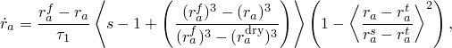
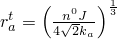

# 26.6.5 Swelling gel


**Products: **Abaqus/Standard  Abaqus/CAE  

##### **References**

- ["Pore fluid flow properties," Section 26.6.1](pt05ch26s06abo24.md)
- ["Material library: overview," Section 21.1.1](pt05ch21s01abo18.md)
- [*GEL](../key/key-link.md#usb-kws-mgel)
- ["Defining a swelling gel" in "Defining a fluid-filled porous material," Section 12.12.3 of the Abaqus/CAE User's Guide](../usi/usi-link.md#usi-prp-other-porefluid-gel)

### Overview

The swelling gel model:
- allows for modeling of the growth of gel particles that swell and trap wetting liquid in a partially saturated porous medium;
- is intended for use in moisture absorption problems, which typically involve polymeric materials, such as in the analysis of diapers; and
- can be used in the analysis of coupled pore liquid flow and porous medium stress (see ["Coupled pore fluid diffusion and stress analysis," Section 6.8.1](pt03ch06s08at26.md)).

### Swelling gel model

The simple swelling gel model is based on the idealization of a gel as a volume of individual spherical particles of equal radius, . The swelling evolution (discussed in detail in ["Constitutive behavior in a porous medium," Section 2.8.3 of the Abaqus Theory Guide](../stm/stm-link.md#stm-anl-porconstbehav)) is assumed to be given by 



where the value of any grouping of terms in angled brackets  is set equal to zero if its mathematical result is not positive, and


is the fully swollen radius;


is the relaxation time of the gel particles;

*s*

is the saturation of the surrounding medium;


is the radius of the gel particles when they are completely dry;



is the maximum radius that the gel particles can achieve before they must touch;


is the effective gel radius when the volume is entirely occupied with gel;


is the initial porosity of the material;

*J*

is the volume change in the material; and


is the number of gel particles per unit volume.

The second term in the definition of gel growth incorporates the assumption that the gel will swell only when the saturation of the surrounding medium, *s*, exceeds the effective saturation of the gel. The third term in the growth equation reduces the swelling rate when the surface of gel particles exposed to free fluid is limited by the combination of packing density and gel particle radius.

The swelling gel model is defined by specifying the variables , , , and .

| **Input File Usage: ** | ``` [*GEL](../key/key-link.md#usb-kws-mgel) ``` |
| --- | --- |

| **Abaqus/CAE Usage: ** | Property module: material editor: ****Other****Pore Fluid****Gel**** |
| --- | --- |

### Elements

The swelling gel model can be used only in elements that allow for pore pressure (see ["Choosing the appropriate element for an analysis type," Section 27.1.3](pt06ch27s01aus112.md)).


