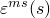
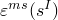
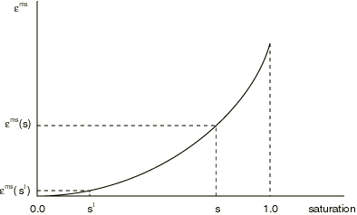
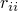
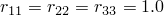

# 26.6.6 Moisture swelling


**Products: **Abaqus/Standard  Abaqus/CAE  

##### **References**

- ["Pore fluid flow properties," Section 26.6.1](pt05ch26s06abo24.md)
- ["Material library: overview," Section 21.1.1](pt05ch21s01abo18.md)
- [*MOISTURE SWELLING](../key/key-link.md#usb-kws-mmoistureswell)
- ["Defining moisture swelling" in "Defining a fluid-filled porous material," Section 12.12.3 of the Abaqus/CAE User's Guide](../usi/usi-link.md#usi-prp-other-porefluid-moistureswelling)

### Overview

Moisture swelling:
- defines the saturation-driven volumetric swelling of the solid skeleton of a porous medium in partially saturated flow conditions;
- can be used in the analysis of coupled wetting liquid flow and porous medium stress (see ["Coupled pore fluid diffusion and stress analysis," Section 6.8.1](pt03ch06s08at26.md)); and
- can be either isotropic or anisotropic.

### Moisture swelling model

The moisture swelling model assumes that the volumetric swelling of the porous medium's solid skeleton is a function of the saturation of the wetting liquid in partially saturated flow conditions. The porous medium is partially saturated when the pore liquid pressure, , is negative (see ["Effective stress principle for porous media," Section 2.8.1 of the Abaqus Theory Guide](../stm/stm-link.md#stm-anl-poreffstress)).

The swelling behavior is assumed to be reversible. The logarithmic measure of swelling strain is calculated with reference to the initial saturation so that 


where  and  are the volumetric swelling strains at the current and initial saturations. A typical curve is shown in [Figure 26.6.6--1](pt05ch26s06abm68.md#cmoistureswell-vol-vs-sat). The ratios , , and  allow for anisotropic swelling as discussed below. 

**Figure 26.6.6–1** Typical volumetric moisture swelling versus saturation curve.



### Defining volumetric swelling strain

Define the volumetric swelling strain, , as a tabular function of the wetting liquid saturation, *s*. The swelling strain must be defined for the range .

| **Input File Usage: ** | ``` [*MOISTURE SWELLING](../key/key-link.md#usb-kws-mmoistureswell) ``` |
| --- | --- |

| **Abaqus/CAE Usage: ** | Property module: material editor: ****Other****Pore Fluid****Moisture Swelling**** |
| --- | --- |

### Defining initial saturation values

You can define the initial saturation values as initial conditions. If no initial saturation values are given, the default is fully saturated conditions (saturation of 1.0). For partial saturation the initial saturation and pore fluid pressure must be consistent, in the sense that the pore fluid pressure must lie within the absorption and exsorption values for the initial saturation value (see ["Permeability," Section 26.6.2](pt05ch26s06abm64.md)). If this is not the case, Abaqus/Standard will adjust the saturation value as needed to satisfy this requirement.

| **Input File Usage: ** | ``` [*INITIAL CONDITIONS](../key/key-link.md#usb-kws-minitialcond), TYPE=SATURATION ``` |
| --- | --- |

| **Abaqus/CAE Usage: ** | Load module: **Create Predefined Field**: **Step: Initial**: choose **Other** for the **Category** and **Saturation** for the **Types for Selected Step** |
| --- | --- |

### Defining anisotropic swelling

Anisotropy can be included in moisture swelling behavior by defining the ratios , , and , such that two or more of the three ratios differ. If the ratios  are not specified, Abaqus/Standard assumes that the swelling is isotropic and that . The orientation of the moisture swelling strain directions depends on the user-specified local orientation (see ["Orientations," Section 2.2.5](pt01ch02s02aus15.md)).

| **Input File Usage: ** | Use both of the following options: |
| --- | --- |
|  | ``` [*MOISTURE SWELLING](../key/key-link.md#usb-kws-mmoistureswell) [*RATIOS](../key/key-link.md#usb-kws-mswellratios) ``` The [*RATIOS](../key/key-link.md#usb-kws-mswellratios) option should immediately follow the [*MOISTURE SWELLING](../key/key-link.md#usb-kws-mmoistureswell) option. |

| **Abaqus/CAE Usage: ** | Property module: material editor: ****Other****Pore Fluid****Moisture Swelling****: ****Suboptions****Ratios**** |
| --- | --- |

### Elements

The moisture swelling model can be used only in elements that allow for pore pressure (see ["Choosing the appropriate element for an analysis type," Section 27.1.3](pt06ch27s01aus112.md)).


