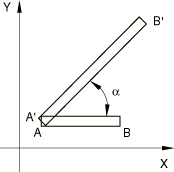
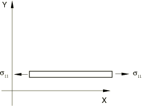
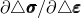

# 26.7.1 User-defined mechanical material behavior


**Products: **Abaqus/Standard  Abaqus/Explicit  Abaqus/CAE  

##### **References**

- ["UMAT," Section 1.1.41 of the Abaqus User Subroutines Reference Guide](../sub/sub-link.md#sub-rtn-uumat)
- ["VUMAT," Section 1.2.20 of the Abaqus User Subroutines Reference Guide](../sub/sub-link.md#sub-rtn-uexpmat)
- [*USER MATERIAL](../key/key-link.md#usb-kws-musermaterial)
- [*DEPVAR](../key/key-link.md#usb-kws-mdepvar)
- ["Specifying solution-dependent state variables," Section 12.8.2 of the Abaqus/CAE User's Guide](../usi/usi-link.md#usi-prp-general-depvar)
- ["Defining constants for a user material," Section 12.8.4 of the Abaqus/CAE User's Guide](../usi/usi-link.md#usi-prp-general-usermaterial)

### Overview

User-defined mechanical material behavior in Abaqus:
- is provided by means of an interface whereby any mechanical constitutive model can be added to the library;
- requires that a constitutive model (or a library of models) is programmed in user subroutine [`UMAT`](../sub/sub-link.md#sub-xsl-umat) (Abaqus/Standard) or [`VUMAT`](../sub/sub-link.md#sub-xsl-vumat) (Abaqus/Explicit); and
- requires considerable effort and expertise: the feature is very general and powerful, but its use is not a routine exercise.

### Stress components and strain increments

The subroutine interface has been implemented using Cauchy stress components (“true” stress). For soils problems “stress” should be interpreted as effective stress. The strain increments are defined by the symmetric part of the displacement increment gradient (equivalent to the time integral of the symmetric part of the velocity gradient).

The orientation of the stress and strain components in user subroutine [`UMAT`](../sub/sub-link.md#sub-xsl-umat) depends on the use of local orientations (["Orientations," Section 2.2.5](pt01ch02s02aus15.md)).

In user subroutine [`VUMAT`](../sub/sub-link.md#sub-xsl-vumat) all strain measures are calculated with respect to the midincrement configuration. All tensor quantities are defined in the corotational coordinate system that rotates with the material point. To illustrate what this means in terms of stresses, consider the bar shown in [Figure 26.7.1--1](pt05ch26s07abm69.md#uexpmat), which is stretched and rotated from its original configuration, , to its new position, . This deformation can be obtained in two stages; the bar is first stretched, as shown in [Figure 26.7.1--2](pt05ch26s07abm69.md#uexpmat-stretching), and is then rotated by applying a rigid body rotation to it, as shown in [Figure 26.7.1--3](pt05ch26s07abm69.md#uexpmat-rotation). 

**Figure 26.7.1–1** Stretched and rotated bar.



**Figure 26.7.1–2** Stretching of bar.



**Figure 26.7.1–3** Rigid body rotation of bar.


The stress in the bar after it has been stretched is , and this stress does not change during the rigid body rotation. The  coordinate system that rotates as a result of the rigid body rotation is the corotational coordinate system. The stress tensor and state variables are, therefore, computed directly and updated in user subroutine [`VUMAT`](../sub/sub-link.md#sub-xsl-vumat) using the strain tensor since all of these quantities are in the corotational system; these quantities do not have to be rotated by the user subroutine as is sometimes required in user subroutine [`UMAT`](../sub/sub-link.md#sub-xsl-umat).

The elastic response predicted by a rate-form constitutive law depends on the objective stress rate employed. For example, the Green-Naghdi stress rate is used in [`VUMAT`](../sub/sub-link.md#sub-xsl-vumat). However, the stress rate used for built-in material models may differ. For example, most material models used with solid (continuum) elements in Abaqus/Explicit employ the Jaumann stress rate. This difference in the formulation will cause significant differences in the results only if finite rotation of a material point is accompanied by finite shear. For a discussion of the objective stress rates used in Abaqus, see ["Stress rates," Section 1.5.3 of the Abaqus Theory Guide](../stm/stm-link.md#stm-int-stressrates).

### Material constants

Any material constants that are needed in user subroutine [`UMAT`](../sub/sub-link.md#sub-xsl-umat) or [`VUMAT`](../sub/sub-link.md#sub-xsl-vumat) must be specified as part of a user-defined material behavior definition. Any other mechanical material behaviors included in the same material definition (except thermal expansion and, in Abaqus/Explicit, density) will be ignored; the user-defined material behavior requires that all mechanical material behavior calculations be programmed in subroutine [`UMAT`](../sub/sub-link.md#sub-xsl-umat) or [`VUMAT`](../sub/sub-link.md#sub-xsl-vumat). In Abaqus/Explicit the density (["Density," Section 21.2.1](pt05ch21s02abm01.md)) is required when using a user-defined material behavior.

| **Input File Usage: ** | In Abaqus/Standard use the following option to specify a user-defined material behavior: |
| --- | --- |
|  | ``` [*USER MATERIAL](../key/key-link.md#usb-kws-musermaterial), TYPE=MECHANICAL, CONSTANTS=*number_of_constants* ``` In Abaqus/Explicit use both of the following options to specify a user-defined material behavior: ``` [*USER MATERIAL](../key/key-link.md#usb-kws-musermaterial), CONSTANTS=*number_of_constants* [*DENSITY](../key/key-link.md#usb-kws-mdensity) ``` In either case you must specify the number of material constants being entered. |

| **Abaqus/CAE Usage: ** | In Abaqus/Standard use the following option to specify a user-defined material behavior: |
| --- | --- |
|  | Property module: material editor: ****General****User Material****: **User material type: Mechanical** In Abaqus/Explicit use both of the following options to specify a user-defined material behavior: Property module: material editor: ****General****User Material****: **User material type: Mechanical******General****Density**** |

### Unsymmetric equation solver in Abaqus/Standard

If the user material's Jacobian matrix, , is not symmetric, the unsymmetric equation solution capability in Abaqus/Standard should be invoked (see ["Defining an analysis," Section 6.1.2](pt03ch06s01abo05.md)).

| **Input File Usage: ** | ``` [*USER MATERIAL](../key/key-link.md#usb-kws-musermaterial), TYPE=MECHANICAL, CONSTANTS=*number_of_constants*, UNSYMM ``` |
| --- | --- |

| **Abaqus/CAE Usage: ** | Property module: material editor: ****General****User Material****: **User material type: Mechanical**, toggle on **Use unsymmetric material stiffness matrix** |
| --- | --- |

### Hybrid formulation in Abaqus/Standard

If you use a hybrid element with user subroutine [`UMAT`](../sub/sub-link.md#sub-xsl-umat), by default Abaqus/Standard replaces the pressure stress calculated from the stress tensor returned by the user subroutine with that derived from the Lagrange multiplier and modifies the Jacobian appropriately (["Hybrid incompressible solid element formulation," Section 3.2.3 of the Abaqus Theory Guide](../stm/stm-link.md#stm-elm-hybridincompress)). This approach is suitable for material models that use an incremental formulation (for example, metal plasticity) but is not consistent with the total formulation that is commonly used for hyperelastic materials. In the latter situation the default formulation may lead to convergence problems. Such convergence problems may be observed, for example, when an almost incompressible nonlinear elastic user material is subjected to large deformations. Abaqus/Standard provides an alternate total formulation that is more appropriate in such situations. The total formulation is consistent with the native almost incompressible formulation used by Abaqus for hyperelastic materials (["Hyperelastic material behavior," Section 4.6.1 of the Abaqus Theory Guide](../stm/stm-link.md#stm-mat-hyperelastic)), and works better than the default (incremental) formulation for such cases.

Abaqus/Standard also provides a fully incompressible formulation for use with hybrid elements to define a fully incompressible user material response. The fully incompressible formulation is consistent with the native formulation used by Abaqus for incompressible hyperelastic materials. For the total hybrid formulation it is assumed that the deviatoric and the volumetric responses of the material are decoupled and that the volumetric response can be derived from a strain energy potential function. All the native hyperelastic materials in Abaqus use this assumption. For the incompressible hybrid formulation, it is assumed that the deviatoric stress can be derived from a strain energy potential function.

The total hybrid formulation is useful for an almost incompressible hyperelastic response. The volumetric response of the material is assumed to be defined in terms of an alternate variable, , in place of the volume change, . The alternate variable is made available inside user subroutine [`UMAT`](../sub/sub-link.md#sub-xsl-umat). Further details are discussed in ["UMAT," Section 1.1.41 of the Abaqus User Subroutines Reference Guide](../sub/sub-link.md#sub-rtn-uumat).

The fully incompressible formulation requires you to define only the deviatoric parts of the stress tensor and the material's Jacobian matrix inside the [`UMAT`](../sub/sub-link.md#sub-xsl-umat). Abaqus/Standard automatically accounts for the pressure stress based on the Lagrange multiplier.

| **Input File Usage: ** | Use the following option to invoke the total hybrid formulation: |
| --- | --- |
|  | ``` [*USER MATERIAL](../key/key-link.md#usb-kws-musermaterial), TYPE=MECHANICAL, CONSTANTS=*number_of_constants*, HYBRID FORMULATION=TOTAL ``` Use following option to invoke the incremental hybrid formulation (default): ``` [*USER MATERIAL](../key/key-link.md#usb-kws-musermaterial), TYPE=MECHANICAL, CONSTANTS=*number_of_constants*, HYBRID FORMULATION=INCREMENTAL ``` Use the following option to invoke the incompressible hybrid formulation: ``` [*USER MATERIAL](../key/key-link.md#usb-kws-musermaterial), TYPE=MECHANICAL, CONSTANTS=*number_of_constants*, HYBRID FORMULATION=INCOMPRESSIBLE ``` |

| **Abaqus/CAE Usage: ** | Specification of the hybrid formulation is not supported in Abaqus/CAE. |
| --- | --- |

### Material state

Many mechanical constitutive models require the storage of solution-dependent state variables (plastic strains, “back stress,” saturation values, etc. in rate constitutive forms or historical data for theories written in integral form). You should allocate storage for these variables in the associated material definition (see ["Allocating space" in "User subroutines: overview," Section 18.1.1](pt04ch18s01aus104.md#usb-anl-usubrout-allocatespace)). There is no restriction on the number of state variables associated with a user-defined material.

The user material subroutines are provided with the material state at the start of each increment, as described below. They must return values for the new stresses and the new internal state variables. State variables associated with [`UMAT`](../sub/sub-link.md#sub-xsl-umat) and [`VUMAT`](../sub/sub-link.md#sub-xsl-vumat) can be output to the output database file (`.odb`) and results file (`.fil`) using the output identifiers SDV and SDV*n* (see ["Abaqus/Standard output variable identifiers," Section 4.2.1](pt02ch04s02abv01.md), and ["Abaqus/Explicit output variable identifiers," Section 4.2.2](pt02ch04s02xbv01.md)).

#### Material state in Abaqus/Standard

User subroutine [`UMAT`](../sub/sub-link.md#sub-xsl-umat) is called for each material point at each iteration of every increment. It is provided with the material state at the start of the increment (stress, solution-dependent state variables, temperature, and any predefined field variables) and with the increments in temperature, predefined state variables, strain, and time.

In addition to updating the stresses and the solution-dependent state variables to their values at the end of the increment, subroutine [`UMAT`](../sub/sub-link.md#sub-xsl-umat) must also provide the material Jacobian matrix, , for the mechanical constitutive model. This matrix will also depend on the integration scheme used if the constitutive model is in rate form and is integrated numerically in the subroutine. For any nontrivial constitutive model these will be challenging tasks. For example, the accuracy with which the Jacobian matrix is defined will usually be a major determinant of the convergence rate of the solution and, therefore, will have a strong influence on computational efficiency.

If you specify the viscoelastic behavior of materials in the frequency domain, user subroutine [`UMAT`](../sub/sub-link.md#sub-xsl-umat) must also provide the damping (loss modulus) contribution to the material Jacobian matrix, in addition to the stiffness (storage modulus) contribution.

#### Material state in Abaqus/Explicit

User subroutine [`VUMAT`](../sub/sub-link.md#sub-xsl-vumat) is called for blocks of material points at each increment. When the subroutine is called, it is provided with the state at the start of the increment (stress, solution-dependent state variables). It is also provided with the stretches and rotations at the beginning and the end of the increment. The [`VUMAT`](../sub/sub-link.md#sub-xsl-vumat) user material interface passes a block of material points to the subroutine on each call, which allows vectorization of the material subroutine.

The temperature is provided to user subroutine [`VUMAT`](../sub/sub-link.md#sub-xsl-vumat) at the start and the end of the increment. The temperature is passed in as information only and cannot be modified, even in a fully coupled thermal-stress analysis. However, if the inelastic heat fraction is defined in conjunction with the specific heat and conductivity in a fully coupled thermal-stress analysis in Abaqus/Explicit, the heat flux due to inelastic energy dissipation will be calculated automatically. If the [`VUMAT`](../sub/sub-link.md#sub-xsl-vumat) user subroutine is used to define an adiabatic material behavior (conversion of plastic work to heat) in an explicit dynamics procedure, you must specify both the inelastic heat fraction and the specific heat for the material, and you must store the temperatures and integrate them as user-defined state variables. Most often the temperatures are provided by specifying initial conditions (["Initial conditions in Abaqus/Standard and Abaqus/Explicit," Section 34.2.1](pt07ch34s02aus116.md)) and are constant throughout the analysis.

#### Deleting elements from a mesh using state variables

Element deletion in a mesh can be controlled during the course of an Abaqus analysis through user subroutine [`VUMAT`](../sub/sub-link.md#sub-xsl-vumat) or [`UMAT`](../sub/sub-link.md#sub-xsl-umat). Deleted elements have no ability to carry stresses and, therefore, have no contribution to the stiffness of the model. You specify the state variable number controlling the element deletion flag. For example, specifying a state variable number of 4 indicates that the fourth state variable is the deletion flag in the user subroutine. The deletion state variable should be set to a value of one or zero. A value of one indicates that the material point is active, while a value of zero indicates that Abaqus should delete the material point from the model by setting the stresses to zero. In Abaqus/Explicit the structure of the block of material points passed to user subroutine [`VUMAT`](../sub/sub-link.md#sub-xsl-vumat) remains unchanged during the analysis; deleted material points are not removed from the block. Abaqus/Explicit will pass zero stresses and strain increments for all deleted material points. Once a material point has been flagged as deleted, it cannot be reactivated. An element will be deleted from the mesh only after all of the material points in the element are deleted. The status of an element can be determined by requesting output of the variable STATUS. This variable is equal to one if the element is active and equal to zero if the element is deleted.

| **Input File Usage: ** | ``` [*DEPVAR](../key/key-link.md#usb-kws-mdepvar), DELETE=*variable number* ``` |
| --- | --- |

| **Abaqus/CAE Usage: ** | Property module: material editor: ****General****Depvar****: **Variable number controlling element deletion:** *variable number* |
| --- | --- |

### Hourglass control and transverse shear stiffness

Normally the default hourglass control stiffness for reduced-integration elements in Abaqus/Standard and the transverse shear stiffness for shell, pipe, and beam elements are defined based on the elasticity associated with the material (["Section controls," Section 27.1.4](pt06ch27s01aus113.md); ["Shell section behavior," Section 29.6.4](pt06ch29s06alm18.md); and ["Choosing a beam element," Section 29.3.3](pt06ch29s03alm08.md)). These stiffnesses are based on a typical value of the initial shear modulus of the material, which may, for example, be given as part of an elastic material behavior (["Linear elastic behavior," Section 22.2.1](pt05ch22s02abm02.md)) included in the material definition. However, the shear modulus is not available during the preprocessing stage of input for materials defined with user subroutine [`UMAT`](../sub/sub-link.md#sub-xsl-umat) or [`VUMAT`](../sub/sub-link.md#sub-xsl-vumat). Therefore, you must provide the hourglass stiffness parameters (see ["Methods for suppressing hourglass modes" in "Section controls," Section 27.1.4](pt06ch27s01aus113.md#usb-elm-esection-hourglass)) when using [`UMAT`](../sub/sub-link.md#sub-xsl-umat) to define the material behavior of elements with hourglassing modes; and you must specify the transverse shear stiffness (see ["Choosing a beam element," Section 29.3.3](pt06ch29s03alm08.md), or ["Shell section behavior," Section 29.6.4](pt06ch29s06alm18.md)) when using [`UMAT`](../sub/sub-link.md#sub-xsl-umat) or [`VUMAT`](../sub/sub-link.md#sub-xsl-vumat) to define the material behavior of beams and shells with transverse shear flexibility.

### Use of [`UMAT`](../sub/sub-link.md#sub-xsl-umat) with other subroutines

Various utility subroutines are also available in Abaqus/Standard for use with subroutine [`UMAT`](../sub/sub-link.md#sub-xsl-umat). These utility subroutines are discussed in ["Obtaining stress invariants, principal stress/strain values and directions, and rotating tensors in an Abaqus/Standard analysis," Section 2.1.11 of the Abaqus User Subroutines Reference Guide](../sub/sub-link.md#sub-utl-utensor).

User subroutine [`UMATHT`](../sub/sub-link.md#sub-xsl-umatht) can be used in conjunction with [`UMAT`](../sub/sub-link.md#sub-xsl-umat) to define the constitutive thermal behavior of the material. The solution-dependent variables allocated in the material definition are accessible in both [`UMAT`](../sub/sub-link.md#sub-xsl-umat) and [`UMATHT`](../sub/sub-link.md#sub-xsl-umatht). In addition, user subroutines [`FRIC`](../sub/sub-link.md#sub-xsl-fric), [`GAPCON`](../sub/sub-link.md#sub-xsl-gapcon), and [`GAPELECTR`](../sub/sub-link.md#sub-xsl-gapelectr) are available for defining mechanical, thermal, and electrical interactions between surfaces.

### Material options

A number of material behaviors can be used in the definition of a material when its mechanical behavior is defined by user subroutine [`UMAT`](../sub/sub-link.md#sub-xsl-umat) or [`VUMAT`](../sub/sub-link.md#sub-xsl-vumat). These behaviors include density, thermal expansion, permeability, and heat transfer properties. Thermal expansion can alternatively be an integral part of the constitutive model implemented in [`UMAT`](../sub/sub-link.md#sub-xsl-umat) or [`VUMAT`](../sub/sub-link.md#sub-xsl-vumat).

The temperature available in [`UMAT`](../sub/sub-link.md#sub-xsl-umat) is always the interpolated temperature field at the element integration points. Naturally, if the thermal expansion behavior is implemented in [`UMAT`](../sub/sub-link.md#sub-xsl-umat), it is defined in terms of the integration point temperature. When the temperature field is interpolated differently within an element compared to the displacement field in Abaqus/Standard, implementing the thermal expansion behavior in [`UMAT`](../sub/sub-link.md#sub-xsl-umat) may lead to differences compared to the built-in thermal expansion behavior. This situation commonly arises for coupled temperature-displacement elements. For example, for first-order coupled temperature-displacement elements, the built-in thermal expansion behavior uses a constant temperature field over the whole element (see ["Fully coupled thermal-stress analysis," Section 6.5.3](pt03ch06s05at19.md)), while the behavior in [`UMAT`](../sub/sub-link.md#sub-xsl-umat) will be defined in terms of a linear temperature field.

For a material defined by user subroutine [`UMAT`](../sub/sub-link.md#sub-xsl-umat) or [`VUMAT`](../sub/sub-link.md#sub-xsl-vumat), mass proportional damping can be included separately (see ["Material damping," Section 26.1.1](pt05ch26s01abm51.md)), but stiffness proportional damping must be defined in the user subroutine by the Jacobian (Abaqus/Standard only) and stress definitions. Stiffness proportional damping cannot be specified if the user material is used in the direct steady-state dynamics procedure.

### Elements

User subroutines [`UMAT`](../sub/sub-link.md#sub-xsl-umat) and [`VUMAT`](../sub/sub-link.md#sub-xsl-vumat) can be used with all elements in Abaqus that include mechanical behavior (elements that have displacement degrees of freedom).


