# 27.1.2 Choosing the element's dimensionality

**Products: **Abaqus/Standard  Abaqus/Explicit  Abaqus/CFD  Abaqus/CAE  

##### **References**

- ["Element library: overview," Section 27.1.1](pt06ch27s01abo25.md)
- ["Part modeling space," Section 11.4.1 of the Abaqus/CAE User's Guide](../usi/usi-link.md#usi-prt-conc-dimensionality)
- ["Assigning Abaqus element types," Section 17.5 of the Abaqus/CAE User's Guide](../usi/usi-link.md#usi-mgn-conc-attributes)

### Overview

The Abaqus element library contains the following for modeling a wide range of spatial dimensionality:
- one-dimensional elements;
- two-dimensional elements;
- three-dimensional elements;
- cylindrical elements;
- axisymmetric elements; and
- axisymmetric elements with nonlinear, asymmetric deformation.

### One-dimensional (link) elements

One-dimensional heat transfer, coupled thermal/electrical, and acoustic elements are available only in Abaqus/Standard. In addition, structural link (truss) elements are available in both Abaqus/Standard and Abaqus/Explicit. These elements can be used in two- or three-dimensional space to transmit loads or fluxes along the length of the element.

### Two-dimensional elements

Abaqus provides several different types of two-dimensional elements. For structural applications these include plane stress elements and plane strain elements. Abaqus/Standard also provides generalized plane strain elements for structural applications.

#### Plane stress elements

Plane stress elements can be used when the thickness of a body or domain is small relative to its lateral (in-plane) dimensions. The stresses are functions of planar coordinates alone, and the out-of-plane normal and shear stresses are equal to zero.

Plane stress elements must be defined in the *X*–*Y* plane, and all loading and deformation are also restricted to this plane. This modeling method generally applies to thin, flat bodies. For anisotropic materials the *Z*-axis must be a principal material direction.

#### Plane strain elements

Plane strain elements can be used when it can be assumed that the strains in a loaded body or domain are functions of planar coordinates alone and the out-of-plane normal and shear strains are equal to zero.

Plane strain elements must be defined in the *X*–*Y* plane, and all loading and deformation are also restricted to this plane. This modeling method is generally used for bodies that are very thick relative to their lateral dimensions, such as shafts, concrete dams, or walls. Plane strain theory might also apply to a typical slice of an underground tunnel that lies along the *Z*-axis. For anisotropic materials the *Z*-axis must be a principal material direction.

Since plane strain theory assumes zero strain in the thickness direction, isotropic thermal expansion may cause large stresses in the thickness direction.

#### Generalized plane strain elements

Generalized plane strain elements provide for the modeling of cases in Abaqus/Standard where the structure has constant curvature (and, hence, no gradients of solution variables) with respect to one material direction—the “axial” direction of the model. The formulation, thus, involves a model that lies between two planes that can move with respect to each other and, hence, cause strain in the axial direction of the model that varies linearly with respect to position in the planes, the variation being due to the change in curvature. In the initial configuration the bounding planes can be parallel or at an angle to each other, the latter case allowing the modeling of initial curvature of the model in the axial direction. The concept is illustrated in [Figure 27.1.2--1](pt06ch27s01aus111.md#edimension-gen-plane-strain). Generalized plane strain elements are typically used to model a section of a long structure that is free to expand axially or is subjected to axial loading.

**Figure 27.1.2–1** Generalized plane strain model.

Each generalized plane strain element has three, four, six, or eight conventional nodes, at each of which *x*- and *y*-coordinates, displacements, etc. are stored. These nodes determine the position and motion of the element in the two bounding planes. Each element also has a reference node, which is usually the same node for all of the generalized plane strain elements in the model. The reference node of a generalized plane strain element should not be used as a conventional node in any element in the model. The reference node has three degrees of freedom 3, 4, and 5: (, , and ). The first degree of freedom () is the change in length of the axial material fiber connecting this node and its image in the other bounding plane. This displacement is positive as the planes move apart; therefore, there is a tensile strain in the axial fiber. The second and third degrees of freedom (, ) are the components of the relative rotation of one bounding plane with respect to the other. The values stored are the two components of rotation about the *X*- and *Y*-axes in the bounding planes (that is, in the cross-section of the model). Positive rotation about the *X*-axis causes increasing axial strain with respect to the *y*-coordinate in the cross-section; positive rotation about the *Y*-axis causes decreasing axial strain with respect to the *x*-coordinate in the cross-section. The *x*- and *y*-coordinates of a generalized plane strain element reference node (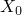 and 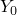 discussed below) remain fixed throughout all steps of an analysis. From the degrees of freedom of the reference node, the length of the axial material fiber passing through the point with current coordinates (*x*, *y*) in a bounding plane is defined as 

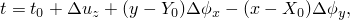

where 

*t*

is the current length of the fiber,

is the initial length of the fiber passing through the reference node (given as part of the element section definition),

is the displacement at the reference node (stored as degree of freedom 3 at the reference node),

 and 

are the total values of the components of the angle between the bounding planes (the original values of ,  are given as part of the element section definition—see ["Defining the element's section properties" in "Solid (continuum) elements," Section 28.1.1](pt06ch28s01alm01.md#usb-elm-esolidcont-secprops): the changes in these values are the degrees of freedom 4 and 5 of the reference node), and

 and 

are the coordinates of the reference node in a bounding plane. 

The strain in the axial direction is defined immediately from this axial fiber length. The strain components in the cross-section of the model are computed from the displacements of the regular nodes of the elements in the usual way. Since the solution is assumed to be independent of the axial position, there are no transverse shear strains.

### Three-dimensional elements

Three-dimensional elements are defined in the global *X*, *Y*, *Z* space. These elements are used when the geometry and/or the applied loading are too complex for any other element type with fewer spatial dimensions.

### Cylindrical elements

Cylindrical elements are three-dimensional elements defined in the global *X*, *Y*, *Z* space. These elements are used to model bodies with circular or axisymmetric geometry subjected to general, nonaxisymmetric loading. Cylindrical elements are available only in Abaqus/Standard.

Cylindrical elements are useful in situations where the expected solution over a relatively large angle is nearly axisymmetric. In this case a very coarse mesh of cylindrical elements is often sufficient. Footprint and steady-state rolling analyses of tires are good examples of where cylindrical elements have distinct advantages over conventional continuum elements (see ["Steady-state rolling analysis of a tire," Section 3.1.2 of the Abaqus Example Problems Guide](../exa/exa-link.md#exa-veh-rollingtire)). If, however, the expected solution has significant non-axisymmetric components, a finer mesh of cylindrical elements will be needed and it may be more economical to use conventional continuum elements. 

### Axisymmetric elements

Axisymmetric elements provide for the modeling of bodies of revolution under axially symmetric loading conditions. A body of revolution is generated by revolving a plane cross-section about an axis (the symmetry axis) and is readily described in cylindrical polar coordinates *r*, *z*, and . [Figure 27.1.2--2](pt06ch27s01aus111.md#edimension-axi-solid) shows a typical reference cross-section at . The radial and axial coordinates of a point on this cross-section are denoted by *r* and *z*, respectively. At , the radial and axial coordinates coincide with the global Cartesian *X*- and *Y*-coordinates.

**Figure 27.1.2–2** Reference cross-section and element in an axisymmetric solid.

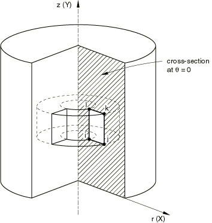

Abaqus does not apply boundary conditions automatically to nodes that are located on the symmetry axis in axisymmetric models. If required, you should apply them directly. Radial boundary conditions at nodes located on the *z*-axis are appropriate for most problems because without them nodes may displace across the symmetry axis, violating the principle of compatibility. However, there are some analyses, such as penetration calculations, where nodes along the symmetry axis should be free to move; boundary conditions should be omitted in these cases.

If the loading and material properties are independent of , the solution in any *r*–*z* plane completely defines the solution in the body. Consequently, axisymmetric elements can be used to analyze the problem by discretizing the reference cross-section at . [Figure 27.1.2--2](pt06ch27s01aus111.md#edimension-axi-solid) shows an element of an axisymmetric body. The nodes *i*, *j*, *k*, and *l* are actually nodal “circles,” and the volume of material associated with the element is that of a body of revolution, as shown in the figure. The value of a prescribed nodal load or reaction force is the total value on the ring; that is, the value integrated around the circumference.

#### Regular axisymmetric elements

Regular axisymmetric elements for structural applications allow for only radial and axial loading and have isotropic or orthotropic material properties, with  being a principal direction. Any radial displacement in such an element will induce a strain in the circumferential direction (“hoop” strain); and since the displacement must also be purely axisymmetric, there are only four possible nonzero components of strain (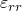, 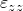, 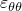, and 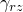).

#### Generalized axisymmetric stress/displacement elements with twist

Axisymmetric solid elements with twist are available only in Abaqus/Standard for the analysis of structures that are axially symmetric but can twist about their symmetry axis. This element family is similar to the axisymmetric elements discussed above, except that it allows for a circumferential loading component (which is independent of ) and for general material anisotropy. Under these conditions, there may be displacements in the -direction that vary with *r* and *z* but not with . The problem remains axisymmetric because the solution does not vary as a function of  so that the deformation of any *r*–*z* plane characterizes the deformation in the entire body. Initially the elements define an axisymmetric reference geometry with respect to the *r*–*z* plane at , where the *r*-direction corresponds to the global *X*-direction and the *z*-direction corresponds to the global *Y*-direction. [Figure 27.1.2--3](pt06ch27s01aus111.md#edimension-axi-solid-twist) shows an axisymmetric model consisting of two elements. The figure also shows the local cylindrical coordinate system at node 100.

**Figure 27.1.2–3** Reference and deformed cross-section in an axisymmetric solid with twist.

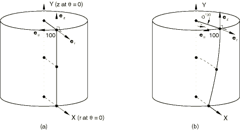

The motion at a node of an axisymmetric element with twist is described by the radial displacement , the axial displacement , and the twist  (in radians) about the *z*-axis, each of which is constant in the circumferential direction, so that the deformed geometry remains axisymmetric. [Figure 27.1.2--3](pt06ch27s01aus111.md#edimension-axi-solid-twist)(b) shows the deformed geometry of the reference model shown in [Figure 27.1.2--3](pt06ch27s01aus111.md#edimension-axi-solid-twist)(a) and the local cylindrical coordinate system at the displaced location of node 100, for a twist 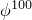.

The formulation of these elements is discussed in ["Axisymmetric elements," Section 3.2.8 of the Abaqus Theory Guide](../stm/stm-link.md#stm-elm-axitwist).

Generalized axisymmetric elements with twist cannot be used in contour integral calculations and in dynamic analysis. Elastic foundations are applied only to degrees of freedom  and .

These elements should not be mixed with three-dimensional elements.

Axisymmetric elements with twist and the nodes of these elements should be used with caution within rigid bodies. If the rigid body undergoes large rotations, incorrect results may be obtained. It is recommended that rigid constraints on axisymmetric elements with twist be modeled with kinematic coupling (see ["Kinematic coupling constraints," Section 35.2.3](pt08ch35s02aus131.md)).

Stabilization should not be used with these elements if the deformation is dominated by twist, since stabilization is applied only to the in-plane deformation.

### Axisymmetric elements with nonlinear, asymmetric deformation

These elements are intended for the linear or nonlinear analysis of structures that are initially axisymmetric but undergo nonlinear, nonaxisymmetric deformation. They are available only in Abaqus/Standard.

The elements use standard isoparametric interpolation in the *r*–*z* plane, combined with Fourier interpolation with respect to . The deformation is assumed to be symmetric with respect to the *r*–*z* plane at .

Up to four Fourier modes are allowed. For more general cases, full three-dimensional modeling or cylindrical element modeling is probably more economical because of the complete coupling between all deformation modes.

These elements use a set of nodes in each of several *r*–*z* planes: the number of such planes depends on the order *N* of Fourier interpolation used with respect to , as follows: 

| Number of Fourier modes *N* | Number of nodal planes | Nodal plane locations with respect to  |
| --- | --- | --- |
| 1 | 2 | 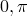 |
| 2 | 3 | 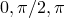 |
| 3 | 4 | 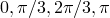 |
| 4 | 5 | 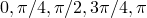 |

Each element type is defined by a name such as CAXA8R*N* (continuum elements) or SAXA1*N* (shell elements). The number *N* should be given as the number of Fourier modes to be used with the element (*N*=1, 2, 3, or 4). For example, element type CAXA8R2 is a quadrilateral in the *r*–*z* plane with biquadratic interpolation in this plane and two Fourier modes for interpolation with respect to . The nodal planes associated with various Fourier modes are illustrated in [Figure 27.1.2--4](pt06ch27s01aus111.md#axisolid-fourier-modes).

**Figure 27.1.2–4** Nodal planes of a second-order axisymmetric element with nonlinear, asymmetric deformation and (a) 1, (b) 2, (c) 3, or (d) 4 Fourier modes.

