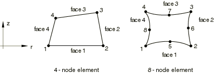
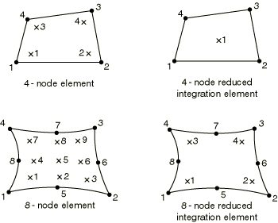

# 28.1.7 Axisymmetric solid elements with nonlinear, asymmetric deformation


**Product: **Abaqus/Standard  

##### **References**

- ["Choosing the element's dimensionality," Section 27.1.2](pt06ch27s01aus111.md)
- ["Solid (continuum) elements," Section 28.1.1](pt06ch28s01alm01.md)
- [*SOLID SECTION](../key/key-link.md#usb-kws-msolidsection)

### Overview

This section provides a reference to the axisymmetric solid elements available in Abaqus/Standard. These elements are intended for analysis of hollow bodies, such as pipes and pressure vessels. They can also be used to model solid bodies, but spurious stresses may occur at zero radius, particularly if transverse shear loads are applied.

### Conventions

Coordinate 1 is *r*, coordinate 2 is *z*. Referring to the figures shown in ["Choosing the element's dimensionality," Section 27.1.2](pt06ch27s01aus111.md), the *r*-direction corresponds to the global *X*-direction in the  plane and the negative global *Z*-direction in the  plane, and the *z*-direction corresponds to the global *Y*-direction. Coordinate 1 must be greater than or equal to zero.

Degree of freedom 1 is , degree of freedom 2 is . The  degree of freedom is an internal variable: you cannot control it.

### Element types

#### Stress/displacement elements

| CAXA4*N* | Bilinear, Fourier quadrilateral with 4 nodes per *r*--*z* plane |
| --- | --- |
|  |

| CAXA4H*N* | Bilinear, Fourier quadrilateral with 4 nodes per *r*--*z* plane, hybrid with constant Fourier pressure |
| --- | --- |
|  |

| CAXA4R*N* | Bilinear, Fourier quadrilateral with 4 nodes per *r*--*z* plane, reduced integration in *r*--*z* planes with hourglass control |
| --- | --- |
|  |

| CAXA4RH*N* | Bilinear, Fourier quadrilateral with 4 nodes per *r*--*z* plane, reduced integration in *r*--*z* planes, hybrid with constant Fourier pressure |
| --- | --- |
|  |

| CAXA8*N* | Biquadratic, Fourier quadrilateral with 8 nodes per *r*--*z* plane |
| --- | --- |
|  |

| CAXA8H*N* | Biquadratic, Fourier quadrilateral with 8 nodes per --*z* plane, hybrid with linear Fourier pressure |
| --- | --- |
|  |

| CAXA8R*N* | Biquadratic, Fourier quadrilateral with 8 nodes per *r*--*z* plane, reduced integration in *r*--*z* planes |
| --- | --- |
|  |

| CAXA8RH*N* | Biquadratic, Fourier quadrilateral with 8 nodes per *r*--*z* plane, reduced integration in *r*--*z* planes, hybrid with linear Fourier pressure |
| --- | --- |
|  |

##### Active degrees of freedom

1, 2

##### Additional solution variables

The bilinear elements have 4*N* and the biquadratic elements 8*N* additional variables relating to .

Element types CAXA4H*N* and CAXA4RH*N* have  additional variables relating to the pressure stress.

Element types CAXA8H*N* and CAXA8RH*N* have  additional variables relating to the pressure stress. 

#### Pore pressure elements

| CAXA8P*N* | Biquadratic, Fourier quadrilateral with 8 nodes per *r*--*z* plane, bilinear Fourier pore pressure |
| --- | --- |
|  |

| CAXA8RP*N* | Biquadratic, Fourier quadrilateral with 8 nodes per *r*--*z* plane, bilinear Fourier pore pressure, reduced integration in *r*--*z* planes |
| --- | --- |
|  |

##### Active degrees of freedom

1, 2, 8 at corner nodes

1, 2 at midside nodes

##### Additional solution variables

8*N* additional variables relating to .

### Nodal coordinates required

*r*, *z*

### Element property definition

| **Input File Usage: ** | ``` [*SOLID SECTION](../key/key-link.md#usb-kws-msolidsection) ``` |
| --- | --- |

### Element-based loading

Even though the symmetry in the *r*–*z* plane at  allows the modeling of half of the initially axisymmetric structure, the loading must be specified as the total load on the full axisymmetric body. Consider, for example, a cylindrical shell loaded by a unit uniform axial force. To produce a unit load on a CAXA element with 4 modes, the nodal forces are 1/8, 1/4, 1/4, 1/4, and 1/8 at , , , , and , respectively.

### Distributed loads

Distributed loads are specified as described in ["Distributed loads," Section 34.4.3](pt07ch34s04aus122.md).

**Load ID (*DLOAD):**  BX**Units:**  [FL3](../popups/usb-int-iconventions-unitsym.md)**Description:  **Body force per unit volume in the global *X*-direction.

**Load ID (*DLOAD):**  BZ**Units:**  [FL3](../popups/usb-int-iconventions-unitsym.md)**Description:  **Body force per unit volume in the *z*-direction.

**Load ID (*DLOAD):**  BXNU**Units:**  [FL3](../popups/usb-int-iconventions-unitsym.md)**Description:  **Nonuniform body force in the global *X*-direction with magnitude supplied via user subroutine [`DLOAD`](../sub/sub-link.md#sub-xsl-dload).

**Load ID (*DLOAD):**  BZNU**Units:**  [FL3](../popups/usb-int-iconventions-unitsym.md)**Description:  **Nonuniform body force in the *z*-direction with magnitude supplied via user subroutine [`DLOAD`](../sub/sub-link.md#sub-xsl-dload).

**Load ID (*DLOAD):**  P*n***Units:**  [FL2](../popups/usb-int-iconventions-unitsym.md)**Description:  **Pressure on face *n*.

**Load ID (*DLOAD):**  P*n*NU**Units:**  [FL2](../popups/usb-int-iconventions-unitsym.md)**Description:  **Nonuniform pressure on face *n* with magnitude supplied via user subroutine [`DLOAD`](../sub/sub-link.md#sub-xsl-dload).

**Load ID (*DLOAD):**  HP*n***Units:**  [FL2](../popups/usb-int-iconventions-unitsym.md)**Description:  **Hydrostatic pressure on face *n*, linear in the global *Y*-direction.

### Foundations

Foundations are specified as described in ["Element foundations," Section 2.2.2](pt01ch02s02aus12.md).

**Load ID (*FOUNDATION):**  F*n***Units:**  [FL3](../popups/usb-int-iconventions-unitsym.md)**Description:  **Elastic foundation on face *n*.

### Distributed flows

Distributed flows are available for elements with pore pressure degrees of freedom. They are specified as described in ["Coupled pore fluid diffusion and stress analysis," Section 6.8.1](pt03ch06s08at26.md).

**Load ID (*FLOW/ *DFLOW):**  Q*n***Units:**  [F1L3T1](../popups/usb-int-iconventions-unitsym.md)**Description:  **Seepage (outward normal flow) proportional to the difference between surface pore pressure and a reference sink pore pressure on face *n* (units of [FL2](../popups/usb-int-iconventions-unitsym.md)).

**Load ID (*FLOW/ *DFLOW):**  Q*n*D**Units:**  [F1L3T1](../popups/usb-int-iconventions-unitsym.md)**Description:  **Drainage-only seepage (outward normal flow) proportional to the surface pore pressure on face *n* only when that pressure is positive.

**Load ID (*FLOW/ *DFLOW):**  Q*n*NU**Units:**  [F1L3T1](../popups/usb-int-iconventions-unitsym.md)**Description:  **Nonuniform seepage (outward normal flow) proportional to the difference between surface pore pressure and a reference sink pore pressure on face *n* (units of [FL2](../popups/usb-int-iconventions-unitsym.md)) with magnitude supplied via user subroutine [`FLOW`](../sub/sub-link.md#sub-xsl-flow).

**Load ID (*FLOW/ *DFLOW):**  S*n***Units:**  [LT1](../popups/usb-int-iconventions-unitsym.md)**Description:  **Prescribed pore fluid velocity (outward from the face) on face *n*.

**Load ID (*FLOW/ *DFLOW):**  S*n*NU**Units:**  [LT1](../popups/usb-int-iconventions-unitsym.md)**Description:  **Nonuniform prescribed pore fluid velocity (outward from the face) on face *n* with magnitude supplied via user subroutine [`DFLOW`](../sub/sub-link.md#sub-xsl-dflow).

### Element output

The numerical integration with respect to  employs the trapezoidal rule. There are  equally spaced integration planes in the element, including the  and  planes, with *N* being the number of Fourier modes. Consequently, the radial nodal forces corresponding to pressure loads applied in the circumferential direction are distributed in this direction in the ratio of  in the 1 Fourier mode element,  in the 2 Fourier mode element, and  in the 4 Fourier mode element. The sum of these consistent nodal forces is equal to the integral of the applied pressure over .

Output is as defined below unless a local coordinate system in the *r*–*z* plane is assigned to the element through the section definition (["Orientations," Section 2.2.5](pt01ch02s02aus15.md)) in which case the components are in the local directions. These local directions rotate with the motion in large-displacement analysis. See ["State storage," Section 1.5.4 of the Abaqus Theory Guide](../stm/stm-link.md#stm-int-statestorage), for details.

#### Stress, strain, and other tensor components

Stress and other tensors (including strain tensors) are available for elements with displacement degrees of freedom. All tensors have the same components. For example, the stress components are as follows:

| S11 | Stress in the radial direction or in the local 1-direction. |
| --- | --- |

| S22 | Stress in the axial direction or in the local 2-direction. |
| --- | --- |

| S33 | Hoop direct stress. |
| --- | --- |

| S12 | Shear stress. |
| --- | --- |

| S13 | Shear stress. |
| --- | --- |

| S23 | Shear stress. |
| --- | --- |

### Node ordering and face numbering on elements

The node ordering in the first *r*–*z* plane of each element, at , is shown below. Each element must have *N* more planes of nodes defined, where *N* is the number of Fourier modes. The node ordering is the same in each plane. You can specify the nodes in each plane. Alternatively, you can specify the node ordering in the first *r*–*z* plane of an element, and Abaqus/Standard will generate all other nodes for the element by adding successively a constant offset to each node for each of the *N* planes of the element. By default, Abaqus/Standard uses an offset of 100000 (see ["Element definition," Section 2.2.1](pt01ch02s02aus11.md)). 



##### Element faces

| Face 1 | 1 -- 2 face |
| --- | --- |
| Face 2 | 2 -- 3 face |
| Face 3 | 3 -- 4 face |
| Face 4 | 4 -- 1 face |

### Numbering of integration points for output

The integration points in the first *r*–*z* plane of integration, at , are shown below. The integration points follow in sequence at the *r*–*z* integration planes in ascending order of  location. 




