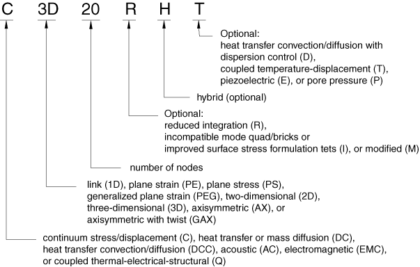
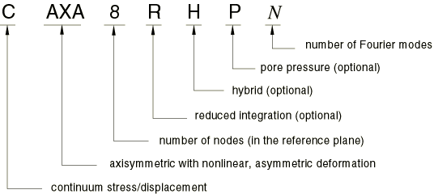
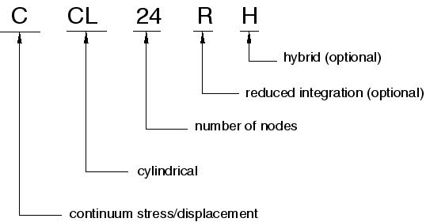
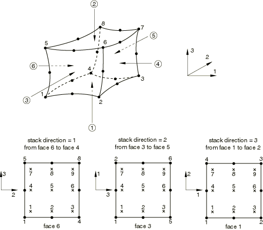
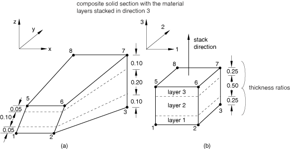

# 28.1.1 Solid (continuum) elements


**Products: **Abaqus/Standard  Abaqus/Explicit  Abaqus/CAE  

##### **References**

- ["Choosing the element's dimensionality," Section 27.1.2](pt06ch27s01aus111.md)
- ["One-dimensional solid (link) element library," Section 28.1.2](pt06ch28s01ael01.md)
- ["Two-dimensional solid element library," Section 28.1.3](pt06ch28s01ael02.md)
- ["Three-dimensional solid element library," Section 28.1.4](pt06ch28s01ael03.md)
- ["Cylindrical solid element library," Section 28.1.5](pt06ch28s01ael04.md)
- ["Axisymmetric solid element library," Section 28.1.6](pt06ch28s01ael05.md)
- ["Axisymmetric solid elements with nonlinear, asymmetric deformation," Section 28.1.7](pt06ch28s01ael06.md)
- [*SOLID SECTION](../key/key-link.md#usb-kws-msolidsection)
- [*HOURGLASS STIFFNESS](../key/key-link.md#usb-kws-mhourglasstiff)
- ["Creating homogeneous solid sections," Section 12.13.1 of the Abaqus/CAE User's Guide](../usi/usi-link.md#usi-prp-section-solid)
- ["Creating composite solid sections," Section 12.13.4 of the Abaqus/CAE User's Guide](../usi/usi-link.md#usi-prp-section-compsolid)
- ["Creating electromagnetic solid sections," Section 12.13.5 of the Abaqus/CAE User's Guide](../usi/usi-link.md#usi-prp-section-electromagsolid)
- ["Assigning a material orientation" in "Assigning a material orientation or rebar reference orientation," Section 12.15.4 of the Abaqus/CAE User's Guide](../usi/usi-link.md#usi-prp-assign-matorient)
- [Chapter 23, "Composite layups," of the Abaqus/CAE User's Guide](../usi/usi-link.md#usi-adv-layups)

### Overview

Solid (continuum) elements:
- are the standard volume elements of Abaqus;
- do not include structural elements such as beams, shells, membranes, and trusses; special-purpose elements such as gap elements; or connector elements such as connectors, springs, and dashpots;
- can be composed of a single homogeneous material or, in Abaqus/Standard, can include several layers of different materials for the analysis of laminated composite solids; and
- are more accurate if not distorted, particularly for quadrilaterals and hexahedra. The triangular and tetrahedral elements are less sensitive to distortion.

### Typical applications

The solid (or continuum) elements in Abaqus can be used for linear analysis and for complex nonlinear analyses involving contact, plasticity, and large deformations. They are available for stress, heat transfer, acoustic, coupled thermal-stress, coupled pore fluid-stress, piezoelectric, magnetostatic, electromagnetic, and coupled thermal-electrical analyses (see ["Choosing the appropriate element for an analysis type," Section 27.1.3](pt06ch27s01aus112.md)).

### Choosing an appropriate element

There are some differences in the solid element libraries available in Abaqus/Standard and Abaqus/Explicit.

**Abaqus/Standard solid element library**

The Abaqus/Standard solid element library includes first-order (linear) interpolation elements and second-order (quadratic) interpolation elements in one, two, or three dimensions. Triangles and quadrilaterals are available in two dimensions; and tetrahedra, triangular prisms, and hexahedra (“bricks”) are provided in three dimensions. Modified second-order triangular and tetrahedral elements are also provided.

Curved (parabolic) edges can be used on the quadratic elements but are not recommended for pore pressure or coupled temperature-displacement elements. Cylindrical elements are provided for structures with edges that are initially circular.

In addition, reduced-integration, hybrid, and incompatible mode elements are available in Abaqus/Standard.

Electromagnetic elements, based on an edge-based interpolation of the magnetic vector potential, are provided both in two and three dimensions.

**Abaqus/Explicit solid element library**

The Abaqus/Explicit solid element library includes first-order (linear) interpolation elements and modified second-order interpolation elements in two or three dimensions. Triangular and quadrilateral first-order elements are available in two dimensions; and tetrahedral, triangular prism, and hexahedral (“brick”) first-order elements are available in three dimensions. The modified second-order elements are limited to triangles and tetrahedra. The acoustic elements in Abaqus/Explicit are limited to first-order (linear) interpolations. For incompatible mode elements only three-dimensional elements are available.

Various two-dimensional models (plane stress, plane strain, axisymmetric) are available in both Abaqus/Standard and Abaqus/Explicit. See ["Choosing the element's dimensionality," Section 27.1.2](pt06ch27s01aus111.md), for details.

Given the wide variety of element types available, it is important to select the correct element for a particular application. Choosing an element for a particular analysis can be simplified by considering specific element characteristics: first- or second-order; full or reduced integration; hexahedra/quadrilaterals or tetrahedra/triangles; or normal, hybrid, or incompatible mode formulation. By considering each of these aspects carefully, the best element for a given analysis can be selected.

#### Choosing between first- and second-order elements

In first-order plane strain, generalized plane strain, axisymmetric quadrilateral, hexahedral solid elements, and cylindrical elements, the strain operator provides constant volumetric strain throughout the element. This constant strain prevents mesh “locking” when the material response is approximately incompressible (see ["Solid isoparametric quadrilaterals and hexahedra," Section 3.2.4 of the Abaqus Theory Guide](../stm/stm-link.md#stm-elm-solidisoquadhex), for a more detailed discussion).

Second-order elements provide higher accuracy in Abaqus/Standard than first-order elements for “smooth” problems that do not involve severe element distortions. They capture stress concentrations more effectively and are better for modeling geometric features: they can model a curved surface with fewer elements. Finally, second-order elements are very effective in bending-dominated problems.

First-order triangular and tetrahedral elements should be avoided as much as possible in stress analysis problems; the elements are overly stiff and exhibit slow convergence with mesh refinement, which is especially a problem with first-order tetrahedral elements. If they are required, an extremely fine mesh may be needed to obtain results of sufficient accuracy.

#### Choosing between full- and reduced-integration elements

Reduced integration uses a lower-order integration to form the element stiffness. The mass matrix and distributed loadings use full integration. Reduced integration reduces running time, especially in three dimensions. For example, element type C3D20 has 27 integration points, while C3D20R has only 8; therefore, element assembly is roughly 3.5 times more costly for C3D20 than for C3D20R.

In Abaqus/Standard you can choose between full or reduced integration for quadrilateral and hexahedral (brick) elements. In Abaqus/Explicit you can choose between full or reduced integration for hexahedral (brick) elements. Only reduced-integration first-order elements are available for quadrilateral elements in Abaqus/Explicit; the elements with reduced integration are also referred to as uniform strain or centroid strain elements with hourglass control.

Second-order reduced-integration elements in Abaqus/Standard generally yield more accurate results than the corresponding fully integrated elements. However, for first-order elements the accuracy achieved with full versus reduced integration is largely dependent on the nature of the problem.

##### Hourglassing

Hourglassing can be a problem with first-order, reduced-integration elements (CPS4R, CAX4R, C3D8R, etc.) in stress/displacement analyses. Since the elements have only one integration point, it is possible for them to distort in such a way that the strains calculated at the integration point are all zero, which, in turn, leads to uncontrolled distortion of the mesh. First-order, reduced-integration elements in Abaqus include hourglass control, but they should be used with reasonably fine meshes. Hourglassing can also be minimized by distributing point loads and boundary conditions over a number of adjacent nodes.

In Abaqus/Standard the second-order reduced-integration elements, with the exception of the 27-node C3D27R and C3D27RH elements, do not have the same difficulty and are recommended in all cases when the solution is expected to be smooth. The C3D27R and C3D27RH elements have three unconstrained, propagating hourglass modes when all 27 nodes are present. These elements should not be used with all 27 nodes, unless they are sufficiently constrained through boundary conditions. First-order elements are recommended when large strains or very high strain gradients are expected.

##### Shear and volumetric locking

Fully integrated elements in Abaqus/Standard and Abaqus/Explicit do not hourglass but may suffer from “locking” behavior: both shear and volumetric locking. Shear locking occurs in first-order, fully integrated elements (CPS4, CPE4, C3D8, etc.) that are subjected to bending. The numerical formulation of the elements gives rise to shear strains that do not really exist—the so-called parasitic shear. Therefore, these elements are too stiff in bending, in particular if the element length is of the same order of magnitude as or greater than the wall thickness. See ["Performance of continuum and shell elements for linear analysis of bending problems," Section 2.3.5 of the Abaqus Benchmarks Guide](../bmk/bmk-link.md#bmk-elm-linbending), for further discussion of the bending behavior of solid elements.

Volumetric locking occurs in fully integrated elements when the material behavior is (almost) incompressible. Spurious pressure stresses develop at the integration points, causing an element to behave too stiffly for deformations that should cause no volume changes. If materials are almost incompressible (elastic-plastic materials for which the plastic strains are incompressible), second-order, fully integrated elements start to develop volumetric locking when the plastic strains are on the order of the elastic strains. However, the first-order, fully integrated quadrilaterals and hexahedra use selectively reduced integration (reduced integration on the volumetric terms). Therefore, these elements do not lock with almost incompressible materials. Reduced-integration, second-order elements develop volumetric locking for almost incompressible materials only after significant straining occurs. In this case, volumetric locking is often accompanied by a mode that looks like hourglassing. Frequently, this problem can be avoided by refining the mesh in regions of large plastic strain.

If volumetric locking is suspected, check the pressure stress at the integration points (printed output). If the pressure values show a checkerboard pattern, changing significantly from one integration point to the next, volumetric locking is occurring. Choosing a quilt-style contour plot in the Visualization module of Abaqus/CAE will show the effect.

#### Specifying nondefault section controls

You can specify a nondefault hourglass control formulation or scale factor for reduced-integration first-order elements (4-node quadrilaterals and 8-node bricks with one integration point). See ["Section controls," Section 27.1.4](pt06ch27s01aus113.md), for more information about section controls.

In Abaqus/Explicit section controls can also be used to specify a nondefault kinematic formulation for 8-node brick elements, the accuracy order of the element formulation, and distortion control for either 4-node quadrilateral or 8-node brick elements. Section controls are also used with coupled temperature-displacement elements in Abaqus/Explicit to change the default values for the mechanical response analysis.

In Abaqus/Standard you can specify nondefault hourglass stiffness factors based on the default total stiffness approach for reduced-integration first-order elements (4-node quadrilaterals and 8-node bricks with one integration point) and modified tetrahedral and triangular elements.

There are no hourglass stiffness factors or scale factors for the nondefault enhanced hourglass control formulation. See ["Section controls," Section 27.1.4](pt06ch27s01aus113.md), for more information about hourglass control.

| **Input File Usage: ** | Use both of the following options to associate a section control definition with the element section definition: |
| --- | --- |
|  | ``` [*SECTION CONTROLS](../key/key-link.md#usb-kws-msectioncontrols), NAME=*name* [*SOLID SECTION](../key/key-link.md#usb-kws-msolidsection), CONTROLS=*name* ``` Use both of the following options in Abaqus/Standard to specify nondefault hourglass stiffness factors for the total stiffness approach: ``` [*SOLID SECTION](../key/key-link.md#usb-kws-msolidsection) [*HOURGLASS STIFFNESS](../key/key-link.md#usb-kws-mhourglasstiff) ``` |

| **Abaqus/CAE Usage: ** | Mesh module: **Element Type**: **Element Controls** **Element Type**: **Hourglass stiffness**: **Specify** |
| --- | --- |

#### Choosing between bricks/quadrilaterals and tetrahedra/triangles

Triangular and tetrahedral elements are geometrically versatile and are used in many automatic meshing algorithms. It is very convenient to mesh a complex shape with triangles or tetrahedra, and the second-order and modified triangular and tetrahedral elements (CPE6, CPE6M, C3D10, C3D10M, etc.) in Abaqus are suitable for general usage. However, a good mesh of hexahedral elements usually provides a solution of equivalent accuracy at less cost. Quadrilaterals and hexahedra have a better convergence rate than triangles and tetrahedra, and sensitivity to mesh orientation in regular meshes is not an issue. However, triangles and tetrahedra are less sensitive to initial element shape, whereas first-order quadrilaterals and hexahedra perform better if their shape is approximately rectangular. The elements become much less accurate when they are initially distorted (see ["Performance of continuum and shell elements for linear analysis of bending problems," Section 2.3.5 of the Abaqus Benchmarks Guide](../bmk/bmk-link.md#bmk-elm-linbending)).

First-order triangles and tetrahedra are usually overly stiff, and extremely fine meshes are required to obtain accurate results. As mentioned earlier, fully integrated first-order triangles and tetrahedra in Abaqus/Standard also exhibit volumetric locking in incompressible problems. As a rule, these elements should not be used except as filler elements in noncritical areas. Therefore, try to use well-shaped elements in regions of interest.

##### Tetrahedral and wedge elements

For stress/displacement analyses the first-order tetrahedral element C3D4 is a constant stress tetrahedron, which should be avoided as much as possible; the element exhibits slow convergence with mesh refinement. This element provides accurate results only in general cases with very fine meshing. Therefore, C3D4 is recommended only for filling in regions of low stress gradient in meshes of C3D8 or C3D8R elements, when the geometry precludes the use of C3D8 or C3D8R elements throughout the model. For tetrahedral element meshes the second-order or the modified tetrahedral elements, C3D10 or C3D10M, should be used.

Similarly, the linear version of the wedge element C3D6 should generally be used only when necessary to complete a mesh, and, even then, the element should be far from any areas where accurate results are needed. This element provides accurate results only with very fine meshing. 

#### Modified triangular and tetrahedral elements

A family of modified 6-node triangular and 10-node tetrahedral elements is available that provides improved performance over the first-order triangular and tetrahedral elements and that occasionally provides improved behavior to regular second-order triangular and tetrahedral elements. In Abaqus/Explicit these modified triangular and tetrahedral elements are the only 6-node triangular and 10-node tetrahedral elements available. Regular second-order triangular and tetrahedral elements are typically preferable in Abaqus/Standard; however, regular second-order triangular and tetrahedral elements may exhibit “volumetric locking” when incompressibility is approached, such as in problems with a large amount of plastic deformation. As discussed in ["Three-dimensional surfaces with second-order faces and a node-to-surface formulation" in "Common difficulties associated with contact modeling in Abaqus/Standard," Section 39.1.2](pt09ch39s01aus184.md#usb-cni-acontacttrouble-3dsurf), regular second-order tetrahedral elements cannot underly a slave surface for the node-to-surface contact formulation with strict enforcement of a “hard” contact relationship. This limitation is typically not significant because the surface-to-surface contact formulation and penalty contact enforcement are generally recommended.

Modified triangular and tetrahedral elements work well in contact, exhibit minimal shear and volumetric locking, and are robust during finite deformation (see ["The Hertz contact problem," Section 1.1.11 of the Abaqus Benchmarks Guide](../bmk/bmk-link.md#bmk-anl-hertzcontact), and ["Upsetting of a cylindrical billet: coupled temperature-displacement and adiabatic analysis," Section 1.3.16 of the Abaqus Example Problems Guide](../exa/exa-link.md#exa-sta-cylbillet)). These elements use a lumped matrix formulation for dynamic analysis. Modified triangular elements are provided for planar and axisymmetric analysis, and modified tetrahedra are provided for three-dimensional analysis. In addition, hybrid versions of these elements are provided in Abaqus/Standard for use with incompressible and nearly incompressible constitutive models.

When the total stiffness approach is chosen, modified tetrahedral and triangular elements (C3D10M, CPS6M, CAX6M, etc.) use hourglass control associated with their internal degrees of freedom. The hourglass modes in these elements do not usually propagate; hence, the hourglass stiffness is usually not as significant as for first-order elements.

For most Abaqus/Standard analysis models the same mesh density appropriate for the regular second-order triangular and tetrahedral elements can be used with the modified elements to achieve similar accuracy. For comparative results, see the following:
- ["Geometrically nonlinear analysis of a cantilever beam," Section 2.1.2 of the Abaqus Benchmarks Guide](../bmk/bmk-link.md#bmk-elm-nlgeocantilever)
- ["Performance of continuum and shell elements for linear analysis of bending problems," Section 2.3.5 of the Abaqus Benchmarks Guide](../bmk/bmk-link.md#bmk-elm-linbending)
- ["LE1: Plane stress elements---elliptic membrane," Section 4.2.1 of the Abaqus Benchmarks Guide](../bmk/bmk-link.md#bmk-nfm-le1)
- ["LE10: Thick plate under pressure," Section 4.2.10 of the Abaqus Benchmarks Guide](../bmk/bmk-link.md#bmk-nfm-le10)
- ["FV32: Cantilevered tapered membrane," Section 4.4.7 of the Abaqus Benchmarks Guide](../bmk/bmk-link.md#bmk-nfm-fv32)
- ["FV52: Simply supported "solid" square plate," Section 4.4.10 of the Abaqus Benchmarks Guide](../bmk/bmk-link.md#bmk-nfm-fv52)

 However, in analyses involving thin bending situations with finite deformations (see ["Pressurized rubber disc," Section 1.1.7 of the Abaqus Benchmarks Guide](../bmk/bmk-link.md#bmk-anl-rubberdisk)) and in frequency analyses where high bending modes need to be captured accurately (see ["FV41: Free cylinder: axisymmetric vibration," Section 4.4.8 of the Abaqus Benchmarks Guide](../bmk/bmk-link.md#bmk-nfm-fv41)), the mesh has to be more refined for the modified triangular and tetrahedral elements (by at least one and a half times) to attain accuracy comparable to the regular second-order elements.

The modified triangular and tetrahedral elements might not be adequate to be used in the coupled pore fluid diffusion and stress analysis in the presence of large pore pressure fields if enhanced hourglass control is used.

The modified elements are more expensive computationally than lower-order quadrilaterals and hexahedron and sometimes require a more refined mesh for the same level of accuracy. However, in Abaqus/Explicit they are provided as an attractive alternative to the lower-order triangles and tetrahedron to take advantage of automatic triangular and tetrahedral mesh generators.

##### Compatibility with other elements

The modified triangular and tetrahedral elements are incompatible with the regular second-order solid elements in Abaqus/Standard. Thus, they should not be connected with these elements in a mesh.

##### Surface stress output

In areas of high stress gradients, stresses extrapolated from the integration points to the nodes are not as accurate for the modified elements as for similar second-order triangles and tetrahedra in Abaqus/Standard. In cases where more accurate surface stresses are needed, the surface can be coated with membrane elements that have a significantly lower stiffness than the underlying material. The stresses in these membrane elements will then reflect more accurately the surface stress and can be used for output purposes.

##### Fully constrained displacements

In Abaqus/Standard if all the displacement degrees of freedom on all the nodes of a modified element are constrained with boundary conditions, a similar boundary condition is applied to an internal node in the element. If a distributed load is subsequently applied to this element, the reported reaction forces at the nodes you defined will not sum up to the applied load since some of the applied load is taken by the internal node whose reaction force is not reported.

#### Choosing between regular and hybrid elements

Hybrid elements are intended primarily for use with incompressible and almost incompressible material behavior; these elements are available only in Abaqus/Standard. When the material response is incompressible, the solution to a problem cannot be obtained in terms of the displacement history only, since a purely hydrostatic pressure can be added without changing the displacements.

##### Almost incompressible material behavior

Near-incompressible behavior occurs when the bulk modulus is very much larger than the shear modulus (for example, in linear elastic materials where the Poisson's ratio is greater than .48) and exhibits behavior approaching the incompressible limit: a very small change in displacement produces extremely large changes in pressure. Therefore, a purely displacement-based solution is too sensitive to be useful numerically (for example, computer round-off may cause the method to fail).

This singular behavior is removed from the system by treating the pressure stress as an independently interpolated basic solution variable, coupled to the displacement solution through the constitutive theory and the compatibility condition. This independent interpolation of pressure stress is the basis of the hybrid elements. Hybrid elements have more internal variables than their nonhybrid counterparts and are slightly more expensive. See ["Hybrid incompressible solid element formulation," Section 3.2.3 of the Abaqus Theory Guide](../stm/stm-link.md#stm-elm-hybridincompress), for further details.

##### Fully incompressible material behavior

Hybrid elements must be used if the material is fully incompressible (except in the case of plane stress since the incompressibility constraint can be satisfied by adjusting the thickness). If the material is almost incompressible and hyperelastic, hybrid elements are still recommended. For almost incompressible, elastic-plastic materials and for compressible materials, hybrid elements offer insufficient advantage and, hence, should not be used.

For Mises and Hill plasticity the plastic deformation is fully incompressible; therefore, the rate of total deformation becomes incompressible as the plastic deformation starts to dominate the response. All of the quadrilateral and brick elements in Abaqus/Standard can handle this rate-incompressibility condition except for the fully integrated quadrilateral and brick elements without the hybrid formulation: CPE8, CPEG8, CAX8, CGAX8, and C3D20. These elements will “lock” (become overconstrained) as the material becomes more incompressible.

##### Elastic strains in hybrid elements

Hybrid elements use an independent interpolation for the hydrostatic pressure, and the elastic volumetric strain is calculated from the pressure. Hence, the elastic strains agree exactly with the stress, but they agree with the total strain only in an element average sense and not pointwise, even if no inelastic strains are present. For isotropic materials this behavior is noticeable only in second-order, fully integrated hybrid elements. In these elements the hydrostatic pressure (and, thus, the volumetric strain) varies linearly over the element, whereas the total strain may exhibit a quadratic variation.

For anisotropic materials this behavior also occurs in first-order, fully integrated hybrid elements. In such materials there is typically a strong coupling between volumetric and deviatoric behavior: volumetric strain will give rise to deviatoric stresses and, conversely, deviatoric strains will give rise to hydrostatic pressure. Hence, the constant hydrostatic pressure enforced in the fully integrated, first-order hybrid elements does not generally yield a constant elastic strain; whereas the total volume strain is always constant for these elements, as discussed earlier in this section. Therefore, hybrid elements are not recommended for use with anisotropic materials unless the material is approximately incompressible, which usually implies that the coupling between deviatoric and volume behavior is relatively weak.

##### Using hybrid elements with material models that exhibit volumetric plasticity

If the material model exhibits volumetric plasticity, such as the (capped) Drucker-Prager model, slow convergence or convergence problems may occur if second-order hybrid elements are used. In that case good results can usually be obtained with regular (nonhybrid) second-order elements.

##### Determining the need for hybrid elements

For nearly incompressible materials a displaced shape plot that shows a more or less homogeneous but nonphysical pattern of deformation is an indication of mesh locking. As previously discussed, fully integrated elements should be changed to reduced-integration elements in this case. If reduced-integration elements are already being used, the mesh density should be increased. Finally, hybrid elements can be used if problems persist.

##### Hybrid triangular and tetrahedral elements

The following hybrid, triangular, two-dimensional and axisymmetric elements should be used only for mesh refinement or to fill in regions of meshes of quadrilateral elements: CPE3H, CPEG3H, CAX3H, and CGAX3H. Hybrid, three-dimensional tetrahedral elements C3D4H and prism elements C3D6H should be used only for mesh refinement or to fill in regions of meshes of brick-type elements. Since each C3D6H element introduces a constraint equation in a fully incompressible problem, a mesh containing only these elements will be overconstrained. Abutting regions of C3D4H elements with different material properties should be tied rather than sharing nodes to allow discontinuity jumps in the pressure and volumetric fields. 

In addition, the second-order three-dimensional hybrid elements C3D10H, C3D10MH, C3D15H, and C3D15VH are significantly more expensive than their nonhybrid counterparts.

#### Multi-purpose, improved surface stress visualization tetrahedra

The C3D10I tetrahedron has been developed for improved bending results in coarse meshes while avoiding pressure locking in metal plasticity and quasi-incompressible and incompressible rubber elasticity.   These elements are available only in Abaqus/Standard. Internal pressure degrees of freedom are activated automatically for a given element once the material exhibits behavior approaching the incompressible limit (i.e., an effective Poisson's ratio above .45).  This unique feature of C3D10I elements make it especially suitable for modeling metal plasticity, since it activates the pressure degrees of freedom only in the regions of the model where the material is incompressible. Once the internal degrees of freedom are activated, C3D10I elements have more internal variables than either hybrid or nonhybrid elements and, thus, are more expensive.  This element also uses a unique 11-point integration scheme, providing a superior stress visualization scheme in coarse meshes as it  avoids errors due to the extrapolation of stress components from the integration points to the nodes.

#### Incompatible mode elements

Incompatible mode elements (CPS4I, CPE4I, CAX4I, CPEG4I, and C3D8I and the corresponding hybrid elements) are first-order elements that are enhanced by incompatible modes to improve their bending behavior; all of these elements are available in Abaqus/Standard and only element C3D8I is available in Abaqus/Explicit.

In addition to the standard displacement degrees of freedom, incompatible deformation modes are added internally to the elements. The primary effect of these modes is to eliminate the parasitic shear stresses that cause the response of the regular first-order displacement elements to be too stiff in bending. In addition, these modes eliminate the artificial stiffening due to Poisson's effect in bending (which is manifested in regular displacement elements by a linear variation of the stress perpendicular to the bending direction). In the nonhybrid elements—except for the plane stress element, CPS4I—additional incompatible modes are added to prevent locking of the elements with approximately incompressible material behavior. For fully incompressible material behavior the corresponding hybrid elements must be used.

Because of the added internal degrees of freedom due to the incompatible modes (4 for CPS4I; 5 for CPE4I, CAX4I, and CPEG4I; and 13 for C3D8I), these elements are somewhat more expensive than the regular first-order displacement elements; however, they are significantly more economical than second-order elements. The incompatible mode elements use full integration and, thus, have no hourglass modes.

Incompatible mode elements are discussed in more detail in ["Continuum elements with incompatible modes," Section 3.2.5 of the Abaqus Theory Guide](../stm/stm-link.md#stm-elm-incompatible).

##### Shape considerations

The incompatible mode elements perform almost as well as second-order elements in many situations if the elements have an approximately rectangular shape. The performance is reduced considerably if the elements have a parallelogram shape. The performance of trapezoidal-shaped incompatible mode elements is not much better than the performance of the regular, fully integrated, first-order interpolation elements; see ["Performance of continuum and shell elements for linear analysis of bending problems," Section 2.3.5 of the Abaqus Benchmarks Guide](../bmk/bmk-link.md#bmk-elm-linbending), which illustrates the loss of accuracy associated with distorted elements.

##### Using incompatible mode elements in large-strain applications

Incompatible mode elements should be used with caution in applications involving large compressive strains. Convergence may be slow at times, and inaccuracies may accumulate in hyperelastic applications. Hence, erroneous residual stresses may sometimes appear in hyperelastic elements that are unloaded after having been subjected to a complex deformation history.

##### Using incompatible mode elements with regular elements

Incompatible mode elements can be used in the same mesh with regular solid elements. Generally the incompatible mode elements should be used in regions where bending response must be modeled accurately, and they should be of rectangular shape to provide the most accuracy. While these elements often provide accurate response in such cases, it is generally preferable to use structural elements (shells or beams) to model structural components.

#### Variable node elements

Variable node elements (such as C3D27 and C3D15V) allow midface nodes to be introduced on any element face (on any rectangular face only for the triangular prism C3D15V). The choice is made by the nodes specified in the element definition. These elements are available only in Abaqus/Standard and can be used quite generally in any three-dimensional model. The C3D27 family of elements is frequently used as the ring of elements around a crack line.

#### Cylindrical elements

Cylindrical elements (CCL9, CCL9H, CCL12, CCL12H, CCL18, CCL18H, CCL24, CCL24H, and CCL24RH) are available only in Abaqus/Standard for precise modeling of regions in a structure with circular geometry, such as a tire. The elements make use of trigonometric functions to interpolate displacements along the circumferential direction and use regular isoparametric interpolation in the radial or cross-sectional plane of the element. All the elements use three nodes along the circumferential direction and can span angles between 0 and 180. Elements with both first-order and second-order interpolation in the cross-sectional plane are available.

The geometry of the element is defined by specifying nodal coordinates in a global Cartesian system. The default nodal output is also provided in a global Cartesian system. Output of stress, strain, and other material point output quantities are done, by default, in a fixed local cylindrical system where direction 1 is the radial direction, direction 2 is the axial direction, and direction 3 is the circumferential direction. This default system is computed from the reference configuration of the element. An alternative local system can be defined (see ["Orientations," Section 2.2.5](pt01ch02s02aus15.md)). In this case the output of stress, strain, and other material point quantities is done in the oriented system.

The cylindrical elements can be used in the same mesh with regular elements. In particular, regular solid elements can be connected directly to the nodes on the cross-sectional plane of cylindrical elements. For example, any face of a C3D8 element can share nodes with the cross-sectional faces (faces 1 and 2; see ["Cylindrical solid element library," Section 28.1.5](pt06ch28s01ael04.md), for a description of the element faces) of a CCL12 element. Regular elements can also be connected along the circular edges of cylindrical elements by using a surface-based tie constraint (["Mesh tie constraints," Section 35.3.1](pt08ch35s03aus132.md)) provided that the cylindrical elements do not span a large segment. However, such usage may result in spurious oscillations in the solution near the tied surfaces and should be avoided when an accurate solution in this region is required.

Compatible membrane elements (["Membrane elements," Section 29.1.1](pt06ch29s01alm05.md)) and surface elements with rebar (["Surface elements," Section 32.7.1](pt06ch32s07alm52.md)) are available for use with cylindrical solid elements.

All elements with first-order interpolation in the cross-sectional plane use full integration for the deviatoric terms and reduced integration for the volumetric terms and, thus, have no hourglass modes and do not lock with almost incompressible materials. The hybrid elements with first-order and second-order interpolation in the cross-sectional plane use an independent interpolation for hydrostatic pressure.

#### Summary of recommendations for element usage

The following recommendations apply to both Abaqus/Standard and Abaqus/Explicit:
- Make all elements as "well shaped" as possible to improve convergence and accuracy.
- If an automatic tetrahedral mesh generator is used, use the second-order elements C3D10 (in Abaqus/Standard) or C3D10M (in Abaqus/Explicit). Use the modified tetrahedral element C3D10M in Abaqus/Standard in analyses with large amounts of plastic deformation.
- If possible, use hexahedral elements in three-dimensional analyses since they give the best results for the minimum cost.

Abaqus/Standard users should also consider the following recommendations:- For linear and "smooth" nonlinear problems use reduced-integration, second-order elements if possible.
- Use second-order, fully integrated elements close to stress concentrations to capture the severe gradients in these regions. However, avoid these elements in regions of finite strain if the material response is nearly incompressible.
- Use first-order quadrilateral or hexahedral elements or the modified triangular and tetrahedral elements for problems involving large distortions. If the mesh distortion is severe, use reduced-integration, first-order elements.
- If the problem involves bending and large distortions, use a fine mesh of first-order, reduced-integration elements.
- Hybrid elements must be used if the material is fully incompressible (except when using plane stress elements). Hybrid elements should also be used in some cases with nearly incompressible materials.
- Incompatible mode elements can give very accurate results in problems dominated by bending.

### Naming convention

The naming conventions for solid elements depend on the element dimensionality.

#### One-dimensional, two-dimensional, three-dimensional, and axisymmetric elements

One-dimensional, two-dimensional, three-dimensional, and axisymmetric solid elements in Abaqus are named as follows:



For example, CAX4R is an axisymmetric continuum stress/displacement, 4-node, reduced-integration element; and CPS8RE is an 8-node, reduced-integration, plane stress piezoelectric element. The exception for this naming convention is C3D6 and C3D6T in Abaqus/Explicit, which are 6-node linear triangular prism, reduced integration elements.

The pore pressure elements violate this naming convention slightly: the hybrid elements have the letter H after the letter P.  For example, CPE8PH is an 8-node, hybrid, plane strain, pore pressure element.

#### Axisymmetric elements with nonlinear asymmetric deformation

The axisymmetric solid elements with nonlinear asymmetric deformation in Abaqus/Standard are named as follows:



For example, CAXA4RH1 is a 4-node, reduced-integration, hybrid, axisymmetric element with nonlinear asymmetric deformation and one Fourier mode (see ["Choosing the element's dimensionality," Section 27.1.2](pt06ch27s01aus111.md)).

#### Cylindrical elements

The cylindrical elements in Abaqus/Standard are named as follows:



For example, CCL24RH is a 24-node, hybrid, reduced-integration cylindrical element.

### Defining the element's section properties

A solid section definition is used to define the section properties of solid elements.

In Abaqus/Standard solid elements can be composed of a single homogeneous material or can include several layers of different materials for the analysis of laminated composite solids. In Abaqus/Explicit solid elements can be composed only of a single homogeneous material.

#### Defining homogeneous solid elements

You must associate a material definition (["Material data definition," Section 21.1.2](pt05ch21s01aus109.md)) with the solid section definition. In  an Abaqus/Standard analysis spatially varying material behavior defined with one or more distributions (["Distribution definition," Section 2.8.1](pt01ch02s08aus26.md)) can be assigned to the solid section definition. In addition, you must associate the section definition with a region of your model.

In Abaqus/Standard if any of the material behaviors assigned to the solid section definition (through the material definition) are defined with distributions, spatially varying material properties are applied to all elements associated with the solid section. Default material behaviors (as defined by the distributions) are applied to any element that is not specifically included in the associated distribution.

| **Input File Usage: ** | ``` [*SOLID SECTION](../key/key-link.md#usb-kws-msolidsection), MATERIAL=*name*, ELSET=*name* ``` |
| --- | --- |
|  | where the ELSET parameter refers to a set of solid elements. |

| **Abaqus/CAE Usage: ** | Property module: **Create Section**: select **Solid** as the section **Category** and **Homogeneous** or **Electromagnetic, Solid** as the section **Type**: **Material:** *name* ****Assign****Section****: select regions |
| --- | --- |

##### Assigning an orientation definition

You can associate a material orientation definition with solid elements (see ["Orientations," Section 2.2.5](pt01ch02s02aus15.md)). A spatially varying local coordinate system defined with a distribution (["Distribution definition," Section 2.8.1](pt01ch02s08aus26.md)) can be assigned to the solid section definition.

If the orientation definition assigned to the solid section definition is defined with distributions, spatially varying local coordinate systems are applied to all elements associated with the solid section. A default local coordinate system (as defined by the distributions) is applied to any element that is not specifically included in the associated distribution.

| **Input File Usage: ** | ``` [*SOLID SECTION](../key/key-link.md#usb-kws-msolidsection), ORIENTATION=*name* ``` |
| --- | --- |

| **Abaqus/CAE Usage: ** | Property module: ****Assign****Material Orientation**** |
| --- | --- |

##### Defining the geometric attributes, if required

For some element types additional geometric attributes are required, such as the cross-sectional area for one-dimensional elements or the thickness for two-dimensional plane elements. The attributes required for a particular element type are defined in the solid element libraries. These attributes are given as part of the solid section definition.

#### Defining composite solid elements in Abaqus/Standard

The use of composite solids is limited to three-dimensional brick elements that have only displacement degrees of freedom (they are not available for coupled temperature-displacement elements, piezoelectric elements, pore pressure elements, and continuum cylindrical elements). Composite solid elements are primarily intended for modeling convenience. They usually do not provide a more accurate solution than composite shell elements.

The thickness, the number of section points required for numerical integration through each layer (discussed below), and the material name and orientation associated with each layer are specified as part of the composite solid section definition.  In Abaqus/Standard spatially varying orientation angles can be specified on a layer using distributions (["Distribution definition," Section 2.8.1](pt01ch02s08aus26.md)).

The material layers can be stacked in any of the three isoparametric coordinates, parallel to opposite faces of the isoparametric master element as shown in [Figure 28.1.1--1](pt06ch28s01alm01.md#esolid-stack-dir). The number of integration points within a layer at any given section point depends on the element type. [Figure 28.1.1--1](pt06ch28s01alm01.md#esolid-stack-dir) shows the integration points for a fully integrated element.

**Figure 28.1.1–1** Stacking direction and associated element faces and positions of element integration point output variables in the layer plane.



The element faces are defined by the order in which the nodes are specified when the element is defined.

The element matrices are obtained by numerical integration. Gauss quadrature is used in the plane of the lamina, and Simpson's rule is used in the stacking direction. If one section point through the layer is used, it will be located in the middle of the layer thickness. The location of the section points in the plane of the lamina coincides with the location of the integration points. The number of section points required for the integration through the thickness of each layer is specified as part of the solid section definition; this number must be an odd number. The integration points for a fully integrated second-order composite element are shown in [Figure 28.1.1--1](pt06ch28s01alm01.md#esolid-stack-dir), and the numbering of section points that are associated with an arbitrary integration point in a composite solid element is illustrated in [Figure 28.1.1--2](pt06ch28s01alm01.md#composite-sect-pts). 

**Figure 28.1.1–2** Numbering of section points in a three-layered composite element.


The thickness of each layer may not be constant from integration point to integration point within an element since the element dimensions in the stack direction may vary. Therefore, it is defined indirectly by specifying the ratio between the thickness and the element length along the stack direction in the solid section definition, as shown in [Figure 28.1.1--3](pt06ch28s01alm01.md#laminae-isospace). Using the ratios that are defined for all layers, actual thicknesses will be determined at each integration point such that their sum equals the element length in the stack direction. The thickness ratios for the layers need not reflect actual element or model dimensions. 

**Figure 28.1.1–3** Lamina in (a) real space and (b) isoparametric space.



Unless your model is relatively simple, you will find it increasingly difficult to define your model using composite solid sections as you increase the number of layers and as you assign different sections to different regions. It can also be cumbersome to redefine the sections after you add new layers or remove or reposition existing layers. To manage a large number of layers in a typical composite model, you may want to use the composite layup functionality in Abaqus/CAE. For more information, see [Chapter 23, "Composite layups," of the Abaqus/CAE User's Guide](../usi/usi-link.md#usi-adv-layups).

For postprocessing composite solid elements appear in the output database (`.odb`) file with C1, C2, or C3 appended to the element type to represent the stacking direction of 1, 2, or 3, respectively.

| **Input File Usage: ** | ``` [*SOLID SECTION](../key/key-link.md#usb-kws-msolidsection), COMPOSITE, STACK DIRECTION=1, 2, or 3, ELSET=*name* *thickness, number of integration points, material name, orientation name* ``` |
| --- | --- |

| **Abaqus/CAE Usage: ** | Abaqus/CAE uses a composite layup or a composite solid section to define the layers of a composite solid. |
| --- | --- |
|  | Use the following option for a composite layup: Property module: **Create Composite Layup**: select **Solid** as the **Element Type**: specify stacking direction, regions, thicknesses, number of integration points, materials, and orientations Use the following options for a composite solid section: Property module: **Create Section**: select **Solid** as the section **Category** and **Composite** as the section **Type******Assign****Material Orientation****: select regions: **Use Default Orientation or Other Method**: **Stacking Direction**: **Element direction 1**, **Element direction 2**, **Element direction 3**, or **From orientation******Assign****Section****: select regions |

##### Output locations for composite solid elements

You specify the location of the output variables in the plane of the lamina (layers) when you request output of element variables. For example, you can request values at the centroid of each layer. In addition, you specify the number of output points through the thickness of the layers by providing a list of the “section points.” The default section points for the output are the first and the last section point corresponding to the bottom and the top face, respectively (see [Figure 28.1.1--2](pt06ch28s01alm01.md#composite-sect-pts)). See ["Element output" in "Output to the data and results files," Section 4.1.2](pt02ch04s01aus39.md#usb-out-oprintfile-elementoutput), and ["Element output" in "Output to the output database," Section 4.1.3](pt02ch04s01aus40.md#usb-out-odboutput-elementoutput), for more information.

### Modeling thick composites with solid elements in Abaqus/Standard

While laminated composite solids are typically modeled using shell elements, the following cases require three-dimensional brick elements with one or multiple brick elements per layer: when transverse shear effects are predominant; when the normal stress cannot be ignored; and when accurate interlaminar stresses are required, such as near localized regions of complex loading or geometry.

One case in which shell elements perform somewhat better than solid elements is in modeling the transverse shear stress through the thickness. The transverse shear stresses in solid elements usually do not vanish at the free surfaces of the structure and are usually discontinuous at layer interfaces. This deficiency may be present even if several elements are used in the discretization through the section thickness. Since the transverse shear stresses in thick shell elements are calculated by Abaqus on the basis of linear elasticity theory, such stresses are often better estimated by thick shell elements than by solid elements (see ["Composite shells in cylindrical bending," Section 1.1.3 of the Abaqus Benchmarks Guide](../bmk/bmk-link.md#bmk-anl-compositeshells)).

### Defining pressure loads on continuum elements

The convention used for pressure loading on a continuum element is that positive pressure is directed into the element; that is, it pushes on the element. In large-strain analyses special consideration is necessary for plane stress elements that are pressure loaded on their edges; this issue is discussed in ["Distributed loads," Section 34.4.3](pt07ch34s04aus122.md).

### Using solid elements in a rigid body

All solid elements can be included in a rigid body definition. When solid elements are assigned to a rigid body, they are no longer deformable and their motion is governed by the motion of the rigid body reference node (see ["Rigid body definition," Section 2.4.1](pt01ch02s04aus22.md)).

Section properties for solid elements that are part of a rigid body must be defined to properly account for rigid body mass and rotary inertia. All associated material properties will be ignored except for the density. Element output is not available for solid elements assigned to a rigid body.

### Automatic conversion of certain element types in Abaqus/Standard

Element types C3D20 and C3D15 are converted automatically to the corresponding variable node element types C3D27 and C3D15V, respectively, if they have faces that are part of the slave surface in a node-to-surface contact pair (see ["Adjusting contact controls in Abaqus/Standard," Section 36.3.6](pt09ch36s03aus150.md)). 

### Special considerations for various element types in Abaqus/Standard

The following considerations should be acknowledged in the context of the stress/displacement, coupled temperature-displacement, and heat transfer elements in Abaqus/Standard.

#### Interpolation of temperature and field variables in stress/displacement elements

The value of temperatures at the integration points used to compute the thermal stresses depends on whether first-order or second-order elements are used. An average temperature is used at the integration points in (compatible) linear elements so that the thermal strain is constant throughout the element; in the case of elements with incompatible modes the temperatures are interpolated linearly. An approximate linearly varying temperature distribution is used in higher-order elements with full integration. Higher-order reduced-integration elements pose no special problems since the temperatures are interpolated linearly. Field variables in a given stress/displacement element are interpolated using the same scheme used to interpolate temperatures.

#### Interpolation in coupled temperature-displacement elements

Coupled temperature-displacement elements use either linear or parabolic interpolation for the geometry and displacements. Temperature is interpolated linearly, but certain rules can apply to the temperature and field variable evaluation at the Gauss points, as discussed below.

The elements that use linear interpolation for displacements and temperatures have temperatures at all nodes. The thermal strain is taken as constant throughout the element because it is desirable to have the same interpolation for thermal strains as for total strains so as to avoid spurious hydrostatic stresses. Separate integration schemes are used for the internal energy storage, heat conduction, and plastic dissipation (coupling contribution) terms for the first-order elements. The internal energy storage term is integrated at the nodes, which yields a lumped internal energy matrix and, thereby, improves the accuracy for problems with latent heat effects. In fully integrated elements both the heat conduction and plastic dissipation terms are integrated at the Gauss points. While the plastic dissipation term is integrated at each Gauss point, the heat generated by the mechanical deformation at a Gauss point is applied at the nearest node. The temperature at a Gauss point is assumed to be the temperature of its nearest node to be consistent with the temperature treatment throughout the formulation. In reduced-integration elements the plastic dissipation term is obtained at the centroid and the heat generated by the mechanical deformation is applied as a weighted average at each node. The temperature at the centroid of reduced-integration elements is a weighted average of the nodal temperatures to be consistent with the temperature treatment throughout the formulation.

The elements that use parabolic interpolation for displacements and linear interpolation for temperatures have displacement degrees of freedom at all of the nodes, but temperature degrees of freedom exist only at the corner nodes. The temperatures are interpolated linearly so that the thermal strains have the same interpolation as the total strains. Temperatures at the midside nodes are calculated by linear interpolation from the corner nodes for output purposes only. In contrast to the linear coupled elements, all terms in the governing equations are integrated using a conventional Gauss scheme. For these elements the stiffness matrix can be generated using either full integration (3 Gauss points in each parametric direction) or reduced integration (2 Gauss points in each parametric direction). The same integration scheme is always used for the specific heat and conductivity matrices as for the stiffness matrix; however, because of the lower-order interpolation for temperature, this implies that we always use a full integration scheme for the heat transfer matrices, even when the stiffness integration is reduced. Reduced integration uses a lower-order integration to form the element stiffness: the mass matrix and distributed loadings are still integrated exactly. Reduced integration usually provides more accurate results (providing that the elements are not distorted) and significantly reduces running time, especially in three dimensions. Reduced integration for the quadratic displacement elements is recommended in all cases except when very sharp strain gradients are expected (such as in finite-strain metal forming applications); these elements are considered to be the most cost-effective elements of this class.

The value of field variables at the integration points depends on whether first-order or second-order coupled temperature-displacement elements are used. An average field variable is used at the integration points in linear elements. An approximate linearly varying field variable distribution is used in higher-order elements with full integration. Higher-order reduced-integration elements pose no special problems since the field variables are interpolated linearly. 

Modified triangle and tetrahedron elements use a special consistent interpolation scheme for displacement and temperature. Displacement and temperature degrees of freedom are active at all user-defined nodes.

#### Integration in diffusive heat transfer elements

In all of the first-order elements (2-node links, 3-node triangles, 4-node quadrilaterals, 4-node tetrahedra, 6-node triangular prisms, and 8-node bricks) the internal energy storage term (associated with specific heat and latent heat storage) is integrated at the nodes. This integration scheme gives a diagonal internal energy matrix and improves the accuracy for problems with latent heat effects. Conduction contributions in these elements and all contributions in second-order elements use conventional Gauss schemes. Second-order elements are preferable for smooth problems without latent heat effects.

The one-dimensional element cannot be used in a mass diffusion analysis.

#### Forced convection heat transfer elements

These elements are available with linear interpolation only. They use an “upwinding” (Petrov-Galerkin) method to provide accurate solutions for convection-dominated problems (see ["Convection/diffusion," Section 2.11.3 of the Abaqus Theory Guide](../stm/stm-link.md#stm-anl-convectelems)). Consequently, the internal energy (associated with specific heat storage) is not integrated at the nodes, which yields a consistent internal energy matrix and may cause oscillatory temperatures if strong temperature gradients occur along boundaries that are parallel to the flow direction.

#### Electromagnetic elements

These elements are available with linear edge-based interpolation only. The user-defined nodes define the geometry of the element but do not directly participate in the interpolation of the electromagnetic or, in the case of a magnetostatic analysis, the magnetic fields. However, temperature and predefined field variables are defined at the user-defined nodes and are interpolated to the integration points for evaluating material properties that are temperature and predefined field variable dependent.

### Using element types C3D6 and C3D6T in Abaqus/Explicit analyses

When element types C3D6 and C3D6T are used in Abaqus/Explicit analyses, they appear in the output database (`.odb`) file as C3D6R and C3D6RT, respectively. In the data (`.dat`) file, C3D6 is referred to as C3D6R. You cannot specify C3D6R or C3D6RT as an element type for input.


