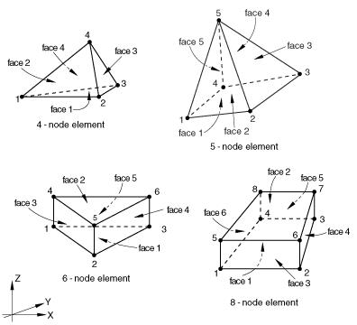

# 28.2.2 Fluid element library


**Products: **Abaqus/CFD  Abaqus/CAE  

##### **Reference**

- ["Fluid (continuum) elements," Section 28.2.1](pt06ch28s02alm02.md)

### Overview

This section provides a reference to the fluid elements available in Abaqus/CFD.

### Element types

#### Fluid elements

| FC3D4 | 4-node tetrahedron |
| --- | --- |
|  |

| FC3D5 | 5-node pyramid |
| --- | --- |
|  |

| FC3D6 | 6-node prism |
| --- | --- |
|  |

| FC3D8 | 8-node brick |
| --- | --- |
|  |

##### Active degrees of freedom

The active degrees of freedom depend on the analysis procedure and options, such as the energy equation and turbulence model. For more information, see ["Active degrees of freedom" in "Boundary conditions in Abaqus/CFD," Section 34.3.2](pt07ch34s03aus119.md#usb-prc-pboundarycfd-dofs).

##### Additional solution variables

None.

### Nodal coordinates required

*X*, *Y*, *Z*

### Element property definition

| **Input File Usage: ** | Use the following option to define the element properties for flows: |
| --- | --- |
|  | ``` [*FLUID SECTION](../key/key-link.md#usb-kws-mfluidsection) ``` Use the following option to define the element properties for heat transfer without flows: ``` [*SOLID SECTION](../key/key-link.md#usb-kws-msolidsection) ``` |

| **Abaqus/CAE Usage: ** | In Abaqus/CAE you can only define the element properties for flows. |
| --- | --- |
|  | Property module: **Create Section**: select **Fluid** as the section |

### Element-based loading

### Distributed loads

Distributed loads are available for all fluid element types. They are specified as described in ["Distributed loads," Section 34.4.3](pt07ch34s04aus122.md).

**Load ID (*DLOAD):**  BX**Abaqus/CAE Load/Interaction:**  **Body force****Units:**  [FL3](../popups/usb-int-iconventions-unitsym.md)**Description:  **Body force in global *X*-direction.

**Load ID (*DLOAD):**  BY**Abaqus/CAE Load/Interaction:**  **Body force****Units:**  [FL3](../popups/usb-int-iconventions-unitsym.md)**Description:  **Body force in global *Y*-direction.

**Load ID (*DLOAD):**  BZ**Abaqus/CAE Load/Interaction:**  **Body force****Units:**  [FL3](../popups/usb-int-iconventions-unitsym.md)**Description:  **Body force in global *Z*-direction.

**Load ID (*DLOAD):**  GRAV**Abaqus/CAE Load/Interaction:**  **Gravity****Units:**  [LT2](../popups/usb-int-iconventions-unitsym.md)**Description:  **Gravity loading in a specified direction (magnitude is input as acceleration).

**Load ID (*DLOAD):**  PDBF**Abaqus/CAE Load/Interaction:**  **Porous drag body force****Units:**  [None](../popups/usb-int-iconventions-unitsym.md)**Description:  **Porous drag body force load (specify porosity as the input).

### Distributed heat fluxes

Distributed heat fluxes are available when the temperature equation is activated on the analysis procedure. They are specified as described in ["Thermal loads," Section 34.4.4](pt07ch34s04aus123.md).

**Load ID (*DFLUX):**  BF**Abaqus/CAE Load/Interaction:**  **Body heat flux****Units:**  [JL3T1](../popups/usb-int-iconventions-unitsym.md)**Description:  **Heat body flux per unit volume.

### Surface-based loading

### Distributed heat fluxes

Surface-based heat fluxes are available for all elements when the temperature equation is activated on the analysis procedure. They are specified as described in ["Thermal loads," Section 34.4.4](pt07ch34s04aus123.md).

**Load ID (*DSFLUX):**  S**Abaqus/CAE Load/Interaction:**  **Surface heat flux****Units:**  [JL2T1](../popups/usb-int-iconventions-unitsym.md)**Description:  **Heat surface flux per unit area into the element surface.

### Film conditions

Surface-based film conditions are available for all elements when the temperature equation is activated on the analysis procedure. They are specified as described in ["Thermal loads," Section 34.4.4](pt07ch34s04aus123.md).

**Load ID (*SFILM):**  F**Abaqus/CAE Load/Interaction:**  **Surface film condition****Units:**  [JL2T11](../popups/usb-int-iconventions-unitsym.md)**Description:  **Film coefficient and sink temperature (units of ) provided on the element surface.

### Radiation types

Surface-based radiation conditions are available for all elements when the temperature equation is activated on the analysis procedure. They are specified as described in ["Thermal loads," Section 34.4.4](pt07ch34s04aus123.md).

**Load ID (*SRADIATE):**  R**Abaqus/CAE Load/Interaction:**  **Surface radiation****Units:**  [Dimensionless](../popups/usb-int-iconventions-unitsym.md)**Description:  **Emissivity and sink temperature (units of ) provided on the element surface.

### Element output

Element output is always in the global directions.

### Node ordering and face numbering on elements

##### All elements



##### Tetrahedral element faces

| Face 1 | 1 -- 3 -- 2 face |
| --- | --- |
| Face 2 | 1 -- 2 -- 4 face |
| Face 3 | 2 -- 3 -- 4 face |
| Face 4 | 1 -- 4 -- 3 face |

##### Pyramid element faces

| Face 1 | 1 -- 4 -- 3 -- 2 face |
| --- | --- |
| Face 2 | 1 -- 2 -- 5 face |
| Face 3 | 2 -- 3 -- 5 face |
| Face 4 | 3 -- 4 -- 5 face |
| Face 5 | 1 -- 5 -- 4 face |

##### Wedge (triangular prism) element faces

| Face 1 | 1 -- 3 -- 2 face |
| --- | --- |
| Face 2 | 4 -- 5 -- 6 face |
| Face 3 | 1 -- 2 -- 5 -- 4 face |
| Face 4 | 2 -- 3 -- 6 -- 5 face |
| Face 5 | 1 -- 4 -- 6 -- 3 face |

##### Hexahedron (brick) element faces

| Face 1 | 1 -- 4 -- 3 -- 2 face |
| --- | --- |
| Face 2 | 5 -- 6 -- 7 -- 8 face |
| Face 3 | 1 -- 2 -- 6 -- 5 face |
| Face 4 | 2 -- 3 -- 7 -- 6 face |
| Face 5 | 3 -- 4 -- 8 -- 7 face |
| Face 6 | 1 -- 5 -- 8 -- 4 face |


