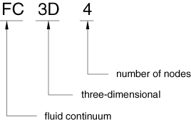

# 28.2.1 Fluid (continuum) elements

**Products: **Abaqus/CFD  Abaqus/CAE  

##### **References**

- ["Fluid element library," Section 28.2.2](pt06ch28s02ael07.md)
- ["Creating homogeneous fluid sections," Section 12.13.13 of the Abaqus/CAE User's Guide](../usi/usi-link.md#usi-prp-section-fluid)

### Overview

Fluid elements are provided to discretize the domain in Abaqus/CFD. These elements can be referenced by a fluid section to define a fluid domain or by a solid section to define a solid domain in an Abaqus/CFD solid heat transfer analysis.

### Choosing an appropriate element

Three-dimensional fluid elements are available.

### Naming convention

Fluid elements in Abaqus are named as follows:

For example, FC3D8 is a three-dimensional, 8-node brick fluid element.

### Active fields for fluid elements

The fields active in a fluid flow analysis are not determined by the element type but by the analysis procedure and its options.  The sole purpose of the element type is to define the shape of the element used to discretize the continuum.

