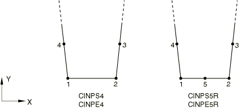
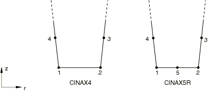
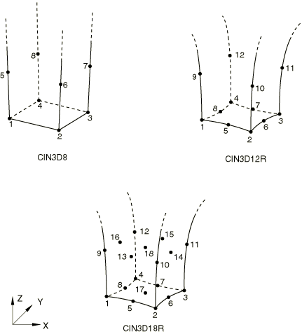
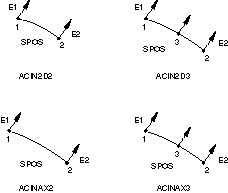
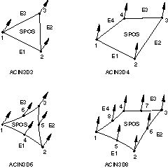
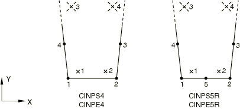
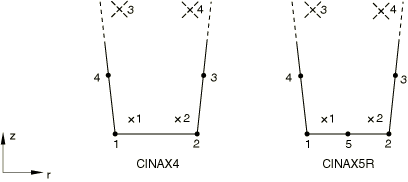
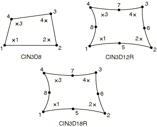

# 28.3.2 Infinite element library


**Products: **Abaqus/Standard  Abaqus/Explicit  Abaqus/CAE  

##### **References**

- ["Infinite elements," Section 28.3.1](pt06ch28s03alm03.md)
- [*SOLID SECTION](../key/key-link.md#usb-kws-msolidsection)

### Overview

This section provides a reference to the infinite elements available in Abaqus/Standard and Abaqus/Explicit.

### Element types

#### Plane strain solid continuum infinite elements

| CINPE4 | 4-node linear, one-way infinite |
| --- | --- |
|  |

| CINPE5R(S) | 5-node quadratic, one-way infinite |
| --- | --- |
|  |

##### Active degrees of freedom

1, 2

##### Additional solution variables

None.

#### Plane stress solid continuum infinite elements

| CINPS4 | 4-node linear, one-way infinite |
| --- | --- |
|  |

| CINPS5R(S) | 5-node quadratic, one-way infinite |
| --- | --- |
|  |

##### Active degrees of freedom

1, 2

##### Additional solution variables

None.

#### 3D solid continuum infinite elements

| CIN3D8 | 8-node linear, one-way infinite |
| --- | --- |
|  |

| CIN3D12R(S) | 12-node quadratic, one-way infinite |
| --- | --- |
|  |

| CIN3D18R(S) | 18-node quadratic, one-way infinite |
| --- | --- |
|  |

##### Active degrees of freedom

1, 2, 3

##### Additional solution variables

None.

#### Axisymmetric solid continuum infinite elements

| CINAX4 | 4-node linear, one-way infinite |
| --- | --- |
|  |

| CINAX5R(S) | 5-node quadratic, one-way infinite |
| --- | --- |
|  |

##### Active degrees of freedom

1, 2

##### Additional solution variables

None.

#### 2D acoustic infinite elements

| ACIN2D2 | 2-node linear, acoustic infinite |
| --- | --- |
|  |

| ACIN2D3(S) | 3-node quadratic, acoustic infinite |
| --- | --- |
|  |

##### Active degree of freedom

8

#### 3D acoustic infinite elements

| ACIN3D3 | 3-node linear, acoustic infinite triangular element |
| --- | --- |
|  |

| ACIN3D4 | 4-node linear, acoustic infinite quadrilateral element |
| --- | --- |
|  |

| ACIN3D6(S) | 6-node quadratic, acoustic infinite triangular element |
| --- | --- |
|  |

| ACIN3D8(S) | 8-node quadratic, acoustic infinite quadrilateral element |
| --- | --- |
|  |

##### Active degree of freedom

8

#### Axisymmetric acoustic infinite elements

| ACINAX2 | 2-node linear, acoustic infinite |
| --- | --- |
|  |

| ACINAX3(S) | 3-node quadratic, acoustic infinite |
| --- | --- |
|  |

##### Active degree of freedom

8

### Nodal coordinates required

Plane stress and plane strain solid continuum elements: *X*, *Y* 

2D acoustic elements: *X*, *Y* 

3D solid continuum and acoustic elements: *X*, *Y*, *Z*

Axisymmetric solid continuum and acoustic elements: *r*, *z*

Normal directions are not specified at nodes used in acoustic infinite elements; they will be computed automatically. See ["Infinite elements," Section 28.3.1](pt06ch28s03alm03.md), for details.

### Element property definition

For two-dimensional, plane strain, and plane stress elements, you must provide the thickness of the elements; by default, unit thickness is assumed.

For three-dimensional and axisymmetric solid elements, you do not need to specify a thickness.

For acoustic elements, you must specify the reference point in addition to the thickness.

| **Input File Usage: ** | ``` [*SOLID SECTION](../key/key-link.md#usb-kws-msolidsection) ``` |
| --- | --- |

| **Abaqus/CAE Usage: ** | Only acoustic infinite sections are supported in Abaqus/CAE. |
| --- | --- |
|  | Property module: **Create Section**: select **Other** as the section **Category** and **Acoustic infinite** as the section **Type** |

### Element-based loading

None.

### Element output

#### Stress, strain, and other tensor components

No output is available from Abaqus/Explicit for infinite elements. Stress and other tensors (including strain tensors) are available from Abaqus/Standard for infinite elements with displacement degrees of freedom. All tensors have the same components. For example, the stress components are as follows:

| S11 |  direct stress or radial stress for axisymmetric elements. |
| --- | --- |

| S22 |  direct stress or axial stress for axisymmetric elements. |
| --- | --- |

| S33 |  direct stress (not available for plane stress elements) or hoop stress for axisymmetric elements. |
| --- | --- |

| S12 |  shear stress or shear stress for axisymmetric elements. |
| --- | --- |

| S13 |  shear stress (not available for plane stress, plane strain, and axisymmetric elements). |
| --- | --- |

| S23 |  shear stress (not available for plane stress, plane strain, and axisymmetric elements). |
| --- | --- |

### Node ordering and face numbering on elements

##### Plane stress and plane strain solid continuum elements



##### Axisymmetric solid continuum elements



##### Three-dimensional solid continuum elements



##### Two-dimensional and axisymmetric acoustic infinite elements



##### Three-dimensional acoustic infinite elements



### Numbering of integration points for output

##### Plane stress and plane strain solid continuum elements



##### Axisymmetric solid continuum elements



##### Three-dimensional solid continuum elements



This shows the scheme in the layer closest to the 1–2–3–4 face. The integration points in the second layer are numbered consecutively.


