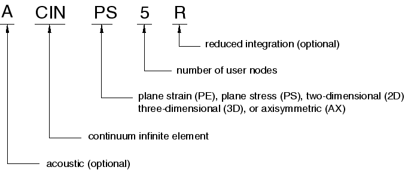
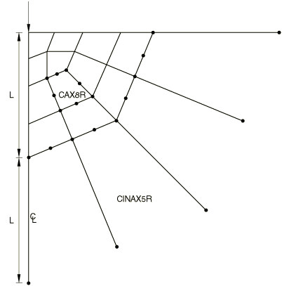
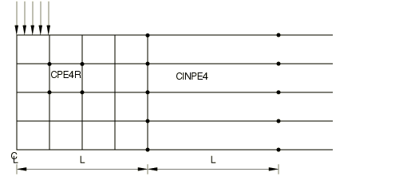
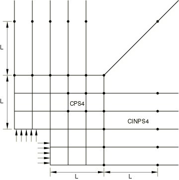
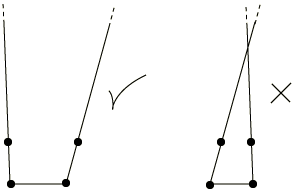
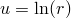

# 28.3.1 Infinite elements


**Products: **Abaqus/Standard  Abaqus/Explicit  Abaqus/CAE  

##### **References**

- ["Infinite element library," Section 28.3.2](pt06ch28s03ael08.md)
- [*SOLID SECTION](../key/key-link.md#usb-kws-msolidsection)
- ["Creating acoustic infinite sections," Section 12.13.17 of the Abaqus/CAE User's Guide](../usi/usi-link.md#usi-prp-section-acoustic-infinite)

### Overview

Infinite elements:
- are used in boundary value problems defined in unbounded domains or problems in which the region of interest is small in size compared to the surrounding medium;
- are usually used in conjunction with finite elements;
- can have linear behavior only;
- provide stiffness in static solid continuum analyses; and
- provide "quiet" boundaries to the finite element model in dynamic analyses.

A solid section definition is used to define the section properties of infinite elements.

### Typical applications

The analyst is sometimes faced with boundary value problems defined in unbounded domains or problems in which the region of interest is small in size compared to the surrounding medium. Infinite elements are intended to be used for such cases in conjunction with first- and second-order planar, axisymmetric, and three-dimensional finite elements. Standard finite elements should be used to model the region of interest, with the infinite elements modeling the far-field region.

### Choosing an appropriate element

Plane stress, plane strain, three-dimensional, and axisymmetric infinite elements are available. Reduced-integration elements are also available in Abaqus/Standard.

Element type CIN3D18R is intended for use with the three-dimensional variable-number-of-node solids C3D15V, C3D27, and C3D27R in Abaqus/Standard.

Acoustic infinite elements are also available in Abaqus.

### Naming convention

Infinite elements in Abaqus are named as follows:



For example, CINAX4 is a 4-node, axisymmetric, infinite element.

### Defining the element's section properties

You use a solid section definition to define the section properties. You must associate these properties with a region of your model.

| **Input File Usage: ** | ``` [*SOLID SECTION](../key/key-link.md#usb-kws-msolidsection), ELSET=*name* ``` |
| --- | --- |
|  | where the ELSET parameter refers to a set of infinite elements. |

| **Abaqus/CAE Usage: ** | Only acoustic infinite sections are supported in Abaqus/CAE. |
| --- | --- |
|  | Property module: **Create Section**: select **Other** as the section **Category** and **Acoustic infinite** as the section **Type** ****Assign****Section****: select regions |

#### Defining the thickness for plane strain and plane stress elements

You define the thickness for plane strain and plane stress elements as part of the section definition. If you do not specify a thickness, unit thickness is assumed.

| **Input File Usage: ** | ``` [*SOLID SECTION](../key/key-link.md#usb-kws-msolidsection) *thickness* ``` |
| --- | --- |

| **Abaqus/CAE Usage: ** | Structural infinite sections are not supported in Abaqus/CAE. |
| --- | --- |

#### Defining the reference point and thickness for acoustic infinite elements

For acoustic infinite elements you specify the thickness and the reference point. The thickness is ignored in three-dimensional and axisymmetric elements. You can prescribe the reference point either as a reference node on the section definition (see below) or directly by giving its coordinates on the data line following the thickness value. If both methods are used, the former takes precedence. If you do not define the reference point at all, an error message is issued.

The location of the reference point is used to determine the “radius” and “node ray” at each node of acoustic infinite elements, as shown in [Figure 28.3.1--1](pt06ch28s03alm03.md#einfinite-aco-noderay). 

**Figure 28.3.1–1** Reference point and node rays for acoustic infinite elements.


Each node ray is a unit vector in the direction of the line between the reference point and the node. These radii and rays are used in the formulation of acoustic infinite elements. The placement of the reference point is not extremely critical as long as it is near the center of the finite region enclosed by the infinite elements. If acoustic infinite elements are placed on the surface of a sphere, the optimal location for the reference point is the center of the sphere.

Acoustic infinite elements whose section properties are defined using a particular solid section definition should not have any nodes in common with acoustic infinite elements associated with a different solid section definition. This is to ensure a unique reference point (and, therefore, a unique “radius” and “node ray”) for each acoustic infinite element node.

The node rays are used to compute “cosine” values at each node of the infinite element interface. The “cosine”  is equal to the smallest dot product of the unit node ray and the unit normals of all acoustic infinite element faces surrounding the node (see [Figure 28.3.1--2](pt06ch28s03alm03.md#einfinite-aco-cosine)). An error message is issued for negative values of  “cosine.” Both the “radius” and “cosine” for all nodes of acoustic infinite elements are printed to the data (`.dat`) file as nodal (model) data. For details of how these quantities are used in the formulation, see ["Acoustic infinite elements," Section 3.3.2 of the Abaqus Theory Guide](../stm/stm-link.md#stm-elm-acousticinfinite). 

**Figure 28.3.1–2** Defining the cosine for acoustic infinite elements.


| **Input File Usage: ** | ``` [*SOLID SECTION](../key/key-link.md#usb-kws-msolidsection), REF NODE=*node number or node set name* *thickness* ``` |
| --- | --- |

| **Abaqus/CAE Usage: ** | Property module: **Create Section**: select **Other** as the section **Category** and **Acoustic infinite** as the section **Type**: **Plane stress/strain thickness**: *thickness* |
| --- | --- |
|  | Acoustic infinite sections must be assigned to regions of parts that have a reference point associated with them. To define the reference point: Part module or Property module: ****Tools****Reference Point****: select reference point |

#### Defining the order of interpolation for acoustic infinite elements

For acoustic infinite elements the variation of the acoustic field in the infinite direction is given by functions that are members of a set of 10 ninth-order polynomials (for further details, see ["Acoustic infinite elements," Section 3.3.2 of the Abaqus Theory Guide](../stm/stm-link.md#stm-elm-acousticinfinite)). The members of this set are constructed to correspond to the Legendre modes of a sphere; that is, if infinite elements are placed on a sphere and if tangential refinement is adequate, an *i*th order acoustic infinite element will absorb waves associated with the ()th Legendre mode.  The computational cost involved in using all 10 members in this set of polynomials to resolve the variation of the acoustic field in the infinite direction may be significant in certain applications in Abaqus/Explicit. In such cases you may wish to include only the first few members of the set, although you should be aware of the possibility of degraded accuracy (i.e., increased reflection at acoustic infinite elements) due to using a reduced set of polynomials. In Abaqus/Explicit you can specify the number, *N*, of ninth-order polynomials to be used. By default, all 10 members of the set will be used; all 10 are always used in Abaqus/Standard. Specifying a value less than 10 would result in the first *N* members of the set being used to model the variation of the acoustic field in the infinite direction.

| **Input File Usage: ** | ``` [*SOLID SECTION](../key/key-link.md#usb-kws-msolidsection), ORDER=*N* ``` |
| --- | --- |

| **Abaqus/CAE Usage: ** | Property module: **Create Section**: select **Other** as the section **Category** and **Acoustic infinite** as the section **Type**: **Order**: *N* |
| --- | --- |

#### Assigning a material definition to a set of infinite elements

You must associate a material definition with each infinite element section definition. Optionally, you can associate a material orientation definition with the section (see ["Orientations," Section 2.2.5](pt01ch02s02aus15.md)).

The solution in the far field is assumed to be linear, so that only linear behavior can be associated with infinite elements (["Linear elastic behavior," Section 22.2.1](pt05ch22s02abm02.md)). In dynamic analysis the material response in the infinite elements is also assumed to be isotropic.

In Abaqus/Explicit the material properties assigned to the infinite elements must match the material properties of the adjacent finite elements in the linear domain.

Only an acoustic medium material (["Acoustic medium," Section 26.3.1](pt05ch26s03abm58.md)) is valid for acoustic infinite elements.

| **Input File Usage: ** | ``` [*SOLID SECTION](../key/key-link.md#usb-kws-msolidsection), MATERIAL=*name*, ORIENTATION=*name* ``` |
| --- | --- |

| **Abaqus/CAE Usage: ** | Only acoustic infinite sections are supported in Abaqus/CAE. |
| --- | --- |
|  | Property module: **Create Section**: select **Other** as the section **Category** and **Acoustic infinite** as the section **Type**: **Material:** *name*****Assign****Material Orientation****: select regions****Assign****Section****: select regions |

### Defining nodes for solid medium infinite elements

The node numbering for infinite elements must be defined such that the first face is the face that is connected to the finite element part of the mesh.

The infinite element nodes that are not part of the first face are treated differently in explicit dynamic analysis than in other procedures. These nodes are located away from the finite element mesh in the infinite direction. The location of these nodes is not meaningful for explicit analysis, and loads and boundary conditions must not be specified using these nodes in explicit dynamic procedures. In other procedures these outer nodes are important in the element definition and can be used in load and boundary condition definitions. 

Except for explicit procedures, the basis of the formulation of the solid medium elements is that the far-field solution along each element edge that stretches to infinity is centered about an origin, called the “pole.” For example, the solution for a point load applied to the boundary of a half-space has its pole at the point of application of the load. It is important to choose the position of the nodes in the infinite direction appropriately with respect to the pole. The second node along each edge pointing in the infinite direction must be positioned so that it is twice as far from the pole as the node on the same edge at the boundary between the finite and the infinite elements. Three examples of this are shown in [Figure 28.3.1--3](pt06ch28s03alm03.md#einfinite-pt-load), [Figure 28.3.1--4](pt06ch28s03alm03.md#einfinite-exp-strip-footing), and [Figure 28.3.1--5](pt06ch28s03alm03.md#einfinite-plate-hole). In addition to this length consideration, you must specify the second nodes in the infinite direction such that the element edges in the infinite direction do not cross over, which would give nonunique mappings (see [Figure 28.3.1--6](pt06ch28s03alm03.md#einfinite-good-bad-elem)). Abaqus will stop with an error message if such problems occur. A convenient way of defining these second nodes in the infinite direction is to project the original nodes from a pole node; see ["Projecting the nodes in the old set from a pole node" in "Node definition," Section 2.1.1](pt01ch02s01aus05.md#usb-int-inode-copy-pole). The positions of the pole and of the nodes on the boundary between the finite and the infinite elements are used.

**Figure 28.3.1–3** Point load on elastic half-space.



**Figure 28.3.1–4** Strip footing on infinitely extending layer of soil.



**Figure 28.3.1–5** Quarter plate with square hole.



**Figure 28.3.1–6** Examples of an acceptable and an unacceptable two-dimensional infinite element.



### Defining nodes for acoustic infinite elements

The nodes of acoustic infinite elements need to be defined only for the face that is connected to the finite element part of the mesh. Additional nodes are generated internally by Abaqus in the direction of the “node ray” (see [Figure 28.3.1--1](pt06ch28s03alm03.md#einfinite-aco-noderay)). The node rays, which are discussed earlier in this section in the context of defining the reference point, define the sides of the acoustic infinite elements.

### Using solid medium infinite elements in plane stress and plane strain analyses

In plane stress and plane strain analyses when the loading is not self-equilibrating, the far-field displacements typically have the form , where *r* is distance from the origin. This form implies that the displacement approaches infinity as . Infinite elements will not provide a unique displacement solution for such cases. Experience shows, however, that they can still be used, provided that the displacement results are treated as having an arbitrary reference value. Thus, strain, stress, and *relative* displacements within the finite element part of the model will converge to unique values as the model is refined; the *total* displacements will depend on the size of the region modeled with finite elements. If the loading is self-equilibrating, the total displacements will also converge to a unique solution.

### Using solid medium infinite elements in dynamic analyses

In direct-integration implicit dynamic response analysis (["Implicit dynamic analysis using direct integration," Section 6.3.2](pt03ch06s03at07.md)), steady-state dynamic frequency domain analysis (["Direct-solution steady-state dynamic analysis," Section 6.3.4](pt03ch06s03at09.md)), matrix generation (["Generating matrices," Section 10.3.1](pt04ch10s03at32.md)), superelement generation (["Using substructures," Section 10.1.1](pt04ch10s01aus58.md)), and explicit dynamic analysis (["Explicit dynamic analysis," Section 6.3.3](pt03ch06s03at08.md)), infinite elements provide “quiet” boundaries to the finite element model through the effect of a damping matrix; the stiffness matrix of the element is suppressed. The elements do not provide any contribution to the eigenmodes of the system. The elements maintain the static force that was present at the start of the dynamic response analysis on this boundary; as a consequence, the far-field nodes in the infinite elements will not displace during the dynamic response. 

During dynamic steps the infinite elements introduce additional normal and shear tractions on the finite element boundary that are proportional to the normal and shear components of the velocity of the boundary. These boundary damping constants are chosen to minimize the reflection of dilatational and shear wave energy back into the finite element mesh. This formulation does not provide perfect transmission of energy out of the mesh except in the case of plane body waves impinging orthogonally on the boundary in an isotropic medium. However, it usually provides acceptable modeling for most practical cases.

During dynamic response analysis the infinite elements hold the static stress on the boundary constant but do not provide any stiffness. Therefore, some rigid body motion of the region modeled will generally occur. This effect is usually small.

#### Optimizing the transmission of energy out of the finite element mesh

For dynamic cases the ability of the infinite elements to transmit energy out of the finite element mesh, without trapping or reflecting it, is optimized by making the boundary between the finite and infinite elements as close as possible to being orthogonal to the direction from which the waves will impinge on this boundary. Close to a free surface, where Rayleigh waves may be important, or close to a material interface, where Love waves may be important, the infinite elements are most effective if they are orthogonal to the surface. (Rayleigh and Love waves are surface waves that decay with distance from the surface.)

For acoustic medium infinite elements, these general guidelines apply as well. 

### Defining an initial stress field and corresponding body force field

In many applications, especially geotechnical problems, an initial stress field and a corresponding body force field must be defined. For standard elements you define the initial stress field as an initial condition (["Defining initial stresses" in "Initial conditions in Abaqus/Standard and Abaqus/Explicit," Section 34.2.1](pt07ch34s02aus116.md#usb-prc-pinitialcond-stress)) and the corresponding body force field as a distributed load (["Distributed loads," Section 34.4.3](pt07ch34s04aus122.md)). The body force cannot be defined for infinite elements since the elements are of infinite extent. Therefore, Abaqus automatically inserts forces at the nodes of the infinite elements that cause those nodes to be in static equilibrium at the start of the analysis. These forces remain constant throughout the analysis. This capability allows the initial geostatic stress field to be defined in the infinite elements, but it does not check whether or not the geostatic stress field is reasonable. If the initial stress field is due to a body force loading (such as gravity loading), this loading must be held constant during the step. In multistep analyses it must be maintained constant over all steps.

You must remember that when infinite elements are used in conjunction with an initial stress condition, it is essential that the initial stress field be in equilibrium. In Abaqus/Standard any procedure that determines the initial static (steady-state) equilibrium conditions is suitable as the first step of the analysis; for example, static (["Static stress analysis," Section 6.2.2](pt03ch06s02at01.md)); geostatic stress field (["Geostatic stress state," Section 6.8.2](pt03ch06s08at27.md)); coupled pore fluid diffusion/stress (["Coupled pore fluid diffusion and stress analysis," Section 6.8.1](pt03ch06s08at26.md)); and steady-state fully coupled thermal-stress (["Fully coupled thermal-stress analysis," Section 6.5.3](pt03ch06s05at19.md)) steps can be used. To check for equilibrium in Abaqus/Explicit, perform an initial step with no loading (except for the body forces that created the initial stress field) and verify that the accelerations are small.


