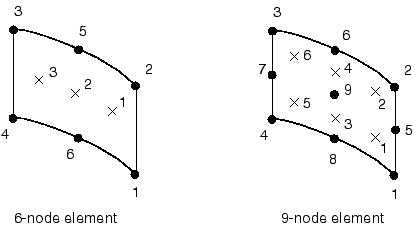

# 29.1.3 Cylindrical membrane element library


**Product: **Abaqus/Standard  

##### **References**

- ["Membrane elements," Section 29.1.1](pt06ch29s01alm05.md)
- [*MEMBRANE SECTION](../key/key-link.md#usb-kws-mmembranesection)

### Overview

This section provides a reference to the cylindrical membrane elements available in Abaqus/Standard.

### Element types

| MCL6 | 6-node cylindrical membrane |
| --- | --- |
|  |

| MCL9 | 9-node cylindrical membrane |
| --- | --- |
|  |

##### Active degrees of freedom

1, 2, 3

##### Additional solution variables

None.

### Nodal coordinates required

 *X*, *Y*, *Z*

### Element property definition

| **Input File Usage: ** | ``` [*MEMBRANE SECTION](../key/key-link.md#usb-kws-mmembranesection) ``` |
| --- | --- |

### Element-based loading

### Distributed loads

Distributed loads are specified as described in ["Distributed loads," Section 34.4.3](pt07ch34s04aus122.md).

**Load ID (*DLOAD):**  BX**Units:**  [FL3](../popups/usb-int-iconventions-unitsym.md)**Description:  **Body force in the global *X*-direction.

**Load ID (*DLOAD):**  BY**Units:**  [FL3](../popups/usb-int-iconventions-unitsym.md)**Description:  **Body force in the global *Y*-direction.

**Load ID (*DLOAD):**  BZ**Units:**  [FL3](../popups/usb-int-iconventions-unitsym.md)**Description:  **Body force in the global *Z*-direction.

**Load ID (*DLOAD):**  BXNU**Units:**  [FL3](../popups/usb-int-iconventions-unitsym.md)**Description:  **Nonuniform body force in the global *X*-direction with magnitude supplied via user subroutine [`DLOAD`](../sub/sub-link.md#sub-xsl-dload).

**Load ID (*DLOAD):**  BYNU**Units:**  [FL3](../popups/usb-int-iconventions-unitsym.md)**Description:  **Nonuniform body force in the global *Y*-direction with magnitude supplied via user subroutine [`DLOAD`](../sub/sub-link.md#sub-xsl-dload).

**Load ID (*DLOAD):**  BZNU**Units:**  [FL3](../popups/usb-int-iconventions-unitsym.md)**Description:  **Nonuniform body force in the global *Z*-direction with magnitude supplied via user subroutine [`DLOAD`](../sub/sub-link.md#sub-xsl-dload).

**Load ID (*DLOAD):**  CENT**Units:**  [FL4(ML3 T2)](../popups/usb-int-iconventions-unitsym.md)**Description:  **Centrifugal load (magnitude is input as , where  is the mass density per unit volume,  is the angular velocity).

**Load ID (*DLOAD):**  CENTRIF**Units:**  [T2](../popups/usb-int-iconventions-unitsym.md)**Description:  **Centrifugal load (magnitude is input as , where  is the angular velocity).

**Load ID (*DLOAD):**  CORIO**Units:**  [FL4T (ML3 T1)](../popups/usb-int-iconventions-unitsym.md)**Description:  **Coriolis force (magnitude is input as , where  is the mass density per unit volume,  is the angular velocity).

**Load ID (*DLOAD):**  GRAV**Units:**  [LT2](../popups/usb-int-iconventions-unitsym.md)**Description:  **Gravity loading in a specified direction (magnitude is input as acceleration). 

**Load ID (*DLOAD):**  HP**Units:**  [FL2](../popups/usb-int-iconventions-unitsym.md)**Description:  **Hydrostatic pressure applied to the element reference surface and linear in global *Z*. The pressure is positive in the direction of the positive element normal.

**Load ID (*DLOAD):**  P**Units:**  [FL2](../popups/usb-int-iconventions-unitsym.md)**Description:  **Pressure applied to the element reference surface. The pressure is positive in the direction of the positive element normal.

**Load ID (*DLOAD):**  PNU**Units:**  [FL2](../popups/usb-int-iconventions-unitsym.md)**Description:  **Nonuniform pressure applied to the element reference surface with magnitude supplied via user subroutine [`DLOAD`](../sub/sub-link.md#sub-xsl-dload). The pressure is positive in the direction of the positive element normal. 

**Load ID (*DLOAD):**  ROTA**Units:**  [T2](../popups/usb-int-iconventions-unitsym.md)**Description:  **Rotary acceleration load (magnitude is input as , where  is the rotary acceleration. 

**Load ID (*DLOAD):**  ROTDYNF(S)**Units:**  [T1](../popups/usb-int-iconventions-unitsym.md)**Description:  **Rotordynamic load (magnitude is input as , where  is the angular velocity).

**Load ID (*DLOAD):**  TRSHR**Units:**  [FL2](../popups/usb-int-iconventions-unitsym.md)**Description:  **Shear traction on the element reference surface.

**Load ID (*DLOAD):**  TRSHRNU(S)**Units:**  [FL2](../popups/usb-int-iconventions-unitsym.md)**Description:  **Nonuniform shear traction on the element reference surface with magnitude and direction supplied via user subroutine [`UTRACLOAD`](../sub/sub-link.md#sub-xsl-utracload).

**Load ID (*DLOAD):**  TRVEC**Units:**  [FL2](../popups/usb-int-iconventions-unitsym.md)**Description:  **General traction on the element reference surface.

**Load ID (*DLOAD):**  TRVECNU(S)**Units:**  [FL2](../popups/usb-int-iconventions-unitsym.md)**Description:  **Nonuniform general traction on the element reference surface with magnitude and direction supplied via user subroutine [`UTRACLOAD`](../sub/sub-link.md#sub-xsl-utracload).

### Foundations

Foundations are specified as described in ["Element foundations," Section 2.2.2](pt01ch02s02aus12.md).

**Load ID (*FOUNDATION):**  F**Units:**  [FL3](../popups/usb-int-iconventions-unitsym.md)**Description:  **Elastic foundation.

### Surface-based loading

### Distributed loads

Surface-based distributed loads are specified as described in ["Distributed loads," Section 34.4.3](pt07ch34s04aus122.md).

**Load ID (*DSLOAD):**  HP**Units:**  [FL2](../popups/usb-int-iconventions-unitsym.md)**Description:  **Hydrostatic pressure on the element reference surface and linear in global *Z*. The pressure is positive in the direction opposite to the surface normal.

**Load ID (*DSLOAD):**  P**Units:**  [FL2](../popups/usb-int-iconventions-unitsym.md)**Description:  **Pressure on the element reference surface. The pressure is positive in the direction opposite to the surface normal.

**Load ID (*DSLOAD):**  PNU**Units:**  [FL2](../popups/usb-int-iconventions-unitsym.md)**Description:  **Nonuniform pressure on the element reference surface with magnitude supplied via user subroutine [`DLOAD`](../sub/sub-link.md#sub-xsl-dload). The pressure is positive in the direction opposite to the surface normal.

**Load ID (*DSLOAD):**  TRSHR**Units:**  [FL2](../popups/usb-int-iconventions-unitsym.md)**Description:  **Shear traction on the element reference surface.

**Load ID (*DSLOAD):**  TRSHRNU(S)**Units:**  [FL2](../popups/usb-int-iconventions-unitsym.md)**Description:  **Nonuniform shear traction on the element reference surface with magnitude and direction supplied via user subroutine [`UTRACLOAD`](../sub/sub-link.md#sub-xsl-utracload).

**Load ID (*DSLOAD):**  TRVEC**Units:**  [FL2](../popups/usb-int-iconventions-unitsym.md)**Description:  **General traction on the element reference surface.

**Load ID (*DSLOAD):**  TRVECNU(S)**Units:**  [FL2](../popups/usb-int-iconventions-unitsym.md)**Description:  **Nonuniform general traction on the element reference surface with magnitude and direction supplied via user subroutine [`UTRACLOAD`](../sub/sub-link.md#sub-xsl-utracload).

### Element output

If a local orientation (["Orientations," Section 2.2.5](pt01ch02s02aus15.md)) is not used with the element, the stress/strain components are expressed in the default directions on the surface defined by the convention given in ["Conventions," Section 1.2.2](pt01ch01s02aus02.md). If a local orientation is used with the element, the stress/strain components are in the surface directions defined by the orientation. In large-displacement problems the local directions defined in the reference configuration are rotated into the current configuration by the average material rotation. See ["State storage," Section 1.5.4 of the Abaqus Theory Guide](../stm/stm-link.md#stm-int-statestorage), for details.

#### Stress, strain, and other tensor components

Stress and other tensors (including strain tensors) are available for elements with displacement degrees of freedom. All tensors have the same components. For example, the stress components are as follows:

| S11 | Local  direct stress. |
| --- | --- |

| S22 | Local  direct stress. |
| --- | --- |

| S12 | Local  shear stress. |
| --- | --- |

#### Section thickness

| STH | Current thickness. |
| --- | --- |

### Node ordering and face numbering on elements


### Numbering of integration points for output




