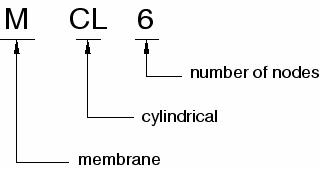
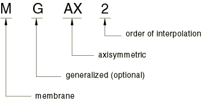

# 29.1.1 Membrane elements


**Products: **Abaqus/Standard  Abaqus/Explicit  Abaqus/CAE  

##### **References**

- ["General membrane element library," Section 29.1.2](pt06ch29s01ael10.md)
- ["Cylindrical membrane element library," Section 29.1.3](pt06ch29s01ael11.md)
- ["Axisymmetric membrane element library," Section 29.1.4](pt06ch29s01ael12.md)
- [*MEMBRANE SECTION](../key/key-link.md#usb-kws-mmembranesection)
- [*NODAL THICKNESS](../key/key-link.md#usb-kws-mnodalthickness)
- [*DISTRIBUTION](../key/key-link.md#usb-kws-mdistribution)
- [*HOURGLASS STIFFNESS](../key/key-link.md#usb-kws-mhourglasstiff)
- ["Creating membrane sections," Section 12.13.8 of the Abaqus/CAE User's Guide](../usi/usi-link.md#usi-prp-section-membrane)

### Overview

Membrane elements:
- are surface elements that transmit in-plane forces only (no moments); and
- have no bending stiffness.

### Typical applications

Membrane elements are used to represent thin surfaces in space that offer strength in the plane of the element but have no bending stiffness; for example, the thin rubber sheet that forms a balloon. In addition, they are often used to represent thin stiffening components in solid structures, such as a reinforcing layer in a continuum. (If the reinforcing layer is made up of chords, rebar should be used. See ["Defining rebar as an element property," Section 2.2.4](pt01ch02s02aus14.md).)

### Choosing an appropriate element

In addition to the general membrane elements available in both Abaqus/Standard and Abaqus/Explicit, cylindrical membrane elements and axisymmetric membrane elements are available in Abaqus/Standard only.

#### General membrane elements

General membrane elements should be used in three-dimensional models in which the deformation of the structure can evolve in three dimensions.

#### Cylindrical membrane elements

Cylindrical membrane elements are available in Abaqus/Standard for precise modeling of regions in a structure with circular geometry, such as a tire. The elements make use of trigonometric functions to interpolate displacements along the circumferential direction and use regular isoparametric interpolation in the radial or cross-sectional plane. They use three nodes along the circumferential direction and can span a 0 to 180 segment. Elements with both first-order and second-order interpolation in the cross-sectional plane are available.

The geometry of the element is defined by specifying nodal coordinates in a global Cartesian system. The default nodal output is also provided in a global Cartesian system. Output of stress, strain, and other material point quantities is done in a corotational system that rotates with the average material rotation.

The cylindrical elements can be used in the same mesh with regular elements. In particular, regular membrane elements can be connected directly to the nodes on the cross-sectional edge of cylindrical elements. For example, any edge of an M3D4 element can share nodes with the cross-sectional edges of an MCL6 element.

Compatible cylindrical solid elements (["Cylindrical solid element library," Section 28.1.5](pt06ch28s01ael04.md)) and surface elements with rebar (["Surface elements," Section 32.7.1](pt06ch32s07alm52.md)) are available for use with cylindrical membrane elements.

#### Axisymmetric membrane elements

The axisymmetric membrane elements available in Abaqus/Standard are divided into two categories: those that do not allow twist about the symmetry axis and those that do. These elements are referred to as the regular and generalized axisymmetric membrane elements, respectively.

The generalized axisymmetric membrane elements (axisymmetric membrane elements with twist) allow a circumferential component of loading or material anisotropy, which may cause twist about the symmetry axis. Both the circumferential load component and material anisotropy are independent of the circumferential coordinate . Since there is no dependence of the loading or the material on the circumferential coordinate, the deformation is axisymmetric.

The generalized axisymmetric membrane elements cannot be used in dynamic or eigenfrequency extraction procedures.

### Naming convention

The naming convention for membrane elements depends on the element dimensionality.

#### General membrane elements

General membrane elements in Abaqus are named as follows:


For example, M3D4R is a three-dimensional, 4-node membrane element with reduced integration.

#### Cylindrical membrane elements

Cylindrical membrane elements in Abaqus/Standard are named as follows: 



For example, MCL6 is a 6-node cylindrical membrane element with circumferential interpolation.

#### Axisymmetric membrane elements

Axisymmetric membrane elements in Abaqus/Standard are named as follows:



For example, MAX2 is a regular axisymmetric, quadratic-interpolation membrane element.

### Element normal definition

The “top” surface of a membrane is the surface in the positive normal direction (defined below) and is called the SPOS face for contact definition. The “bottom” surface is in the negative direction along the normal and is called the SNEG face for contact definition.

#### General membrane elements

For general membrane elements the positive normal direction is defined by the right-hand rule going around the nodes of the element in the order that they are specified in the element definition. See [Figure 29.1.1--1](pt06ch29s01alm05.md#emembrane-gen-normal).

**Figure 29.1.1–1** Positive normals for general membranes.


#### Cylindrical membrane elements

For cylindrical membrane elements the positive normal direction is defined by the right-hand rule going around the nodes of the element in the order that they are specified in the element definition. See [Figure 29.1.1--2](pt06ch29s01alm05.md#emembrane-cyl-normal).

**Figure 29.1.1–2** Positive normals for cylindrical membranes.


#### Axisymmetric membrane elements

For axisymmetric membrane elements the positive normal is defined by a 90 counterclockwise rotation from the direction going from node 1 to node 2. See [Figure 29.1.1--3](pt06ch29s01alm05.md#emembrane-axi-normal).

**Figure 29.1.1–3** Positive normals for axisymmetric membranes.


### Defining the element's section properties

You use a membrane section definition to define the section properties. You must associate these properties with a region of your model.

| **Input File Usage: ** | ``` [*MEMBRANE SECTION](../key/key-link.md#usb-kws-mmembranesection), ELSET=*name* ``` |
| --- | --- |
|  | where the ELSET parameter refers to a set of membrane elements. |

| **Abaqus/CAE Usage: ** | Property module: **Create Section**: select **Shell** as the section **Category** and **Membrane** as the section **Type** ****Assign****Section****: select regions |
| --- | --- |

#### Defining a constant section thickness

You can define a constant section thickness as part of the section definition.

| **Input File Usage: ** | ``` [*MEMBRANE SECTION](../key/key-link.md#usb-kws-mmembranesection), ELSET=*name* *thickness* ``` |
| --- | --- |

| **Abaqus/CAE Usage: ** | Property module: **Create Section**: select **Shell** as the section **Category** and **Membrane** as the section **Type**: **Membrane thickness:** *thickness* |
| --- | --- |

#### Defining a variable thickness using distributions

In Abaqus/Standard you can define a spatially varying thickness for membranes using a distribution (["Distribution definition," Section 2.8.1](pt01ch02s08aus26.md)). 

The distribution used to define membrane thickness must have a default value. The default thickness is used by any membrane element assigned to the membrane section that is not specifically assigned a value in the distribution.

If the membrane thickness is defined for a membrane section with a distribution, nodal thicknesses cannot be used for that section definition. 

| **Input File Usage: ** | Use the following option to define a spatially varying thickness: |
| --- | --- |
|  | ``` [*MEMBRANE SECTION](../key/key-link.md#usb-kws-mmembranesection), MEMBRANE THICKNESS=*distribution name* ``` |

#### Defining a continuously varying thickness

Alternatively, you can define a continuously varying thickness over the element. In this case any constant section thickness you specify will be ignored, and the section thickness will be interpolated from the specified nodal values (see ["Nodal thicknesses," Section 2.1.3](pt01ch02s01aus07.md)). The thickness must be defined at all nodes connected to the element.

If the membrane thickness is defined for a membrane section with a distribution, nodal thicknesses cannot be used for that section definition.

| **Input File Usage: ** | Use both of the following options: |
| --- | --- |
|  | ``` [*MEMBRANE SECTION](../key/key-link.md#usb-kws-mmembranesection), NODAL THICKNESS [*NODAL THICKNESS](../key/key-link.md#usb-kws-mnodalthickness) ``` |

| **Abaqus/CAE Usage: ** | Continuously varying membrane thicknesses are not supported in Abaqus/CAE. |
| --- | --- |

#### Assigning a material definition to a set of membrane elements

You must associate a material definition with each membrane section definition. Optionally, you can associate a material orientation definition with the section (see ["Orientations," Section 2.2.5](pt01ch02s02aus15.md)). An arbitrary material orientation is valid only for general membrane elements and axisymmetric membrane elements with twist. You can define other directions by defining a local orientation, except for MAX1 and MAX2 elements (["Axisymmetric membrane element library," Section 29.1.4](pt06ch29s01ael12.md)), which do not support orientations.

In Abaqus/Standard if the orientation assigned to a membrane section is defined with distributions, spatially varying local coordinate systems are applied to all membrane elements associated with the membrane section. A default local coordinate system (as defined by the distributions) is applied to any membrane element that is not specifically included in the associated distribution.

| **Input File Usage: ** | ``` [*MEMBRANE SECTION](../key/key-link.md#usb-kws-mmembranesection), MATERIAL=*name*, ORIENTATION=*name* ``` |
| --- | --- |

| **Abaqus/CAE Usage: ** | Property module: **Create Section**: select **Shell** as the section **Category** and **Membrane** as the section **Type**: **Material:** *name* ****Assign****Material Orientation**** |
| --- | --- |

#### Specifying how the membrane thickness changes with deformation

You can define how the membrane thickness will change with deformation by specifying a nonzero value for the section Poisson's ratio that will allow for a change in the thickness of the membrane as a function of the in-plane strains in geometrically nonlinear analysis (see ["Defining an analysis," Section 6.1.2](pt03ch06s01abo05.md)).

Alternatively in Abaqus/Explicit, you can choose to have the thickness change computed through integration of the thickness-direction strain that is based on the element material definition and the plane stress condition.

The value of the effective Poisson's ratio for the section must be between 1.0 and 0.5. By default, the section Poisson's ratio is 0.5 in Abaqus/Standard to enforce incompressibility of the element; in Abaqus/Explicit the default thickness change is based on the element material definition.

A section Poisson's ratio of 0.0 means that the thickness will not change. Values between 0.0 and 0.5 mean that the thickness changes proportionally between the limits of no thickness change and incompressibility, respectively. A negative value of the section Poisson's ratio will result in an increase of the section thickness in response to tensile strains.

| **Input File Usage: ** | Use one of the following options: |
| --- | --- |
|  | ``` [*MEMBRANE SECTION](../key/key-link.md#usb-kws-mmembranesection), POISSON= [*MEMBRANE SECTION](../key/key-link.md#usb-kws-mmembranesection), POISSON=MATERIAL (available in Abaqus/Explicit only) ``` |

| **Abaqus/CAE Usage: ** | Property module: **Create Section**: select **Shell** as the section **Category** and **Membrane** as the section **Type**: **Section Poisson's ratio: Use analysis default** or **Specify value:**  |
| --- | --- |

### Specifying nondefault hourglass control parameters for reduced-integration membrane elements

See ["Methods for suppressing hourglass modes" in "Section controls," Section 27.1.4](pt06ch27s01aus113.md#usb-elm-esection-hourglass), for more information about hourglass control.

#### Specifying a nondefault hourglass control formulation or scale factors

You can specify a nondefault hourglass control formulation or scale factors for reduced-integration membrane elements. The nondefault enhanced hourglass control formulation is available only for M3D4R elements.

| **Input File Usage: ** | Use the following option to specify a nondefault hourglass control formulation in a section control definition: |
| --- | --- |
|  | ``` [*SECTION CONTROLS](../key/key-link.md#usb-kws-msectioncontrols), NAME=*name*, HOURGLASS=*hourglass_control_formulation* ``` Use the following option to associate the section control definition with the membrane section: ``` [*MEMBRANE SECTION](../key/key-link.md#usb-kws-mmembranesection), CONTROLS=*name* ``` |

| **Abaqus/CAE Usage: ** | Mesh module: ****Mesh****Element Type****: **Hourglass control:** *hourglass_control_formulation* |
| --- | --- |

#### Specifying nondefault hourglass stiffness factors

In Abaqus/Standard you can specify nondefault hourglass stiffness factors based on the default total stiffness approach for reduced-integration general membrane elements. These stiffness factors are ignored for axisymmetric membrane elements. There are no hourglass stiffness factors or scale factors for the nondefault enhanced hourglass control formulation. 

| **Input File Usage: ** | Use both of the following options: |
| --- | --- |
|  | ``` [*MEMBRANE SECTION](../key/key-link.md#usb-kws-mmembranesection) [*HOURGLASS STIFFNESS](../key/key-link.md#usb-kws-mhourglasstiff) ``` |

| **Abaqus/CAE Usage: ** | Mesh module: ****Mesh****Element Type****: **Hourglass stiffness: Specify** |
| --- | --- |

### Using membrane elements in large-displacement implicit analyses

Buckling can occur in Abaqus/Standard if a membrane structure is subject to compressive loading in a large-displacement analysis, causing out-of-plane deformation. Since a stress-free flat membrane has no stiffness perpendicular to its plane, out-of-plane loading will cause numerical singularities and convergence difficulties. Once some out-of-plane deformation has developed, the membrane will be able to resist out-of-plane loading.

In some cases loading the membrane elements in tension or adding initial tensile stress can overcome the numerical singularities and convergence difficulties associated with out-of-plane loading. However, you must choose the magnitude of the loading or initial stress such that the final solution is unaffected.

### Using membrane elements in Abaqus/Standard contact analyses

Element types M3D8 and M3D8R are converted automatically to element types M3D9 and M3D9R, respectively, if a slave surface on a contact pair is attached to the element.


