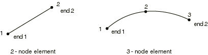

# 29.2.2 Truss element library


**Products: **Abaqus/Standard  Abaqus/Explicit  Abaqus/CAE  

##### **References**

- ["Truss elements," Section 29.2.1](pt06ch29s02alm06.md)
- [*SOLID SECTION](../key/key-link.md#usb-kws-msolidsection)

### Overview

This section provides a reference to the truss elements available in Abaqus/Standard and Abaqus/Explicit.

### Element types

#### 2D stress/displacement truss elements

| T2D2 | 2-node linear displacement |
| --- | --- |
|  |

| T2D2H(S) | 2-node linear displacement, hybrid |
| --- | --- |
|  |

| T2D3(S) | 3-node quadratic displacement |
| --- | --- |
|  |

| T2D3H(S) | 3-node quadratic displacement, hybrid |
| --- | --- |
|  |

##### Active degrees of freedom

1, 2

##### Additional solution variables

Element type T2D2H has one additional variable and element type T2D3H has two additional variables relating to axial force.

#### 3D stress/displacement truss elements

| T3D2 | 2-node linear displacement |
| --- | --- |
|  |

| T3D2H(S) | 2-node linear displacement, hybrid |
| --- | --- |
|  |

| T3D3(S) | 3-node quadratic displacement |
| --- | --- |
|  |

| T3D3H(S) | 3-node quadratic displacement, hybrid |
| --- | --- |
|  |

##### Active degrees of freedom

1, 2, 3

##### Additional solution variables

Element type T3D2H has one additional variable and element type T3D3H has two additional variables relating to axial force.

#### 2D coupled temperature-displacement truss elements

| T2D2T(S) | 2-node, linear displacement, linear temperature |
| --- | --- |
|  |

| T2D3T(S) | 3-node, quadratic displacement, linear temperature |
| --- | --- |
|  |

##### Active degrees of freedom

1, 2 at middle node for T2D3T

1, 2, 11 at all other nodes

##### Additional solution variables

None.

#### 3D coupled temperature-displacement truss elements

| T3D2T(S) | 2-node, linear displacement, linear temperature |
| --- | --- |
|  |

| T3D3T(S) | 3-node, quadratic displacement, linear temperature |
| --- | --- |
|  |

##### Active degrees of freedom

1, 2, 3 at middle node for T3D3T

1, 2, 3, 11 at all other nodes

##### Additional solution variables

None.

#### 2D piezoelectric truss elements

| T2D2E(S) | 2-node, linear displacement, linear electric potential |
| --- | --- |
|  |

| T2D3E(S) | 3-node, quadratic displacement, quadratic electric potential |
| --- | --- |
|  |

##### Active degrees of freedom

1, 2, 9

##### Additional solution variables

None.

#### 3D piezoelectric truss elements

| T3D2E(S) | 2-node, linear displacement, linear electric potential |
| --- | --- |
|  |

| T3D3E(S) | 3-node, quadratic displacement, quadratic electric potential |
| --- | --- |
|  |

##### Active degrees of freedom

1, 2, 3, 9

##### Additional solution variables

None.

### Nodal coordinates required

2D: *X*, *Y*

3D: *X*, *Y*, *Z*

### Element property definition

You must provide the cross-sectional area of the element. If no area is given, Abaqus assumes unit area.

| **Input File Usage: ** | ``` [*SOLID SECTION](../key/key-link.md#usb-kws-msolidsection) ``` |
| --- | --- |

| **Abaqus/CAE Usage: ** | Property module: **Create Section**: select **Beam** as the section **Category** and **Truss** as the section **Type** |
| --- | --- |

### Element-based loading

### Distributed loads

Distributed loads are available for elements with displacement degrees of freedom. They are specified as described in ["Distributed loads," Section 34.4.3](pt07ch34s04aus122.md).

**Load ID (*DLOAD):**  BX**Abaqus/CAE Load/Interaction:**  **Body force****Units:**  [FL3](../popups/usb-int-iconventions-unitsym.md)**Description:  **Body force in global *X*-direction.

**Load ID (*DLOAD):**  BY**Abaqus/CAE Load/Interaction:**  **Body force****Units:**  [FL3](../popups/usb-int-iconventions-unitsym.md)**Description:  **Body force in global *Y*-direction.

**Load ID (*DLOAD):**  BZ**Abaqus/CAE Load/Interaction:**  **Body force****Units:**  [FL3](../popups/usb-int-iconventions-unitsym.md)**Description:  **Body force in global *Z*-direction. (Only for 3D trusses.)

**Load ID (*DLOAD):**  BXNU**Abaqus/CAE Load/Interaction:**  **Body force****Units:**  [FL3](../popups/usb-int-iconventions-unitsym.md)**Description:  **Nonuniform body force in global *X*-direction with magnitude supplied via user subroutine [`DLOAD`](../sub/sub-link.md#sub-xsl-dload) in Abaqus/Standard  and [`VDLOAD`](../sub/sub-link.md#sub-xsl-vdload) in Abaqus/Explicit.

**Load ID (*DLOAD):**  BYNU**Abaqus/CAE Load/Interaction:**  **Body force****Units:**  [FL3](../popups/usb-int-iconventions-unitsym.md)**Description:  **Nonuniform body force in global *Y*-direction with magnitude supplied via user subroutine [`DLOAD`](../sub/sub-link.md#sub-xsl-dload) in Abaqus/Standard  and [`VDLOAD`](../sub/sub-link.md#sub-xsl-vdload) in Abaqus/Explicit.

**Load ID (*DLOAD):**  BZNU**Abaqus/CAE Load/Interaction:**  **Body force****Units:**  [FL3](../popups/usb-int-iconventions-unitsym.md)**Description:  **Nonuniform body force in global *Z*-direction with magnitude supplied via user subroutine [`DLOAD`](../sub/sub-link.md#sub-xsl-dload) in Abaqus/Standard  and [`VDLOAD`](../sub/sub-link.md#sub-xsl-vdload) in Abaqus/Explicit. (Only for 3D trusses.)

**Load ID (*DLOAD):**  CENT(S)**Abaqus/CAE Load/Interaction:**  Not supported**Units:**  [FL4 (ML3T2)](../popups/usb-int-iconventions-unitsym.md)**Description:  **Centrifugal load (magnitude is input as , where  is the mass density per unit volume,  is the angular velocity).

**Load ID (*DLOAD):**  CENTRIF(S)**Abaqus/CAE Load/Interaction:**  **Rotational body force****Units:**  [T2](../popups/usb-int-iconventions-unitsym.md)**Description:  **Centrifugal load (magnitude is input as , where  is the angular velocity).

**Load ID (*DLOAD):**  CORIO(S)**Abaqus/CAE Load/Interaction:**  **Coriolis force****Units:**  [FL4T (ML3T1)](../popups/usb-int-iconventions-unitsym.md)**Description:  **Coriolis force (magnitude is input as , where  is the mass density per unit volume,  is the angular velocity).

**Load ID (*DLOAD):**  GRAV**Abaqus/CAE Load/Interaction:**  **Gravity****Units:**  [LT2](../popups/usb-int-iconventions-unitsym.md)**Description:  **Gravity loading in a specified direction (magnitude is input as acceleration).

**Load ID (*DLOAD):**  ROTA(S)**Abaqus/CAE Load/Interaction:**  **Rotational body force****Units:**  [T2](../popups/usb-int-iconventions-unitsym.md)**Description:  **Rotary acceleration load (magnitude is input as , where  is the rotary acceleration).

### Abaqus/Aqua loads

Abaqus/Aqua loads are specified as described in ["Abaqus/Aqua analysis," Section 6.11.1](pt03ch06s11at30.md). They are available only for stress/displacement trusses.

**Load ID (*CLOAD/ *DLOAD):**  FDD**Abaqus/CAE Load/Interaction:**  Not supported**Units:**  [FL1](../popups/usb-int-iconventions-unitsym.md)**Description:  **Transverse fluid drag load.

**Load ID (*CLOAD/ *DLOAD):**  FD1**Abaqus/CAE Load/Interaction:**  Not supported**Units:**  [F](../popups/usb-int-iconventions-unitsym.md)**Description:  **Fluid drag force on the first end of the truss (node 1).

**Load ID (*CLOAD/ *DLOAD):**  FD2**Abaqus/CAE Load/Interaction:**  Not supported**Units:**  [F](../popups/usb-int-iconventions-unitsym.md)**Description:  **Fluid drag force on the second end of the truss (node 2 or node 3).

**Load ID (*CLOAD/ *DLOAD):**  FDT**Abaqus/CAE Load/Interaction:**  Not supported**Units:**  [FL1](../popups/usb-int-iconventions-unitsym.md)**Description:  **Tangential fluid drag load.

**Load ID (*CLOAD/ *DLOAD):**  FI**Abaqus/CAE Load/Interaction:**  Not supported**Units:**  [FL1](../popups/usb-int-iconventions-unitsym.md)**Description:  **Fluid inertia load.

**Load ID (*CLOAD/ *DLOAD):**  FI1**Abaqus/CAE Load/Interaction:**  Not supported**Units:**  [F](../popups/usb-int-iconventions-unitsym.md)**Description:  **Fluid inertia force on the first end of the truss (node 1).

**Load ID (*CLOAD/ *DLOAD):**  FI2**Abaqus/CAE Load/Interaction:**  Not supported**Units:**  [F](../popups/usb-int-iconventions-unitsym.md)**Description:  **Fluid inertia force on the second end of the truss (node 2 or node 3).

**Load ID (*CLOAD/ *DLOAD):**  PB**Abaqus/CAE Load/Interaction:**  Not supported**Units:**  [FL1](../popups/usb-int-iconventions-unitsym.md)**Description:  **Buoyancy load (with closed end condition).

**Load ID (*CLOAD/ *DLOAD):**  WDD**Abaqus/CAE Load/Interaction:**  Not supported**Units:**  [FL1](../popups/usb-int-iconventions-unitsym.md)**Description:  **Transverse wind drag load.

**Load ID (*CLOAD/ *DLOAD):**  WD1**Abaqus/CAE Load/Interaction:**  Not supported**Units:**  [F](../popups/usb-int-iconventions-unitsym.md)**Description:  **Wind drag force on the first end of the truss (node 1).

**Load ID (*CLOAD/ *DLOAD):**  WD2**Abaqus/CAE Load/Interaction:**  Not supported**Units:**  [F](../popups/usb-int-iconventions-unitsym.md)**Description:  **Wind drag force on the second end of the truss (node 2 or node 3).

### Distributed heat fluxes

Distributed heat fluxes are available for coupled temperature-displacement trusses. They are specified as described in ["Thermal loads," Section 34.4.4](pt07ch34s04aus123.md).

**Load ID (*DFLUX):**  BF(S)**Abaqus/CAE Load/Interaction:**  **Body heat flux****Units:**  [JL3 T1](../popups/usb-int-iconventions-unitsym.md)**Description:  **Heat body flux per unit volume.

**Load ID (*DFLUX):**  BFNU(S)**Abaqus/CAE Load/Interaction:**  **Body heat flux****Units:**  [JL3 T1](../popups/usb-int-iconventions-unitsym.md)**Description:  **Nonuniform heat body flux per unit volume with magnitude supplied via user subroutine [`DFLUX`](../sub/sub-link.md#sub-xsl-dflux).

**Load ID (*DFLUX):**  S1(S)**Abaqus/CAE Load/Interaction:**  **Surface heat flux****Units:**  [JL2 T1](../popups/usb-int-iconventions-unitsym.md)**Description:  **Heat surface flux per unit area into the first end of the truss (node 1).

**Load ID (*DFLUX):**  S2(S)**Abaqus/CAE Load/Interaction:**  **Surface heat flux****Units:**  [JL2 T1](../popups/usb-int-iconventions-unitsym.md)**Description:  **Heat surface flux per unit area into the second end of the truss (node 2 or node 3).

**Load ID (*DFLUX):**  S1NU(S)**Abaqus/CAE Load/Interaction:**  Not supported**Units:**  [JL2 T1](../popups/usb-int-iconventions-unitsym.md)**Description:  **Nonuniform heat surface flux per unit area into the first end of the truss (node 1) with magnitude supplied via user subroutine [`DFLUX`](../sub/sub-link.md#sub-xsl-dflux).

**Load ID (*DFLUX):**  S2NU(S)**Abaqus/CAE Load/Interaction:**  Not supported**Units:**  [JL2 T1](../popups/usb-int-iconventions-unitsym.md)**Description:  **Nonuniform heat surface flux per unit area into the second end of the truss (node 2 or node 3) with magnitude supplied via user subroutine [`DFLUX`](../sub/sub-link.md#sub-xsl-dflux).

### Film conditions

Film conditions are available for coupled temperature-displacement trusses. They are specified as described in ["Thermal loads," Section 34.4.4](pt07ch34s04aus123.md).

**Load ID (*FILM):**  F1(S)**Abaqus/CAE Load/Interaction:**  Not supported**Units:**  [JL2 T11](../popups/usb-int-iconventions-unitsym.md)**Description:  **Film coefficient and sink temperature at the first end of the truss (node 1).

**Load ID (*FILM):**  F2(S)**Abaqus/CAE Load/Interaction:**  Not supported**Units:**  [JL2 T11](../popups/usb-int-iconventions-unitsym.md)**Description:  **Film coefficient and sink temperature at the second end of the truss (node 2 or node 3).

**Load ID (*FILM):**  F1NU(S)**Abaqus/CAE Load/Interaction:**  Not supported**Units:**  [JL2 T11](../popups/usb-int-iconventions-unitsym.md)**Description:  **Nonuniform film coefficient and sink temperature at the first end of the truss (node 1) with magnitude supplied via user subroutine [`FILM`](../sub/sub-link.md#sub-xsl-film).

**Load ID (*FILM):**  F2NU(S)**Abaqus/CAE Load/Interaction:**  Not supported**Units:**  [JL2 T11](../popups/usb-int-iconventions-unitsym.md)**Description:  **Nonuniform film coefficient and sink temperature at the second end of the truss (node 2 or node 3) with magnitude supplied via user subroutine [`FILM`](../sub/sub-link.md#sub-xsl-film).

### Radiation types

Radiation conditions are available for coupled temperature-displacement trusses. They are specified as described in ["Thermal loads," Section 34.4.4](pt07ch34s04aus123.md).

**Load ID (*RADIATE):**  R1(S)**Abaqus/CAE Load/Interaction:**  **Surface radiation****Units:**  [Dimensionless](../popups/usb-int-iconventions-unitsym.md)**Description:  **Emissivity and sink temperature at the first end of the truss (node 1).

**Load ID (*RADIATE):**  R2(S)**Abaqus/CAE Load/Interaction:**  **Surface radiation****Units:**  [Dimensionless](../popups/usb-int-iconventions-unitsym.md)**Description:  **Emissivity and sink temperature at the second end of the truss (node 2 or node 3).

### Electric fluxes

Electric fluxes are available for piezoelectric trusses. They are specified as described in ["Piezoelectric analysis," Section 6.7.2](pt03ch06s07at21.md).

**Load ID (*DECHARGE):**  EBF(S)**Abaqus/CAE Load/Interaction:**  **Body charge****Units:**  [CL3](../popups/usb-int-iconventions-unitsym.md)**Description:  **Body flux per unit volume.

### Element output

#### Stress, strain, and other tensor components

Stress and other tensors (including strain tensors) are available for elements with displacement degrees of freedom. All tensors have the same components. For example, the stress components are as follows:

| S11 | Axial stress. |
| --- | --- |

#### Heat flux components

Available for coupled temperature-displacement trusses.

| HFL1 | Heat flux along the element axis. |
| --- | --- |

### Node ordering on elements



### Numbering of integration points for output


