# 29.3.9 Beam cross-section library


**Products: **Abaqus/Standard  Abaqus/Explicit  Abaqus/CAE  

##### **References**

- ["Beam modeling: overview," Section 29.3.1](pt06ch29s03abo26.md)
- ["Choosing a beam cross-section," Section 29.3.2](pt06ch29s03alm07.md)
- ["Frame elements," Section 29.4.1](pt06ch29s04alm13.md)
- ["Defining profiles," Section 12.2.2 of the Abaqus/CAE User's Guide](../usi/usi-link.md#usi-prp-prop-profile)

### Overview

This section describes the standard beam sections that are available in Abaqus/Standard and Abaqus/Explicit for use with beam elements. A subset of the standard beam sections are available for use with frame elements in Abaqus/Standard. General (nonstandard) beam cross-sections can be defined as described in ["Choosing a beam cross-section," Section 29.3.2](pt06ch29s03alm07.md).

### Arbitrary, thin-walled, open and closed sections

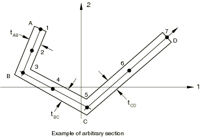

The arbitrary section type is provided to permit modeling of simple, arbitrary, thin-walled, open and closed sections. You specify the section by defining a series of points in the thin-walled cross-section of the beam; these points are then linked by straight line segments, each of which is integrated numerically along the axis of the section so that the section can be used together with nonlinear material behavior. An independent thickness is associated with each of the segments making up the arbitrary section.

Warping effects are included when an arbitrary section is used with open-section beam elements (available only in Abaqus/Standard).

| **Input File Usage: ** | Use either of the following options: |
| --- | --- |
|  | ``` [*BEAM SECTION](../key/key-link.md#usb-kws-mbeamsection), SECTION=ARBITRARY [*BEAM GENERAL SECTION](../key/key-link.md#usb-kws-mbeamgensect), SECTION=ARBITRARY ``` |

| **Abaqus/CAE Usage: ** | Property module: **Create Profile**: **Arbitrary** |
| --- | --- |

#### Restrictions

- An arbitrary section can be used only with beams in space (three-dimensional models).
- An arbitrary section should not be used to define closed sections with branches, multiply connected closed sections, or open sections with disconnected regions.
- For each individual segment of an arbitrary section there is no bending stiffness about the line joining the end points of the segment. Thus, an arbitrary section cannot be made up of only one segment.

#### Geometric input data

First, give the number of segments, the local coordinates of points *A* and *B*, and the thickness of the segment connecting these two vertices. Then, proceed by giving the local coordinates of point *C* and the thickness of the segment between points *B* and *C*, followed by the local coordinates of point *D* and the thickness of the segment between points *C* and *D*, and so on. An arbitrary section can contain as many segments as needed. All coordinates of section definition points are given in the local 1–2 axis system of the section.

The origin of the local 1–2 axis system is the beam node, and the position of this node used to define the section is arbitrary: it does not have to be the centroid.

##### Defining a closed section

A closed section is defined by making the starting and end points coincident. Only single-cell closed sections can be modeled accurately. Closed sections with fins (single branches attached to the cell) cannot be modeled with the capability in Abaqus.

##### Defining an arbitrary section with discontinuous branches

If the arbitrary section contains discontinuous sections (branches), a section with zero thickness should be used to return from the ending point of the branch to the starting point of the subsequent section. This zero thickness section should always coincide with a nonzero thickness section. For an example of an I-section defined using this method, see ["Buckling analysis of beams," Section 1.2.1 of the Abaqus Benchmarks Guide](../bmk/bmk-link.md#bmk-anl-beambuckle).

#### Default integration

A three-point Simpson integration scheme is used for each segment making up the section. For more detailed integration, specify several segments along each straight portion of the section.

#### Default stress output points if a beam section integrated during the analysis is used

The vertices of the section.

#### Temperature and field variable input at specific points through beam sections integrated during the analysis

Give the value at each vertex of the section (points *A*, *B*, *C*, *D* in the figure).

### Box section

| **Input File Usage: ** | Use one of the following options: |
| --- | --- |
|  | ``` [*BEAM SECTION](../key/key-link.md#usb-kws-mbeamsection), SECTION=BOX [*BEAM GENERAL SECTION](../key/key-link.md#usb-kws-mbeamgensect), SECTION=BOX [*FRAME SECTION](../key/key-link.md#usb-kws-mframesection), SECTION=BOX ``` |

| **Abaqus/CAE Usage: ** | Property module: **Create Profile**: **Box** |
| --- | --- |

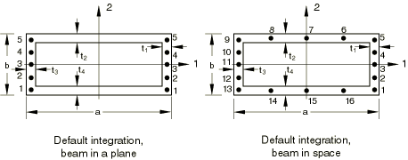

#### Geometric input data

*a*, *b*, , , , 

#### Default integration (Simpson)

Beam in a plane: 5 points

Beam in space: 5 points in each wall (16 total)

#### Nondefault integration input for a beam section integrated during the analysis

Beam in a plane: Give the number of points in each wall that is parallel to the 2-axis. This number must be odd and greater than or equal to three.

Beam in space: Give the number of points in each wall that is parallel to the 2-axis, then the number of points in each wall that is parallel to the 1-axis. Both numbers must be odd and greater than or equal to three.

#### Default stress output points if a beam section integrated during the analysis is used

Beam in a plane: Bottom and top (points 1 and 5 above for default integration).

Beam in space: 4 corners (points 1, 5, 9, and 13 above for default integration).

#### Temperature and field variable input at specific points for beam sections integrated during the analysis

Give the value at each of the points shown below.

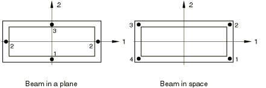

#### Temperature input for a frame section

Constant temperature throughout the element cross-section is assumed; therefore, only one temperature value per node is required.

### Circular section

| **Input File Usage: ** | Use one of the following options: |
| --- | --- |
|  | ``` [*BEAM SECTION](../key/key-link.md#usb-kws-mbeamsection), SECTION=CIRC [*BEAM GENERAL SECTION](../key/key-link.md#usb-kws-mbeamgensect), SECTION=CIRC [*FRAME SECTION](../key/key-link.md#usb-kws-mframesection), SECTION=CIRC ``` |

| **Abaqus/CAE Usage: ** | Property module: **Create Profile**: **Circular** |
| --- | --- |


#### Geometric input data

Radius

#### Default integration

Beam in a plane: 5 points

Beam in space: 3 points radially, 8 circumferentially (17 total; trapezoidal rule). Integration point 1 is situated at the center of the beam and is used for output purposes only. It makes no contribution to the stiffness of the element; therefore, the integration point volume (IVOL) associated with this point is zero.

#### Nondefault integration input for a beam section integrated during the analysis

Beam in a plane: A maximum of 9 points are permitted.

Beam in space: Give an odd number of points in the radial direction, then an even number of points in the circumferential direction.

#### Default stress output points if a beam section integrated during the analysis is used

Beam in a plane: Bottom and top (points 1 and 5 above for default integration).

Beam in space: On the intersection of the surface with the 1- and 2-axes (points 3, 7, 11, and 15 above for default integration).

#### Temperature and field variable input at specific points for beam sections integrated during the analysis

Give the value at each of the points shown below.


#### Temperature input for a frame section

Constant temperature throughout the element cross-section is assumed; therefore, only one temperature value per node is required.

### Hexagonal section

| **Input File Usage: ** | Use either of the following options: |
| --- | --- |
|  | ``` [*BEAM SECTION](../key/key-link.md#usb-kws-mbeamsection), SECTION=HEX [*BEAM GENERAL SECTION](../key/key-link.md#usb-kws-mbeamgensect), SECTION=HEX ``` |

| **Abaqus/CAE Usage: ** | Property module: **Create Profile**: **Hexagonal** |
| --- | --- |

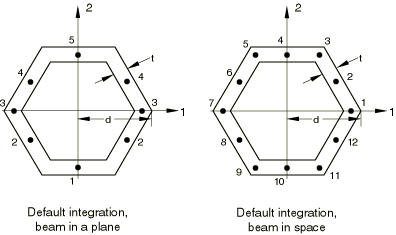

#### Geometric input data

*d* (circumscribing radius), *t* (wall thickness)

#### Default integration (Simpson)

Beam in a plane: 5 points

Beam in space: 3 points in each wall segment (12 total)

#### Nondefault integration input for a beam section integrated during the analysis

Beam in a plane: Give the number of points along the section wall, moving in the second beam section axis direction. This number must be odd and greater than or equal to three.

Beam in space: Give the number of points in each wall segment. This number must be odd and greater than or equal to three.

#### Default stress output points if a beam section integrated during the analysis is used

Beam in a plane: Bottom and top (points 1 and 5 above for default integration).

Beam in space: Vertices (points 1, 3, 5, 7, 9, and 11 above for default integration).

#### Temperature and field variable input at specific points for beam sections integrated during the analysis

Give the value at each of the points shown below.


### I-section

| **Input File Usage: ** | Use one of the following options: |
| --- | --- |
|  | ``` [*BEAM SECTION](../key/key-link.md#usb-kws-mbeamsection), SECTION=I [*BEAM GENERAL SECTION](../key/key-link.md#usb-kws-mbeamgensect), SECTION=I [*FRAME SECTION](../key/key-link.md#usb-kws-mframesection), SECTION=I ``` |

| **Abaqus/CAE Usage: ** | Property module: **Create Profile**: **I** |
| --- | --- |


#### Geometric input data

*l*, *h*, , , , , 

By allowing you to specify *l*, the origin of the local cross-section axis can be placed anywhere on the symmetry line (the local 2-axis). In the above figures a negative value of *l* implies that the origin of the local cross-section axis is below the lower edge of the bottom flange, which may be needed when constraining a beam stiffener to a shell.

##### Defining a T-section

| **Input File Usage: ** | Set  and  or  and  to zero to model a T-section. |
| --- | --- |

| **Abaqus/CAE Usage: ** | Property module: **Create Profile**: **T** |
| --- | --- |

#### Default integration (Simpson)

Beam in a plane: 5 points (one in each flange plus 3 in web)

Beam in space: 5 points in web, 5 in each flange (13 total)

#### Nondefault integration input for a beam section integrated during the analysis

Beam in a plane: Give the number of points in the second beam section axis direction. This number must be odd and greater than or equal to three.

Beam in space: Give the number of points in the lower flange first, then in the web, and then in the upper flange. These numbers must be odd and greater than or equal to three in each nonvanishing section.

#### Default stress output points if a beam section integrated during the analysis is used

Beam in a plane: Flanges (points 1 and 5 above for default integration).

Beam in space: Ends of flanges (points 1, 5, 9, and 13 above for default integration).

#### Temperature and field variable input at specific points for beam sections integrated during the analysis

Give the value at each of the points shown below.


For a beam in space the temperature is first interpolated linearly through the flanges based on the temperature at points 1 and 2, and then 4 and 5, respectively. It is then interpolated parabolically through the web.

#### Temperature input for a frame section

Constant temperature throughout the element cross-section is assumed; therefore, only one temperature value per node is required.

### L-section

| **Input File Usage: ** | Use either of the following options: |
| --- | --- |
|  | ``` [*BEAM SECTION](../key/key-link.md#usb-kws-mbeamsection), SECTION=L [*BEAM GENERAL SECTION](../key/key-link.md#usb-kws-mbeamgensect), SECTION=L ``` |

| **Abaqus/CAE Usage: ** | Property module: **Create Profile**: **L** |
| --- | --- |

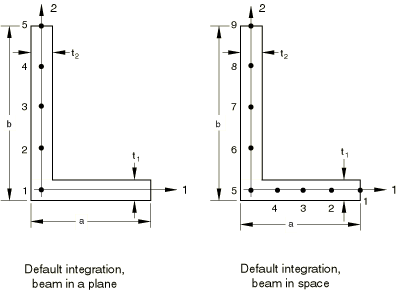

#### Geometric input data

*a*, *b*, , 

#### Default integration (Simpson)

Beam in a plane: 5 points

Beam in space: 5 points in each flange (9 total)

#### Nondefault integration input for a beam section integrated during the analysis

Beam in a plane: Give the number of points in the second beam section axis direction. This number must be odd and greater than or equal to three.

Beam in space: Give the number of points in the first beam section axis direction, then the number of points in the second beam section axis direction. These numbers must be odd and greater than or equal to three.

#### Default stress output points if a beam section integrated during the analysis is used

Beam in a plane: Bottom and top (points 1 and 5 above for default integration).

Beam in space: End of flange along positive local 1-axis; section corner; end of flange along positive local 2-axis (points 1, 5, and 9 above for default integration).

#### Temperature and field variable input at specific points for beam sections integrated during the analysis

Give the value at each of the points shown below.

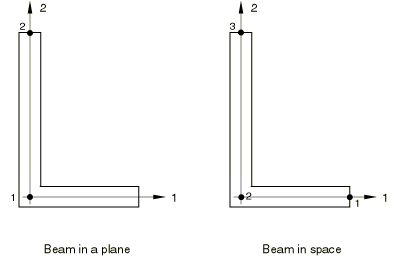

### Pipe section (thin-walled)

Pipe cross-sections can be associated with beam, pipe, or frame elements.

| **Input File Usage: ** | Use one of the following options: |
| --- | --- |
|  | ``` [*BEAM SECTION](../key/key-link.md#usb-kws-mbeamsection), SECTION=PIPE [*BEAM GENERAL SECTION](../key/key-link.md#usb-kws-mbeamgensect), SECTION=PIPE [*FRAME SECTION](../key/key-link.md#usb-kws-mframesection), SECTION=PIPE ``` |

| **Abaqus/CAE Usage: ** | Property module: **Create Profile**: **Pipe**: **Thin walled** |
| --- | --- |

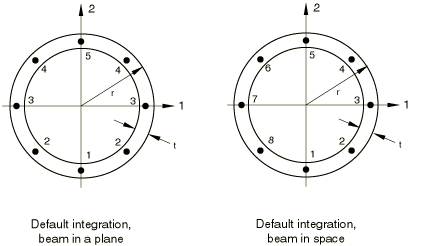

#### Geometric input data

*r* (outside radius), *t* (wall thickness)

#### Default integration

Beam in a plane: 5 points (Simpson's rule)

Beam in space: 8 points (trapezoidal rule)

#### Nondefault integration input for a beam section integrated during the analysis

Beam in a plane: Give an odd number of points. This number must be greater than or equal to five.

Beam in space: Give an even number of points. This number must be greater than or equal to eight.

#### Default stress output points if a beam section integrated during the analysis is used

Beam in a plane: Bottom and top (points 1 and 5 above for default integration).

Beam in space: On the intersection of the surface with the 1- and 2-axes (points 1, 3, 5, and 7 above for default integration).

#### Temperature and field variable input at specific points for beam sections integrated during the analysis

Give the value at each of the points shown below.

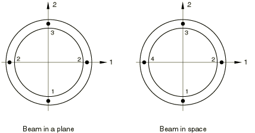

#### Temperature input for a frame section

Constant temperature throughout the element cross-section is assumed; therefore, only one temperature value per node is required.

### Pipe section (thick-walled)

Thick-walled pipe cross-sections can be associated with beam or pipe elements.

| **Input File Usage: ** | Use the following option: |
| --- | --- |
|  | ``` [*BEAM SECTION](../key/key-link.md#usb-kws-mbeamsection), SECTION=THICK PIPE ``` |

| **Abaqus/CAE Usage: ** | Property module: **Create Profile**: **Pipe**: **Thick walled** |
| --- | --- |


#### Geometric input data

*r* (outside radius), *t* (wall thickness)

#### Default integration

Beam in a plane: 3 points radially (Simpson's rule), 5 circumferentially (trapezoidal rule)

Beam in space:  3 points radially (Simpson's rule), 8 circumferentially (trapezoidal rule)

#### Nondefault integration input for a beam section integrated during the analysis

Beam in a plane: Give an odd number of points in the radial direction, then an odd number of points (greater than or equal to 5) in the circumferential direction.

Beam in space: Give an odd number of points in the radial direction, then an even number of points (greater than or equal to 8) in the circumferential direction.

#### Default stress output points if a beam section integrated during the analysis is used

Beam in a plane: Bottom and top on the pipe midsurface (points 2 and 14 above for default integration).

Beam in space: On the intersection of the pipe midsurface with the 1- and 2-axes (points 2, 8, 14, and 20 above for default integration).

#### Temperature and field variable input at specific points for beam sections integrated during the analysis

Give the value at each of the points shown below.

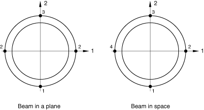

### Rectangular section

| **Input File Usage: ** | Use one of the following options: |
| --- | --- |
|  | ``` [*BEAM SECTION](../key/key-link.md#usb-kws-mbeamsection), SECTION=RECT [*BEAM GENERAL SECTION](../key/key-link.md#usb-kws-mbeamgensect), SECTION=RECT [*FRAME SECTION](../key/key-link.md#usb-kws-mframesection), SECTION=RECT ``` |

| **Abaqus/CAE Usage: ** | Property module: **Create Profile**: **Rectangular** |
| --- | --- |


#### Geometric input data

*a*, *b*

#### Default integration (Simpson)

Beam in a plane: 5 points

Beam in space: 5  5 (25 total)

#### Nondefault integration input for a beam section integrated during the analysis

Beam in a plane: Give the number of points in the second beam section axis direction. This number must be odd and greater than or equal to five.

Beam in space: Give the number of points in the first beam section axis direction, then the number of points in the second beam section axis direction. These numbers must be odd and greater than or equal to five.

#### Default stress output points if a beam section integrated during the analysis is used

Beam in a plane: Bottom and top (points 1 and 5 above for default integration).

Beam in space: Corners (points 1, 5, 21, and 25 above for default integration).

#### Temperature and field variable input at specific points for beam sections integrated during the analysis

Give the value at each of the points shown below.

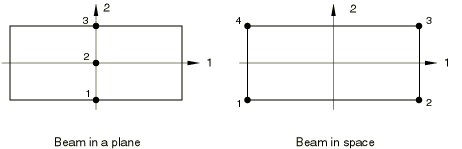

#### Temperature input for a frame section

Constant temperature throughout the element cross-section is assumed; therefore, only one temperature value per node is required.

### Trapezoidal section

| **Input File Usage: ** | Use either of the following options: |
| --- | --- |
|  | ``` [*BEAM SECTION](../key/key-link.md#usb-kws-mbeamsection), SECTION=TRAPEZOID [*BEAM GENERAL SECTION](../key/key-link.md#usb-kws-mbeamgensect), SECTION=TRAPEZOID ``` |

| **Abaqus/CAE Usage: ** | Property module: **Create Profile**: **Trapezoidal** |
| --- | --- |

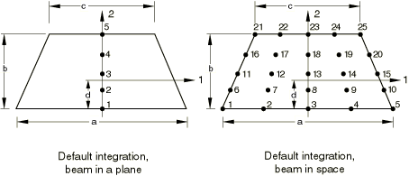

#### Geometric input data

*a*, *b*, *c*, *d*

By allowing you to specify *d*, the origin of the local cross-section axes can be placed anywhere on the symmetry line (the local 2-axis). In the above figures a negative value of *d* implies that the origin of the local cross-section axis is below the lower edge of the section. This may be needed when constraining a beam stiffener to a shell.

#### Default integration (Simpson)

Beam in a plane: 5 points

Beam in space: 5  5 (25 total)

#### Nondefault integration input for a beam section integrated during the analysis

Beam in a plane: Give the number of points in the second beam section axis direction. This number must be odd and greater than or equal to five.

Beam in space: Give the number of points in the first beam section axis direction, then the number of points in the second beam section axis direction. These numbers must be odd and greater than or equal to five.

#### Default stress output points if a beam section integrated during the analysis is used

Beam in a plane: Bottom and top (points 1 and 5 above for default integration).

Beam in space: Corners (points 1, 5, 21, and 25 above for default integration).

#### Temperature and field variable input at specific points for beam sections integrated during the analysis

Give the value at each of the points shown below.


