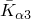
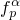
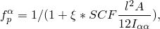
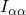
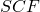
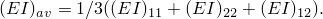
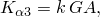
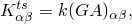
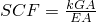
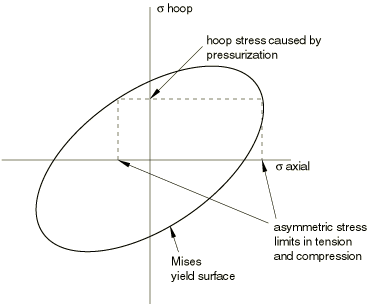

# 29.3.3 Choosing a beam element


**Products: **Abaqus/Standard  Abaqus/Explicit  Abaqus/CAE  

##### **References**

- ["Beam modeling: overview," Section 29.3.1](pt06ch29s03abo26.md)
- ["Beam element library," Section 29.3.8](pt06ch29s03ael14.md)
- [*TRANSVERSE SHEAR STIFFNESS](../key/key-link.md#usb-kws-mtransshearstiff)
- ["Creating beam sections," Section 12.13.11 of the Abaqus/CAE User's Guide](../usi/usi-link.md#usi-prp-section-beam)

### Overview

Abaqus offers a wide range of beam elements, including “Euler-Bernoulli”-type beams and “Timoshenko”-type beams with solid, thin-walled closed and thin-walled open sections.

The Abaqus/Standard beam element library includes: 
- Euler-Bernoulli (slender) beams in a plane and in space;
- Timoshenko (shear flexible) beams in a plane and in space;
- linear, quadratic, and cubic interpolation formulations;
- warping (open section) beams;
- pipe elements; and
- hybrid formulation beams, typically used for very stiff beams that rotate significantly (applications in robotics or in very flexible structures such as offshore pipelines).

The Abaqus/Explicit beam element library includes:- Timoshenko (shear flexible) beams in a plane and in space;
- linear and quadratic interpolation formulations; and
- linear pipe elements.

### Naming convention

Beam elements in Abaqus are named as follows:


For example, B21H is a planar beam that uses linear interpolation and a hybrid formulation.

### Euler-Bernoulli (slender) beams

Euler-Bernoulli beams (B23, B23H, B33, and B33H) are available only in Abaqus/Standard. These elements do not allow for transverse shear deformation; plane sections initially normal to the beam's axis remain plane (if there is no warping) and normal to the beam axis. They should be used only to model slender beams: the beam's cross-sectional dimensions should be small compared to typical distances along its axis (such as the distance between support points or the wavelength of the highest mode that participates in a dynamic response). For beams made of uniform material, typical dimensions in the cross-section should be less than about 1/15 of typical axial distances for transverse shear flexibility to be negligible. (The ratio of cross-section dimension to typical axial distance is called the slenderness ratio.)

Load stiffness for pressure loads is not included for these elements.

#### Interpolation

The Euler-Bernoulli beam elements use cubic interpolation functions, which makes them reasonably accurate for cases involving distributed loading along the beam. Therefore, they are well suited for dynamic vibration studies, where the d'Alembert (inertia) forces provide such distributed loading.

The cubic beam elements are written for small-strain, large-rotation analysis. They may not be appropriate for torsional stability problems due to the approximations in the underlying formulation and cannot be used in analyses involving very large rotations (of the order 180); quadratic or linear beam elements should be used instead.

#### Mass formulation

The Euler-Bernoulli beam elements use a consistent mass formulation. Rotary inertia for twist around the beam axis is the same as for Timoshenko beams. For details, see ["Mass and inertia for Timoshenko beams," Section 3.5.5 of the Abaqus Theory Guide](../stm/stm-link.md#stm-elm-timbeaminertia). Any additional inertia defined for these elements (see ["Adding inertia to the beam section behavior for Timoshenko beams" in "Beam section behavior," Section 29.3.5](pt06ch29s03alm10.md#usb-elm-ebeamsectionbehavior-addinertia)) is ignored.

### Timoshenko (shear flexible) beams

Timoshenko beams (B21, B22, B31, B31OS, B32, B32OS, PIPE21, PIPE22, PIPE31, PIPE32, and their “hybrid” equivalents) allow for transverse shear deformation. They can be used for thick (“stout”) as well as slender beams. For beams made from uniform material, shear flexible beam theory can provide useful results for cross-sectional dimensions up to 1/8 of typical axial distances or the wavelength of the highest natural mode that contributes significantly to the response. Beyond this ratio the approximations that allow the member's behavior to be described solely as a function of axial position no longer provide adequate accuracy.

Abaqus assumes that the transverse shear behavior of Timoshenko beams is linear elastic with a fixed modulus and, thus, independent of the response of the beam section to axial stretch and bending.

For most beam sections Abaqus will calculate the transverse shear stiffness values required in the element formulation. You can override these default values as described below in ["Defining the transverse shear stiffness and the slenderness compensation factor](pt06ch29s03alm08.md#usb-elm-ebeamelem-transshear-override).” The default shear stiffness values are not calculated in some cases if estimates of shear moduli are unavailable during the preprocessing stage of input; for example, when the material behavior is defined by user subroutine [`UMAT`](../sub/sub-link.md#sub-xsl-umat), [`UHYPEL`](../sub/sub-link.md#sub-xsl-uhypel), [`UHYPER`](../sub/sub-link.md#sub-xsl-uhyper), or [`VUMAT`](../sub/sub-link.md#sub-xsl-vumat). In such cases you must define the transverse shear stiffnesses as described below.

The Timoshenko beams can be subjected to large axial strains. The axial strains due to torsion are assumed to be small. In combined axial-torsion loading, torsional shear strains are calculated accurately only when the axial strain is not large.

#### Transverse shear stiffness definition

The effective transverse shear stiffness of the section of a shear flexible beam is defined in Abaqus as 


where  is the section shear stiffness in the -direction;  is a dimensionless factor used to prevent the shear stiffness from becoming too large in slender beam elements;  is the actual shear stiffness of the section; and  are the local directions of the cross-section. The  have units of force.

The dimensionless factors  are always included in the calculation of transverse shear stiffness and are defined as 



where *l* is the length of the element, *A* is the cross-sectional area,  is the inertia in the -direction,  is the slenderness compensation factor (with a default value of 0.25), and  is a constant of value 1.0 for first-order elements and 104 for second-order elements.

For meshed cross-sections the above expressions change to




You can define the  or  as described below. If you do not specify them, they are defined by 



 or 



where *G* is the elastic shear modulus or moduli and *A* is the cross-sectional area of the beam section. Temperature and field variable dependencies of *G* are not taken into account when calculating  and . The shear factor *k* (Cowper, 1966) is defined as:

| Section type | Shear factor, *k* |
| --- | --- |
| Arbitrary | 1.0 |
| Box | 0.44 |
| Circular | 0.89 |
| Elbow | 0.85 |
| Generalized | 1.0 |
| Hexagonal | 0.53 |
| I (and T) | 0.44 |
| L | 1.0 |
| Meshed | 1.0 |
| Nonlinear generalized | 1.0 |
| Pipe | 0.53 |
| Rectangular | 0.85 |
| Thick pipe | 0.53--0.89 |
| Trapezoidal | 0.822 |

When a beam section definition integrated during the analysis is used (see ["Using a beam section integrated during the analysis to define the section behavior," Section 29.3.6](pt06ch29s03alm11.md)), *G* is calculated from the elastic material definition used with the section. When a general beam section definition is used (see ["Using a general beam section to define the section behavior," Section 29.3.7](pt06ch29s03alm12.md)), you provide *G* as part of the beam section data.

##### Defining the transverse shear stiffness and the slenderness compensation factor

You can define the transverse shear stiffness for beam sections integrated during the analysis and general beam sections. In the case of two-dimensional beams, you can input a single value of transverse shear stiffness, namely . If either value of  is omitted or given as zero, the nonzero value will be used for both.

 You can also define the slenderness compensation factor. The default value for the slenderness compensation factor is 0.25. If a slenderness compensation factor value is provided, you must also provide the values of the shear stiffness .

In the case of first-order elements, you may define the slenderness compensation factor by including the label SCF. Abaqus will then use a slenderness compensation factor of , and any values of  that you specify are ignored. Instead, the  values are calculated from the elastic material definition.

The transverse shear stiffness is not relevant to Euler-Bernoulli beam elements for which the transverse shear constraints are satisfied exactly.

| **Input File Usage: ** | Use both of the following options to define the transverse shear stiffness for beam sections integrated during the analysis: |
| --- | --- |
|  | ``` [*BEAM SECTION](../key/key-link.md#usb-kws-mbeamsection) [*TRANSVERSE SHEAR STIFFNESS](../key/key-link.md#usb-kws-mtransshearstiff) ``` Use both of the following options to define the transverse shear stiffness for general beam sections: ``` [*BEAM GENERAL SECTION](../key/key-link.md#usb-kws-mbeamgensect) [*TRANSVERSE SHEAR STIFFNESS](../key/key-link.md#usb-kws-mtransshearstiff) ``` |

| **Abaqus/CAE Usage: ** | To define transverse shear stiffness for beam sections integrated during the analysis: |
| --- | --- |
|  | Property module: beam section editor: **Section integration: During analysis**: **Stiffness**: toggle on **Specify transverse shear** To define transverse shear stiffness for general beam sections: Property module: beam section editor: **Section integration: Before analysis**: **Stiffness**, toggle on **Specify ****transverse shear** |

#### Interpolation

Abaqus provides finite axial strain, shear flexible beams with linear and quadratic interpolations. Their formulation is described in ["Beam element formulation," Section 3.5.2 of the Abaqus Theory Guide](../stm/stm-link.md#stm-elm-beamform).

Element types B21, B31, B31OS, PIPE21, PIPE31, and their hybrid equivalents use linear interpolation. These elements are well suited for cases involving contact, such as the laying of a pipeline in a trench or on the seabed or the contact between a drill string and a well hole, and for dynamic versions of similar problems (impact).

Element types B22, B32, B32OS, PIPE22, PIPE32, and their hybrid equivalents use quadratic interpolation.

#### Mass formulation

The linear Timoshenko beam elements use a lumped mass formulation by default. The quadratic Timoshenko beam elements in Abaqus/Standard use a consistent mass formulation, except in dynamic procedures in which a lumped mass formulation with a 1/6, 2/3, 1/6 distribution is used. For details, see ["Mass and inertia for Timoshenko beams," Section 3.5.5 of the Abaqus Theory Guide](../stm/stm-link.md#stm-elm-timbeaminertia). The quadratic Timoshenko beam elements in Abaqus/Explicit use a lumped mass formulation with a 1/6, 2/3, 1/6 distribution.

##### Using a consistent mass matrix in Abaqus/Standard

Alternatively, in Abaqus/Standard you can use the McCalley-Archer consistent mass matrix based on the cubic interpolation of deflections and quadratic interpolation of rotations.

| **Input File Usage: ** | Use the following option for linear Timoshenko beam elements with beam sections integrated during the analysis: |
| --- | --- |
|  | ``` [*BEAM SECTION](../key/key-link.md#usb-kws-mbeamsection), LUMPED=NO ``` Use the following option for linear Timoshenko beam elements with general beam sections: ``` [*BEAM GENERAL SECTION](../key/key-link.md#usb-kws-mbeamgensect), LUMPED=NO ``` |

| **Abaqus/CAE Usage: ** | Use the following option for linear Timoshenko beam elements with beam sections integrated during the analysis: |
| --- | --- |
|  | Property module: beam section editor: **Section integration: During analysis**: **Stiffness** tabbed page: toggle on **Use consistent mass matrix formulation** Use the following option for linear Timoshenko beam elements with general beam sections: Property module: beam section editor: **Section integration: Before analysis**: **Stiffness** tabbed page: toggle on **Use consistent mass matrix formulation** |

#### Rotary inertia treatment and additional beam inertia

By default, the exact (anisotropic with displacement-rotation coupling) rotary inertia is used for Timoshenko beams. Optionally, an uncoupled isotropic approximation to the rotary inertia can be used. See ["Rotary inertia for Timoshenko beams" in "Beam section behavior," Section 29.3.5](pt06ch29s03alm10.md#usb-elm-ebeamsectionbehavior-rotinertia), for further details.

The exception to this rule is the static procedure with automatic stabilization (see ["Static stress analysis," Section 6.2.2](pt03ch06s02at01.md)), where the mass matrix for Timoshenko beams is always calculated assuming isotropic rotary inertia, regardless of the type of rotary inertia specified for the beam section definition (see ["Rotary inertia for Timoshenko beams" in "Beam section behavior," Section 29.3.5](pt06ch29s03alm10.md#usb-elm-ebeamsectionbehavior-rotinertia)).

In some structural applications the beam element may be a one-dimensional approximation of a structure with complex cross-sectional geometry and mass distribution. In such a cross-section there may be inertia contributions that represent heavy machinery, cargo loaded in a ship compartment, fluid-filled ballast tanks, or any other mass distributed along the length of the beam that is not part of the beam's structural stiffness. In such cases you can define additional mass and rotary inertia associated with the beam section properties. Multiple masses per unit length (with location other than the origin of the beam cross-section) and rotary inertias per unit length can be specified. Mass proportional damping (alpha or composite damping) associated with this additional inertia can also be specified. Abaqus will use the mass weighted average (based on the material damping and the added inertial damping) for the element mass proportional damping. See ["Material damping," Section 26.1.1](pt05ch26s01abm51.md), for details.

#### Additional inertia due to immersion in fluid

When a beam is fully or partially submerged, the effect of the surrounding fluid can be modeled as an additional distributed inertia on the beam. See ["Additional inertia due to immersion in fluid" in "Beam section behavior," Section 29.3.5](pt06ch29s03alm10.md#usb-elm-ebeamsectionbehavior-fluidinertia), for details.

#### Warping (open-section) beams

When modeling beams in space, a further consideration arises from the possible warping of the beam's cross-section under torsional loading. For all but circular sections the beam's cross-section will deform out of its original plane when subject to torsion. This warping deformation will modify the shear strain distribution throughout the section.

Open sections will typically twist very easily if warping is not prevented, especially if the walls that form the beam section are thin. Constraint of this warping at certain points along the beam (such as where the beam is built into some other member, [Figure 29.3.3--1](pt06ch29s03alm08.md#ebeam-open-intersect), or into a wall) is then a major determinant of the beam's overall torsional response.

**Figure 29.3.3–1** Intersection of open section beams.


Element types B31OS, B32OS (and their “hybrid” equivalents) have the warping magnitude, *w*, as a degree of freedom at each node; they are available only in Abaqus/Standard. In these elements Abaqus/Standard assumes that the warping of the cross-section follows a certain pattern as a function of position in the cross-section (Abaqus will calculate this warping pattern if you have specified a standard library section or an “arbitrary” section): only the warping magnitude varies with position along the beam's axis. These elements are meant for the analysis of thin-walled open sections in which warping constraints play a role and the axial strains due to warping cannot be neglected. Examples of such open sections that may warp in this fashion are the I-section and any open arbitrary section. In the other beam element types warping is considered unconstrained and any axial stress due to warping is neglected; torsional behavior will not be represented adequately when these element types are used with thin-walled, open sections.

In general, the warping magnitude can be continuous only when the beam axis is continuous through a node and the beam cross-section is the same on both sides of the node. Thus, if open-section members intersect at a node (such as the cross-member of a vehicle chassis abutting a longitudinal member, [Figure 29.3.3--1](pt06ch29s03alm08.md#ebeam-open-intersect)), separate nodes may have to be used for the intersecting members with different axial directions and appropriate constraints must be chosen for the warping amplitudes in each member at this point. The choice of these constraints is a matter of detail of the local construction. For example, if the joint is reinforced, warping may be prevented; therefore, degree of freedom 7 should be fully constrained with a boundary condition on the appropriate members at the joint.

#### "Pipe" elements

The pipe elements in Abaqus assume a hollow circular section. The internal stress caused by internal or external pressure loading in the pipe is included in these elements so that on the pipe cross-section a point under tension will have different yield than a point under compression ([Figure 29.3.3--2](pt06ch29s03alm08.md#ebeam-pipe-yield)), thus causing an asymmetry in the section's response to inelastic bending. Two formulations are available for pipe elements in Abaqus. The thin-walled pipe formulation assumes constant hoop stress across the cross-section and neglects the radial stress, whereas thick-walled pipes (available only in Abaqus/Standard) allow the hoop and radial stress components to vary across the cross-section.

**Figure 29.3.3–2** Yield behavior in thin-walled PIPE elements.



The hoop stress in thin-walled pipe elements is computed as the average stress in equilibrium with the internal and external pressure loading on the pipe section. For the thin-walled formulation, an integration rule with one point through the thickness suffices to obtain an accurate solution.

For thick-walled pipes, the hoop stress and radial stress variation under applied internal and/or external pressure are calculated using Lam’s equations. The constitutive calculations at each material point take into account the imposed hoop and radial stress values to determine the structural response.  A two-dimensional integration rule is used for thick-walled pipes to capture the effect of stress variation across the section accurately.

### "Hybrid" beams

Hybrid beam element types (B21H, B33H, etc.) are provided in Abaqus/Standard for use in cases where it is numerically difficult to compute the axial and shear forces in the beam by the usual finite element displacement method. This problem arises most commonly in geometrically nonlinear analysis when the beam undergoes large rotations and is very rigid in axial and transverse shear deformation, such as a link in a vehicle's suspension system or a flexing long pipe or cable. The problem in such cases is that slight differences in nodal positions can cause very large forces, which, in turn, cause large motions in other directions. The hybrid elements overcome this difficulty by using a more general formulation in which the axial and transverse shear forces in the elements are included, along with the nodal displacements and rotations, as primary variables. Although this formulation makes these elements more expensive, they generally converge much faster when the beam's rotations are large and, therefore, are more efficient overall in such cases.

#### Additional references

- Archer, J. S., "Consistent Matrix Formulations for Structural Analysis using Finite-Element Techniques," American Institute of Aeronautics and Astronautics Journal, vol. 3, pp. 1910--1918, 1965.
- Cowper, R. G., "The Shear Coefficient in Timoshenko's Beam Theory," Journal of Applied Mechanics, vol. 33, pp. 335--340, 1966.


