# 29.4.2 Frame section behavior


**Product: **Abaqus/Standard  

##### **References**

- ["Frame elements," Section 29.4.1](pt06ch29s04alm13.md)
- [*FRAME SECTION](../key/key-link.md#usb-kws-mframesection)

### Overview

The frame section behavior:
- requires definition of the section's shape and its material response;
- uses linear elastic behavior in the interior of the frame element;
- can include "lumped" plasticity at the element ends to model the formation of plastic hinges;
- can be uniaxial only, with response governed by a phenomenological buckling strut model, together with linear elasticity and tensile plastic yielding; and
- for pipe sections only, can switch to buckling strut response during the analysis.

### Defining elastic section behavior

The elastic response of the frame elements is formulated in terms of Young's modulus, *E*; the torsional shear modulus, *G*; coefficient of thermal expansion, ; and cross-section shape. Geometric properties such as the cross-sectional area, *A*, or bending moments of inertia are constant along the element and during the analysis.

If present, thermal strains are constant over the cross-section, which is equivalent to assuming that the temperature does not vary in the cross-section. As a result of this assumption only the axial force, *N*, depends on the thermal strain 

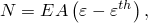

where  defines the total axial strain, including any initial elastic strain caused by a user-defined nonzero initial axial force, and  defines the thermal expansion strain given by 

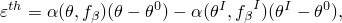

where 


is the thermal expansion coefficient,


is the current temperature at the section,


is the reference temperature for ,


is the user-defined initial temperature at this point (["Initial conditions in Abaqus/Standard and Abaqus/Explicit," Section 34.2.1](pt07ch34s02aus116.md)),


are field variables, and


are the user-defined initial values of field variables at this point (["Initial conditions in Abaqus/Standard and Abaqus/Explicit," Section 34.2.1](pt07ch34s02aus116.md)).

The bending moment and twist torque responses are defined by the constitutive relations

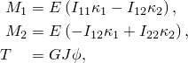

where 


is the moment of inertia for bending about the 1-axis of the section,


is the moment of inertia for bending about the 2-axis of the section,


is the moment of inertia for cross-bending,

*J*

is the torsional constant,


is the curvature change about the first beam section local axis, including any elastic curvature change associated with a user-defined nonzero initial moment  (["Initial conditions in Abaqus/Standard and Abaqus/Explicit," Section 34.2.1](pt07ch34s02aus116.md)),


is the curvature change about the second beam section local axis, including any elastic curvature change associated with a user-defined nonzero initial moment  (["Initial conditions in Abaqus/Standard and Abaqus/Explicit," Section 34.2.1](pt07ch34s02aus116.md)), and


is the twist, including any elastic twist associated with a user-defined nonzero initial twisting moment (torque) *T* (["Initial conditions in Abaqus/Standard and Abaqus/Explicit," Section 34.2.1](pt07ch34s02aus116.md)).

#### Defining temperature and field-variable-dependent section properties

The temperature and predefined field variables may vary linearly over the element's length. Material constants such as Young's modulus, 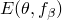, the torsional shear modulus, 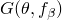, and the coefficient of thermal expansion, , can also depend on the temperature, , and field variables . You must associate the section definition with an element set.

| **Input File Usage: ** | ``` [*FRAME SECTION](../key/key-link.md#usb-kws-mframesection), ELSET=*name* ``` |
| --- | --- |

#### Specifying a standard library section and allowing Abaqus/Standard to calculate the cross-section's parameters

Select one of the following section profiles from the standard library of cross-sections (see ["Beam cross-section library," Section 29.3.9](pt06ch29s03abm01.md)): box, circular, I, pipe, or rectangular. Specify the geometric input data needed to define the shape of the cross-section. Abaqus/Standard will then calculate the geometric quantities needed to define the section behavior automatically.

| **Input File Usage: ** | ``` [*FRAME SECTION](../key/key-link.md#usb-kws-mframesection), SECTION=*library_section*, ELSET=*name* ``` |
| --- | --- |

#### Specifying the geometric quantities directly

Specify a general cross-section to define the area of the cross-section, moments of inertia, and torsional constant directly. These data are sufficient for defining the elastic section behavior since the axial stretching, bending response, and torsional behavior are assumed to be uncoupled.

| **Input File Usage: ** | ``` [*FRAME SECTION](../key/key-link.md#usb-kws-mframesection), SECTION=GENERAL, ELSET=*name* ``` |
| --- | --- |

#### Specifying the elastic behavior

Specify the elastic modulus, the torsional shear modulus, and the coefficient of thermal expansion as functions of temperature and field variables.

| **Input File Usage: ** | ``` [*FRAME SECTION](../key/key-link.md#usb-kws-mframesection), SECTION=*section_type*, ELSET=*name* *first_data_line* *second_data_line* *elastic_modulus*, *torsional_shear_modulus*, *coefficient_of_thermal_expansion*, *temperature*, *fv_1*, *fv_2*, etc. ``` |
| --- | --- |

### Defining elastic-plastic section behavior

To include elastic-plastic response, specify *N*, , , and *T* directly as functions of their conjugate plastic deformation variables or use the default plastic response for *N*, , , and *T* based on the material yield stress. Abaqus/Standard uses the specified or default values to define a nonlinear kinematic hardening model that is “lumped” into plastic hinges at the element ends. Since the plasticity is lumped at the element ends, no length dimension is associated with the hinge. Generalized forces are related to generalized plastic displacements, not strains. In reality, the plastic hinge will have a finite size determined by the structural member's length and the loading, which will affect the hardening rate but not the ultimate load. For example, yielding under pure bending (a constant moment over the member) will produce a hinge length equal to the member length, whereas yielding of a cantilever with transverse tip load (a linearly varying moment over the member) will produce a much more localized hinge. Hence, if the rate of hardening and, thus, the plastic deformation at a given load are of importance, you should calibrate the plastic response appropriately for different lengths and different loading situations.

In the plastic range the only plastic surface available is an ellipsoid. This yield surface is only reasonably accurate for the pipe cross-section. Box, circular, I, and rectangular cross-sections can be used at your discretion with the understanding that the elliptic yield surface may not approximate the elastic-plastic response accurately. The general cross-section type cannot be used with plasticity.

#### Defining *N*, *M1*, *M2*, and *T* directly

You can define *N*, , , and *T* directly. (See ["Material data definition," Section 21.1.2](pt05ch21s01aus109.md), for a detailed discussion of the tabular input conventions. In particular, you must ensure that the range of values given for the variables is sufficient for the application since Abaqus/Standard assumes a constant value of the dependent variable outside the specified range.) Abaqus/Standard will fit an exponential curve to the user-supplied data as discussed below (see “Elastic-plastic data curve fit and calculation of default values” below). The plastic data describe the response to axial force, moment about the cross-sectional 1- and 2-directions, and torque.

You must specify pairs of data relating the generalized force component to the appropriate plastic variable. Since the plasticity is concentrated at the element ends, the overall plastic response is dependent on the length of the element; hence, members with different lengths might require different hardening data. The plasticity model for frame elements is intended for frame-like structures: each member between structural joints is modeled with a single frame element where plastic hinges are allowed to develop at the end connections.

At least three data pairs for each plastic variable are required to describe the elastic-plastic section hardening behavior. If fewer than three data pairs are given, Abaqus/Standard will issue an error message.

| **Input File Usage: ** | Use the following options: |
| --- | --- |
|  | ``` [*FRAME SECTION](../key/key-link.md#usb-kws-mframesection), SECTION=PIPE, ELSET=*name* [*PLASTIC AXIAL](../key/key-link.md#usb-kws-mplasticaxial) for *N* [*PLASTIC M1](../key/key-link.md#usb-kws-mplasticm1) for  [*PLASTIC M2](../key/key-link.md#usb-kws-mplasticm2) for  [*PLASTIC TORQUE](../key/key-link.md#usb-kws-mplastictorque) for *T* ``` |

#### Allowing Abaqus/Standard to calculate default values for *N*, *M1*, *M2*, and *T*

You can use the default elastic-plastic material response for the plastic variables based on the yield stress for the material. The default elastic-plastic material response differs for each of the plastic variables: the plastic axial force, first plastic bending moment, second plastic bending moment, and plastic torsional moment. Specific default values are given below.

If you define the plastic variables directly and specify that the default response should be used, the data defined by you will take precedence over the default values.

| **Input File Usage: ** | Use the following options: |
| --- | --- |
|  | ``` [*FRAME SECTION](../key/key-link.md#usb-kws-mframesection), SECTION=PIPE, ELSET=*name*, PLASTIC DEFAULTS, YIELD STRESS= *plastic options if user-defined values are necessary for a particular generalized force* ``` |

#### Elastic-plastic data curve fit and calculation of default values

The elastic-plastic response is a nonlinear kinematic hardening plasticity model. See ["Models for metals subjected to cyclic loading," Section 23.2.2](pt05ch23s02abm18.md), for a discussion of the nonlinear kinematic hardening formulation.

##### Nonlinear kinematic hardening with *N*, *M1*, *M2*, and *T* defined directly

For each of the four plastic material variables Abaqus/Standard uses an exponential curve fit of the user-supplied generalized force versus generalized plastic displacement to define the limits on the elastic range. The curve-fit procedure generates a hardening curve from the user-supplied data. It requires at least three data pairs.

The nonlinear kinematic hardening model describes the translation of the yield surface in generalized force space through a generalized backstress, . The kinematic hardening is defined to be an additive combination of a purely kinematic linear hardening term and a relaxation (recall) term such that the backstress evolution is defined by

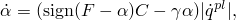

where *F* is a component of generalized force, and *C* and  are material parameters that are calibrated based on the user-defined or default hardening data. *C* is the initial hardening modulus, and  determines the rate at which the kinematic hardening modulus decreases with increasing backstress, . The saturation value of  (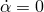), called 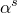, is 

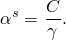

See [Figure 29.4.2--1](pt06ch29s04alm14.md#eframe-hardening-1) for an illustration of the elastic range for the nonlinear kinematic hardening model.

**Figure 29.4.2–1** Nonlinear kinematic hardening model: yield surface for positive loading and the center of the yield surface, .

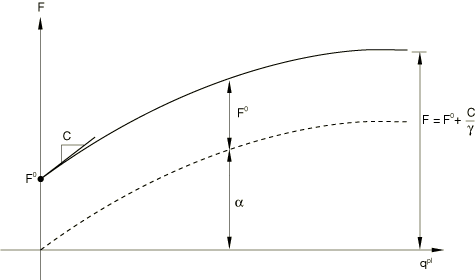

##### Allowing Abaqus/Standard to generate the default nonlinear kinematic hardening model

To define the default plastic response, three data points are generated from the yield stress value and the cross-section shape. These three data points relate generalized force to generalized plastic displacement per unit length of the element. Since the model is calibrated per unit element length, the generated default plastic response is different for different element lengths. The generalized force levels for these three points are , 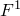, and 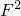.  is the generalized force at zero plastic generalized displacement.  and  are generalized force magnitudes that characterize the ultimate load-carrying capacity. The slopes between the data points (i.e., the generalized plastic moduli  and ) characterize the hardening response. See [Figure 29.4.2--2](pt06ch29s04alm14.md#eframe-hardening-2) for an illustration of the default nonlinear kinematic hardening model. 

**Figure 29.4.2–2** Data points generated for the default nonlinear kinematic hardening model.

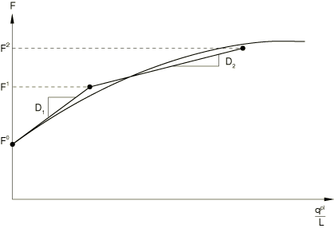

For the plastic axial force,  is the axial force that causes initial yielding. For the plastic bending moments about the first and second axes,  is the moment about the first and second cross-sectional directions, respectively, that produces first fiber yielding. For the plastic torsional moment,  is the torque about the axis that produces first fiber yielding. The generalized force levels  and , along with the connecting slopes  and , are chosen to approximate the response of a pipe cross-section made of a typical structural steel, with mild work hardening, from initial yielding to the development of a fully plastic hinge. The work hardening of the material corresponds to the default hardening of the section during axial loading. For different loading situations the size of the plastic hinge will vary; hence, the default model should be checked for validity against all anticipated loading situations. Default values for , , , and  corresponding to each plastic variable are listed in [Table 29.4.2--1](pt06ch29s04alm14.md#table-frame-genforces-slopes). 

**Table 29.4.2–1** Default values for generalized forces and connecting slopes for corresponding plastic variables.
|  |  |  |  |  |
| --- | --- | --- | --- | --- |
| Plastic axial force | 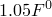 | 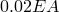 | 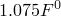 | 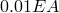 |
| First plastic bending moment | 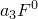 | 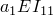 |  | 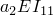 |
| Second plastic bending moment |  | 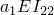 | 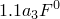 | 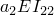 |
| Plastic torsional moment (for box and pipe sections) |  | 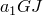 | 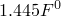 | 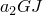 |
| Plastic torsional moment (for I-sections) | 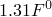 | 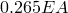 |  | 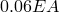 |

These default values are available for pipe, box, and I cross-section types with the values for the coefficients , , and  as shown in [Table 29.4.2--2](pt06ch29s04alm14.md#table-frame-a-coeff).

**Table 29.4.2–2** Coefficients , , and .
| Cross-section type |  |  |  |
| --- | --- | --- | --- |
| Pipe | 0.30 | 0.07 | 1.35 |
| Box | 0.17 | 0.02 | 1.20 |
| I (strong) | 0.10 | 0.02 | 1.12 |
| I (weak) | 0.43 | 0.10 | 1.50 |

### Defining optional uniaxial strut behavior

Frame elements optionally allow only uniaxial response (strut behavior). In this case neither end of the element supports moments or forces transverse to the axis; hence, only a force along the axis of the element exists. Furthermore, this axial force is constant along the length of the element, even if a distributed load is applied tangentially to the element axis. The uniaxial response of the element is linear elastic or nonlinear, in which case it includes buckling and postbuckling in compression and isotropic hardening plasticity in tension.

#### Defining linear elastic uniaxial behavior

A linear elastic uniaxial frame element behaves like an axial spring with constant stiffness 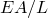, where *E* is Young's modulus, *A* is the cross-sectional area, and *L* is the original element length. The strain measure is the change in length of the element divided by the element's original length.

| **Input File Usage: ** | ``` [*FRAME SECTION](../key/key-link.md#usb-kws-mframesection), SECTION=*library_section*, ELSET=*name*, PINNED ``` |
| --- | --- |

#### Defining buckling, postbuckling, and plastic uniaxial behavior: buckling strut response

If uniaxial buckling and postbuckling in compression and isotropic hardening plasticity in tension are modeled (buckling strut response), the buckling envelope must be defined. The buckling envelope defines the force versus axial strain (change in length divided by the original length) response of the element. It is illustrated in [Figure 29.4.2--3](pt06ch29s04alm14.md#eusingframe-envelope).

**Figure 29.4.2–3** Buckling envelope for uniaxial buckling response.

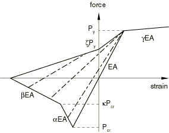

The buckling envelope derives from Marshall Strut theory, which is developed for pipe cross-section profiles only. No other cross-section types are permitted with buckling strut response.

Seven coefficients determine the buckling envelope as follows (the default values are listed, where *D* is the pipe outer diameter and *t* is the pipe wall thickness): 


Elastic limit force (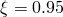).  is the yield stress.

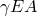

Isotropic hardening slope (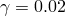).


Critical compressive buckling force predicted by the ISO equation, defined in ["Buckling strut response for frame elements," Section 3.9.3 of the Abaqus Theory Guide](../stm/stm-link.md#stm-elm-strut).


Slope of a segment on the buckling envelope, 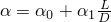 ( and ).

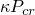

Corner on the buckling envelope (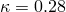).

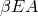

Slope of a segment on the buckling envelope (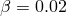).

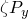

Corner on the buckling envelope (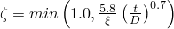).

The axial force in the element is required to stay inside or on the buckling envelope. When tension yielding occurs, the enclosed part of the envelope translates along the strain axis by an amount equal to the plastic strain. When reverse loading occurs for points on the boundary of the enclosed part of the envelope, the strut exhibits “damaged elastic” behavior. This damaged elastic response is determined by drawing a line from the point on the envelope to the tension yield point (force value ). As long as the force and axial strain remain inside the enclosed part of the envelope, the force response is linear elastic with a modulus equal to the damaged elastic modulus. At any time that the compressive strain is greater in magnitude than the negative extreme strain point of the envelope, the force is constant with a value of zero.

The value of  is a function of an element's geometrical and material properties, including the yield stress value.

Buckling strut response cannot be used with elastic-plastic frame section behavior; the strut's plastic behavior is defined by  and the isotropic hardening slope .

##### Defining the buckling envelope

You can specify that the default buckling envelope should be used, or you can define the buckling envelope. If you define the buckling envelope directly and specify that the default envelope should be used, the values defined by you will take precedence.

In either case you must provide the yield stress value, which will be used to determine the yield force in tension and the critical compressive buckling load (through the ISO equation described later in this section).

| **Input File Usage: ** | To specify the default buckling envelope, use the following option: |
| --- | --- |
|  | ``` [*FRAME SECTION](../key/key-link.md#usb-kws-mframesection), SECTION=PIPE, ELSET=*name*, BUCKLING, PINNED, YIELD STRESS= ``` To specify a user-defined buckling envelope, use both of the following options: ``` [*FRAME SECTION](../key/key-link.md#usb-kws-mframesection), SECTION=PIPE, ELSET=*name*, PINNED, YIELD STRESS= [*BUCKLING ENVELOPE](../key/key-link.md#usb-kws-mbucklingenvelope) ``` |

##### Defining the critical buckling load

The critical buckling load, , is determined by the ISO equation, which is an empirical relationship determined by the International Organization for Standardization based on experimental results for pipe-like or tubular structural members. Within the ISO equation, four variables can be changed from their default values: the effective length factors, 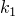 and , in the first and second sectional directions (the default values are 1.0) and the added length, 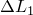 and 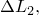 in the first and second sectional directions (the default values are 0). These variables account for the buckling member's end connectivity. The effective element length in the transverse direction *i* () is 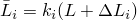. For details on the ISO equation, see ["Buckling strut response for frame elements," Section 3.9.3 of the Abaqus Theory Guide](../stm/stm-link.md#stm-elm-strut).

| **Input File Usage: ** | To define nondefault coefficients for the ISO equation with the default buckling envelope, use both of the following options: |
| --- | --- |
|  | ``` [*FRAME SECTION](../key/key-link.md#usb-kws-mframesection), SECTION=PIPE, ELSET=*name*, BUCKLING, PINNED, YIELD STRESS= [*BUCKLING LENGTH](../key/key-link.md#usb-kws-mbucklinglength) ``` To define nondefault coefficients for the ISO equation with a user-defined buckling envelope, use all of the following options: ``` [*FRAME SECTION](../key/key-link.md#usb-kws-mframesection), SECTION=PIPE, ELSET=*name*, PINNED, YIELD STRESS= [*BUCKLING ENVELOPE](../key/key-link.md#usb-kws-mbucklingenvelope) [*BUCKLING LENGTH](../key/key-link.md#usb-kws-mbucklinglength) ``` |

### Switching to optional uniaxial strut behavior during an analysis

Frame elements allow switching to uniaxial buckling strut response during the analysis. The criterion for switching is the “ISO” equation together with the “strength” equation (see ["Buckling strut response for frame elements," Section 3.9.3 of the Abaqus Theory Guide](../stm/stm-link.md#stm-elm-strut)). When the ISO equation is satisfied, the elastic or elastic-plastic frame element undergoes a one-time-only switch in behavior to buckling strut response. The strength equation is introduced to prevent switching in the absence of significant axial forces.

When the frame element switches to buckling strut response, a dramatic loss of structural stiffness occurs. The switched element no longer supports bending, torsion, or shear loading. If the global structure is unstable as a result of the switch (that is, the structure would collapse under the applied loading), the analysis may fail to converge.

To permit switching of the element response, use the default buckling envelope or define a buckling envelope and provide a yield stress, but do not activate linear elastic uniaxial behavior for the frame element.

The ISO equation is an empirical relationship based on experiments with slender, pipe-like (tubular) members. Since the equation is written explicitly in terms of the pipe outer diameter and thickness, only pipe sections are permitted with buckling strut response. The ISO equation incorporates several factors that you can define. Effective and added length factors account for element end fixity, and buckling reduction factors account for bending moment influence on buckling. You can define nondefault values for these factors in each local cross-section direction.

| **Input File Usage: ** | To allow switching to buckling strut response with default coefficients for the ISO equation and the default buckling envelope, use the following option: |
| --- | --- |
|  | ``` [*FRAME SECTION](../key/key-link.md#usb-kws-mframesection), SECTION=PIPE, ELSET=*name*, BUCKLING, YIELD STRESS= ``` To allow switching to buckling strut response with nondefault coefficients for the ISO equation and the default buckling envelope, use all of the following options: ``` [*FRAME SECTION](../key/key-link.md#usb-kws-mframesection), SECTION=PIPE, ELSET=*name*, BUCKLING, YIELD STRESS= [*BUCKLING LENGTH](../key/key-link.md#usb-kws-mbucklinglength) [*BUCKLING REDUCTION FACTORS](../key/key-link.md#usb-kws-mbucklingreductfact) ``` To allow switching to buckling strut response with nondefault coefficients for the ISO equation and a user-defined buckling envelope, use all of the following options: ``` [*FRAME SECTION](../key/key-link.md#usb-kws-mframesection), SECTION=PIPE, ELSET=*name*, YIELD STRESS= [*BUCKLING ENVELOPE](../key/key-link.md#usb-kws-mbucklingenvelope) [*BUCKLING LENGTH](../key/key-link.md#usb-kws-mbucklinglength) [*BUCKLING REDUCTION FACTORS](../key/key-link.md#usb-kws-mbucklingreductfact) ``` |

### Defining the reference temperature for thermal expansion

You can define a thermal expansion coefficient for the frame section. The thermal expansion coefficient may be temperature dependent. In this case you must define the reference temperature for thermal expansion, .

| **Input File Usage: ** | Use both of the following options: |
| --- | --- |
|  | ``` [*FRAME SECTION](../key/key-link.md#usb-kws-mframesection), ZERO= [*THERMAL EXPANSION](../key/key-link.md#usb-kws-mthermalexpansion) ``` |

### Specifying temperature and field variables

Define temperatures and field variables by giving the value at the origin of the cross-section (i.e., only one temperature or field-variable value is given).

| **Input File Usage: ** | Use one or more of the following options: |
| --- | --- |
|  | ``` [*TEMPERATURE](../key/key-link.md#usb-kws-htemperature) [*FIELD](../key/key-link.md#usb-kws-hfield) [*INITIAL CONDITIONS](../key/key-link.md#usb-kws-minitialcond), TYPE=TEMPERATURE [*INITIAL CONDITIONS](../key/key-link.md#usb-kws-minitialcond), TYPE=FIELD ``` |


