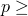
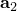

# 29.5.2 Elbow element library


**Product: **Abaqus/Standard  

##### **References**

- ["Pipes and pipebends with deforming cross-sections: elbow elements," Section 29.5.1](pt06ch29s05alm15.md)
- [*BEAM SECTION](../key/key-link.md#usb-kws-mbeamsection)

### Overview

This section provides a reference to the elbow elements available in Abaqus/Standard.

### Element types

| ELBOW31 | 2-node pipe in space with deforming section, linear interpolation along the pipe |
| --- | --- |
|  |

| ELBOW32 | 3-node pipe in space with deforming section, quadratic interpolation along the pipe |
| --- | --- |
|  |

| ELBOW31B | 2-node pipe in space with ovalization only, axial gradients of ovalization neglected |
| --- | --- |
|  |

| ELBOW31C | 2-node pipe in space with ovalization only, axial gradients of ovalization neglected. This formulation is the same as that for element type ELBOW31B, with the exception that all odd numbered terms in the Fourier interpolation around the pipe but the first term are neglected. |
| --- | --- |
|  |

##### Active degrees of freedom

1, 2, 3, 4, 5, 6

##### Additional solution variables

Elbow elements have numerous variables to model cross-sectional ovalization and warping. The number of variables depends on the type of elbow element, the number of nodes, and the number of Fourier modes chosen. In the following table *p* is the number of Fourier modes:

| Element type | Number of variables |
| --- | --- |
| ELBOW31 | 16, if *p*=0 |
| (16*p*+8), if *p* 1 |
| ELBOW32 | 24, if *p*=0 |
| (24*p*+12), if  1 |
| ELBOW31B | 13+2*p*, if *p*=0,1 |
| 11+4*p*, if  2 |
| ELBOW31C | 13+2*p*, if *p*=0,1,3,5 |
| 15+2*p*, if *p*=2,4,6 |

### Nodal coordinates required


### Element property definition

| **Input File Usage: ** | ``` [*BEAM SECTION](../key/key-link.md#usb-kws-mbeamsection), SECTION=ELBOW ``` |
| --- | --- |

### Element-based loading

### Distributed loads

Distributed loads are specified as described in ["Distributed loads," Section 34.4.3](pt07ch34s04aus122.md).

**Load ID (*DLOAD):**  BX**Units:**  [FL3](../popups/usb-int-iconventions-unitsym.md)**Description:  **Body force per unit volume in global *X*-direction.

**Load ID (*DLOAD):**  BY**Units:**  [FL3](../popups/usb-int-iconventions-unitsym.md)**Description:  **Body force per unit volume in global *Y*-direction.

**Load ID (*DLOAD):**  BZ**Units:**  [FL3](../popups/usb-int-iconventions-unitsym.md)**Description:  **Body force per unit volume in global *Z*-direction.

**Load ID (*DLOAD):**  BXNU**Units:**  [FL3](../popups/usb-int-iconventions-unitsym.md)**Description:  **Nonuniform body force in global *X*-direction with magnitude supplied via user subroutine [`DLOAD`](../sub/sub-link.md#sub-xsl-dload).

**Load ID (*DLOAD):**  BYNU**Units:**  [FL3](../popups/usb-int-iconventions-unitsym.md)**Description:  **Nonuniform body force in global *Y*-direction with magnitude supplied via user subroutine [`DLOAD`](../sub/sub-link.md#sub-xsl-dload).

**Load ID (*DLOAD):**  BZNU**Units:**  [FL3](../popups/usb-int-iconventions-unitsym.md)**Description:  **Nonuniform body force in global *Z*-direction with magnitude supplied via user subroutine [`DLOAD`](../sub/sub-link.md#sub-xsl-dload).

**Load ID (*DLOAD):**  CENT**Units:**  [FL4(ML3T2)](../popups/usb-int-iconventions-unitsym.md)**Description:  **Centrifugal load (magnitude is input as , where  is the mass density per unit volume and  is the angular velocity).

**Load ID (*DLOAD):**  CENTRIF**Units:**  [T2](../popups/usb-int-iconventions-unitsym.md)**Description:  **Centrifugal load (magnitude is input as , where  is the angular velocity).

**Load ID (*DLOAD):**  GRAV**Units:**  [LT2](../popups/usb-int-iconventions-unitsym.md)**Description:  **Gravity loading in a specified direction (magnitude is input as acceleration).

**Load ID (*DLOAD):**  HPE**Units:**  [FL2](../popups/usb-int-iconventions-unitsym.md)**Description:  **Hydrostatic external pressure, with linear variation in global *Z* (closed-end condition).

**Load ID (*DLOAD):**  HPI**Units:**  [FL2](../popups/usb-int-iconventions-unitsym.md)**Description:  **Hydrostatic internal pressure, with linear variation in global *Z* (closed-end condition).

**Load ID (*DLOAD):**  PE**Units:**  [FL2](../popups/usb-int-iconventions-unitsym.md)**Description:  **Uniform external pressure (closed-end condition).

**Load ID (*DLOAD):**  PI**Units:**  [FL2](../popups/usb-int-iconventions-unitsym.md)**Description:  **Uniform internal pressure (closed-end condition).

**Load ID (*DLOAD):**  PENU**Units:**  [FL2](../popups/usb-int-iconventions-unitsym.md)**Description:  **Nonuniform external pressure with magnitude supplied via user subroutine [`DLOAD`](../sub/sub-link.md#sub-xsl-dload) (closed-end condition).

**Load ID (*DLOAD):**  PINU**Units:**  [FL2](../popups/usb-int-iconventions-unitsym.md)**Description:  **Nonuniform internal pressure with magnitude supplied via user subroutine [`DLOAD`](../sub/sub-link.md#sub-xsl-dload) (closed-end condition).

**Load ID (*DLOAD):**  ROTA**Units:**  [T2](../popups/usb-int-iconventions-unitsym.md)**Description:  **Rotary acceleration load (magnitude is input as , where  is the rotary acceleration).

### Abaqus/Aqua loads

Abaqus/Aqua loads are specified as described in ["Abaqus/Aqua analysis," Section 6.11.1](pt03ch06s11at30.md).

**Load ID (*CLOAD/ *DLOAD):**  FDD**Units:**  [FL1](../popups/usb-int-iconventions-unitsym.md)**Description:  **Transverse fluid drag load.

**Load ID (*CLOAD/ *DLOAD):**  FD1**Units:**  [F](../popups/usb-int-iconventions-unitsym.md)**Description:  **Fluid drag force on the first end of the elbow (node 1).

**Load ID (*CLOAD/ *DLOAD):**  FD2**Units:**  [F](../popups/usb-int-iconventions-unitsym.md)**Description:  **Fluid drag force on the second end of the elbow (node 2 or node 3).

**Load ID (*CLOAD/ *DLOAD):**  FDT**Units:**  [FL1](../popups/usb-int-iconventions-unitsym.md)**Description:  **Tangential fluid drag load.

**Load ID (*CLOAD/ *DLOAD):**  FI**Units:**  [FL1](../popups/usb-int-iconventions-unitsym.md)**Description:  **Transverse fluid inertia load.

**Load ID (*CLOAD/ *DLOAD):**  FI1**Units:**  [F](../popups/usb-int-iconventions-unitsym.md)**Description:  **Fluid inertia force on the first end of the elbow (node 1).

**Load ID (*CLOAD/ *DLOAD):**  FI2**Units:**  [F](../popups/usb-int-iconventions-unitsym.md)**Description:  **Fluid inertia force on the second end of the elbow (node 2 or node 3).

**Load ID (*CLOAD/ *DLOAD):**  PB**Units:**  [FL1](../popups/usb-int-iconventions-unitsym.md)**Description:  **Buoyancy force (closed-end condition).

**Load ID (*CLOAD/ *DLOAD):**  WDD**Units:**  [FL1](../popups/usb-int-iconventions-unitsym.md)**Description:  **Transverse wind drag load.

**Load ID (*CLOAD/ *DLOAD):**  WD1**Units:**  [F](../popups/usb-int-iconventions-unitsym.md)**Description:  **Wind drag force on the first end of the elbow (node 1).

**Load ID (*CLOAD/ *DLOAD):**  WD2**Units:**  [F](../popups/usb-int-iconventions-unitsym.md)**Description:  **Wind drag force on the second end of the elbow (node 2 or node 3).

### Element output

The default stress output points are on the inside surface and the outside surface at all integration stations around the pipe.

#### Stress, strain, and other tensor components

Stress and other tensors (including strain tensors) are available for elements with displacement degrees of freedom. All tensors have the same components. For example, the stress components are as follows:

| S11 | Direct stress along the pipe. |
| --- | --- |

| S22 | Direct stress around the pipe section. |
| --- | --- |

| S12 | Shear stress in the pipe wall. |
| --- | --- |

#### Section forces and moments

| SF1 | Axial force. |
| --- | --- |

| SM1 | Bending moment about the local 1-axis. |
| --- | --- |

| SM2 | Bending moment about the local 2-axis. |
| --- | --- |

| SM3 | Twisting moment about the elbow axis. |
| --- | --- |

### Node ordering on elements


### Numbering of integration points for output


The extrados is the side of the pipebend that is furthest away from the center of the torus defining the pipebend; that is, the side of the pipebend to which the -axis points. The intrados is the side of the pipebend closest to the center of the torus.

The middle surface integration points around a section are shown above. There is a default of five thickness direction integration points at each such point, with point 1 on the inside surface of the pipe and point 5 on the outside surface.

For ELBOW31 and ELBOW31B only one integration station is used along the axis of the element. For ELBOW32 two integration stations are used along the axis of the elbow and the point numbers on the second section are a continuation of those on the first section (e.g., 21, 22, …, 40 in the default case), located around the pipe as shown above.


