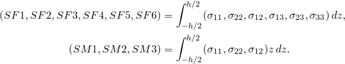
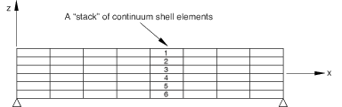

# 29.6.8 Continuum shell element library


**Products: **Abaqus/Standard  Abaqus/Explicit  Abaqus/CAE  

##### **References**

- ["Shell elements: overview," Section 29.6.1](pt06ch29s06abo27.md)
- ["Choosing a shell element," Section 29.6.2](pt06ch29s06alm16.md)
- [*SHELL GENERAL SECTION](../key/key-link.md#usb-kws-mshellgensect)
- [*SHELL SECTION](../key/key-link.md#usb-kws-mshellsection)

### Overview

This section provides a reference to the continuum shell elements available in Abaqus/Standard and Abaqus/Explicit.

### Element types

#### Stress/displacement elements

| SC6R | 6-node triangular in-plane continuum shell wedge, general-purpose, finite membrane strains |
| --- | --- |
|  |

| SC8R | 8-node hexahedron, general-purpose, finite membrane strains |
| --- | --- |
|  |

##### Active degrees of freedom

1, 2, 3

##### Additional solution variables

None.

#### Coupled temperature-displacement elements

| SC6RT | 6-node linear displacement and temperature, triangular in-plane continuum shell wedge, general-purpose, finite membrane strains |
| --- | --- |
|  |

| SC8RT | 8-node linear displacement and temperature, hexahedron, general-purpose, finite membrane strains |
| --- | --- |
|  |

##### Active degrees of freedom

1, 2, 3, 11

##### Additional solution variables

None.

### Nodal coordinates required


### Element property definition

| **Input File Usage: ** | Use either of the following options: |
| --- | --- |
|  | ``` [*SHELL SECTION](../key/key-link.md#usb-kws-mshellsection) [*SHELL GENERAL SECTION](../key/key-link.md#usb-kws-mshellgensect) ``` |

| **Abaqus/CAE Usage: ** | Property module: **Create Section**: select **Shell** as the section **Category** and **Homogeneous** or **Composite** as the section **Type** |
| --- | --- |

### Element-based loading

### Distributed loads

Distributed loads are specified as described in ["Distributed loads," Section 34.4.3](pt07ch34s04aus122.md).

**Load ID (*DLOAD):**  BX**Abaqus/CAE Load/Interaction:**  **Body force****Units:**  [FL3](../popups/usb-int-iconventions-unitsym.md)**Description:  **Body force (give magnitude as force per unit volume) in the global *X*-direction.

**Load ID (*DLOAD):**  BY**Abaqus/CAE Load/Interaction:**  **Body force****Units:**  [FL3](../popups/usb-int-iconventions-unitsym.md)**Description:  **Body force (give magnitude as force per unit volume) in the global *Y*-direction.

**Load ID (*DLOAD):**  BZ**Abaqus/CAE Load/Interaction:**  **Body force****Units:**  [FL3](../popups/usb-int-iconventions-unitsym.md)**Description:  **Body force (give magnitude as force per unit volume) in the global *Z*-direction.

**Load ID (*DLOAD):**  BXNU**Abaqus/CAE Load/Interaction:**  **Body force****Units:**  [FL3](../popups/usb-int-iconventions-unitsym.md)**Description:  **Nonuniform body force (give magnitude as force per unit volume) in the global *X*-direction, with magnitude supplied via user subroutine [`DLOAD`](../sub/sub-link.md#sub-xsl-dload) in Abaqus/Standard and [`VDLOAD`](../sub/sub-link.md#sub-xsl-vdload) in Abaqus/Explicit.

**Load ID (*DLOAD):**  BYNU**Abaqus/CAE Load/Interaction:**  **Body force****Units:**  [FL3](../popups/usb-int-iconventions-unitsym.md)**Description:  **Nonuniform body force (give magnitude as force per unit volume) in the global *Y*-direction, with magnitude supplied via user subroutine [`DLOAD`](../sub/sub-link.md#sub-xsl-dload) in Abaqus/Standard  and [`VDLOAD`](../sub/sub-link.md#sub-xsl-vdload) in Abaqus/Explicit.

**Load ID (*DLOAD):**  BZNU**Abaqus/CAE Load/Interaction:**  **Body force****Units:**  [FL3](../popups/usb-int-iconventions-unitsym.md)**Description:  **Nonuniform body force (give magnitude as force per unit volume) in the global *Z*-direction, with magnitude supplied via user subroutine [`DLOAD`](../sub/sub-link.md#sub-xsl-dload) in Abaqus/Standard and [`VDLOAD`](../sub/sub-link.md#sub-xsl-vdload) in Abaqus/Explicit.

**Load ID (*DLOAD):**  CENT(S)**Abaqus/CAE Load/Interaction:**  Not supported**Units:**  [FL4 (ML3T2)](../popups/usb-int-iconventions-unitsym.md)**Description:  **Centrifugal load (magnitude defined as , where  is the mass density and  is the angular speed).

**Load ID (*DLOAD):**  CENTRIF(S)**Abaqus/CAE Load/Interaction:**  **Rotational body force****Units:**  [T2](../popups/usb-int-iconventions-unitsym.md)**Description:  **Centrifugal load (magnitude is input as , where  is the angular speed).

**Load ID (*DLOAD):**  CORIO(S)**Abaqus/CAE Load/Interaction:**  **Coriolis force****Units:**  [FL4T (ML3T1)](../popups/usb-int-iconventions-unitsym.md)**Description:  **Coriolis force (magnitude input , where  is the mass density and  is the angular speed). The load stiffness due to Coriolis loading is not accounted for in direct steady-state dynamics analysis.

**Load ID (*DLOAD):**  GRAV**Abaqus/CAE Load/Interaction:**  **Gravity****Units:**  [LT2](../popups/usb-int-iconventions-unitsym.md)**Description:  **Gravity loading in a specified direction (magnitude is input as acceleration).

**Load ID (*DLOAD):**  HP*n*(S)**Abaqus/CAE Load/Interaction:**  Not supported**Units:**  [FL2](../popups/usb-int-iconventions-unitsym.md)**Description:  **Hydrostatic pressure on face *n*, linear in global *Z*. A positive pressure is directed into the element.

**Load ID (*DLOAD):**  P*n***Abaqus/CAE Load/Interaction:**  **Pressure****Units:**  [FL2](../popups/usb-int-iconventions-unitsym.md)**Description:  **Pressure on face *n*. A positive pressure is directed into the element.

**Load ID (*DLOAD):**  P*n*NU**Abaqus/CAE Load/Interaction:**  Not supported**Units:**  [FL2](../popups/usb-int-iconventions-unitsym.md)**Description:  **Nonuniform pressure on face *n* with magnitude supplied via user subroutine [`DLOAD`](../sub/sub-link.md#sub-xsl-dload) in Abaqus/Standard and [`VDLOAD`](../sub/sub-link.md#sub-xsl-vdload) in Abaqus/Explicit. A positive pressure is directed into the element.

**Load ID (*DLOAD):**  ROTA(S)**Abaqus/CAE Load/Interaction:**  **Rotational body force****Units:**  [T2](../popups/usb-int-iconventions-unitsym.md)**Description:  **Rotary acceleration load (magnitude is input as , where  is the rotary acceleration).

**Load ID (*DLOAD):**  ROTDYNF(S)**Abaqus/CAE Load/Interaction:**  Not supported**Units:**  [T1](../popups/usb-int-iconventions-unitsym.md)**Description:  **Rotordynamic load (magnitude is input as , where  is the angular velocity).

**Load ID (*DLOAD):**  SBF(E)**Abaqus/CAE Load/Interaction:**  Not supported**Units:**  [FL5T2](../popups/usb-int-iconventions-unitsym.md)**Description:  **Stagnation body force in global *X*-, *Y*-, and *Z*-directions.

**Load ID (*DLOAD):**  SP*n*(E)**Abaqus/CAE Load/Interaction:**  Not supported**Units:**  [FL4T2](../popups/usb-int-iconventions-unitsym.md)**Description:  **Stagnation pressure on face *n*.

**Load ID (*DLOAD):**  TRSHR*n***Abaqus/CAE Load/Interaction:**  **Surface traction****Units:**  [FL2](../popups/usb-int-iconventions-unitsym.md)**Description:  **Shear traction on face *n*.

**Load ID (*DLOAD):**  TRSHR*n*NU(S)**Abaqus/CAE Load/Interaction:**  Not supported**Units:**  [FL2](../popups/usb-int-iconventions-unitsym.md)**Description:  **Nonuniform shear traction on face *n* with magnitude and direction supplied via user subroutine [`UTRACLOAD`](../sub/sub-link.md#sub-xsl-utracload).

**Load ID (*DLOAD):**  TRVEC*n***Abaqus/CAE Load/Interaction:**  **Surface traction****Units:**  [FL2](../popups/usb-int-iconventions-unitsym.md)**Description:  **General traction on face *n*.

**Load ID (*DLOAD):**  TRVEC*n*NU(S)**Abaqus/CAE Load/Interaction:**  Not supported**Units:**  [FL2](../popups/usb-int-iconventions-unitsym.md)**Description:  **Nonuniform general traction on face *n* with magnitude and direction supplied via user subroutine [`UTRACLOAD`](../sub/sub-link.md#sub-xsl-utracload).

**Load ID (*DLOAD):**  VBF(E)**Abaqus/CAE Load/Interaction:**  Not supported**Units:**  [FL4T](../popups/usb-int-iconventions-unitsym.md)**Description:  **Viscous body force in global *X*-, *Y*-, and *Z*-directions.

**Load ID (*DLOAD):**  VP*n*(E)**Abaqus/CAE Load/Interaction:**  Not supported**Units:**  [FL3T](../popups/usb-int-iconventions-unitsym.md)**Description:  **Viscous pressure on face *n*, applying a pressure proportional to the velocity normal to the face and opposing the motion.

### Foundations

Foundations are specified as described in ["Element foundations," Section 2.2.2](pt01ch02s02aus12.md).

**Load ID (*FOUNDATION):**  F*n*(S)**Abaqus/CAE Load/Interaction:**  **Elastic foundation****Units:**  [FL3](../popups/usb-int-iconventions-unitsym.md)**Description:  **Elastic foundation on face *n*. A positive pressure is directed into the element.

### Distributed heat fluxes

Distributed heat fluxes are available for all elements with temperature degrees of freedom. They are specified as described in ["Thermal loads," Section 34.4.4](pt07ch34s04aus123.md).

**Load ID (*DFLUX):**  BF**Abaqus/CAE Load/Interaction:**  **Body heat flux****Units:**  [JL3T1](../popups/usb-int-iconventions-unitsym.md)**Description:  **Heat body flux per unit volume.

**Load ID (*DFLUX):**  BFNU(S)**Abaqus/CAE Load/Interaction:**  **Body heat flux****Units:**  [JL3T1](../popups/usb-int-iconventions-unitsym.md)**Description:  **Nonuniform heat body flux per unit volume with magnitude supplied via user subroutine [`DFLUX`](../sub/sub-link.md#sub-xsl-dflux).

**Load ID (*DFLUX):**  S*n***Abaqus/CAE Load/Interaction:**  **Surface heat flux****Units:**  [JL2T1](../popups/usb-int-iconventions-unitsym.md)**Description:  **Heat surface flux per unit area into face *n*.

**Load ID (*DFLUX):**  S*n*NU(S)**Abaqus/CAE Load/Interaction:**  Not supported**Units:**  [JL2T1](../popups/usb-int-iconventions-unitsym.md)**Description:  **Nonuniform heat surface flux per unit area into face *n* with magnitude supplied via user subroutine [`DFLUX`](../sub/sub-link.md#sub-xsl-dflux).

### Film conditions

Film conditions are available for all elements with temperature degrees of freedom. They are specified as described in ["Thermal loads," Section 34.4.4](pt07ch34s04aus123.md).

**Load ID (*FILM):**  F*n***Abaqus/CAE Load/Interaction:**  **Surface film condition****Units:**  [JL2T11](../popups/usb-int-iconventions-unitsym.md)**Description:  **Film coefficient and sink temperature (units of ) provided on face *n*.

**Load ID (*FILM):**  F*n*NU(S)**Abaqus/CAE Load/Interaction:**  Not supported**Units:**  [JL2T11](../popups/usb-int-iconventions-unitsym.md)**Description:  **Nonuniform film coefficient and sink temperature (units of ) provided on face *n* with magnitude supplied via user subroutine [`FILM`](../sub/sub-link.md#sub-xsl-film).

### Radiation types

Radiation conditions are available for all elements with temperature degrees of freedom. They are specified as described in ["Thermal loads," Section 34.4.4](pt07ch34s04aus123.md).

**Load ID (*RADIATE):**  R*n***Abaqus/CAE Load/Interaction:**  **Surface radiation****Units:**  [Dimensionless](../popups/usb-int-iconventions-unitsym.md)**Description:  **Emissivity and sink temperature (units of ) provided on face *n*.

### Surface-based loading

### Distributed loads

Surface-based distributed loads are specified as described in ["Distributed loads," Section 34.4.3](pt07ch34s04aus122.md).

**Load ID (*DSLOAD):**  HP(S)**Abaqus/CAE Load/Interaction:**  **Pressure****Units:**  [FL2](../popups/usb-int-iconventions-unitsym.md)**Description:  **Hydrostatic pressure applied to the element surface, linear in global *Z*. The pressure is positive in the direction opposite to the surface normal.

**Load ID (*DSLOAD):**  P**Abaqus/CAE Load/Interaction:**  **Pressure****Units:**  [FL2](../popups/usb-int-iconventions-unitsym.md)**Description:  **Pressure applied to the element surface. The pressure is positive in the direction opposite to the surface normal.

**Load ID (*DSLOAD):**  PNU**Abaqus/CAE Load/Interaction:**  **Pressure****Units:**  [FL2](../popups/usb-int-iconventions-unitsym.md)**Description:  **Nonuniform pressure applied to the element surface with magnitude supplied via user subroutine [`DLOAD`](../sub/sub-link.md#sub-xsl-dload) in Abaqus/Standard  and [`VDLOAD`](../sub/sub-link.md#sub-xsl-vdload) in Abaqus/Explicit. The pressure is positive in the direction opposite to the surface normal.

**Load ID (*DSLOAD):**  SP(E)**Abaqus/CAE Load/Interaction:**  **Pressure****Units:**  [FL4T2](../popups/usb-int-iconventions-unitsym.md)**Description:  **Stagnation pressure applied to the element reference surface.

**Load ID (*DSLOAD):**  TRSHR**Abaqus/CAE Load/Interaction:**  **Surface traction****Units:**  [FL2](../popups/usb-int-iconventions-unitsym.md)**Description:  **Shear traction on the element reference surface.

**Load ID (*DSLOAD):**  TRSHRNU(S)**Abaqus/CAE Load/Interaction:**  **Surface traction****Units:**  [FL2](../popups/usb-int-iconventions-unitsym.md)**Description:  **Nonuniform shear traction on the element reference surface with magnitude and direction supplied via user subroutine [`UTRACLOAD`](../sub/sub-link.md#sub-xsl-utracload).

**Load ID (*DSLOAD):**  TRVEC**Abaqus/CAE Load/Interaction:**  **Surface traction****Units:**  [FL2](../popups/usb-int-iconventions-unitsym.md)**Description:  **General traction on the element reference surface.

**Load ID (*DSLOAD):**  TRVECNU(S)**Abaqus/CAE Load/Interaction:**  **Surface traction****Units:**  [FL2](../popups/usb-int-iconventions-unitsym.md)**Description:  **Nonuniform general traction on the element reference surface with magnitude and direction supplied via user subroutine [`UTRACLOAD`](../sub/sub-link.md#sub-xsl-utracload).

**Load ID (*DSLOAD):**  VP(E)**Abaqus/CAE Load/Interaction:**  **Pressure****Units:**  [FL3T](../popups/usb-int-iconventions-unitsym.md)**Description:  **Viscous surface pressure. The viscous pressure is proportional to the velocity normal to the element face and opposing the motion.

### Distributed heat fluxes

Surface-based heat fluxes are available for all elements with temperature degrees of freedom. They are specified as described in ["Thermal loads," Section 34.4.4](pt07ch34s04aus123.md).

**Load ID (*DSFLUX):**  S**Abaqus/CAE Load/Interaction:**  **Surface heat flux****Units:**  [JL2T1](../popups/usb-int-iconventions-unitsym.md)**Description:  **Heat surface flux per unit area into the element surface.

**Load ID (*DSFLUX):**  SNU(S)**Abaqus/CAE Load/Interaction:**  **Surface heat flux****Units:**  [JL2T1](../popups/usb-int-iconventions-unitsym.md)**Description:  **Nonuniform heat surface flux per unit area into the element surface with magnitude supplied via user subroutine [`DFLUX`](../sub/sub-link.md#sub-xsl-dflux).

### Film conditions

Surface-based film conditions are available for all elements with temperature degrees of freedom. They are specified as described in ["Thermal loads," Section 34.4.4](pt07ch34s04aus123.md).

**Load ID (*SFILM):**  F**Abaqus/CAE Load/Interaction:**  **Surface film condition****Units:**  [JL2T11](../popups/usb-int-iconventions-unitsym.md)**Description:  **Film coefficient and sink temperature (units of ) provided on the element surface.

**Load ID (*SFILM):**  FNU(S)**Abaqus/CAE Load/Interaction:**  **Surface film condition****Units:**  [JL2T11](../popups/usb-int-iconventions-unitsym.md)**Description:  **Nonuniform film coefficient and sink temperature (units of ) provided on the element surface with magnitude supplied via user subroutine [`FILM`](../sub/sub-link.md#sub-xsl-film).

### Radiation types

Surface-based radiation conditions are available for all elements with temperature degrees of freedom. They are specified as described in ["Thermal loads," Section 34.4.4](pt07ch34s04aus123.md).

**Load ID (*SRADIATE):**  R**Abaqus/CAE Load/Interaction:**  **Surface radiation****Units:**  [Dimensionless](../popups/usb-int-iconventions-unitsym.md)**Description:  **Emissivity and sink temperature (units of ) provided on the element surface.

### Element output

If a local coordinate system is not assigned to the element, the stress/strain components, as well as the section forces/strains, are in the default directions on the surface defined by the convention given in ["Conventions," Section 1.2.2](pt01ch01s02aus02.md). If a local coordinate system is assigned to the element through the section definition (["Orientations," Section 2.2.5](pt01ch02s02aus15.md)), the stress/strain components and the section forces/strains are in the surface directions defined by the local coordinate system.

The local directions defined in the reference configuration are rotated into the current configuration by the average material rotation.

In the case of composite shells the components of section forces, section strains, and transverse shear stress estimates for stacked continuum shells (CTSHR13 and CTSHR23) are reported in the local orientation defined for the entire section (or the default shell coordinate directions if no section orientation is used). Components of stress, strain, and transverse shear stress (TSHR13 and TSHR23) are given with respect to the individual layer orientations. 

#### Stress, strain, and other tensor components

Stress and other tensors (including strain tensors) are available. All tensors have the same components. For example, the stress components are as follows:

| S11 | Local  direct stress. |
| --- | --- |

| S22 | Local  direct stress. |
| --- | --- |

| S12 | Local  shear stress. |
| --- | --- |

The stress in the thickness direction, , is reported as zero to the output database as discussed in ["Abaqus/Standard output variable identifiers," Section 4.2.1](pt02ch04s02abv01.md).  may be obtained through the average section stress variable SSAVG6. Output of in-plane stress components of continuum shell elements does not include Poisson effects due to changes in the thickness direction.

#### Heat flux components

Available for elements with temperature degrees of freedom.

| HFL1 | Heat flux in the *X*-direction. |
| --- | --- |

| HFL2 | Heat flux in the *Y*-direction. |
| --- | --- |

| HFL3 | Heat flux in the *Z*-direction. |
| --- | --- |

#### Section forces, moments, and transverse shear forces

| SF1 | Direct membrane force per unit width in local 1-direction. |
| --- | --- |

| SF2 | Direct membrane force per unit width in local 2-direction. |
| --- | --- |

| SF3 | Shear membrane force per unit width in local 1--2 plane. |
| --- | --- |

| SF4 | Transverse shear force per unit width in local 1-direction. |
| --- | --- |

| SF5 | Transverse shear force per unit width in local 2-direction. |
| --- | --- |

| SF6 | Thickness stress integrated over the element thickness. |
| --- | --- |

| SM1 | Bending moment force per unit width about local 2-axis. |
| --- | --- |

| SM2 | Bending moment force per unit width about local 1-axis. |
| --- | --- |

| SM3 | Twisting moment force per unit width in local 1--2 plane. |
| --- | --- |

The section force and moment resultants per unit length in the normal basis directions in a given shell section of thickness *h* can be defined on this basis as 



where stress in the thickness direction  is constant through the thickness. Outputs of in-plane section forces of continuum shell elements do not include Poisson effects due to changes in the thickness direction. 

#### Average section stresses

| SSAVG1 | Average membrane stress in local 1-direction. |
| --- | --- |

| SSAVG2 | Average membrane stress in local 2-direction. |
| --- | --- |

| SSAVG3 | Average membrane stress in local 1--2 plane. |
| --- | --- |

| SSAVG4 | Average transverse shear stress in local 1-direction. |
| --- | --- |

| SSAVG5 | Average transverse shear stress in local 2-direction. |
| --- | --- |

| SSAVG6 | Average thickness stress in the local 3-direction. |
| --- | --- |

The average section stresses are defined as 


where  and *h* is the current section thickness.  is constant through the thickness.

#### Section strains, curvatures, and transverse shear strains

| SE1 | Direct membrane strain in local 1-direction. |
| --- | --- |

| SE2 | Direct membrane strain in local 2-direction. |
| --- | --- |

| SE3 | Shear membrane strain in local 1--2 plane. |
| --- | --- |

| SE4 | Transverse shear strain in the local 1-direction. |
| --- | --- |

| SE5 | Transverse shear strain in the local 2-direction. |
| --- | --- |

| SE6 | Total strain in the thickness direction. |
| --- | --- |

| SK1 | Curvature change about local 1-axis. |
| --- | --- |

| SK2 | Curvature change about local 2-axis. |
| --- | --- |

| SK3 | Surface twist in local 1--2 plane. |
| --- | --- |

The local directions are defined in ["Shell elements: overview," Section 29.6.1](pt06ch29s06abo27.md).

#### Shell thickness

| STH | Section thickness, which is the current section thickness if geometric nonlinearity is considered; otherwise, it is the initial section thickness. |
| --- | --- |

#### Transverse shear stress estimates

| TSHR13 | 13-component of transverse shear stress. |
| --- | --- |

| TSHR23 | 23-component of transverse shear stress. |
| --- | --- |

Estimates of the transverse shear stresses are available at section integration points as output variables TSHR13 or TSHR23 for both Simpson's rule and Gauss quadrature. For Simpson's rule output of variables TSHR13 or TSHR23 should be requested at nondefault section points, since the default output is at section point 1 of the shell section where the transverse shear stresses vanish.

For numerically integrated sections, estimates of the interlaminar shear stresses in composite sections—i.e., the transverse shear stresses at the interface between two composite layers—can be obtained only by using Simpson's rule. With Gauss quadrature no section integration point exists at the interface between composite layers.

Unlike the S11, S22, and S12 in-surface stress components, TSHR13 and TSHR23 are not calculated from the constitutive behavior at points through the shell section. They are estimated by matching the elastic strain energy associated with shear deformation of the shell section with that based on piecewise quadratic variation of the transverse shear stress across the section, under conditions of bending about one axis (see ["Transverse shear stiffness in composite shells and offsets from the midsurface," Section 3.6.8 of the Abaqus Theory Guide](../stm/stm-link.md#stm-elm-transshearshells)). Therefore, interlaminar shear stress calculation is supported only when the elastic material model is used for each layer of the shell section.  If you specify the transverse shear stiffness values, interlaminar shear stress output is not available. TSHR13 and TSHR23 are valid only for sections that have one element through the thickness direction. For sections with two or more continuum shell elements stacked in the thickness direction, output variables SSAVG4 and SSAVG5 or CTSHR13 and CTSHR23 should be used instead. An example using SSAVG4 and SSAVG5 to estimate the transverse shear stress distribution in stacked continuum shells can be found in ["Composite shells in cylindrical bending," Section 1.1.3 of the Abaqus Benchmarks Guide](../bmk/bmk-link.md#bmk-anl-compositeshells).

#### Transverse shear stress estimates for stacked continuum shells

| CTSHR13 | 13-component of transverse shear stress for stacked continuum shells. |
| --- | --- |

| CTSHR23 | 23-component of transverse shear stress for stacked continuum shells. |
| --- | --- |

Estimates of the transverse shear stresses that take into account the continuity of interlaminar transverse shear stress for stacked continuum shells are available at section integration points as output variables CTSHR13 or CTSHR23 for both Simpson's rule and Gauss quadrature. CTSHR13 or CTSHR23 are available only in Abaqus/Standard.

CTSHR13 and CTSHR23 are not calculated from the constitutive behavior at points through the shell section. They are estimated by assuming a quadratic variation of shear stress across the element section and by enforcing the continuity of interface transverse shear between adjoining continuum elements in a stack. It is also assumed that the transverse shear is zero at the free boundaries of a stack. 

The intended use case for CTSHR13 and CTSHR23 is to estimate the through-the-thickness transverse shear stress for flat or nearly flat composite plates that are modeled with stacked continuum shell elements where each continuum element in the stack models a single material layer. Central to CTSHR13 and CTSHR23 is the concept of a “stack” of continuum shell elements.

During input file preprocessing Abaqus partitions all the continuum shells in a model into stacks. A “stack” is defined as a contiguous set of continuum shells whose first and last elements lie on a free boundary and who are connected through shared nodes on the top and bottom element surfaces (as determined by the elements' stack directions). In this context a “free boundary” is a top or bottom surface of a continuum shell element that is not connected through its nodes to another continuum shell element. For example, assuming that the stack direction of all the elements in [Figure 29.6.8--1](pt06ch29s06ael18.md#eshell-contstack) is in the *z*-direction, elements 1–6 would form a stack. 

**Figure 29.6.8–1** Composite plate meshed with six stacked continuum shells through the thickness.



It is important to emphasize that stacks of continuum shells are connected through shared nodes, not through constraints or other elements. Suppose, for example, that in [Figure 29.6.8--1](pt06ch29s06ael18.md#eshell-contstack) element pairs 1–2, 2–3, 4–5, and 5–6 are connected to each other through shared nodes, but elements 3 and 4 are connected through a constraint (such as a tied constraint). In that case Abaqus would interpret the bottom surface of element 3 and the top surface of element 4 as free boundaries; therefore, elements 1–3 would form one stack, and elements 4–6 would form a second independent stack. For another example, suppose that element 4 is not a continuum shell element. In this case elements 1–3 would form one stack, and elements 5–6 would form another stack. In a final example, suppose the stack directions of elements 1–5 are in the global *z*-direction and the stack direction of element 6 is in the global *x*-direction. In this case elements 1–5 would form a stack separate from element 6. In the three cases just discussed the computed values of CTSHR13 and CTSHR23 would probably not be what you wanted. It is more likely that you want elements 1–6 to be in the same stack. It may be necessary to make changes in your model to achieve this. You can review the partitioning of the continuum shell elements into stacks in the data file by making a model definition data request. 

The continuum shell elements in a stack must satisfy certain criteria; otherwise, Abaqus marks the stack as *invalid* with respect to computing CTSHR13 or CTSHR23. If a stack is marked as invalid, CTSHR13 or CTSHR23, if requested, are not computed and are set to zero for all continuum shell elements in that stack. If a continuum shell element does not have an elastic material model, if you specify the transverse shear for any element in the stack, or if the element is specified as rigid, that stack is marked as invalid. A stack is also marked as invalid if the normal of any element in a stack is not within 10 of the average normal for the stack. In addition, if a continuum shell element is removed during the analysis, the stack to which the element belongs is marked as invalid until the element is reactivated. 

There are several other certain restrictions on CTSHR13 and CTSHR23. CTSHR13 and CTSHR23 are not available in any continuum shell element with a multi-layer composite material definition. However, having a multi-layer composite element in the stack does not invalidate the stack. For the purposes of computing CTSHR13 and CTSHR23, a maximum of 500 continuum shell elements can be put in any individual stack. If more than 500 continuum shell elements are stacked on top of each other, Abaqus issues a warning message during input file preprocessing, and CTSHR13 and CTSHR23 are not computed and are set to zero for all continuum shell elements in the model. CTSHR13 and CTSHR23 are not available if element operations are run in parallel (see ["Parallel execution in Abaqus/Standard," Section 3.5.2](pt01ch03s05aus33.md)). CTSHR13 or CTSHR23 are currently available only for static and direct-integration dynamic analyses.

An example using CTSHR13 and CTSHR23 to estimate the transverse shear stress distribution in stacked continuum shells can be found in ["Composite shells in cylindrical bending," Section 1.1.3 of the Abaqus Benchmarks Guide](../bmk/bmk-link.md#bmk-anl-compositeshells).

### Node ordering on elements


### Numbering of integration points for output

##### Stress/displacement analysis


