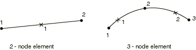

# 29.6.9 Axisymmetric shell element library


**Products: **Abaqus/Standard  Abaqus/Explicit  Abaqus/CAE  

##### **References**

- ["Shell elements: overview," Section 29.6.1](pt06ch29s06abo27.md)
- ["Choosing a shell element," Section 29.6.2](pt06ch29s06alm16.md)
- [*NODAL THICKNESS](../key/key-link.md#usb-kws-mnodalthickness)
- [*SHELL GENERAL SECTION](../key/key-link.md#usb-kws-mshellgensect)
- [*SHELL SECTION](../key/key-link.md#usb-kws-mshellsection)

### Overview

This section provides a reference to the axisymmetric shell elements available in Abaqus/Standard and Abaqus/Explicit. For axisymmetric shell geometries in which nonaxisymmetric behavior is expected, use the SAXA elements available in Abaqus/Standard (see ["Axisymmetric shell elements with nonlinear, asymmetric deformation," Section 29.6.10](pt06ch29s06ael20.md)).

### Conventions

Coordinate 1 is *r*, coordinate 2 is *z*. The *r*-direction corresponds to the global *X*-direction, and the *z*-direction corresponds to the global *Y*-direction. Coordinate 1 should be greater than or equal to zero.

Degree of freedom 1 is , degree of freedom 2 is , and degree of freedom 6 is rotation in the *r*–*z* plane.

Abaqus does not automatically apply any boundary conditions to nodes located along the symmetry axis. You should apply radial or symmetry boundary conditions on these nodes if desired.

Point loads and concentrated fluxes should be given as the value integrated around the circumference (that is, the load on the complete ring).

The meridional direction is the direction that is tangent to the element in the *r*–*z* plane; that is, the meridional direction is along the line that is rotated about the axis of symmetry to generate the full three-dimensional body.

The circumferential or hoop direction is the direction normal to the *r*–*z* plane.

### Element types

#### Stress/displacement elements

| SAX1 | 2-node thin or thick linear shell |
| --- | --- |
|  |

| SAX2(S) | 3-node thin or thick quadratic shell |
| --- | --- |
|  |

##### Active degrees of freedom

1, 2, 6

##### Additional solution variables

None.

#### Heat transfer elements

| DSAX1(S) | 2-node shell |
| --- | --- |
|  |

| DSAX2(S) | 3-node shell |
| --- | --- |
|  |

##### Active degrees of freedom

11, 12, 13, etc. (temperatures through the thickness as described in ["Choosing a shell element," Section 29.6.2](pt06ch29s06alm16.md))

##### Additional solution variables

None.

#### Coupled temperature-displacement element

| SAX2T(S) | 3-node thin or thick shell, quadratic displacement, linear temperature in the shell surface |
| --- | --- |
|  |

##### Active degrees of freedom

1, 2, 6 at all three nodes

11, 12, 13, etc. (temperatures through the thickness as described in ["Choosing a shell element," Section 29.6.2](pt06ch29s06alm16.md)) at the end nodes

##### Additional solution variables

None.

### Nodal coordinates required

 *r*, *z*, and optionally for shells with displacement degrees of freedom, , , the direction cosines of the shell normal at the node.

### Element property definition

| **Input File Usage: ** | Use either of the following options for stress/displacement elements: |
| --- | --- |
|  | ``` [*SHELL SECTION](../key/key-link.md#usb-kws-mshellsection) [*SHELL GENERAL SECTION](../key/key-link.md#usb-kws-mshellgensect) ``` Use the following option for heat transfer or coupled temperature-displacement elements: ``` [*SHELL SECTION](../key/key-link.md#usb-kws-mshellsection) ``` In addition, use the following option for variable thickness shells: ``` [*NODAL THICKNESS](../key/key-link.md#usb-kws-mnodalthickness) ``` |

| **Abaqus/CAE Usage: ** | Property module: **Create Section**: select **Shell** as the section **Category** and **Homogeneous** or **Composite** as the section **Type** |
| --- | --- |

### Element-based loading

### Distributed loads

Distributed loads are available for elements with displacement degrees of freedom. They are specified as described in ["Distributed loads," Section 34.4.3](pt07ch34s04aus122.md).

Distributed load magnitudes are per unit area or per unit volume. They do not need to be multiplied by .

Body forces and centrifugal loads must be given as force per unit area if a general shell section is used.

**Load ID (*DLOAD):**  BR**Abaqus/CAE Load/Interaction:**  **Body force****Units:**  [FL3](../popups/usb-int-iconventions-unitsym.md)**Description:  **Body force per unit volume in the radial direction.

**Load ID (*DLOAD):**  BZ**Abaqus/CAE Load/Interaction:**  **Body force****Units:**  [FL3](../popups/usb-int-iconventions-unitsym.md)**Description:  **Body force per unit volume in the axial direction.

**Load ID (*DLOAD):**  BRNU**Abaqus/CAE Load/Interaction:**  **Body force****Units:**  [FL3](../popups/usb-int-iconventions-unitsym.md)**Description:  **Nonuniform body force per unit volume in the radial direction, with the magnitude supplied via user subroutine [`DLOAD`](../sub/sub-link.md#sub-xsl-dload) in Abaqus/Standard and [`VDLOAD`](../sub/sub-link.md#sub-xsl-vdload) in Abaqus/Explicit.

**Load ID (*DLOAD):**  BZNU**Abaqus/CAE Load/Interaction:**  **Body force****Units:**  [FL3](../popups/usb-int-iconventions-unitsym.md)**Description:  **Nonuniform body force per unit volume in the global *z*-direction, with the magnitude supplied via user subroutine [`DLOAD`](../sub/sub-link.md#sub-xsl-dload) in Abaqus/Standard and [`VDLOAD`](../sub/sub-link.md#sub-xsl-vdload) in Abaqus/Explicit.

**Load ID (*DLOAD):**  CENT(S)**Abaqus/CAE Load/Interaction:**  Not supported**Units:**  [FL4 (ML3T2)](../popups/usb-int-iconventions-unitsym.md)**Description:  **Centrifugal load (magnitude given as , where  is the mass density and  is the angular velocity). Since only axisymmetric deformation is allowed, the spin axis must be the *z*-axis.

**Load ID (*DLOAD):**  CENTRIF(S)**Abaqus/CAE Load/Interaction:**  **Rotational body force****Units:**  [T2](../popups/usb-int-iconventions-unitsym.md)**Description:  **Centrifugal load (magnitude is input as , where  is the angular velocity). Since only axisymmetric deformation is allowed, the spin axis must be the *z*-axis.

**Load ID (*DLOAD):**  GRAV**Abaqus/CAE Load/Interaction:**  **Gravity****Units:**  [LT2](../popups/usb-int-iconventions-unitsym.md)**Description:  **Gravity loading in a specified direction (magnitude input as acceleration).

**Load ID (*DLOAD):**  HP(S)**Abaqus/CAE Load/Interaction:**  Not supported**Units:**  [FL2](../popups/usb-int-iconventions-unitsym.md)**Description:  **Hydrostatic pressure applied to the element reference surface and linear in global *Z*. The pressure is positive in the direction of the positive element normal.

**Load ID (*DLOAD):**  P**Abaqus/CAE Load/Interaction:**  **Pressure****Units:**  [FL2](../popups/usb-int-iconventions-unitsym.md)**Description:  **Pressure applied to the element reference surface. The pressure is positive in the direction of the positive element normal.

**Load ID (*DLOAD):**  PNU**Abaqus/CAE Load/Interaction:**  Not supported**Units:**  [FL2](../popups/usb-int-iconventions-unitsym.md)**Description:  **Nonuniform pressure applied to the element reference surface with magnitude supplied via user subroutine [`DLOAD`](../sub/sub-link.md#sub-xsl-dload) in Abaqus/Standard and [`VDLOAD`](../sub/sub-link.md#sub-xsl-vdload) in Abaqus/Explicit. The pressure is positive in the direction of the positive element normal.

**Load ID (*DLOAD):**  SBF(E)**Abaqus/CAE Load/Interaction:**  Not supported**Units:**  [FL5T2](../popups/usb-int-iconventions-unitsym.md)**Description:  **Stagnation body force in radial and axial directions.

**Load ID (*DLOAD):**  SP(E)**Abaqus/CAE Load/Interaction:**  Not supported**Units:**  [FL4T2](../popups/usb-int-iconventions-unitsym.md)**Description:  **Stagnation pressure applied to the element reference surface.

**Load ID (*DLOAD):**  TRSHR**Abaqus/CAE Load/Interaction:**  **Surface traction****Units:**  [FL2](../popups/usb-int-iconventions-unitsym.md)**Description:  **Shear traction on the element reference surface.

**Load ID (*DLOAD):**  TRSHRNU(S)**Abaqus/CAE Load/Interaction:**  Not supported**Units:**  [FL2](../popups/usb-int-iconventions-unitsym.md)**Description:  **Nonuniform shear traction on the element reference surface with magnitude and direction supplied via user subroutine [`UTRACLOAD`](../sub/sub-link.md#sub-xsl-utracload).

**Load ID (*DLOAD):**  TRVEC**Abaqus/CAE Load/Interaction:**  **Surface traction****Units:**  [FL2](../popups/usb-int-iconventions-unitsym.md)**Description:  **General traction on the element reference surface.

**Load ID (*DLOAD):**  TRVECNU(S)**Abaqus/CAE Load/Interaction:**  Not supported**Units:**  [FL2](../popups/usb-int-iconventions-unitsym.md)**Description:  **Nonuniform general traction on the element reference surface with magnitude and direction supplied via user subroutine [`UTRACLOAD`](../sub/sub-link.md#sub-xsl-utracload).

**Load ID (*DLOAD):**  VBF(E)**Abaqus/CAE Load/Interaction:**  Not supported**Units:**  [FL4T](../popups/usb-int-iconventions-unitsym.md)**Description:  **Viscous body force in  radial and axial directions.

**Load ID (*DLOAD):**  VP(E)**Abaqus/CAE Load/Interaction:**  Not supported**Units:**  [FL3T](../popups/usb-int-iconventions-unitsym.md)**Description:  **Viscous surface pressure. The viscous pressure is proportional to the velocity normal to the element face and opposing the motion.

### Foundations

Foundations are available for Abaqus/Standard elements with displacement degrees of freedom. They are specified as described in ["Element foundations," Section 2.2.2](pt01ch02s02aus12.md).

**Load ID (*FOUNDATION):**  F(S)**Abaqus/CAE Load/Interaction:**  **Elastic foundation****Units:**  [FL3](../popups/usb-int-iconventions-unitsym.md)**Description:  **Elastic foundation in the direction of the shell normal.

### Distributed heat fluxes

Distributed heat fluxes are available for elements with temperature degrees of freedom. They are specified as described in ["Thermal loads," Section 34.4.4](pt07ch34s04aus123.md).

**Load ID (*DFLUX):**  BF(S)**Abaqus/CAE Load/Interaction:**  **Body heat flux****Units:**  [JL3 T1](../popups/usb-int-iconventions-unitsym.md)**Description:  **Body heat flux per unit volume.

**Load ID (*DFLUX):**  BFNU(S)**Abaqus/CAE Load/Interaction:**  **Body heat flux****Units:**  [JL3 T1](../popups/usb-int-iconventions-unitsym.md)**Description:  **Nonuniform body heat flux per unit volume with magnitude supplied via user subroutine [`DFLUX`](../sub/sub-link.md#sub-xsl-dflux).

**Load ID (*DFLUX):**  SNEG(S)**Abaqus/CAE Load/Interaction:**  **Surface heat flux****Units:**  [JL2 T1](../popups/usb-int-iconventions-unitsym.md)**Description:  **Surface heat flux per unit area into the bottom face of the element.

**Load ID (*DFLUX):**  SPOS(S)**Abaqus/CAE Load/Interaction:**  **Surface heat flux****Units:**  [JL2 T1](../popups/usb-int-iconventions-unitsym.md)**Description:  **Surface heat flux per unit area into the top face of the element. 

**Load ID (*DFLUX):**  SNEGNU(S)**Abaqus/CAE Load/Interaction:**  Not supported**Units:**  [JL2 T1](../popups/usb-int-iconventions-unitsym.md)**Description:  **Nonuniform surface heat flux per unit area into the bottom face of the element with magnitude supplied via user subroutine [`DFLUX`](../sub/sub-link.md#sub-xsl-dflux).

**Load ID (*DFLUX):**  SPOSNU(S)**Abaqus/CAE Load/Interaction:**  Not supported**Units:**  [JL2 T1](../popups/usb-int-iconventions-unitsym.md)**Description:  **Nonuniform surface heat flux per unit area into the top face of the element with magnitude supplied via user subroutine [`DFLUX`](../sub/sub-link.md#sub-xsl-dflux).

### Film conditions

Film conditions are available for elements with temperature degrees of freedom. They are specified as described in ["Thermal loads," Section 34.4.4](pt07ch34s04aus123.md).

**Load ID (*FILM):**  FNEG(S)**Abaqus/CAE Load/Interaction:**  **Surface film condition****Units:**  [JL2 T 11](../popups/usb-int-iconventions-unitsym.md)**Description:  **Film coefficient and sink temperature (units of ) provided on the bottom face of the element.

**Load ID (*FILM):**  FPOS(S)**Abaqus/CAE Load/Interaction:**  **Surface film condition****Units:**  [JL2 T11](../popups/usb-int-iconventions-unitsym.md)**Description:  **Film coefficient and sink temperature (units of ) provided on the top face of the element.

**Load ID (*FILM):**  FNEGNU(S)**Abaqus/CAE Load/Interaction:**  Not supported**Units:**  [JL2 T11](../popups/usb-int-iconventions-unitsym.md)**Description:  **Nonuniform film coefficient and sink temperature (units of ) provided on the bottom face of the element with magnitude supplied via user subroutine [`FILM`](../sub/sub-link.md#sub-xsl-film).

**Load ID (*FILM):**  FPOSNU(S)**Abaqus/CAE Load/Interaction:**  Not supported**Units:**  [JL2 T11](../popups/usb-int-iconventions-unitsym.md)**Description:  **Nonuniform film coefficient and sink temperature (units of ) provided on the top face of the element with magnitude supplied via user subroutine [`FILM`](../sub/sub-link.md#sub-xsl-film).

### Radiation types

Radiation conditions are available for elements with temperature degrees of freedom. They are specified as described in ["Thermal loads," Section 34.4.4](pt07ch34s04aus123.md).

**Load ID (*RADIATE):**  RNEG(S)**Abaqus/CAE Load/Interaction:**  **Surface radiation****Units:**  [Dimensionless](../popups/usb-int-iconventions-unitsym.md)**Description:  **Emissivity and sink temperature (units of ) provided for the bottom face of the shell.

**Load ID (*RADIATE):**  RPOS(S)**Abaqus/CAE Load/Interaction:**  **Surface radiation****Units:**  [Dimensionless](../popups/usb-int-iconventions-unitsym.md)**Description:  **Emissivity and sink temperature (units of ) provided for the top face of the shell.

### Surface-based loading

### Distributed loads

Surface-based distributed loads are available for elements with displacement degrees of freedom. They are specified as described in ["Distributed loads," Section 34.4.3](pt07ch34s04aus122.md).

Distributed load magnitudes are per unit area or per unit volume. They do not need to be multiplied by .

**Load ID (*DSLOAD):**  HP(S)**Abaqus/CAE Load/Interaction:**  **Pressure****Units:**  [FL2](../popups/usb-int-iconventions-unitsym.md)**Description:  **Hydrostatic pressure on the element reference surface and linear in global *Z*. The pressure is positive in the direction opposite the surface normal. 

**Load ID (*DSLOAD):**  P**Abaqus/CAE Load/Interaction:**  **Pressure****Units:**  [FL2](../popups/usb-int-iconventions-unitsym.md)**Description:  **Pressure on the element reference surface. The pressure is positive in the direction opposite to the surface normal.

**Load ID (*DSLOAD):**  PNU**Abaqus/CAE Load/Interaction:**  **Pressure****Units:**  [FL2](../popups/usb-int-iconventions-unitsym.md)**Description:  **Nonuniform pressure on the element reference surface with magnitude supplied via user subroutine [`DLOAD`](../sub/sub-link.md#sub-xsl-dload) in Abaqus/Standard and [`VDLOAD`](../sub/sub-link.md#sub-xsl-vdload) in Abaqus/Explicit. The pressure is positive in the direction opposite to the surface normal.

**Load ID (*DSLOAD):**  SP(E)**Abaqus/CAE Load/Interaction:**  **Pressure****Units:**  [FL4T2](../popups/usb-int-iconventions-unitsym.md)**Description:  **Stagnation pressure applied to the element reference surface.

**Load ID (*DSLOAD):**  TRSHR**Abaqus/CAE Load/Interaction:**  **Surface traction****Units:**  [FL2](../popups/usb-int-iconventions-unitsym.md)**Description:  **Shear traction on the element reference surface.

**Load ID (*DSLOAD):**  TRSHRNU(S)**Abaqus/CAE Load/Interaction:**  **Surface traction****Units:**  [FL2](../popups/usb-int-iconventions-unitsym.md)**Description:  **Nonuniform shear traction on the element reference surface with magnitude and direction supplied via user subroutine [`UTRACLOAD`](../sub/sub-link.md#sub-xsl-utracload).

**Load ID (*DSLOAD):**  TRVEC**Abaqus/CAE Load/Interaction:**  **Surface traction****Units:**  [FL2](../popups/usb-int-iconventions-unitsym.md)**Description:  **General traction on the element reference surface.

**Load ID (*DSLOAD):**  TRVECNU(S)**Abaqus/CAE Load/Interaction:**  **Surface traction****Units:**  [FL2](../popups/usb-int-iconventions-unitsym.md)**Description:  **Nonuniform general traction on the element reference surface with magnitude and direction supplied via user subroutine [`UTRACLOAD`](../sub/sub-link.md#sub-xsl-utracload).

**Load ID (*DSLOAD):**  VP(E)**Abaqus/CAE Load/Interaction:**  **Pressure****Units:**  [FL3T](../popups/usb-int-iconventions-unitsym.md)**Description:  **Viscous surface pressure. The viscous pressure is proportional to the velocity normal to the element surface and opposing the motion.

### Distributed heat fluxes

Surface-based heat fluxes are available for elements with temperature degrees of freedom. They are specified as described in ["Thermal loads," Section 34.4.4](pt07ch34s04aus123.md).

**Load ID (*DSFLUX):**  S(S)**Abaqus/CAE Load/Interaction:**  **Surface heat flux****Units:**  [JL2 T1](../popups/usb-int-iconventions-unitsym.md)**Description:  **Surface heat flux per unit area into the element surface. 

**Load ID (*DSFLUX):**  SNU(S)**Abaqus/CAE Load/Interaction:**  **Surface heat flux****Units:**  [JL2 T1](../popups/usb-int-iconventions-unitsym.md)**Description:  **Nonuniform surface heat flux per unit area into the element surface with magnitude supplied via user subroutine [`DFLUX`](../sub/sub-link.md#sub-xsl-dflux).

### Film conditions

Surface-based film conditions are available for elements with temperature degrees of freedom. They are specified as described in ["Thermal loads," Section 34.4.4](pt07ch34s04aus123.md).

**Load ID (*SFILM):**  F(S)**Abaqus/CAE Load/Interaction:**  **Surface film condition****Units:**  [JL2 T11](../popups/usb-int-iconventions-unitsym.md)**Description:  **Film coefficient and sink temperature (units of ) provided on the element surface. 

**Load ID (*SFILM):**  FNU(S)**Abaqus/CAE Load/Interaction:**  **Surface film condition****Units:**  [JL2 T11](../popups/usb-int-iconventions-unitsym.md)**Description:  **Nonuniform film coefficient and sink temperature (units of ) provided on the element surface with magnitude supplied via user subroutine [`FILM`](../sub/sub-link.md#sub-xsl-film).

### Radiation types

Surface-based radiation conditions are available for elements with temperature degrees of freedom. They are specified as described in ["Thermal loads," Section 34.4.4](pt07ch34s04aus123.md).

**Load ID (*SRADIATE):**  R(S)**Abaqus/CAE Load/Interaction:**  **Surface radiation****Units:**  [Dimensionless](../popups/usb-int-iconventions-unitsym.md)**Description:  **Emissivity and sink temperature (units of ) provided for the element surface.

### Incident wave loading

Surface-based incident wave loads are available. They are specified as described in ["Acoustic, shock, and coupled acoustic-structural analysis," Section 6.10.1](pt03ch06s10at29.md). If the incident wave field includes a reflection off a plane outside the boundaries of the mesh, this effect can be included.

### Element output

#### Stress, strain, and other tensor components

Stress and other tensors (including strain tensors) are available for elements with displacement degrees of freedom. All tensors have the same components. For example, the stress components are as follows:

| S11 | Meridional stress. |
| --- | --- |

| S22 | Hoop (circumferential) stress. |
| --- | --- |

#### Section forces, moments, and transverse shear forces

Available for elements with displacement degrees of freedom.

| SF1 | Membrane force per unit width in the meridional direction. |
| --- | --- |

| SF2 | Membrane force per unit width in the hoop direction. |
| --- | --- |

| SF3 | Transverse shear force per unit width in the meridional direction (available only from Abaqus/Standard). |
| --- | --- |

| SF4 | Integrated stress in the thickness direction; always zero (available only from Abaqus/Standard). |
| --- | --- |

| SM1 | Bending moment per unit width about the hoop direction. |
| --- | --- |

| SM2 | Bending moment per unit width about the meridional direction. |
| --- | --- |

#### Section strains, curvature changes, and transverse shear strains

Available for elements with displacement degrees of freedom.

| SE1 | Membrane strain in the meridional direction. |
| --- | --- |

| SE2 | Membrane strain in the hoop direction. |
| --- | --- |

| SE3 | Transverse shear strain in the meridional direction (available only from Abaqus/Standard). |
| --- | --- |

| SE4 | Strain in the thickness direction (available only from Abaqus/Standard). |
| --- | --- |

| SK1 | Curvature change about the hoop direction. |
| --- | --- |

| SK2 | Curvature change about the meridional direction. |
| --- | --- |

#### Shell thickness

| STH | Shell thickness, which is the current thickness for SAX1, SAX2, and SAX2T elements. |
| --- | --- |

#### Heat flux components

Available for elements with temperature degrees of freedom.

| HFL1 | Heat flux in the meridional direction. |
| --- | --- |

| HFL2 | Heat flux in the thickness direction. |
| --- | --- |

### Node ordering on elements


### Numbering of integration points for output




