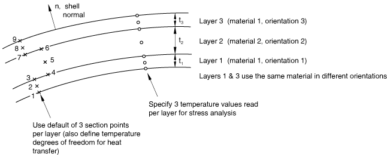
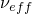
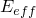
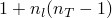
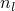
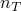
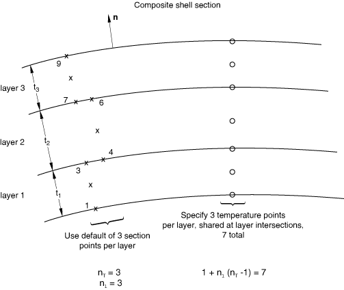
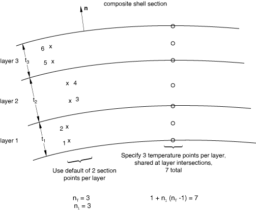
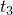

# 29.6.5 Using a shell section integrated during the analysis to define the section behavior


**Products: **Abaqus/Standard  Abaqus/Explicit  Abaqus/CAE  

##### **References**

- ["Shell elements: overview," Section 29.6.1](pt06ch29s06abo27.md)
- ["Shell section behavior," Section 29.6.4](pt06ch29s06alm18.md)
- [*DISTRIBUTION](../key/key-link.md#usb-kws-mdistribution)
- [*HOURGLASS STIFFNESS](../key/key-link.md#usb-kws-mhourglasstiff)
- [*SHELL SECTION](../key/key-link.md#usb-kws-mshellsection)
- [*TRANSVERSE SHEAR STIFFNESS](../key/key-link.md#usb-kws-mtransshearstiff)
- ["Creating homogeneous shell sections," Section 12.13.6 of the Abaqus/CAE User's Guide](../usi/usi-link.md#usi-prp-section-homogeneous-shell)
- ["Creating composite shell sections," Section 12.13.7 of the Abaqus/CAE User's Guide](../usi/usi-link.md#usi-prp-section-composite-shell)
- [Chapter 23, "Composite layups," of the Abaqus/CAE User's Guide](../usi/usi-link.md#usi-adv-layups)

### Overview

A shell section integrated during the analysis:
- is used when numerical integration through the thickness of the shell is required; and
- can be associated with linear or nonlinear material behavior.

### Defining a homogeneous shell section

To define a shell made of a single material, use a material definition (["Material data definition," Section 21.1.2](pt05ch21s01aus109.md)) to define the material properties of the section and associate these properties with the section definition. Optionally, you can refer to an orientation (["Orientations," Section 2.2.5](pt01ch02s02aus15.md)) to be associated with this material definition. A spatially varying local coordinate system defined with a distribution (["Distribution definition," Section 2.8.1](pt01ch02s08aus26.md)) can be assigned to the shell section definition. Linear or nonlinear material behavior can be associated with the section definition. However, if the material response is linear, the more economic approach is to use a general shell section (see ["Using a general shell section to define the section behavior," Section 29.6.6](pt06ch29s06alm20.md)).

You specify the shell thickness and the number of integration points to be used through the shell section (see below). For continuum shell elements the specified shell thickness is used to estimate certain section properties, such as hourglass stiffness, which are later computed using the actual thickness computed from the element geometry.

You must associate the section properties with a region of your model.

If the orientation definition assigned to a shell section definition is defined with distributions, spatially varying local coordinate systems are applied to all shell elements associated with the shell section. A default local coordinate system (as defined by the distributions) is applied to any shell element that is not specifically included in the associated distribution.

| **Input File Usage: ** | ``` [*SHELL SECTION](../key/key-link.md#usb-kws-mshellsection), ELSET=*name*, MATERIAL=*name*, ORIENTATION=*name* ``` |
| --- | --- |
|  | where the ELSET parameter refers to a set of shell elements. |

| **Abaqus/CAE Usage: ** | Property module:**Create Section**: select **Shell** as the section **Category** and **Homogeneous** as the section **Type**: **Section integration: During analysis**; **Basic**: **Material:** *name*****Assign****Material Orientation****: select regions****Assign****Section****: select regions |
| --- | --- |

### Defining a composite shell section

You can define a laminated (layered) shell made of one or more materials. You specify the thickness, the number of integration points (see below), the material, and the orientation (either as a reference to an orientation definition or as an angle measured relative to the overall orientation definition) for each layer of the shell. The order of the laminated shell layers with respect to the positive direction of the shell normal is defined by the order in which the layers are specified.

Optionally, you can specify an overall orientation definition for the layers of a composite shell. A spatially varying local coordinate system defined with a distribution (["Distribution definition," Section 2.8.1](pt01ch02s08aus26.md)) can be used to specify the overall orientation definition for the layers of a composite shell. 

For continuum shell elements the thickness is determined from the element geometry and may vary through the model for a given section definition. Hence, the specified thicknesses are only relative thicknesses for each layer. The actual thickness of a layer is the element thickness times the fraction of the total thickness that is accounted for by each layer. The thickness ratios for the layers need not be given in physical units, nor do the sum of the layer relative thicknesses need to add to one. The specified shell thickness is used to estimate certain section properties, such as hourglass stiffness, which are later computed using the actual thickness computed from the element geometry.

Spatially varying thicknesses can be specified on the layers of conventional shell elements using distributions (["Distribution definition," Section 2.8.1](pt01ch02s08aus26.md)). A distribution that is used to define layer thickness must have a default value. The default layer thickness is used by any shell element assigned to the shell section that is not specifically assigned a value in the distribution.

An example of a section with three layers and three section points per layer is shown in [Figure 29.6.5--1](pt06ch29s06alm19.md#eshell-comp-exa).

**Figure 29.6.5–1** Example of composite shell section definition.



The material name specified for each layer refers to a material definition (["Material data definition," Section 21.1.2](pt05ch21s01aus109.md)). The material behavior can be linear or nonlinear.

The orientation for each layer is specified by either the name of the orientation (["Orientations," Section 2.2.5](pt01ch02s02aus15.md)) associated with the layer or the orientation angle in degrees for the layer. Spatially varying orientation angles can be specified on a layer using distributions (["Distribution definition," Section 2.8.1](pt01ch02s08aus26.md)). Orientation angles, , are measured positive counterclockwise around the normal and relative to the overall section orientation. If either of the two local directions from the overall section orientation is not in the surface of the shell,  is applied after the section orientation has been projected onto the shell surface. If you do not specify an overall section orientation,  is measured relative to the default local shell directions (see ["Conventions," Section 1.2.2](pt01ch01s02aus02.md)).

You must associate the section properties with a region of your model.

If the orientation definition assigned to a shell section definition is defined with distributions, spatially varying local coordinate systems are applied to all shell elements associated with the shell section. A default local coordinate system (as defined by the distributions) is applied to any shell element that is not specifically included in the associated distribution.

Unless your model is relatively simple, you will find it increasingly difficult to define your model using composite shell sections as you increase the number of layers and as you assign different sections to different regions. It can also be cumbersome to redefine the sections after you add new layers or remove or reposition existing layers. To manage a large number of layers in a typical composite model, you may want to use the composite layup functionality in Abaqus/CAE. For more information, see [Chapter 23, "Composite layups," of the Abaqus/CAE User's Guide](../usi/usi-link.md#usi-adv-layups).

| **Input File Usage: ** | ``` [*SHELL SECTION](../key/key-link.md#usb-kws-mshellsection), ELSET=*name*, COMPOSITE, ORIENTATION=*name* ``` |
| --- | --- |
|  | where the ELSET parameter refers to a set of shell elements. |

| **Abaqus/CAE Usage: ** | Abaqus/CAE uses a composite layup or a composite shell section to define the layers of a composite shell. |
| --- | --- |
|  | Use the following option for a composite layup: Property module: **Create Composite Layup**: select **Conventional Shell** or **Continuum Shell** as the **Element Type**: **Section integration: During analysis**: specify orientations, regions, and materials Use the following options for a composite shell section: Property module:**Create Section**: select **Shell** as the section **Category** and **Composite** as the section **Type**: **Section integration: During analysis******Assign****Material Orientation****: select regions****Assign****Section****: select regions |

### Defining the shell section integration

Simpson's rule and Gauss quadrature are provided to calculate the cross-sectional behavior of a shell. You can specify the number of section points through the thickness of each layer and the integration method as described below. The default integration method is Simpson's rule with five points for a homogeneous section and Simpson's rule with three points in each layer for a composite section.

The three-point Simpson's rule and the two-point Gauss quadrature are exact for linear problems. The default number of section points should be sufficient for routine thermal-stress calculations and nonlinear applications (such as predicting the response of an elastic-plastic shell up to limit load). For more severe thermal shock cases or for more complex nonlinear calculations involving strain reversals, more section points may be required; normally no more than nine section points (using Simpson's rule) are required. Gaussian integration normally requires no more than five section points.

Gauss quadrature provides greater accuracy than Simpson's rule when the same number of section points are used. Therefore, to obtain comparable levels of accuracy, Gauss quadrature requires fewer section points than Simpson's rule does and, thus, requires less computational time and storage space.

#### Using Simpson's rule

By default, Simpson's rule will be used for the shell section integration. The default number of section points is five for a homogeneous section and three in each layer for a composite section.

Simpson's integration rule should be used if results output on the shell surfaces or transverse shear stress at the interface between two layers of a composite shell is required and must be used for heat transfer and coupled temperature-displacement shell elements.

| **Input File Usage: ** | ``` [*SHELL SECTION](../key/key-link.md#usb-kws-mshellsection), SECTION INTEGRATION=SIMPSON ``` |
| --- | --- |

| **Abaqus/CAE Usage: ** | Use the following option for a composite layup: |
| --- | --- |
|  | Property module: composite layup editor: **Section integration: During analysis**, **Thickness integration rule: Simpson** Use the following option for a homogeneous or composite shell section: Property module: shell section editor: **Section integration: During analysis**; **Basic**: **Thickness integration rule: Simpson** |

#### Using Gauss quadrature

If you use Gauss quadrature for the shell section integration, the default number of section points is three for a homogeneous section and two in each layer for a composite section.

In Gauss quadrature there are no section points on the shell surfaces; therefore, Gauss quadrature should be used only in cases where results on the shell surfaces are not required.

Gauss quadrature cannot be used for heat transfer and coupled temperature-displacement shell elements.

| **Input File Usage: ** | ``` [*SHELL SECTION](../key/key-link.md#usb-kws-mshellsection), SECTION INTEGRATION=GAUSS ``` |
| --- | --- |

| **Abaqus/CAE Usage: ** | Use the following option for a composite layup: |
| --- | --- |
|  | Property module: composite layup editor: **Section integration: During analysis**, **Thickness integration rule: Gauss** Use the following option for a homogeneous or composite shell section: Property module: shell section editor: **Section integration: During analysis**; **Basic**: **Thickness integration rule: Gauss** |

### Defining a shell offset value for conventional shells

You can define the distance (measured as a fraction of the shell's thickness) from the shell's midsurface to the reference surface containing the element's nodes (see ["Defining the initial geometry of conventional shell elements," Section 29.6.3](pt06ch29s06alm17.md)). Positive values of the offset are in the positive normal direction (see ["Shell elements: overview," Section 29.6.1](pt06ch29s06abo27.md)). When the offset is set equal to 0.5, the top surface of the shell is the reference surface. When the offset is set equal to 0.5, the bottom surface is the reference surface. The default offset is 0, which indicates that the middle surface of the shell is the reference surface.

You can specify an offset value that is greater in magnitude than 0.5. However, this technique should be used with caution in regions of high curvature. The element's area and all kinematic quantities are calculated relative to the reference surface, which may lead to a surface area integration error, affecting the stiffness and mass of the shell.

In an Abaqus/Standard analysis a spatially varying offset can be defined for conventional shells using a distribution (["Distribution definition," Section 2.8.1](pt01ch02s08aus26.md)). The distribution used to define the shell offset must have a default value. The default offset is used by any shell element assigned to the shell section that is not specifically assigned a value in the distribution.

An offset to the shell's top surface is illustrated in [Figure 29.6.5--2](pt06ch29s06alm19.md#shelloffset). The shell offset value is ignored for continuum shell elements.

**Figure 29.6.5–2** Schematic of shell offset for an offset value of 0.5.


| **Input File Usage: ** | Use the following option to specify a value for the shell offset: |
| --- | --- |
|  | ``` [*SHELL SECTION](../key/key-link.md#usb-kws-mshellsection), OFFSET=*offset* ``` The OFFSET parameter accepts a value, a label (SPOS or SNEG), or in an Abaqus/Standard analysis the name of a distribution that is used to define a spatially varying offset. Specifying SPOS is equivalent to specifying a value of 0.5; specifying SNEG is equivalent to specifying a value of 0.5. |

| **Abaqus/CAE Usage: ** | Use the following option for a composite layup: |
| --- | --- |
|  | Property module: composite layup editor: **Section integration: During analysis**; **Offset**: choose a reference surface, specify an offset, or select a scalar discrete field Use the following option for a shell section assignment: Property module: ****Assign****Section****: select regions: **Section**: select a homogeneous or composite shell section: **Definition**: select a reference surface, specify an offset, or select a scalar discrete field |

### Defining a variable thickness for conventional shells using distributions

You can define a spatially varying thickness for conventional shells using a distribution (["Distribution definition," Section 2.8.1](pt01ch02s08aus26.md)). The thickness of continuum shell elements is defined by the element geometry.

For composite shells the total thickness is defined by the distribution, and the layer thicknesses you specify are scaled proportionally such that the sum of the layer thicknesses is equal to the total thickness (including spatially varying layer thicknesses defined with a distribution).

The distribution used to define shell thickness must have a default value. The default thickness is used by any shell element assigned to the shell section that is not specifically assigned a value in the distribution.

If the shell thickness is defined for a shell section with a distribution, nodal thicknesses cannot be used for that section definition. 

| **Input File Usage: ** | Use the following option to define a spatially varying thickness: |
| --- | --- |
|  | ``` [*SHELL SECTION](../key/key-link.md#usb-kws-mshellsection), SHELL THICKNESS=*distribution name* ``` |

| **Abaqus/CAE Usage: ** | Use the following option for a conventional shell composite layup: |
| --- | --- |
|  | Property module: composite layup editor: **Section integration: During analysis**; **Shell Parameters**: **Shell thickness: Element distribution**: select an analytical field or an element-based discrete field Use the following option for a homogeneous shell section: Property module: shell section editor: **Section integration: During analysis**; **Basic**: **Shell thickness: Element distribution**: select an analytical field or an element-based discrete field Use the following option for a composite shell section: Property module: shell section editor: **Section integration: During analysis**; **Advanced**: **Shell thickness: Element distribution**: select an analytical field or an element-based discrete field |

### Defining a variable nodal thickness for conventional shells

You can define a conventional shell with continuously varying thickness by specifying the thickness of the shell at the nodes. The thickness of continuum shell elements is defined by the element geometry.

If you indicate that the nodal thicknesses will be specified, for homogeneous shells any constant shell thickness you specify will be ignored, and the shell thickness will be interpolated from the nodes. The thickness must be defined at all nodes connected to the element.

For composite shells the total thickness  is interpolated from the nodes, and the layer thicknesses you specify are scaled proportionally such that the sum of the layer thicknesses is equal to the total thickness (including spatially varying layer thicknesses defined with a distribution).

If the shell thickness is defined for a shell section with a distribution, nodal thicknesses cannot be used for that section definition. However, if nodal thicknesses are used, you can still use distributions to define spatially varying thicknesses on the layers of conventional shell elements.

| **Input File Usage: ** | Use both of the following options: |
| --- | --- |
|  | ``` [*NODAL THICKNESS](../key/key-link.md#usb-kws-mnodalthickness) [*SHELL SECTION](../key/key-link.md#usb-kws-mshellsection), NODAL THICKNESS ``` |

| **Abaqus/CAE Usage: ** | Use the following option for a conventional shell composite layup: |
| --- | --- |
|  | Property module: composite layup editor: **Section integration: During analysis**; **Shell Parameters**: **Nodal distribution**: select an analytical field or a node-based discrete field Use the following option for a homogeneous shell section: Property module: shell section editor: **Section integration: During analysis**; **Basic**: **Nodal distribution**: select an analytical field or a node-based discrete field Use the following option for a composite shell section: Property module: shell section editor: **Section integration: During analysis**; **Advanced**: **Nodal distribution**: select an analytical field or a node-based discrete field |

### Defining the Poisson strain in shell elements in the thickness direction

Abaqus allows for a possible uniform change in the shell thickness in a geometrically nonlinear analysis (see ["Change of shell thickness" in "Choosing a shell element," Section 29.6.2](pt06ch29s06alm16.md#usb-elm-eshellelem-shellthick)).   The Poisson’s strain can be based on a fixed section Poisson’s ratio, either user specified or computed by Abaqus based on the elastic portion of the material definition.  Alternatively, in Abaqus/Explicit the Poisson strain can be integrated through the section based on the material response at the individual material points in the section.  

By default, Abaqus/Standard computes the Poisson’s strain using a fixed section Poisson’s ratio of 0.5; Abaqus/Explicit uses the material response to compute the Poisson's strain. See ["Finite-strain shell element formulation," Section 3.6.5 of the Abaqus Theory Guide](../stm/stm-link.md#stm-elm-finitestrainshells), for details regarding the underlying formulation.

| **Input File Usage: ** | Use the following option to specify a value for the effective Poisson's ratio: |
| --- | --- |
|  | ``` [*SHELL SECTION](../key/key-link.md#usb-kws-mshellsection), POISSON= ``` Use the following option to cause the shell thickness to change based on the element initial elastic material definition: ``` [*SHELL SECTION](../key/key-link.md#usb-kws-mshellsection), POISSON=ELASTIC ``` Use the following option (available only in Abaqus/Explicit) to cause the thickness direction strain under plane stress conditions to be a function of the membrane strains and the in-plane material properties: ``` [*SHELL SECTION](../key/key-link.md#usb-kws-mshellsection), POISSON=MATERIAL ``` |

| **Abaqus/CAE Usage: ** | Use the following option for a composite layup: |
| --- | --- |
|  | Property module: composite layup editor: **Section integration: During analysis**; **Shell Parameters**: **Section Poisson's ratio: Use analysis default** or **Specify value:**  Use the following option for a homogeneous or composite shell section: Property module: shell section editor: **Section integration: During analysis**; **Advanced**: **Section Poisson's ratio: Use analysis default** or **Specify value:**  You cannot specify a shell thickness direction behavior based on the initial elastic material definition in Abaqus/CAE. |

### Defining the thickness modulus in continuum shell elements

The thickness modulus is used in computing the stress in the thickness direction (see ["Thickness direction stress in continuum shell elements" in "Choosing a shell element," Section 29.6.2](pt06ch29s06alm16.md#usb-elm-eshellelem-contshellthick)). Abaqus computes a thickness modulus value by default based on the elastic portion of the material definitions in the initial configuration.  Alternatively, you can provide a value. 

If the material properties are unavailable during the preprocessing stage of input; for example, when the material behavior is defined by the fabric material model or user subroutine [`UMAT`](../sub/sub-link.md#sub-xsl-umat) or [`VUMAT`](../sub/sub-link.md#sub-xsl-vumat), you must specify the effective thickness modulus directly. 

| **Input File Usage: ** | Use the following option to define an effective thickness modulus directly: |
| --- | --- |
|  | ``` [*SHELL SECTION](../key/key-link.md#usb-kws-mshellsection), THICKNESS MODULUS= ``` |

| **Abaqus/CAE Usage: ** | Use the following option for a composite layup: |
| --- | --- |
|  | Property module: composite layup editor: **Section integration: During analysis**; **Shell Parameters**: **Thickness modulus**  to specify the thickness properties directly Use the following option for a homogeneous or composite shell section: Property module: shell section editor: **Section integration: During analysis**; **Advanced**: **Thickness modulus**  to specify the thickness properties directly You cannot specify a shell thickness direction behavior based on the initial elastic material definition in Abaqus/CAE. |

### Defining the transverse shear stiffness

You can provide nondefault values of the transverse shear stiffness. You *must* specify the transverse shear stiffness in Abaqus/Standard if the section is used with shear flexible shells and the material definitions used in the shell section do not include linear elasticity (["Linear elastic behavior," Section 22.2.1](pt05ch22s02abm02.md)). See ["Shell section behavior," Section 29.6.4](pt06ch29s06alm18.md), for more information about transverse shear stiffness.

If you do not specify the transverse shear stiffness values, Abaqus will integrate through the section to determine them. The transverse shear stiffness is precalculated based on the initial elastic material properties, as defined by the initial temperature and predefined field variables evaluated at the midpoint of each material layer. This stiffness is not recalculated during the analysis.

For most shell sections, including layered composite or sandwich shell sections, Abaqus will calculate the transverse shear stiffness values required in the element formulation. You can override these default values. The default shear stiffness values are not calculated in some cases if estimates of shear moduli are unavailable during the preprocessing stage of input; for example, when the material behavior is defined by the fabric material model or by user subroutine [`UMAT`](../sub/sub-link.md#sub-xsl-umat), [`UHYPEL`](../sub/sub-link.md#sub-xsl-uhypel), [`UHYPER`](../sub/sub-link.md#sub-xsl-uhyper), or [`VUMAT`](../sub/sub-link.md#sub-xsl-vumat). You must define the transverse shear stiffnesses in such cases except for STRI3 elements.

| **Input File Usage: ** | Use both of the following options: |
| --- | --- |
|  | ``` [*SHELL SECTION](../key/key-link.md#usb-kws-mshellsection) [*TRANSVERSE SHEAR STIFFNESS](../key/key-link.md#usb-kws-mtransshearstiff) ``` |

| **Abaqus/CAE Usage: ** | Use the following option for a composite layup: |
| --- | --- |
|  | Property module: composite layup editor: **Section integration: During analysis**; **Shell Parameters**: toggle on **Specify transverse shear** Use the following option for a homogeneous or composite shell section: Property module: shell section editor: **Section integration: During analysis**; **Advanced**: toggle on **Specify transverse shear** |

### Specifying the order of accuracy in the Abaqus/Explicit shell element formulation

In Abaqus/Explicit you can specify second-order accuracy in the shell element formulation. See ["Section controls," Section 27.1.4](pt06ch27s01aus113.md), for more information.

| **Input File Usage: ** | ``` [*SHELL SECTION](../key/key-link.md#usb-kws-mshellsection), CONTROLS=*name* ``` |
| --- | --- |

| **Abaqus/CAE Usage: ** | Mesh module: ****Mesh****Element Type****: **Element Controls** |
| --- | --- |

### Defining density for conventional shells

You can define additional mass per unit area for conventional shell elements directly in the section definition. This functionality is similar to the more general functionality of defining a nonstructural mass contribution (see ["Nonstructural mass definition," Section 2.7.1](pt01ch02s07aus25.md).) The only difference between the two definitions is that the nonstructural mass contributes to the rotary inertia terms about the midsurface while the additional mass defined in the section definition does not.

| **Input File Usage: ** | Use the following option to define the density directly: |
| --- | --- |
|  | ``` [*SHELL SECTION](../key/key-link.md#usb-kws-mshellsection), ELSET=*name*, DENSITY= ``` |

| **Abaqus/CAE Usage: ** | Use the following option for a composite layup: |
| --- | --- |
|  | Property module: composite layup editor: **Section integration: During analysis**; **Shell Parameters**: toggle on **Density**, and enter  Use the following option for a homogeneous or composite shell section: Property module: shell section editor: **Section integration: During analysis**; **Advanced**: toggle on **Density**, and enter  |

### Specifying nondefault hourglass control parameters for reduced-integration shell elements

You can specify a nondefault hourglass control formulation or scale factors for elements that use reduced integration. See ["Section controls," Section 27.1.4](pt06ch27s01aus113.md), for more information.

In Abaqus/Standard the nondefault enhanced hourglass control formulation is available only for S4R and SC8R elements. When the enhanced hourglass control formulation is used with composite shells, the average value of the bulk material properties and the minimum value of the shear material properties over all the layers are used for computing the hourglass forces and moments.

In Abaqus/Standard you can modify the default values for hourglass control stiffness based on the default total stiffness approach for elements that use reduced integration and define a scaling factor for the stiffness associated with the drill degree of freedom (rotation about the surface normal) for elements that use six degrees of freedom at a node.

The stiffness associated with the drill degree of freedom is the average of the direct components of the transverse shear stiffness multiplied by a scaling factor. In most cases the default scaling factor is appropriate for constraining the drill rotation to follow the in-plane rotation of the element. If an additional scaling factor is defined, the additional scaling factor should not increase or decrease the drill stiffness by more than a factor of 100.0 for most typical applications. Usually, a scaling factor between 0.1 and 10.0 is appropriate. Continuum shell elements do not use a drill stiffness; hence, the scale factor is ignored.

There are no hourglass stiffness factors or scale factors for hourglass stiffness for the nondefault enhanced hourglass control formulation. You can define the scale factor for the drill stiffness for the nondefault enhanced hourglass control formulation.

| **Input File Usage: ** | Use both of the following options to specify a nondefault hourglass control formulation or scale factors for reduced-integration elements: |
| --- | --- |
|  | ``` [*SECTION CONTROLS](../key/key-link.md#usb-kws-msectioncontrols), NAME=*name* [*SHELL SECTION](../key/key-link.md#usb-kws-mshellsection), CONTROLS=*name* ``` Use both of the following options in Abaqus/Standard to modify the default values for hourglass control stiffness based on the default total stiffness approach for reduced-integration elements and to define a scaling factor for the stiffness associated with the drill degree of freedom (rotation about the surface normal) for six degree of freedom elements: ``` [*SHELL SECTION](../key/key-link.md#usb-kws-mshellsection) [*HOURGLASS STIFFNESS](../key/key-link.md#usb-kws-mhourglasstiff) ``` |

| **Abaqus/CAE Usage: ** | Mesh module: ****Mesh****Element Type****: **Element Controls** |
| --- | --- |

### Specifying temperature and field variables

You can specify temperatures and field variables for conventional shell elements by defining the value at the reference surface of the shell and the gradient through the shell thickness or by defining the values at equally spaced points through each layer of the shell's thickness. You can specify a temperature gradient only for elements without temperature degrees of freedom. The temperatures and field variables for continuum shell elements are defined at the nodes and then interpolated to the section points.

The actual values of the temperatures and field variables are specified as either predefined fields or initial conditions (see ["Predefined fields," Section 34.6.1](pt07ch34s06aus128.md), or ["Initial conditions in Abaqus/Standard and Abaqus/Explicit," Section 34.2.1](pt07ch34s02aus116.md)).

If temperature is to be read as a predefined field from the results file or the output database file of a previous analysis, the temperature must be defined at equally spaced points through each layer of the thickness. In addition, the results file must be modified so that the field variable data are stored in record 201. See ["Predefined fields," Section 34.6.1](pt07ch34s06aus128.md), for additional details.

#### Defining the value at the reference surface and the gradient through the thickness

You can define the temperature or predefined field by its magnitude on the reference surface of the shell and the gradient through the thickness. If only one value is given, the magnitude will be constant through the thickness.

| **Input File Usage: ** | Use the following option to specify that the temperatures or predefined fields are defined by a gradient: |
| --- | --- |
|  | ``` [*SHELL SECTION](../key/key-link.md#usb-kws-mshellsection) ``` Use any of the following options to specify the actual values of the temperatures or predefined fields: ``` [*TEMPERATURE](../key/key-link.md#usb-kws-htemperature) [*FIELD](../key/key-link.md#usb-kws-hfield) [*INITIAL CONDITIONS](../key/key-link.md#usb-kws-minitialcond), TYPE=TEMPERATURE [*INITIAL CONDITIONS](../key/key-link.md#usb-kws-minitialcond), TYPE=FIELD ``` |

| **Abaqus/CAE Usage: ** | Use the following option for a composite layup: |
| --- | --- |
|  | Property module: composite layup editor: **Section integration: During analysis**; **Shell Parameters**; **Temperature variation: Linear through thickness** Use the following option for a homogeneous or composite shell section: Property module: shell section editor: **Section integration: During analysis**: **Advanced**; **Temperature variation: Linear through thickness** Only initial temperatures and predefined temperature fields are supported in Abaqus/CAE. Load module: **Create Predefined Field**: **Step:** *initial_step* or *analysis_step*: choose **Other** for the **Category** and **Temperature** for the **Types for Selected Step** |

#### Defining the values at equally spaced points through the thickness

Alternatively, you can define the temperature and field variable values at equally spaced points through the thickness of a shell or of each layer of a composite shell.

For a sequentially coupled thermal-stress analysis in Abaqus/Standard, the number (*n*) of equally spaced points through the thickness of a layer is an odd number when temperature values are obtained from the results file or the output database file generated by a previous Abaqus/Standard heat transfer analysis (since only Simpson's rule can be used for integration through the section in heat transfer analysis). *n* may be even or odd if the values are supplied from some other source. In either case Abaqus/Standard interpolates linearly between the two closest defined temperature points to find the temperature values at the section points.

The number of predefined field points through each layer, *n*, must be the same as the number of integration points used through the same layer in the analysis from which the temperatures are obtained. This requirement implies that in the previous analysis each of the layers must have the same number of integration points.

You specify  temperature or field variable values, where  is the number of layers in the shell section and  ( > 1) is the value of *n*. For =1, you specify  one temperature or field variable value for a given node or node set.

| **Input File Usage: ** | Use the following option to specify that the temperatures or predefined fields are defined at equally spaced points: |
| --- | --- |
|  | ``` [*SHELL SECTION](../key/key-link.md#usb-kws-mshellsection), TEMPERATURE=*n* ``` Use any of the following options to specify the actual values of the temperatures or predefined fields: ``` [*TEMPERATURE](../key/key-link.md#usb-kws-htemperature) [*FIELD](../key/key-link.md#usb-kws-hfield) [*INITIAL CONDITIONS](../key/key-link.md#usb-kws-minitialcond), TYPE=TEMPERATURE [*INITIAL CONDITIONS](../key/key-link.md#usb-kws-minitialcond), TYPE=FIELD ``` |

| **Abaqus/CAE Usage: ** | Use the following option for a composite layup: |
| --- | --- |
|  | Property module: composite layup editor: **Section integration: During analysis**; **Shell Parameters**; **Temperature variation: Piecewise linear over *n* values** Use the following option for a homogeneous or composite shell section: Property module: shell section editor: **Section integration: During analysis**: **Advanced**; **Temperature variation: Piecewise linear over *n* values** Only initial temperatures and predefined temperature fields are supported in Abaqus/CAE. Load module: **Create Predefined Field**: **Step:** *initial_step* or *analysis_step*: choose **Other** for the **Category** and **Temperature** for the **Types for Selected Step** |

##### Example

An example of this scheme is illustrated in [Figure 29.6.5--3](pt06ch29s06alm19.md#eshell-temp-simpson-exa) and [Figure 29.6.5--4](pt06ch29s06alm19.md#eshell-temp-gauss-exa). 

**Figure 29.6.5–3** Defining temperature values at *n* equally spaced points using Simpson's rule.



**Figure 29.6.5–4** Defining temperature values at *n* equally spaced points using Gauss integration.



The following Abaqus/Standard heat transfer shell section definition corresponds to this example: 
```
[*SHELL SECTION](../key/key-link.md#usb-kws-mshellsection), COMPOSITE
, 3, MAT1, ORI1
, 3, MAT2, ORI2
, 3, MAT3, ORI3
```
This creates degrees of freedom 11–17 in the heat transfer analysis. Temperatures corresponding to these degrees of freedom are then read into the stress analysis at the temperature points shown and interpolated to the section points shown.

#### Defining a continuous temperature field

In Abaqus/Standard if an element with temperature degrees of freedom other than a shell abuts the bottom surface of a shell element with temperature degrees of freedom, the temperature field is made continuous when the elements share nodes. If another element with temperature degrees of freedom abuts the top surface, separate nodes must be used and a linear constraint equation (["Linear constraint equations," Section 35.2.1](pt08ch35s02aus129.md)) must be used to constrain the temperatures to be the same (that is, to give the same value to the top surface degree of freedom on the shell and degree of freedom 11 on the other element).

For the same reason you must be careful if a different number of temperature points is used in adjacent shell elements. For compatibility MPCs (["General multi-point constraints," Section 35.2.2](pt08ch35s02aus130.md)) or equation constraints are also needed in this case.

In Abaqus/Explicit since no thermal MPCs and no thermal equation constraints are available for degrees of freedom greater than 11, care must be taken when using a different number of temperature points in adjacent shell elements. This should usually have a localized effect on the temperature distribution, but it may affect the overall solution for the cases in which the temperature gradient through the thickness is significant.

In both Abaqus/Standard and Abaqus/Explicit be careful in the models in which the shell's normals are reversed. In this case the temperature at the bottom of the shell becomes the temperature at the top of the adjacent shell. This may have a small impact on the overall solution for the cases in which the thermal gradient through the thickness is negligible and the temperature variation is mainly in plane. However, if the temperature gradient through the thickness is significant, it may lead to incorrect results.

### Output

In an Abaqus/Standard stress analysis temperature output at the section points can be obtained using the element variable TEMP.

If the temperature values were specified at equally spaced points through the thickness, output at the temperature points can be obtained in an Abaqus/Standard stress analysis, as in a heat transfer analysis, by using the nodal variable NT*xx*. This nodal output variable is also available in Abaqus/Explicit for coupled temperature-displacement analyses. The nodal variable NT*xx* should not be used for output at the temperature points with the default gradient method. In this case output variable NT should be requested; NT11 (the reference temperature value) and NT12 (the temperature gradient) will be output automatically. For continuum shell elements, there is only NT11; all other NT*xx* are irrelevant.

Other output variables that are relevant for shells are listed in each of the library sections describing the specific shell elements. For example, stresses, strains, section forces and moments, average section stresses, section strains, etc. can be output. The section moments are calculated relative to the reference surface.


