# 31.1.5 Connection-type library

**Products: **Abaqus/Standard  Abaqus/Explicit  Abaqus/CAE  

##### **References**

- ["Connector elements," Section 31.1.2](pt06ch31s01alm25.md)
- ["Connector element library," Section 31.1.4](pt06ch31s01ael25.md)
- [*CONNECTOR BEHAVIOR](../key/key-link.md#usb-kws-mconnectorbehavior)
- [*CONNECTOR SECTION](../key/key-link.md#usb-kws-mconnectorsection)

### Overview

The connection-type library contains:
- translational basic connection components, which affect translational degrees of freedom at both nodes and may affect rotational degrees of freedom at the first node or at both nodes on the connector element;
- rotational basic connection components, which affect only rotational degrees of freedom at both nodes on the connector element;
- specialized rotational basic connection components, which in addition to rotational degrees of freedom affect other degrees of freedom at the nodes on the connector element;
- assembled connections, which are predefined combinations of translational and rotational or translational and specialized rotational basic connection components; and
- complex connections, which affect a combination of degrees of freedom at the nodes on the connector element and cannot be combined with any other connection component.

### Using the connection-type library

Each connection type is described in the connection-type library. Each library entry includes a figure, which relates the physical behavior to the idealized model and defines the local coordinate directions. Following the figure, each library entry defines kinematic constraints; constraint forces and moments internal to the connection; components of relative motion available for defining the connector behavior, connector motion, or connector loads (called available components); and kinetic forces and moments conjugate to the available components of relative motion. If appropriate, a discussion of the predicted Coulomb-like friction in the connection is included. Finally, the connection type is summarized in a table.

#### Connection figures

A schematic drawing of each connection type is included along with the Abaqus idealization of the connection. The idealization indicates in what sense available components of relative motion are measured and how the nodes' positions and orientation directions define the connection. When orientation directions are used to define the connection, the idealization shows these local directions at the appropriate nodes. If available components of relative motion exist in the connection, they are indicated in the figure as free relative motions. [Figure 31.1.5--1](pt06ch31s01aus114.md#econnect-connectionfig) shows the connection figure for the REVOLUTE connection type, which affects only rotations. It has one available component (the rotation about the shared axis), requires an orientation at node *a*, and allows an optional orientation at node *b*. 

**Figure 31.1.5–1** Example connection type: REVOLUTE.

#### Orientation directions

The orientation directions at node *a* (the first node on the connector element) are indicated as unit base vectors 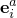, where 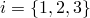. Similarly, the orientation directions at node *b* are indicated as 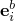. When orientation directions are required at a node, you must define them as described in ["Orientations," Section 2.2.5](pt01ch02s02aus15.md). If orientation directions are optional but not provided at node *a*, the global directions are used by default. If orientation directions are optional but not provided at node *b*, the orientation directions from node *a* are used by default.

Connector elements activate rotational degrees of freedom at the nodes to which they are attached if they do not exist already and an orientation is permitted at that node. The only exception is connection type JOIN, where an orientation is optional at node *a* but rotation degrees of freedom are not activated. 

The orientation directions corotate with the rotation of the node to which they are attached (with the exception of connection type JOIN, which uses fixed directions when rotation degrees of freedom are not active at node *a*). If there are no elements with rotational degrees of freedom attached to the node, rotational multi-point constraints, or rotational equations, you must ensure that sufficient rotational boundary conditions are provided to avoid numerical singularities associated with unconstrained rotational degrees of freedom.

#### Components of relative motion and connector forces and moments

The six components of relative motion, denoted  and 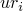 for , are defined in the description for each connection, where needed. These components include constrained and available components of relative motion. Forces and moments are denoted  and . These quantities are either constraint forces and moments, which enforce the kinematic constraints on the constrained components of relative motion, or kinetic forces and moments, which are the work conjugate variables to the available components of relative motion. For example, the REVOLUTE connection type has one available component of relative motion, 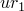, and two kinematic rotation constraints (equivalent to setting two rotation components, 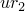 and 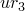, to zero). Conjugate to the available rotation component is the kinetic moment 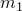 acting about the local -direction.

In general, kinetic forces and moments include the effects of connector behaviors, such as elastic springs, viscous damping, friction, and reaction forces and moments due to connector stops and locks. For constitutive response defined as a function of displacement or rotation, the initial position may not correspond with the reference position where constitutive forces and moments are zero. You can define reference lengths and angles (given in degrees) for connector behavior as described in ["Defining reference lengths and angles for constitutive response" in "Connector behavior," Section 31.2.1](pt06ch31s02alm27.md#usb-elm-econnectorbehavior-reflengths). These reference quantities define 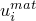 and 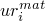, the connector constitutive displacements and rotations. These constitutive displacements and rotations are used only to define constitutive response and differ from the relative displacements and rotations measured in the connector elements only when you define the reference lengths or angles.

As an example, if the REVOLUTE connection included linear spring and dashpot behavior combined with a connector stop,

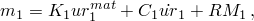

where  is the spring stiffness,  is the dashpot coefficient, and 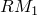 is the reaction moment caused by the connector stop. In the REVOLUTE connection there are two constraint moment components,  about 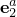 and  about 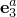.

##### Interpreting connector forces and moments

The kinematic constraint and kinetic forces and moments are always computed as work conjugates of the kinematics in the connector (components of relative motion). In most connection types one direct consequence is that the constraint forces (and moments) in connectors are reported as the forces (and moments) applied at the second node but in the local system associated with the first node. Since the kinematics are complex in many of the connection types, the connector forces and moments can be somewhat surprising upon first inspection. For example, consider the case of a HINGE connection defined with the local -direction aligned with the global *X*-direction and the local -direction aligned with the global Y-direction. Assume that the second connector node is grounded and that the first node is subjected to a concentrated load along the global *Y*-direction. If the only available relative rotation in the HINGE is constrained with a zero-valued connector motion, the second node does not rotate with respect to the first node and the connector reaction force along the local -direction matches the applied load while the other two connector reaction forces are zero. However, if a nonzero connector motion is specified, the first connector reaction force is still zero while both the second and third connector reaction forces are nonzero and only the vector-norm of these two forces matches the applied load. In both cases the only nonzero nodal reaction force at the second connector node is the one in the global *Y*-direction, as dictated by the equilibrium in a free body diagram. Hence, the connector reaction forces and nodal reaction forces are not equivalent in most cases.

#### Coulomb-like friction behavior

Coulomb-like friction behavior is possible for any connection type that has available components of relative motion; see ["Connector friction behavior," Section 31.2.5](pt06ch31s02alm31.md), for details. Friction behavior requires a “tangent” direction (the direction in which slipping may occur) and a “normal” direction (the direction perpendicular to the contacting surfaces). In the most general case you define the normal force causing friction in the connector. However, Abaqus predefines friction behavior for a limited number of connection types, as discussed in the connection-type library in this section. In these predefined friction cases you do not have to define the contact normal force.

#### Summary table

Each connection library entry includes a table summarizing the connection type. This summary table indicates whether the connection type is basic, assembled, or complex. It gives the kinematic constraints; constraint force or moment components; available components of relative motion; “kinetic” force or moment components following from the constitutive behavior in the available components of relative motion; which orientation directions are required, optional, or ignored; how connector stops limit the available components of relative motion; what reference lengths and angles are used to define the constitutive behavior; what parameters are used for predefined Coulomb-like friction; and how the contact normal forces are defined by Abaqus in association with predefined Coulomb-like friction.

### Basic connection components

Basic connection components are divided into three categories:
- Translational basic connection components, which affect translational degrees of freedom at both nodes and may affect rotational degrees of freedom at the first node or at both nodes
- Rotational basic connection components, which affect only rotational degrees of freedom at both nodes
- Specialized rotational basic connection components, which in addition to rotational degrees of freedom affect other degrees of freedom at the nodes

Only one translational basic connection component and one rotational or specialized rotational basic connection component can be used in the definition of a connector element. If a more complicated connection requires more basic connection components than this, use multiple connector elements attached to the same nodes.

#### Translational basic connection components

The following basic connection components affect translational degrees of freedom at both node *a* and node *b*. Some of these connector components affect rotational degrees of freedom at node *a* or at both node *a* and node *b*. Any basic connection component from this list can be used to define the translational behavior of a connector element.

| ACCELEROMETER | Provide a connection between two nodes to measure the relative acceleration, velocity, and position of a body in a local coordinate system. This connection type is available only in Abaqus/Explicit. If it is defined in an Abaqus/Standard model, it will be converted internally to a CARTESIAN connector type. |
| --- | --- |
| AXIAL | Provide a connection between two nodes that acts along the line connecting the nodes. |
| CARTESIAN | Provide a connection between two nodes that allows independent behavior in three local Cartesian directions that follow the system at node *a*. |
| JOIN | Join the position of two nodes. |
| LINK | Provide a pinned rigid link between two nodes to keep the distance between the two nodes constant. |
| PROJECTION CARTESIAN | Provide a connection between two nodes that allows independent behavior in three local Cartesian directions that follow the system at both nodes *a* and *b*. |
| RADIAL-THRUST | Provide a connection between two nodes that allows different behavior for radial and thrust displacements. |
| SLIDE-PLANE | Provide a slide-plane connection to make the position of the second node remain on a plane defined by the orientation of the first node and the initial position of the second node. |
| SLOT | Provide a slot connection to make the position of the second node remain on a line defined by the orientation of the first node and the initial position of the second node. |

#### Rotational basic connection components

The following basic connection components affect only rotational degrees of freedom at the nodes in the connection. Any basic connection component from this list can be used to define the rotational behavior of a connector element.

| ALIGN | Provide a connection between two nodes that aligns their local directions. |
| --- | --- |
| CARDAN | Provide a rotational connection between two nodes parameterized by Cardan (or Bryant) angles. |
| CONSTANT VELOCITY | Provide a constant velocity connection between two nodes. |
| EULER | Provide a rotational connection between two nodes parameterized by Euler angles. |
| FLEXION-TORSION | Provide a connection between two nodes that allows different behavior for flexural and torsional rotations. |
| PROJECTION FLEXION-TORSION | Provide a connection between two nodes that allows different behavior for two flexural rotations and one torsional rotation. |
| REVOLUTE | Provide a revolute connection between two nodes. |
| ROTATION | Provide a rotational connection between two nodes parameterized by the rotation vector. |
| ROTATION-ACCELEROMETER | Provide a connection between two nodes to measure the relative angular acceleration, velocity, and position of a body in a local coordinate system. This connection type is available only in Abaqus/Explicit. If it is defined in an Abaqus/Standard model, it will be converted internally to a CARDAN connector type. |
| UNIVERSAL | Provide a universal connection between two nodes. |

#### Specialized rotational basic connection components

The following basic connection component affects rotational and other non-translational degrees of freedom at the nodes in the connection. The specialized rotational basic connection component can be combined with translational basic connection components.

| FLOW-CONVERTER | Provide a means of converting the material flow (degree of freedom 10) at a connector node into a rotation. |
| --- | --- |

### Assembled connections

Assembled connections are included for convenience. Each assembled connection is created by combinations of basic connection components. The equivalent basic connection components used for each assembled connection are listed in parentheses.

| BEAM | Provide a rigid beam connection between two nodes. (JOIN + ALIGN) |
| --- | --- |
| BUSHING | Provide a connection between two nodes that allows independent behavior in three local Cartesian directions that follow the system at both nodes *a* and *b* and that allows different behavior in two flexural rotations and one torsional rotation. (PROJECTION CARTESIAN + PROJECTION FLEXION-TORSION) |
| CVJOINT | Join the position of two nodes, and provide a constant velocity connection between their rotational degrees of freedom. (JOIN + CONSTANT VELOCITY) |
| CYLINDRICAL | Provide a slot connection between two nodes, and constrain the rotations by a revolute connection. (SLOT + REVOLUTE) |
| HINGE | Join the position of two nodes, and provide a revolute connection between their rotational degrees of freedom. (JOIN + REVOLUTE) |
| PLANAR | Provide a slide-plane connection between two nodes with a revolute connection about the normal direction to the plane. The PLANAR connection creates a local two-dimensional system in three-dimensional analyses. (SLIDE-PLANE + REVOLUTE) |
| RETRACTOR | Join the position of two nodes, and convert material flow into rotation. (JOIN + FLOW-CONVERTER) |
| TRANSLATOR | Provide a slot connection between two nodes, and align their three local axis directions. (SLOT + ALIGN) |
| UJOINT | Join the position of two nodes, and provide a universal connection between their rotational degrees of freedom at the nodes. (JOIN + UNIVERSAL) |
| WELD | Join the position of two nodes, and align their three local axis directions. (JOIN + ALIGN) |

### Complex connections

Complex connections affect a combination of degrees of freedom at the nodes in the connection and cannot be combined with other connection components. They typically model highly coupled physical connections.

| SLIPRING | Model material flow and stretching between two points of a belt system (such as an automotive seat belt). |
| --- | --- |

### Connection-type library

The following descriptions list all the basic connection components and assembled connections in alphabetical order.

#### ACCELEROMETER

Connection type ACCELEROMETER provides a convenient way to measure the relative position, velocity, and acceleration of a body in a local coordinate system. All kinematic quantities are measured relative to node *a*. While position and displacement are reported in the coordinate system of node *a*, velocity and acceleration are reported in the coordinate system of node *b*. Each node of the connector can translate and rotate independently, although fixing the first of the two nodes to ground is more common. With the first node fixed, connection type ACCELEROMETER provides a convenient way to measure the local components of the velocity and acceleration in a coordinate system fixed to a moving body (for example, an accelerometer).

Connection type ACCELEROMETER is available only in Abaqus/Explicit. It is the translation counterpart to connection type ROTATION-ACCELEROMETER, which measures relative angular position, velocity, and acceleration. ACCELEROMETER connections cannot be used in two-dimensional and axisymmetric analyses in Abaqus/Explicit.

**Figure 31.1.5–2** Connection type ACCELEROMETER.

##### Description

The ACCELEROMETER connection does not impose kinematic constraints. It defines three local directions at node *a* and three local directions at node *b*. The ACCELEROMETER connection's formulation is similar to that for the CARTESIAN connection. The ACCELEROMETER connection measures the position of node *b* relative to node *a*

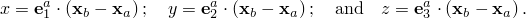

There are no available components of relative motion for the ACCELEROMETER connection. The connector displacement components are

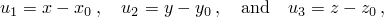

where , , and  are the initial coordinates of node *b* relative to node *a*.

The ACCELEROMETER connection measures velocity and acceleration in the local directions at node *a* as if node *a* were an inertial frame. In contrast to the CARTESIAN connection, the ACCELEROMETER connection reports the computed velocity and acceleration in the local directions at node *b*. Let 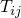 be the transformation from  to . Then the ACCELEROMETER connection measures velocity and acceleration as

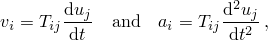

where the derivatives above are time derivatives in a system moving with .

In two-dimensional and axisymmetric analyses . 

##### Summary

| ACCELEROMETER |
| --- |
| Basic, assembled, or complex: | Basic |
| Kinematic constraints: | None |
| Constraint force output: | None |
| Available components: | None |
| Kinetic force output: | None |
| Orientation at *a*: | Optional |
| Orientation at *b*: | Optional |
| Connector stops: | None |
| Constitutive reference lengths: | None |
| Predefined friction parameters: | None |
| Contact force for predefined friction: | None |

#### ALIGN

Connection type ALIGN provides a connection between two nodes where all three local directions are aligned. If both local axes are given and do not align initially, their initial relative angular position is held constant.

**Figure 31.1.5–3** Connection type ALIGN.

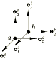

##### Description

The ALIGN connection imposes kinematic constraints only. The local directions at node *b* are set equal to those at node *a*. If the local directions do not align initially, the ALIGN connection holds fixed the Cardan angles between the local orientation directions at node *b*, 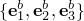, and those at node *a*, 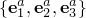. These fixed angular positions are the connector position output quantities. See connection type CARDAN for a definition of Cardan angles.

The constraint moment enforcing the alignment of the local directions is

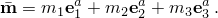

In two-dimensional analysis 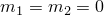.

##### Summary

| ALIGN |
| --- |
| Basic, assembled, or complex: | Basic |
| Kinematic constraints: | 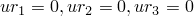 |
| Constraint moment output: | 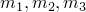 |
| Available components: | None |
| Kinetic moment output: | None |
| Orientation at *a*: | Optional |
| Orientation at *b*: | Optional |
| Connector stops: | None |
| Constitutive reference angles: | None |
| Predefined friction parameters: | None |
| Contact force for predefined friction: | None |

#### AXIAL

Connection type AXIAL provides a connection between two nodes where the relative displacement is along the line separating the two nodes. It models discrete physical connections such as axial springs, axial dashpots, or node-to-node (gap-like) contact.

**Figure 31.1.5–4** Connection type AXIAL.

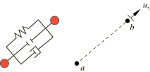

##### Description

The AXIAL connection does not constrain any component of relative motion. The distance between nodes *a* and *b* is 

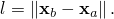

The available component of relative motion, , acts along the line connecting the two nodes, measures the change in distance separating the two nodes, and is defined as

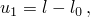

where  is the initial distance from node *a* to *b*. The connector constitutive displacement is

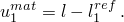

The kinetic force is

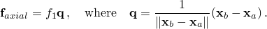

In Abaqus/Standard an optional orientation can be provided at one of the nodes in an AXIAL connection to provide direction for the force if the nodes are coincident or when one of the nodes is a “ground node.” If the orientation is provided at both of the coincident nodes, the orientation at the first node in the connectivity will be used. The orientation definitions remain fixed during the analysis and will be ignored when the two nodes separate. Rotational degrees of freedom are not activated for connection type AXIAL.

Symbol plots in the Visualization module of Abaqus/CAE display vector field output for the AXIAL connector along the 1-direction of the orientation at the first node instead of along the line joining the two nodes. If an orientation is not defined for the first node of the connector, the vector is displayed along the 1-direction of the global coordinate system.

##### Summary

| AXIAL |
| --- |
| Basic, assembled, or complex: | Basic |
| Kinematic constraints: | None |
| Constraint force output: | None |
| Available components: |  |
| Kinetic force output: |  |
| Orientation at *a*: | Optional |
| Orientation at *b*: | Optional |
| Connector stops: | 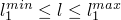 |
| Constitutive reference lengths: |  |
| Predefined friction parameters: | None |
| Contact force for predefined friction: | None |

#### BEAM

Connection type BEAM provides a rigid beam connection between two nodes.

**Figure 31.1.5–5** Connection type BEAM.

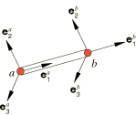

##### Description

Connection type BEAM imposes kinematic constraints and uses local orientation definitions equivalent to combining connection types JOIN and ALIGN.

##### Summary

| BEAM |
| --- |
| Basic, assembled, or complex: | Assembled |
| Kinematic constraints: | JOIN + ALIGN |
| Constraint force and moment output: | 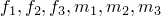 |
| Available components: | None |
| Kinetic force and moment output: | None |
| Orientation at *a*: | Optional |
| Orientation at *b*: | Optional |
| Connector stops: | None |
| Constitutive reference lengths and angles: | None |
| Predefined friction parameters: | None |
| Contact force for predefined friction: | None |

#### BUSHING

Connection type BUSHING provides a bushing-like connection between two nodes. It cannot be used in two-dimensional or axisymmetric analyses.

**Figure 31.1.5–6** Connection type BUSHING.

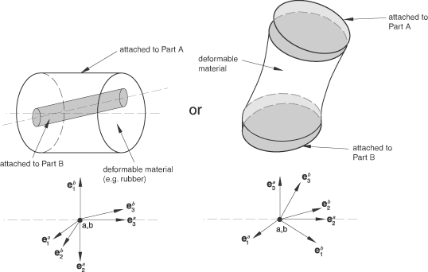

##### Description

Connection type BUSHING does not constrain any components of relative motion and uses local orientation definitions equivalent to combining connection types PROJECTION CARTESIAN and PROJECTION FLEXION-TORSION.

##### Summary

| BUSHING |
| --- |
| Basic, assembled, or complex: | Assembled |
| Kinematic constraints: | None |
| Constraint force and moment output: | None |
| Available components: | 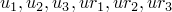 |
| Kinetic force and moment output: |  |
| Orientation at *a*: | Required |
| Orientation at *b*: | Optional |
| Connector stops: | 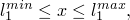 |
|  | 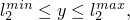 |
|  | 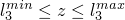 |
|  | 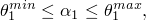 |
|  | 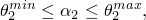 |
|  | 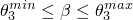 |
| Constitutive reference lengths and angles: | 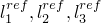 |
|  | 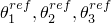 |
| Predefined friction parameters: | None |
| Contact force for predefined friction: | None |

#### CARDAN

Connection type CARDAN provides a rotational connection between two nodes where the relative rotation between the nodes is parameterized by Cardan (or Bryant) angles. A Cardan-angle parameterization of finite rotations is also called a 1–2–3 or yaw-pitch-roll parameterization. Connection type CARDAN cannot be used in two-dimensional or axisymmetric analysis.

When connection type CARDAN is used with connector behavior, the relative rotation axis with the highest resistance to rotational motion should be assigned to the second component of relative rotation (component number 5) to avoid “gimbal lock,” a singularity in the rotation parameterization for relative rotation angles 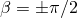.

**Figure 31.1.5–7** Connection type CARDAN.

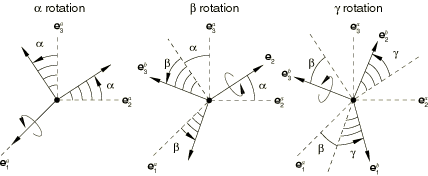

##### Description

The CARDAN connection does not impose kinematic constraints. A CARDAN connection is a finite rotation connection where the local directions at node *b* are parameterized in terms of Cardan (or Bryant) angles relative to the local directions at node *a*. Local directions  are positioned relative to  by three successive finite rotations , , and  as follows:

1. Rotate by  radians about axis ;
2. Rotate by  radians about the intermediate 2-axis, 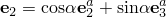; and
3. Rotate by  radians about axis 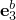.

Rotation angle  should be moderate (magnitude less than ), whereas  and  may be arbitrarily large (i.e., magnitude greater than ). The Cardan angles are determined by the local directions as

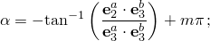

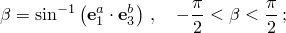

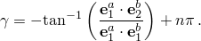

Here, *m* and *n* are integers that account for rotations with a magnitude greater than .

The three available components of relative motion in the CARDAN connection are the changes in the Cardan angles positioning the local directions at node *b* relative to the local directions at node *a*. Therefore, 

where , , and  are the initial Cardan angles. The connector constitutive rotations are

The kinetic moment in a CARDAN connection is determined from the three component relationships:

##### Summary

| CARDAN |
| --- |
| Basic, assembled, or complex: | Basic |
| Kinematic constraints: | None |
| Constraint moment output: | None |
| Available components: |  |
| Kinetic moment output: |  |
| Orientation at *a*: | Required |
| Orientation at *b*: | Optional |
| Connector stops: |  |
|  |  |
|  |  |
| Constitutive reference angles: |  |
| Predefined friction parameters: | None |
| Contact force for predefined friction: | None |

#### CARTESIAN

Connection type CARTESIAN provides a connection between two nodes where the change in position is measured in three local connection directions for node *a*, shown in [Figure 31.1.5--8](pt06ch31s01aus114.md#econnect-cartesian).

**Figure 31.1.5–8** Connection type CARTESIAN.

##### Description

The CARTESIAN connection does not impose kinematic constraints. It defines three local directions  at node *a* and measures the change in position of node *b* along these local coordinate directions. The local directions at node *a* follow the rotation of node *a*.

The position of node *b* relative to node *a* is 

The available components of relative motion are

where , , and  are the initial coordinates of node *b* relative to the local coordinate system at node *a*. The connector constitutive displacements are

The kinetic force is

In two-dimensional analysis , , , and .

##### Summary

| CARTESIAN |
| --- |
| Basic, assembled, or complex: | Basic |
| Kinematic constraints: | None |
| Constraint force output: | None |
| Available components: |  |
| Kinetic force output: |  |
| Orientation at *a*: | Optional |
| Orientation at *b*: | Ignored |
| Connector stops: |  |
|  |  |
|  |  |
| Constitutive reference lengths: |  |
| Predefined friction parameters: | None |
| Contact force for predefined friction: | None |

#### CONSTANT VELOCITY

Connection type CONSTANT VELOCITY provides the rotational part of connection type CVJOINT. It cannot be used in two-dimensional or axisymmetric analysis. Furthermore, the connection type does not have available components of relative motion. To include connector behavior in flexural motion, use connection type FLEXION-TORSION with the torsion angle set to zero.

This connection type models physical connectors that under certain conditions transmit a constant spinning velocity about misaligned shafts.

**Figure 31.1.5–9** Connection type CONSTANT VELOCITY.

##### Description

The shaft direction at node *a* is , and the shaft direction at node *b* is . The constant velocity constraint is stated as follows. In any configuration there are two unit length orthogonal vectors  and  in the plane perpendicular to the shaft at node *b*. These vectors can be written 

The angle  is chosen such that 

The constant velocity constraint requires that the angle  is constant at all times. The constant velocity constraint is equivalent to constraining the torsion angle to be constant in a FLEXION-TORSION connection.

The name “constant velocity” for this connection type derives from the following property. If the angular velocities of the two shafts,  and , have components only along each shaft, respectively, and in the direction of the normal to the plane containing the two shafts (that is, along the  direction), the components of angular velocity along the respective shaft directions are equal:

Hence, the “spinning” angular velocity component is the same about each shaft.

The constraint moment imposing the constant velocity constraint has a single component about the average shaft direction  and is written

##### Summary

| CONSTANT VELOCITY |
| --- |
| Basic, assembled, or complex: | Basic |
| Kinematic constraints: |  |
| Constraint moment output: |  |
| Available components: | None |
| Kinetic moment output: | None |
| Orientation at *a*: | Required |
| Orientation at *b*: | Optional |
| Connector stops: | None |
| Constitutive reference angles: | None |
| Predefined friction parameters: | None |
| Contact force for predefined friction: | None |

#### CVJOINT

Connection type CVJOINT joins the position of two nodes and provides a constant velocity constraint between their rotational degrees of freedom. Connection type CVJOINT cannot be used in two-dimensional or axisymmetric analysis.

**Figure 31.1.5–10** Connection type CVJOINT.

##### Description

Connection type CVJOINT imposes kinematic constraints and uses local orientation definitions equivalent to combining connection types JOIN and CONSTANT VELOCITY.

##### Summary

| CVJOINT |
| --- |
| Basic, assembled, or complex: | Assembled |
| Kinematic constraints: | JOIN + CONSTANT VELOCITY |
| Constraint force and moment output: |  |
| Available components: | None |
| Kinetic force and moment output: | None |
| Orientation at *a*: | Required |
| Orientation at *b*: | Optional |
| Connector stops: | None |
| Constitutive reference lengths and angles: | None |
| Predefined friction parameters: | None |
| Contact force for predefined friction: | None |

#### CYLINDRICAL

Connection type CYLINDRICAL provides a slot connection between two nodes and a revolute constraint where the free rotation is about the line of the slot. It cannot be used in two-dimensional or axisymmetric analysis.

**Figure 31.1.5–11** Connection type CYLINDRICAL.

##### Description

Connection type CYLINDRICAL imposes kinematic constraints and uses local orientation definitions equivalent to combining connection types SLOT and REVOLUTE.

The connector constraint forces and moments reported as connector output depend strongly on the order and the location of the nodes in the connector (see ["Connector behavior," Section 31.2.1](pt06ch31s02alm27.md)). Since the kinematic constraints are enforced at node *b* (the second node of the connector element), the reported forces and moments are the constraint forces and moments applied at node *b* to enforce the CYLINDRICAL constraint. Thus, in most cases the connector output associated with a CYLINDRICAL connection is best interpreted when node *b* is located at the center of the device enforcing the constraint. This choice is essential when moment-based friction is modeled in the connector since the contact forces are derived on the connector forces and moments, as illustrated below. Proper enforcement of the kinematic constraints is independent of the order or location of the nodes.

##### Friction

Predefined Coulomb-like friction in the CYLINDRICAL connection defines the friction force (CSFC) along the instantaneous slip direction on the two contacting cylindrical surfaces (the pin and the sleeve) illustrated above. The table below summarizes the parameters that are used to specify predefined friction in this connection type as discussed in detail next.

The frictional effect is formally written as

where the potential  represents the magnitude of the frictional tangential tractions in the connector in a direction tangent to the cylindrical surface on which contact occurs,  is the friction-producing normal force on the same cylindrical surface, and  is the friction coefficient. Frictional stick occurs if ; and sliding occurs if , in which case the friction force is .

The normal force  is the sum of a magnitude measure of friction-producing connector forces, , and a self-equilibrated internal contact force (such as from a press-fit assembly), : 

The magnitude measure of friction-producing connector contact force, , is defined by summing the following two contributions:
- a radial force contribution,  (the magnitude of the constraint forces enforcing the SLOT constraint): 
- a force contribution from "bending," , obtained by scaling the bending moment,  (the magnitude of the constraint moments enforcing the REVOLUTE constraint), by a length factor, as follows:   where *L* represents a characteristic overlapping length between the shaft and the outer sleeve in the 1-direction. If *L* is 0.0,  is ignored.

Thus, 

where .

The magnitude of the frictional tangential moment,  is computed using 

where *R* is an effective radius of the shaft cross-section in the local 2–3 plane. The potential  represents the magnitude of connector tangential tractions on the cylindrical contact surface due to simultaneous translation and rotation. The instantaneous slip direction is a result of combined motion in these directions.

##### Summary

| CYLINDRICAL |
| --- |
| Basic, assembled, or complex: | Assembled |
| Kinematic constraints: | SLOT + REVOLUTE |
| Constraint force and moment output: |  |
| Available components: | ,  |
| Kinetic force and moment output: | ,  |
| Orientation at *a*: | Required |
| Orientation at *b*: | Optional |
| Connector stops: |  |
|  |  |
| Constitutive reference lengths and angles: | ,  |
| Predefined friction parameters: | Required: *R*; optional: *L*,  |
| Contact force for predefined friction: |  |

#### EULER

Connection type EULER provides a rotational connection between two nodes where the total relative rotation between the nodes is parameterized by Euler angles. An Euler-angle parameterization of finite rotations is also called a 3–1–3 or precession-nutation-spin parameterization. Connection type EULER cannot be used in two-dimensional or axisymmetric analysis.

**Figure 31.1.5–12** Connection type EULER.

##### Description

The EULER connection does not impose kinematic constraints. An EULER connection is a finite rotation connection where the local directions at node *b* are parameterized in terms of Euler angles relative to the local directions at node *a*. Local directions  are positioned relative to  by three successive finite rotations , , and  as follows:

1. Rotate by  radians about axis ;
2. Rotate by  radians about the intermediate 1-axis, ;
3. Rotate by  radians about axis .

The Euler angles are determined by the local directions as

Here *i*, *j*, and *k* are integers that account for rotations with magnitudes greater than . Initially, the intermediate rotation angle  is chosen in the interval .

If the intermediate rotation is an even multiple of , , where , the other two Euler angles become non-unique. In this case

Similarly, if the intermediate rotation is an odd multiple of , , where  0, , the other two Euler angles become nonunique as well. In this case 

In both of these cases a singularity results in the rotation parameterization when the  and  axes align. The EULER connection should be used in such a way that these axes do not align throughout the computation. For a singularity-free condition Abaqus will choose  and  such that a smooth parameterization results for the above values of the intermediate angle .

The available components of relative motion in the EULER connection are the changes in the Euler angles that position the local directions at node *b* relative to the local directions at node *a*. Therefore, 

where , , and  are the initial Euler angles. The connector constitutive rotations are

The kinetic moment in a EULER connection is determined from the three component relationships:

##### Summary

| EULER |
| --- |
| Basic, assembled, or complex: | Basic |
| Kinematic constraints: | None |
| Constraint moment output: | None |
| Available components: |  |
| Kinetic moment output: |  |
| Orientation at *a*: | Required |
| Orientation at *b*: | Optional |
| Connector stops: |  |
|  |  |
|  |  |
| Constitutive reference angles: |  |
| Predefined friction parameters: | None |
| Contact force for predefined friction: | None |

#### FLEXION-TORSION

Connection type FLEXION-TORSION provides a rotational connection between two nodes. It models the bending and twisting of a cylindrical coupling between two shafts. In this case the response to twist rotations about the shafts may differ from the response to bending of the shafts. Connection type FLEXION-TORSION cannot be used in two-dimensional or axisymmetric analysis.

The flexural part of the connection resists angular misalignment of the two shafts, whereas the torsional part of the connection resists relative rotations about the shafts. Connection type FLEXION-TORSION can be used in conjunction with connection type RADIAL-THRUST when resistance to relative radial and thrust displacements is modeled.

**Figure 31.1.5–13** Connection type FLEXION-TORSION.

##### Description

The FLEXION-TORSION connection does not impose kinematic constraints. The FLEXION-TORSION connection describes a finite rotation by three angles: flexion, torsion, and sweep (, , and ). However, the flexion, torsion, and sweep angles do not represent three successive rotations. The flexion angle between two shafts measures the angle of misalignment of the two shafts and is always reported as a positive angle. The torsion angle measures the twist of one shaft relative to the other. 

The sweep angle orients the rotation vector, in the – plane, for the flexion motion. See [Figure 31.1.5--13](pt06ch31s01aus114.md#econnect-flexiontorsion). Since the flexion angle is never negative, the sweep angle may undergo discontinuous jumps by up to  radians when the flexion angle passes through zero. An analysis may give inaccurate results or may not converge if any jump occurs in the sweep angle. In general, the sweep angle is not used as an available component of relative motion for which connector behavior is defined. Rather, it is used to define angular dependence for the elastic constitutive response in flexion deformations (as an independent component in the connector elastic behavior definition). Since the sweep angle is restricted to the interval  to  radians, any dependence on the sweep angle should be periodic, such that the behavior for  is the same as . Since  is a singular point for which the sweep angle is not uniquely defined, it is strongly recommended that any connector behavior that defines flexural moment versus flexion angle gives zero moment at zero flexion angle. If connector behavior is defined in the sweep available component, the sweep moment must be zero at flexion angles  and .

The FLEXION-TORSION connection is similar to a finite successive rotation parameterization 3–2–3. However, in terms of the 3–2–3 parameterization, the sweep angle is the first rotation angle, the flexion angle is the second rotation angle, and the torsion angle is the sum of the first and third rotation angles.

The first shaft direction at node *a* is , and the second shaft direction at node *b* is . Let the two shafts form an angle , called the flexion angle. Then, 

The flexion angle is a rotation by  about the (unit) rotation vector

The torsion angle  between the two shafts is defined as

where positive torsion angles are rotations about the positive -direction, and *m* is an integer.

The sweep angle  measures the angle from  to the projection of  onto the – plane. With this definition 

It follows that the flexion rotation vector, , can be written

A singularity in the definition of the sweep angles occurs when the flexion angle  vanishes. In this case ; that is, the torsion and sweep angle axes are coincident, and the two angles are no longer independent. When , the sweep angle is assumed zero, . 

The available components of relative motion , , and  are the changes in the flexion, torsion, and sweep angles and are defined as

where  and  are the initial flexion and torsion angles, respectively. The initial value of the sweep angle  is chosen to be zero if the shafts align initially. The connector constitutive rotations are

The kinetic moment in a FLEXION-TORSION connection is determined from the three component relationships: 

##### Summary

| FLEXION-TORSION |
| --- |
| Basic, assembled, or complex: | Basic |
| Kinematic constraints: | None |
| Constraint moment output: | None |
| Available components: |  |
| Kinetic moment output: |  |
| Orientation at *a*: | Required |
| Orientation at *b*: | Optional |
| Connector stops: |  |
|  |  |
|  |  |
| Constitutive reference angles: |  |
| Predefined friction parameters: | None |
| Contact force for predefined friction: | None |

#### FLOW-CONVERTER

Connection type FLOW-CONVERTER converts the relative rotation about a user-specified axis between the two nodes of the connector into material flow degree of freedom (10) at the second node of a connector element. This connection type can be used to model retractor and pretensioner devices in automotive seat belts (see ["Seat belt analysis of a simplified crash dummy," Section 3.3.1 of the Abaqus Example Problems Guide](../exa/exa-link.md#exa-veh-seatbelt)) or cable drums in winch-like devices. Belt or cable material is considered to be wrapped around an axle or a drum, and material can be spooled either into or out of the connector element. 

In certain cases, material flow needs to be converted into a displacement rather than a rotation. Examples include pretensioner devices for which experimental force vs. displacement data need to be specified. Although this connection type always converts the material flow into a rotation, the two modeling cases are equivalent. The experimentally available force vs. displacement data can be input directly as moment vs. rotation data for the same end result.

This connection type activates degree of freedom 10 at the second node of a connector. As with any other nodal degree of freedom, you must be careful in constraining it. This is typically done by attaching the connector to a SLIPRING connector that is part of the belt system or by applying a boundary condition. FLOW-CONVERTER connections cannot be used in two-dimensional and axisymmetric analyses in Abaqus/Explicit.

**Figure 31.1.5–14** Connection type FLOW-CONVERTER.

##### Description

The FLOW-CONVERTER connection constrains the relative rotation between the two nodes about the third local direction, , to the material flow at node *b*, . The constraint can be written as 

 where  is the relative nodal rotation between node *a* and*b* and  is a scaling factor specified as part of the associated connector section definition. By default, . The local direction  rotates with the nodal rotation at node *a*. 

There are no available components of relative motion for this connection type; hence, kinetic behavior cannot be specified. However, the following kinematic quantities are available for output:

 which will be output as CPR1 and CPR2, respectively.

The constraint moment is 

##### Limitation

At most two FLOW-CONVERTER connectors can share their second node where degree of freedom 10 is active.

##### Summary

| FLOW-CONVERTER |
| --- |
| Basic, assembled, or complex: | Specialized basic rotational |
| Kinematic constraints: |  |
| Constraint moment output: |  |
| Available components: | None |
| Kinetic force output: | None |
| Orientation at *a*: | Required |
| Orientation at *b*: | Ignored |
| Connector stops: | None |
| Constitutive reference lengths: | None |
| Predefined friction parameters: | None |
| Contact force for predefined friction: | None |

#### HINGE

Connection type HINGE joins the position of two nodes and provides a revolute constraint between their rotational degrees of freedom. Connection type HINGE cannot be used in two-dimensional or axisymmetric analysis.

**Figure 31.1.5–15** Connection type HINGE.

##### Description

Connection type HINGE imposes kinematic constraints and uses local orientation definitions equivalent to combining connection types JOIN and REVOLUTE. 

The connector constraint forces and moments reported as connector output depend strongly on the order and the location of the nodes in the connector element (see ["Connector behavior," Section 31.2.1](pt06ch31s02alm27.md)). Since the kinematic constraints are enforced at node *b* (the second node of the connector element), the reported forces and moments are the constraint forces and moments applied at node *b* to enforce the HINGE constraint. Thus, in most cases the connector output associated with a HINGE connection is best interpreted when node *b* is located at the center of the device enforcing the constraint. This choice is essential when moment-based friction is modeled in the connector since the contact forces are derived from the connector forces and moments, as illustrated below. Proper enforcement of the kinematic constraints is independent of the order or location of the nodes.

##### Friction

Predefined Coulomb-like friction in the HINGE connection relates the kinematic constraint forces and moments in the connector to a friction moment (CSM1) in the rotation about the hinge axis. The table below summarizes the parameters that are used to specify predefined friction in this connection type as discussed in detail next. A typical interpretation of the geometric scaling constants is illustrated in [Figure 31.1.5--16](pt06ch31s01aus114.md#econnect-hingegeom).

**Figure 31.1.5–16** Illustration of the geometric scaling constants for a HINGE connection.

Since the rotation about the 1-direction is the only possible relative motion in the connection, the frictional effect is formally written in terms of moments generated by tangential tractions and moments generated by contact forces, as follows:

where the potential  represents the moment magnitude of the frictional tangential tractions in the connector in a direction tangent to the cylindrical surface on which contact occurs,  is the friction-producing normal moment on the same cylindrical surface, and  is the friction coefficient. Frictional stick occurs if ; and sliding occurs if , in which case the friction moment is .

The normal moment  is the sum of a magnitude measure of friction-producing connector moments, , and a self-equilibrated internal contact moment (such as from a press-fit assembly), :

The magnitude measure of friction-producing connector contact moments, , is defined by summing the following contributions:
- a moment from an axial force, , where  and  is an effective friction arm associated with the constraint force in the axial direction (the  radius could be interpreted as an average radius of the outer sleeve cylindrical sections as found in a typical door hinge or as an effective radius associated with the hinge end caps, if they exist; if  is 0.0,  is ignored); and
- a moment from normal forces to the cylindrical face, , where  is the radius of the pin cross-section in the local 2--3 plane and  is itself a sum of the following two contributions: - a radial force contribution,  (the magnitude of the constraint forces enforcing the translation constraints in the local 2--3 plane):  - a force contribution from "bending," , obtained by scaling the bending moment,  (the magnitude of the constraint moments enforcing the REVOLUTE constraint), by a length factor, as follows:   where  represents a characteristic overlapping length between the pin and the sleeve. If  is 0.0,  is ignored.

Thus,

where .

The moment magnitude of the frictional tangential tractions, .

##### Summary

| HINGE |
| --- |
| Basic, assembled, or complex: | Assembled |
| Kinematic constraints: | JOIN + REVOLUTE |
| Constraint force and moment output: |  |
| Available components: |  |
| Kinetic force and moment output: |  |
| Orientation at *a*: | Required |
| Orientation at *b*: | Optional |
| Connector stops: |  |
| Constitutive reference lengths: |  |
| Predefined friction parameters: | Required: ; optional: , ,  |
| Contact moment for predefined friction: |  |

#### JOIN

Connection type JOIN makes the position of two nodes the same. If the two nodes are not colocated initially, the position of node *b* is fixed relative to that of node *a* in a Cartesian coordinate system attached to node *a*.

Even though an orientation is optional at node *a*, connection type JOIN does not activate rotational degrees of freedom at node *a*.

**Figure 31.1.5–17** Connection type JOIN.

##### Description

The JOIN connection makes the position of node *b* equal to that of node *a*. If the two nodes are not coincident initially, the Cartesian coordinates of node *b* relative to node *a* are fixed. See connection type CARTESIAN for a definition of the Cartesian coordinates of node *b* relative to node *a*. If rotational degrees of freedom exist at node *a*, the local directions corotate with the node.

The constraint force in the JOIN connection acts in the three local directions at node *a* and is

where  in two-dimensional analysis.

##### Friction

When  used by itself, there is no predefined Coulomb-like friction in the JOIN connection, since there are no available components of relative motion for which friction can be defined. However, when the JOIN and REVOLUTE connection types are used together, the predefined friction is the same as the HINGE connection. When the JOIN and UNIVERSAL connection types are used together, the predefined friction is the same as the UJOINT connection.

##### Summary

| JOIN |
| --- |
| Basic, assembled, or complex: | Basic |
| Kinematic constraints: |  |
| Constraint force output: |  |
| Available components: | None |
| Kinetic force output: | None |
| Orientation at *a*: | Optional |
| Orientation at *b*: | Ignored |
| Connector stops: | None |
| Constitutive reference lengths: | None |
| Predefined friction parameters: | None |
| Contact force for predefined friction: | None |

#### LINK

Connection type LINK maintains a constant distance between two nodes. Rotational degrees of freedom, if they exist, are not affected at either node.

**Figure 31.1.5–18** Connection type LINK.

##### Description

The LINK connection constrains the position of node *b*, , to a constant distance from node *a*. The distance between the two nodes is

and is constant. The constraint force in the LINK connection acts along the line connecting the two nodes and is

Symbol plots in the Visualization module of Abaqus/CAE display vector field output for the LINK connector along the 1-direction of the orientation at the first node instead of along the line joining the two nodes. If an orientation is not defined for the first node of the connector, the vector is displayed along the 1-direction of the global coordinate system.

##### Summary

| LINK |
| --- |
| Basic, assembled, or complex: | Basic |
| Kinematic constraints: |  |
| Constraint force output: |  |
| Available components: | None |
| Kinetic force output: | None |
| Orientation at *a*: | Ignored |
| Orientation at *b*: | Ignored |
| Connector stops: | None |
| Constitutive reference lengths: | None |
| Predefined friction parameters: | None |
| Contact force for predefined friction: | None |

#### PLANAR

Connection type PLANAR provides a local two-dimensional system in a three-dimensional analysis. Connection type PLANAR cannot be used in two-dimensional or axisymmetric analysis.

**Figure 31.1.5–19** Connection type PLANAR.

##### Description

Connection type PLANAR imposes kinematic constraints and uses local orientation definitions equivalent to combining connection types SLIDE-PLANE and REVOLUTE.

##### Friction

Predefined Coulomb-like friction in the PLANAR connection relates the kinematic constraint forces and moments in the connector to the friction forces in the translations in the local 2–3 plane and the frictional moment in the rotation about the local 1-direction. These two frictional effects are discussed separately below.

1. The frictional effect due to sliding in the 2--3 plane is formally written as  where the potential  represents the magnitude of the frictional tangential tractions in the connector in a direction tangent to the local 2--3 plane on which contact occurs,  is the friction-producing normal force on the same plane, and  is the friction coefficient. Frictional stick occurs if ; and sliding occurs if , in which case the friction force (CSFC) is . The normal force  is the sum of a magnitude measure of force-producing connector forces, , and a self-equilibrated internal contact force, :  The contact force magnitude  is defined by summing the following two contributions: - a force contribution,  (the constraint force enforcing the SLIDE-PLANE constraint); and - a force contribution from "bending," , obtained by scaling the bending moment,  (the magnitude of the constraint moments enforcing the REVOLUTE constraint), by a length factor, as follows:   where *R* represents a characteristic radius of the "puck" (as illustrated in [Figure 31.1.5--20](pt06ch31s01aus114.md#econnect-planargeom)) in the local 2--3 plane. If *R* is 0.0,  is ignored. **Figure 31.1.5--20** Illustration of the effective internal friction contact forces.  Thus,  where . The magnitude of the frictional tangential moment,  is computed using 
2. Since the frictional effects due to rotation about the 1-direction are quantified, the frictional effect is formally written in terms of moments generated by tangential tractions and moments generated by contact forces as  where the potential  represents the magnitude of the frictional tangential moment in the connector about the 1-direction,  is the friction-producing normal moment about the same axis, and  is the friction coefficient. Frictional stick in rotation occurs if ; and sliding occurs if , in which case the friction moment (CSM1) is . The normal moment  is the sum of a magnitude measure of friction-producing connector moments, , and a self-equilibrated internal contact moment, :  The contact moment magnitude  is defined by summing the following two contributions: - a moment from a contact force in the 2--3 plane,  (the constraint moment enforcing the SLIDE-PLANE constraint):  where , *R* represents a characteristic radius of the "puck" (as illustrated in [Figure 31.1.5--20](pt06ch31s01aus114.md#econnect-planargeom)) in the local 2--3 plane (if *R* is 0.0,  is ignored), and the 2/3 factor comes from integrating moment contributions from a uniform pressure () over the circular contact patch; and - a moment contribution from "bending,"  (the magnitude of the constraint moments enforcing the REVOLUTE constraint):  Thus,  The magnitude of the frictional tangential tractions,  is computed using 

##### Summary

| PLANAR |
| --- |
| Basic, assembled, or complex: | Assembled |
| Kinematic constraints: | SLIDE-PLANE + REVOLUTE |
| Constraint force and moment output: |  |
| Available components: |  |
| Kinetic force and moment output: |  |
| Orientation at *a*: | Required |
| Orientation at *b*: | Optional |
| Connector stops: |  |
|  |  |
|  |  |
| Constitutive reference lengths and angles: |  |
| Predefined friction parameters: | Optional: *R*, ,  |
| Contact forces and moments for predefined friction: | ,  |

#### PROJECTION CARTESIAN

Connection type PROJECTION CARTESIAN provides a connection between two nodes where the response in three local connection directions (that is, the axes of the local Cartesian coordinate system) is measured. Unlike the CARTESIAN connection, which uses an orthonormal coordinate system that follows node *a*, the PROJECTION CARTESIAN connection uses an orthonormal system that follows the systems at both nodes *a* and *b*.

The connector local directions used in the PROJECTION CARTESIAN connection are identical to those used in the PROJECTION FLEXION-TORSION connection. Connection type PROJECTION CARTESIAN is compatible with connection type PROJECTION FLEXION-TORSION and is appropriate for modeling the displacement response of bushing-like or spot-weld-like components.

**Figure 31.1.5–21** Connection type PROJECTION CARTESIAN.

##### Description

The PROJECTION CARTESIAN connection does not impose kinematic constraints. It defines three local directions  as a function of the directions at both nodes *a* and *b*. These directions are the projection directions defined by the PROJECTION FLEXION-TORSION connection. The PROJECTION CARTESIAN connection measures the change in position of node *b* relative to node *a* along the (projection) coordinate directions .

The position of node *b* relative to node *a* is 

The available components of relative motion are

where , , and  are the initial coordinates of node *b* relative to node *a* along the initial  directions. The connector constitutive displacements are

The local directions in a PROJECTION CARTESIAN connection are “centered” between the systems at the two connector nodes. PROJECTION CARTESIAN connections are appropriate where isotropic or anisotropic material response is modeled and the local material directions evolve as a function of the rotations at both ends of the connection. The kinetic force is

In two-dimensional analysis , , , and .

##### Summary

| PROJECTION CARTESIAN |
| --- |
| Basic, assembled, or complex: | Basic |
| Kinematic constraints: | None |
| Constraint force output: | None |
| Available components: |  |
| Kinetic force output: |  |
| Orientation at *a*: | Optional |
| Orientation at *b*: | Optional |
| Connector stops: |  |
|  |  |
|  |  |
| Constitutive reference lengths: |  |
| Predefined friction parameters: | None |
| Contact force for predefined friction: | None |

#### PROJECTION FLEXION-TORSION

Connection type PROJECTION FLEXION-TORSION provides a rotational connection between two nodes. It models the bending and twisting of a cylindrical coupling between two shafts. In this case the response to twist rotations about the shafts may differ from the response to bending of the shafts. Connection type PROJECTION FLEXION-TORSION is similar to connection type FLEXION-TORSION. Whereas the FLEXION-TORSION connection has rotation parameterization angles consisting of total flexion, torsion, and sweep, the PROJECTION FLEXION-TORSION connection has rotation parameterization angles consisting of two component flexion angles and a torsion angle. The flexion angle of the FLEXION-TORSION connection is the resultant flexion angle resulting from the two component flexion angles of the PROJECTION FLEXION-TORSION connection. Connection type PROJECTION FLEXION-TORSION cannot be used in two-dimensional or axisymmetric analysis.

The flexural part of the connection resists angular misalignment of the two shafts, whereas the torsional part of the connection resists relative rotations about the shafts. Connection type PROJECTION FLEXION-TORSION can be used in conjunction with connection type PROJECTION CARTESIAN when modeling the response of bushing-like or spot-weld-like components.

**Figure 31.1.5–22** Connection type PROJECTION FLEXION-TORSION.

##### Description

The PROJECTION FLEXION-TORSION connection does not impose kinematic constraints. The PROJECTION FLEXION-TORSION connection describes a finite rotation by three angles: flexion 1, flexion 2, and torsion (, , and ). However, the flexion 1, flexion 2, and torsion angles do not represent three successive rotations. The two component flexion angles ( and ) make up the total flexion angle between two shafts and measure the angle of misalignment of the two shafts. The torsion angle measures the twist of one shaft relative to the other.

The first shaft direction at node *a* is , and the second shaft direction at node *b* is . Let the two shafts form an angle , called the total flexion angle. Then, 

The flexion angle is a rotation by  about the (unit) rotation vector,

The PROJECTION FLEXION-TORSION connection is formulated in terms of the unit vector normal to a plane, , and two unit vectors spanning this plane,  and . See [Figure 31.1.5--22](pt06ch31s01aus114.md#econnect-projflexiontorsion). The plane with normal vector  is referred to as the flexion-torsion plane. The component flexion angles  and  are determined from  and  by projection onto the two in-plane directions:

The torsion angle in a PROJECTION FLEXION-TORSION connection can be understood from a finite successive rotation parameterization 3–2–3. In terms of the 3–2–3 parameterization the total flexion angle is the second successive rotation angle, and the torsion angle is the sum of the first and third successive rotation angles. The torsion angle  between the two shafts is defined as

where positive torsion angles are rotations about the positive -direction and *m* is an integer.

The PROJECTION FLEXION-TORSION connection avoids the singularity that occurs in the sweep angle of the FLEXION-TORSION connection when the total flexion angle  vanishes. As a result, the PROJECTION FLEXION-TORSION connection is better suited for defining bushing-like behavior for flexion response that varies with the direction of  in the flexion-torsion plane.

The available components of relative motion , , and  are the changes in the two flexion angles and the torsion angle and are defined as

where , , and  are the initial flexion component angles and torsion angle, respectively. The connector constitutive rotations are

The kinetic moment in a PROJECTION FLEXION-TORSION connection is 

##### Summary

| PROJECTION FLEXION-TORSION |
| --- |
| Basic, assembled, or complex: | Basic |
| Kinematic constraints: | None |
| Constraint moment output: | None |
| Available components: |  |
| Kinetic moment output: |  |
| Orientation at *a*: | Required |
| Orientation at *b*: | Optional |
| Connector stops: |  |
|  |  |
|  |  |
| Constitutive reference angles: |  |
| Predefined friction parameters: | None |
| Contact force for predefined friction: | None |

#### RADIAL-THRUST

Connection type RADIAL-THRUST provides a connection between two nodes where the response differs in the radial and cylindrical axis directions. Connection type RADIAL-THRUST models situations such as a point inside a cylindrical bearing where the response to radial displacements differs from the response to thrusting motions. Connection type RADIAL-THRUST cannot be used in two-dimensional or axisymmetric analysis.

If the rotational degrees of freedom at the two nodes are connected through flexural and torsional resistance, connection type FLEXION-TORSION can be used in conjunction with connection type RADIAL-THRUST.

**Figure 31.1.5–23** Connection type RADIAL-THRUST.

##### Description

The RADIAL-THRUST connection does not impose kinematic constraints. An orientation at node *a* is required to define the axis of the rectangular coordinate system, . The position of node *b* relative to node *a* is given by the radial and axial-direction distances

The RADIAL-THRUST connection has two available components of relative motion,  and . The radial displacement  measures the change in distance from node *b* to the axis of the cylindrical coordinate system and is defined as

where  is the initial radial distance from node *b* to the axis. The thrust displacement  measures the change in distance from node *a* to node *b* along the cylindrical axis and is defined as

where  is the initial distance along the axis from node *b* to node *a*. The connector constitutive displacements are

The kinetic force is

where the radial unit vector is

The radial resistance of the RADIAL-THRUST connector is analogous to a single spring in the – plane. Loads applied in this plane and perpendicular to the current radial unit vector will initially encounter no resistance and may lead to numerical singularity and/or zero pivot warnings from the solver during static analyses. If the numerical singularities cause convergence difficulties, one modeling option is to overlay the RADIAL-THRUST connector with a CARTESIAN connector with a very small elastic stiffness.

##### Summary

| RADIAL-THRUST |
| --- |
| Basic, assembled, or complex: | Basic |
| Kinematic constraints: | None |
| Constraint force output: | None |
| Available components: |  |
| Kinetic force output: |  |
| Orientation at *a*: | Required |
| Orientation at *b*: | Ignored |
| Connector stops: |  |
|  |  |
| Constitutive reference lengths: |  |
| Predefined friction parameters: | None |
| Contact force for predefined friction: | None |

#### RETRACTOR

Connection type RETRACTOR joins the position of two nodes and provides a FLOW-CONVERTER constraint between the material flow degree of freedom (10) at the second node and the rotational degrees of freedom at the first node of the connector. This connection type can be used to model retractor and pretensioner devices in automotive seat belts (see ["Seat belt analysis of a simplified crash dummy," Section 3.3.1 of the Abaqus Example Problems Guide](../exa/exa-link.md#exa-veh-seatbelt)) or cable drums in winch-like devices.

RETRACTOR connections cannot be used in two-dimensional and axisymmetric analyses in Abaqus/Explicit.

**Figure 31.1.5–24** Connection type RETRACTOR.

##### Description

Connection type RETRACTOR imposes kinematic constraints and uses local orientation definitions equivalent to combining connection types JOIN and FLOW-CONVERTER.

##### Summary

| RETRACTOR |
| --- |
| Basic, assembled, or complex: | Assembled |
| Kinematic constraints: | JOIN + FLOW-CONVERTER |
| Constraint force output: |  |
| Available components: | None |
| Kinetic force output: | None |
| Orientation at *a*: | Required |
| Orientation at *b*: | Ignored |
| Connector stops: | None |
| Constitutive reference lengths: | None |
| Predefined friction parameters: | None |
| Contact force for predefined friction: | None |

#### REVOLUTE

Connection type REVOLUTE provides a connection between two nodes where the rotations are constrained about two local directions and free about a shared axis. The shared axis of rotation is the connector local 1-direction. Connection type REVOLUTE cannot be used in two-dimensional or axisymmetric analysis. 

Connection type REVOLUTE models the rotational part of a HINGE or CYLINDRICAL joint.

**Figure 31.1.5–25** Connection type REVOLUTE.

##### Description

A REVOLUTE connection constrains two rotational components of relative motion between two nodes and allows one free rotational component. The two kinematic constraints imposed by the REVOLUTE connection are 

which are equivalent to the requirement that . Alternatively, the REVOLUTE constraint is equivalent to setting the second and third Cardan angles to zero in a CARDAN connection. If the shared axes  and  do not align initially, the REVOLUTE constraint will hold the second and third Cardan angles fixed at their initial values. The constraint moment in the REVOLUTE connection is

Node *b* can rotate about the shared local direction . The relative angular position of the local directions at node *b* relative to *a* is 

where  is the first Cardan angle measuring a counterclockwise rotation about the -direction of  to . 

The available component of relative motion, , measures the change in angular position and is defined as

where  is the initial angular position and *n* is an integer accounting for multiple rotations about the shared axis. The connector constitutive rotation is

The kinetic moment in the REVOLUTE connection is

##### Friction

When  used by itself, there is no predefined Coulomb-like friction in the REVOLUTE connection. However, when the REVOLUTE connection is used in combination with a JOIN, SLIDE-PLANE, or SLOT connection, the predefined friction is the same as the HINGE, PLANAR, and CYLINDRICAL connections, respectively.

##### Summary

| REVOLUTE |
| --- |
| Basic, assembled, or complex: | Basic |
| Kinematic constraints: |  |
| Constraint moment output: |  |
| Available components: |  |
| Kinetic moment output: |  |
| Orientation at *a*: | Required |
| Orientation at *b*: | Optional |
| Connector stops: |  |
| Constitutive reference angles: |  |
| Predefined friction parameters: | None |
| Contact moment for predefined friction: | None |

#### ROTATION

Connection type ROTATION provides a rotational connection between two nodes where the relative rotation between the nodes is parameterized by the rotation vector. In two-dimensional and axisymmetric analyses, the ROTATION connection type involves a single (scalar) relative rotation component.

Although available components of relative motion exist for the ROTATION connection type in three-dimensional analysis, the finite rotation parameterization of the connection is not necessarily well-suited for defining connector behavior. If a finite, three-dimensional ROTATION connection with connector behavior is desired, either the CARDAN or EULER connection type typically is more appropriate.

When connection type ROTATION is used in a connector element connected to ground at the element's first node, the rotational components relative to the orientation at ground are identical to the Abaqus convention for nodal rotation degrees of freedom. Hence, connection type ROTATION can be used in conjunction with prescribed connector motion (see ["Connector actuation," Section 31.1.3](pt06ch31s01alm26.md)) to specify finite rotation boundary conditions in local coordinate directions using the Abaqus convention for finite rotation boundary conditions.

**Figure 31.1.5–26** Connection type ROTATION.

##### Description

The rotation connection does not impose kinematic constraints. The rotation connection is a finite rotation connection where the local directions at node *b* are parameterized relative to the local directions at node *a* by the rotation vector. Let  be the rotation vector that positions local directions  relative to ; that is,

for all , where  is the skew-symmetric matrix with axial vector . See ["Rotation variables," Section 1.3.1 of the Abaqus Theory Guide](../stm/stm-link.md#stm-int-rotationvars), for a discussion of finite rotations.

The available components of relative motion in the ROTATION connection are the change in the rotation vector components positioning the local directions at node *b* relative to the local directions at node *a*. Therefore, 

where  is the initial rotation vector,  is an integer accounting for rotations with magnitude greater than , all vector components are components relative to the local directions , and . The connector constitutive rotations are

The kinetic moment in a rotation connection is 

In two-dimensional and axisymmetric analyses  and .

##### Summary

| ROTATION |
| --- |
| Basic, assembled, or complex: | Basic |
| Kinematic constraints: | None |
| Constraint moment output: | None |
| Available components: |  |
| Kinetic moment output: |  |
| Orientation at *a*: | Optional |
| Orientation at *b*: | Optional |
| Connector stops: |  |
| Constitutive reference angles: |  |
| Predefined friction parameters: | None |
| Contact force for predefined friction: | None |

#### ROTATION-ACCELEROMETER

Connection type ROTATION-ACCELEROMETER provides a convenient way to measure the relative angular position, velocity, and acceleration of a body in a local coordinate system. These kinematic quantities are measured relative to the motion of node *a* and are reported in the coordinate system of node *b*. Each node of the connector can translate and rotate independently, although fixing the first of the two nodes to ground is more common. With the first node fixed, connection type ROTATION-ACCELEROMETER provides a convenient way to measure the local components of the angular velocity and angular acceleration in a coordinate system fixed to a moving body (for example, an accelerometer).

Connection type ROTATION-ACCELEROMETER is available only in Abaqus/Explicit. It is the rotation counterpart to connection type ACCELEROMETER, which measures relative translational position, velocity, and acceleration. 

ROTATION-ACCELEROMETER connectors cannot be used in two-dimensional and axisymmetric analysis in Abaqus/Explicit.

**Figure 31.1.5–27** Connection type ROTATION-ACCELEROMETER.

##### Description

The ROTATION-ACCELEROMETER connection does not impose kinematic constraints. It defines three local directions at node *a* and three local directions at node *b*. The ROTATION-ACCELEROMETER connection's formulation is similar to that for the ROTATION connection. The ROTATION-ACCELEROMETER connection measures the finite rotation that takes the local directions at node *a* into the local directions at node *b* and parameterizes that finite rotation by the rotation vector. Let  be the rotation vector that positions local directions  relative to ; that is,

for all , where  is the skew-symmetric matrix with axial vector . See ["Rotation variables," Section 1.3.1 of the Abaqus Theory Guide](../stm/stm-link.md#stm-int-rotationvars), for a discussion of finite rotations. The connection measures the change in the rotation vector components in the local directions rotating with the body at node *b*. The rotation vector components are calculated as 

There are no available components of relative motion for the ROTATION-ACCELEROMETER connection. The connector rotation is

where  is the initial rotation vector and  is an integer accounting for rotations with magnitude greater than .

The ROTATION-ACCELEROMETER connection differs from the ROTATION connection in the way angular velocity and acceleration are calculated. The ROTATION-ACCELEROMETER connection measures velocity and acceleration from the nodes as

where , , , and  are the nodal angular velocities and accelerations at nodes *a* and *b*, respectively.

In two-dimensional and axisymmetric analyses . 

##### Summary

| ROTATION-ACCELEROMETER |
| --- |
| Basic, assembled, or complex: | Basic |
| Kinematic constraints: | None |
| Constraint force output: | None |
| Available components: | None |
| Kinetic force output: | None |
| Orientation at *a*: | Optional |
| Orientation at *b*: | Optional |
| Connector stops: | None |
| Constitutive reference lengths: | None |
| Predefined friction parameters: | None |
| Contact force for predefined friction: | None |

#### SLIDE-PLANE

Connection type SLIDE-PLANE keeps node *b* on a plane defined by the orientation of node *a* and the initial position of node *b*. Connection type SLIDE-PLANE cannot be used in two-dimensional or axisymmetric analysis. The normal direction defining the plane at node *a* is .

Connection type SLIDE-PLANE models a point confined between parallel plates or a pin-in-slot connection where the pin is free to move normal to the plane of the slot.

**Figure 31.1.5–28** Connection type SLIDE-PLANE.

##### Description

The SLIDE-PLANE connection constrains the position of node *b*, , to remain on a plane defined by the local normal direction . The normal direction distance from node *a* to the plane is constant:

where  is the initial distance from node *a* to the plane. The constraint force in the SLIDE-PLANE connection is 

Node *b* can move in the plane defined by the normal of node *a*. The position of node *b* in the plane relative to node *a* is 

The two available components of relative motion,  and , are

where  and  are the coordinates of the initial position of node *b*. The connector constitutive displacements are

The kinetic force in the plane is

##### Friction

Predefined Coulomb-like friction in the SLIDE-PLANE connection relates the kinematic constraint forces in the connector to the friction forces (CSFC) in the translations along the two local directions in the 2–3 plane.

The frictional effect is formally written as

where the potential  represents the magnitude of the frictional tangential tractions in the connector in a direction tangent to the 2–3 plane on which contact occurs,  is the friction-producing normal force on the same plane, and  is the friction coefficient. Frictional stick occurs if ; and sliding occurs if , in which case the friction force is .

The normal force  is the sum of a magnitude measure of friction-producing connector forces, , and a self-equilibrated internal contact force, : 

The force magnitude .

The magnitude of the frictional tangential tractions,  is computed using 

The predefined Coulomb-like friction is computed differently when the SLIDE-PLANE connection is used in combination with a REVOLUTE connection. See the description of the PLANAR connection for the predefined friction definition in this case.

##### Summary

| SLIDE-PLANE |
| --- |
| Basic, assembled, or complex: | Basic |
| Kinematic constraints: |  |
| Constraint force output: |  |
| Available components: |  |
| Kinetic force output: |  |
| Orientation at *a*: | Required |
| Orientation at *b*: | Ignored |
| Connector stops: |  |
|  |  |
| Constitutive reference lengths: |  |
| Predefined friction parameters: | Optional:  |
| Contact force for predefined friction: |  |

#### SLIPRING

Connection type SLIPRING provides a connection between two nodes that models material flow and stretching between two points of a belt system. It can be used to model seat belts (see ["Seat belt analysis of a simplified crash dummy," Section 3.3.1 of the Abaqus Example Problems Guide](../exa/exa-link.md#exa-veh-seatbelt)), pulley systems, and taut cable systems. The angle between two adjacent belt segments is used only for friction calculations. By default, the angle, , is computed automatically from the nodal coordinates as an angle between  and . Alternatively, you can specify the angle between two adjacent belt segments (in radians) as part of the connector section definition. You can use this option to specify wrapping angles larger than . 

This connection type activates the material flow degree of freedom (10) at both nodes of the connector. As with any other nodal degree of freedom, you must be careful in constraining it. This is typically done by attaching the connector to other SLIPRING connectors that are part of the belt system, attaching it to a RETRACTOR (FLOW-CONVERTER) connector, or applying a boundary condition.

SLIPRING connections cannot be used in two-dimensional and axisymmetric analyses in Abaqus/Explicit.

**Figure 31.1.5–29** Connection type SLIPRING.

##### Description

The SLIPRING connection does not constrain any component of relative motion. Hence, there is no restriction on the position of the connector nodes. 

The distance between nodes is 

The belt material can flow and stretch between nodes *a* and *b*. Flow can occur with no stretching (such as in a rigid belt), stretching can occur with no flow (such as when the flow is constrained at both nodes of the connector), or both flow and stretching can occur simultaneously (such as in compliant belts). By convention, the material flow at node *a* is positive if it enters segment  and is positive at node *b* if it exits the segment. A reference length can be defined in incremental fashion as 

 where  is the reference length at the end of the current increment,  is the reference length at the beginning of the current increment,  is the incremental flow at node *a*, and  is the incremental flow at node *b*. The stretch in the belt can then be defined as 

 and the “strain” in the belt can be computed as 

At the beginning of the analysis, the reference length at  is 

where  is the initial stretch of the belt. By default, the initial stretch is  meaning that there are no initial strains in the belt. You can specify initial strains in the belt, , by specifying a connector constitutive reference. The initial stretch is then computed using 

The second available component of relative motion is simply the material flow past node *b*, 

The third component of relative motion is the material flow into node *a* and is used only for output: 

The kinetic force is 

Symbol plots in the Visualization module of Abaqus/CAE display vector field output for the SLIPRING connector along the 1-direction of the orientation at the first node instead of along the line joining the two nodes. If an orientation is not defined for the first node of the connector, the vector is displayed along the 1-direction of the global coordinate system.

##### Limitations

At most two SLIPRING connectors can share a common node. The following limitations apply with respect to the kinetic behavior that can be defined in the SLIPRING connection type:
- Only predefined friction can be defined in the second component of relative motion as outlined below.
- In Abaqus/Explicit plasticity, damage and lock connector behavior cannot be specified.
- The connectivities of the two adjacent SLIPRING connector elements sharing a common node *b* ([Figure 31.1.5--29](pt06ch31s01aus114.md#econnect-slipring)) should be in the typical order *a*--*b* and *b*--*c*. In addition, any two adjacent SLIPRING connector elements must refer to the same connector behavior except for the friction data.

##### Friction

Predefined Coulomb-like friction in the SLIPRING connection relates the tension in the belt segment  (kinetic force  in component 1) to the tension in the adjacent belt segment . In the simpler case of frictionless sliding, the two tensions are equal (apart from inertial effects due to the motion of the belt in dynamic analyses). If frictional effects are included as material flows past node *b*, the two tensions differ by the total friction force (CSF2) over the contact arch between the belt and the ring (angle ).

The Coulomb-like frictional effect is a well-known analytical result. In the case when frictional sliding occurs in the direction illustrated in [Figure 31.1.5--29](pt06ch31s01aus114.md#econnect-slipring), the tensions in the two segments,  and , are related as follows:

 where  is the friction coefficient. The friction force is simply the difference 

More formally, the frictional relationship is modeled by considering the potential function

 Frictional stick occurs if ; and sliding occurs if , in which case the tension force  = . Friction forces do not develop if the kinetic force  is compressive. When sliding occurs in the opposite direction, the sign of the exponent in the potential equation changes.

The friction force is reported as  in this connection type. The friction-generating “contact force” is reported as CNF2=.

In Abaqus/Explicit, by default, the distance between the two nodes of the SLIPRING  is not allowed to become less then one hundredth of the original distance between the nodes, which prevents the SLIPRING  from collapsing to zero length during the analysis. The two nodes of the SLIPRING  can move apart after coming to the minimum distance configuration during the analysis. In addition, the belt can continue to slip over the nodes while they are stopped at the minimum distance configuration. This default value of the minimum distance can be overridden by specifying a lower limit of the connector stop in component 1 of the SLIPRING.

##### Output

Some of the connector output variables  have a somewhat different meaning for this connection type than usual, as follows:
- CP1 is the current distance between the nodes;
- CP2 is the material flow at node *b*;
- CP3 is the material flow at node *a*; and
- CU1 is the strain (dimensionless) in the segment .

##### Summary

| SLIPRING |
| --- |
| Basic, assembled, or complex: | Complex |
| Kinematic constraints: | None |
| Constraint force output: | None |
| Available components: |  |
| Kinetic force output: |  |
| Orientation at *a*: | Ignored |
| Orientation at *b*: | Ignored |
| Connector stops: | None |
| Constitutive reference lengths: |  |
| Predefined friction parameters: | None |
| Contact force for predefined friction: |  |

#### SLOT

Connection type SLOT provides a connection where node *b* stays on the line defined by the orientation of node *a* and the initial position of node *b*. The line of action of the slot is the -direction.

In three-dimensional analysis node *b* cannot move in the direction normal to the slot; i.e., the  direction. If node *b* is free to move in the normal direction, connection type SLIDE-PLANE should be used.

**Figure 31.1.5–30** Connection type SLOT.

##### Description

The line of the slot is defined by the first local direction at node *a*, , and the initial position of node *b*. The SLOT connection constrains the position of node *b*, , to remain on the line of the slot. Therefore, the relative position of node *b* is fixed in the directions perpendicular to the slot: 

where  is the initial distance from node *a* to the slot in the local 2-direction. In three dimensions

where  is the initial distance from node *a* to the slot in the local 3-direction. The constraint force in the slot is 

where  in two-dimensional analysis.

Node *b* can move along the line of the slot. The relative position in the slot is the distance between node *b* and node *a* along the -direction and is defined as

The available component of relative motion is the displacement , which measures the change of the relative position in length along the slot and is defined as

where  is the initial distance between node *b* and node *a* along the slot. The connector constitutive displacement is

The kinetic force in the slot is 

##### Friction

Predefined Coulomb-like friction in the SLOT connection relates the kinematic constraint forces in the connector to the friction force (CSF1) in the translation along the slot.

The frictional effect is formally written as

where the potential  represents the magnitude of the frictional tangential tractions in the connector in a direction tangent to the slot axis along which contact occurs,  is the friction-producing normal (contact) force in the direction normal to the slot, and  is the friction coefficient. Frictional stick occurs if ; and sliding occurs if , in which case the friction force is .

The normal force  is the sum of a magnitude measure of the friction-producing connector force, , and a self-equilibrated internal contact force, : 

The force magnitude  is computed using

The magnitude of the frictional tangential tractions .

The predefined Coulomb-like friction is computed differently when the SLOT connection is used in combination with a REVOLUTE or an ALIGN connection. See CYLINDRICAL and TRANSLATOR, respectively, for the predefined friction definition in these cases.

##### Summary

| SLOT |
| --- |
| Basic, assembled, or complex: | Basic |
| Kinematic constraints: |  |
| Constraint force output: |  |
| Available components: |  |
| Kinetic force output: |  |
| Orientation at *a*: | Required |
| Orientation at *b*: | Ignored |
| Connector stops: |  |
| Constitutive reference lengths: |  |
| Predefined friction parameters: | Optional:  |
| Contact force for predefined friction: |  |

#### TRANSLATOR

Connection type TRANSLATOR provides a slot constraint between two nodes and aligns their local directions.

**Figure 31.1.5–31** Connection type TRANSLATOR.

##### Description

Connection type TRANSLATOR imposes kinematic constraints and uses local orientation definitions equivalent to combining connection types SLOT and ALIGN.

The connector constraint forces and moments reported as connector output depend strongly on the order and location of the nodes in the connector (see ["Connector behavior," Section 31.2.1](pt06ch31s02alm27.md)). Since the kinematic constraints are enforced at node *b* (the second node of the connector element), the reported forces and moments are the constraint forces and moments applied at node *b* to enforce the TRANSLATOR constraint. Thus, in most cases the connector output associated with a TRANSLATOR connection is best interpreted when node *b* is located at the center of the device enforcing the constraint. This choice is essential when moment-based friction is modeled in the connector since the contact forces are derived from the connector forces and moments, as illustrated below.  Proper enforcement of the kinematic constraints is independent of the order or location of the nodes.

##### Friction

Predefined Coulomb-like friction in the TRANSLATOR connection relates the kinematic constraint forces and moments in the connector to the friction force (CSF1) in the translation along the slot.

The frictional effect is formally written as

where the potential  represents the magnitude of the frictional tangential traction in the connector in the local 1-direction,  is the friction-producing normal (contact) force in the direction normal to the slot, and  is the friction coefficient. Frictional stick occurs if ; and sliding occurs if , in which case the friction force is .

The normal force  is the sum of a magnitude measure of contact friction-producing connector forces, , and a self-equilibrated internal contact force, : 

The contact force magnitude  is defined by summing the following three contributions:
- a force contribution from torque, , obtained by scaling the torque constraint moment about the 1-direction, , by a length factor, as follows:   where  represents the effective radius of the shaft cross-section in the local 2--3 plane (if  is 0.0,  is ignored);
- a radial force contribution,  (the magnitude of the constraint forces enforcing the SLOT constraint):  and
- a force contribution from "bending," , obtained by scaling the bending constraint moment, , by a length factor, as follows:   where *L* represents a characteristic overlapping length in the slot direction. If *L* is 0.0,  is ignored.

Thus, 

where .

The magnitude of the frictional tangential tractions,  is .

##### Summary

| TRANSLATOR |
| --- |
| Basic, assembled, or complex: | Assembled |
| Kinematic constraints: | SLOT + ALIGN |
| Constraint force and moment output: |  |
| Available components: |  |
| Kinetic force and moment output: |  |
| Orientation at *a*: | Required |
| Orientation at *b*: | Optional |
| Connector stops: |  |
| Constitutive reference lengths: |  |
| Predefined friction parameters: | Optional: , *L*,  |
| Contact force for predefined friction: |  |

#### UJOINT

Connection type UJOINT joins the position of two nodes and provides a universal constraint between their rotational degrees of freedom. Connection type UJOINT cannot be used in two-dimensional or axisymmetric analysis.

**Figure 31.1.5–32** Connection type UJOINT.

##### Description

Connection type UJOINT imposes kinematic constraints and uses local orientation definitions equivalent to combining connection types JOIN and UNIVERSAL.

The connector constraint forces and moments reported as connector output depend strongly on the order of the nodes and location of the nodes in the connector (see ["Connector behavior," Section 31.2.1](pt06ch31s02alm27.md)). Since the kinematic constraints are enforced at node *b* (the second node of the connector element), the reported forces and moments are the constraint forces and moments applied at node *b* to enforce the UJOINT constraint. Thus, in most cases the connector output associated with a UJOINT connection is best interpreted when node *b* is located at the center of the device enforcing the constraint. This choice is essential when moment-based friction is modeled in the connector since the contact forces are derived from the connector forces and moments, as illustrated below.  Proper enforcement of the kinematic constraints is independent of the order or location of the nodes.

##### Friction

Predefined Coulomb-like friction in the UJOINT connection relates the kinematic constraint forces and moments in the connector to friction moments about the unconstrained rotations (about the two directions of the connection cross). The UJOINT connection type consists of four hinge-like connections placed at the four ends of the connection cross  (see [Figure 31.1.5--32](pt06ch31s01aus114.md#econnect-ujoint)) that generate frictional moments about the cross axes. The frictional moments in each of these hinges are computed in a fashion similar to the HINGE connection.

The constraint forces and moments are used first to compute a reaction force,  (the magnitude of the constraint forces enforcing the JOIN constraint), and a “twisting” constraint moment,  (the magnitude of the constraint moment enforcing the UNIVERSAL connection), as follows:

The two cross directions are given by  and . The constraint moment, , acts about an axis perpendicular to the connection cross given by . Both  and  are considered to be applied at the center of the connection cross. The constraint moment, , produces in each of the four hinges a bending-like moment about : 

and a transverse force in the cross plane 

where  represents a characteristic length of the cross arm between the center of the cross and the ends of the cross. The scaling factors  and  are nonlinear functions of the slenderness of the cross axes (the aspect ratio , where  is the average radius of the four pins at the ends of the connection cross): they can be approximated by assuming the cross arm with rigid bodies for infinitely small aspect ratios, with Timoshenko beams for small aspect ratios (less than 20), and with Euler-Bernoulli beams for slender axes (large aspect ratios). Abaqus chooses the appropriate values automatically based on the user-specified geometric constants  and . [Figure 31.1.5--33](pt06ch31s01aus114.md#econnecttypelib-ujointnonbeam) illustrates the evolution of the scaling factors as a function of the aspect ratio: as the aspect ratio approaches 0.0,  approaches 0.0 and  approaches 0.25; for large aspect ratios,  approaches 0.125 and  approaches 0.375. 

**Figure 31.1.5–33** Scaling factors in the UJOINT connection.

The constraint force, , can be decomposed into axial forces along the two axes of the connection cross and a “bending” force perpendicular to the connection cross plane:

where 

Friction in the UJOINT connection is the superposition of four HINGE-like frictional effects due to rotations about the two cross axes. Since the rotations about the local 1- and 3-directions are the only possible relative motions in the connection, the frictional effects (CSM1 and CSM3) are formally written in terms of moments generated by tangential tractions and moments generated by contact forces. In the following equations subscript 1 refers to frictional effects about the local 1-direction, and subscript 3 refers to frictional effects about the local 3-direction. The frictional effects are written as follows:

where the potentials  and  represent the moment magnitudes of the frictional tangential tractions in the connector in directions tangent to the cylindrical surface on which contact occurs,  and  are the friction-producing normal moments on the same cylindrical surface, and  is the friction coefficient. Frictional stick occurs in a particular direction if  or ; and sliding occurs if  or , in which case the friction moments are  and .

The normal moments  and  are the sums of magnitude measures of force-producing connector moments,  and , and self-equilibrated internal contact moments (such as from a press-fit assembly),  and , respectively:

The factor of two in the above equations comes from the fact that there are two hinges on each cross direction.

The moment magnitudes  and  are defined by summing the following contributions:
- moment from axial forces,  and , where , , and  is an average effective friction arm associated with the constraint force in the axial direction in each of the pins (if  is 0.0,  and  are ignored); and
- moment from normal forces,  and , where  and  are themselves sums of the following contributions: - transverse force contributions,  (the magnitude of the total transverse force in the two hinges along the -direction) and  (the magnitude of the total transverse force in the two hinges along the -direction):   where ,  is defined above, , and ; and - force contributions from "bending," , obtained by scaling the total bending moment,  (the magnitude of the total bending moment on each of the four hinges), by a length factor, as follows:   where ,  is defined above, and  represents a characteristic overlapping length between the pins and their sleeves. If  is 0.0,  is ignored.

Thus,

The moment magnitudes of the frictional tangential tractions are  and .

##### Summary

| UJOINT |
| --- |
| Basic, assembled, or complex: | Assembled |
| Kinematic constraints: | JOIN + UNIVERSAL |
| Constraint force and moment output: |  |
| Available components: |  |
| Kinetic force and moment output: |  |
| Orientation at *a*: | Required |
| Orientation at *b*: | Optional |
| Connector stops: |  |
|  |  |
| Constitutive reference lengths: |  |
| Predefined friction parameters: | Required: , ; optional: , , ,  |
| Contact moments for predefined friction: | ,  |

#### UNIVERSAL

Connection type UNIVERSAL provides a connection between two nodes where the rotations are fixed about one local direction and free about two others. Connection type UNIVERSAL provides the rotational part of a UJOINT connection. Connection type UNIVERSAL cannot be used in two-dimensional or axisymmetric analysis.

**Figure 31.1.5–34** Connection type UNIVERSAL.

##### Description

A UNIVERSAL connection constrains the rotation about the shaft directions at two nodes. The shaft directions at nodes *a* and *b* are  and , respectively. A UNIVERSAL connection requires that local direction  be perpendicular to . This single constraint is written

This constraint is equivalent to constraining the second Cardan angle to be zero in a Cardan angle parameterization of the local directions at node *b* relative to those at node *a*. If the initial orientation directions at node *b* do not satisfy the above constraint condition, the universal constraint will hold the second Cardan angle fixed at its initial value.

The constraint moment imposed by the UNIVERSAL connection is

A UNIVERSAL connection allows two free rotational components of relative motion between two nodes. The first and third Cardan angles that position local directions at node *b* relative to those at node *a* are 

The two available components of relative motion for the UNIVERSAL connection,  and , are the changes in the two unconstrained Cardan angles when the second Cardan angle is fixed. Therefore, 

where  and  are the initial Cardan angles. The connector constitutive rotations are 

The kinetic moment in the UNIVERSAL connection is 

##### Friction

When  used by itself, there is no predefined Coulomb-like friction in the UNIVERSAL connection. However, when the UNIVERSAL connection is used in combination with the JOIN connection type, the predefined friction is the same as the UJOINT connection.

##### Summary

| UNIVERSAL |
| --- |
| Basic, assembled, or complex: | Basic |
| Kinematic constraints: |  |
| Constraint moment output: |  |
| Available components: |  |
| Kinetic moment output: |  |
| Orientation at *a*: | Required |
| Orientation at *b*: | Optional |
| Connector stops: |  |
|  |  |
| Constitutive reference angles: |  |
| Predefined friction parameters: | None |
| Contact force for predefined friction: | None |

#### WELD

Connection type WELD provides a fully bonded connection between two nodes.

**Figure 31.1.5–35** Connection type WELD.

##### Description

Connection type WELD imposes kinematic constraints and uses local orientation definitions equivalent to combining connection types JOIN and ALIGN.

##### Summary

| WELD |
| --- |
| Basic, assembled, or complex: | Assembled |
| Kinematic constraints: | JOIN + ALIGN |
| Constraint force and moment output: |  |
| Available components: | None |
| Kinetic force and moment output: | None |
| Orientation at *a*: | Optional |
| Orientation at *b*: | Optional |
| Connector stops: | None |
| Constitutive reference lengths and angles: | None |
| Predefined friction parameters: | None |
| Contact force for predefined friction: | None |

