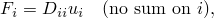

# 31.2.2 Connector elastic behavior


**Products: **Abaqus/Standard  Abaqus/Explicit  Abaqus/CAE  

##### **References**

- ["Connectors: overview," Section 31.1.1](pt06ch31s01abo28.md)
- ["Connector behavior," Section 31.2.1](pt06ch31s02alm27.md)
- [*CONNECTOR BEHAVIOR](../key/key-link.md#usb-kws-mconnectorbehavior)
- [*CONNECTOR ELASTICITY](../key/key-link.md#usb-kws-mconnectorelasticity)
- ["Defining elasticity," Section 15.17.1 of the Abaqus/CAE User's Guide](../usi/usi-link.md#usi-itn-help-elasticity)

### Overview

Spring-like elastic connector behavior: 
- can be defined in any connector with available components of relative motion;
- can be specified for each available component of relative motion independently, in which case the behavior can be linear or nonlinear;
- can be specified as dependent on relative positions or constitutive motions in several local directions; and
- can be specified for all available components of relative motion as coupled linear elastic behavior.

Alternatively, rigid-like behavior can be specified in any of the available components of relative motion using an automatically chosen stiff spring. 

The directions in which the forces and moments act and the displacements and rotations are measured are determined by the local directions as described in ["Connection-type library," Section 31.1.5](pt06ch31s01aus114.md), for each connection type.

### Defining linear uncoupled elastic behavior

In the simplest case of linear uncoupled elasticity you define the spring stiffnesses for the selected components (i.e.,  for component 1,  for component 2, etc.), which are used in the equation



where  is the force or moment in the  component of relative motion and  is the connector displacement or rotation in the  direction. The elastic stiffness can depend on frequency (in Abaqus/Standard), temperature, and field variables. See ["Input syntax rules," Section 1.2.1](pt01ch01s02aus01.md), for further information about defining data as functions of frequency, temperature, and field variables. 

If a frequency-dependent damping behavior is specified in an Abaqus/Standard analysis procedure other than direct-solution steady-state dynamics, the data for the lowest frequency given will be used.

| **Input File Usage: ** | Use the following options to define linear uncoupled elastic connector behavior: |
| --- | --- |
|  | ``` [*CONNECTOR BEHAVIOR](../key/key-link.md#usb-kws-mconnectorbehavior), NAME=*name* [*CONNECTOR ELASTICITY](../key/key-link.md#usb-kws-mconnectorelasticity), COMPONENT=*component number*, DEPENDENCIES=*n* ``` |

| **Abaqus/CAE Usage: ** | Interaction module: connector section editor: ****Add****Elasticity****: **Definition: Linear**, **Force/Moment:** *component or components*, **Coupling: Uncoupled** |
| --- | --- |

### Defining linear coupled elastic behavior

In the linear coupled case you define the spring stiffness matrix components, , which are used in the equation 


where  is the force in the  component of relative motion,  is the motion of the  component, and  is the coupling between the  and  components. The *D* matrix is assumed to be symmetric, so only the upper triangle of the matrix is specified. In connectors with kinematic constraints the entries that correspond to the constrained components of relative motion will be ignored. The elastic stiffness can depend on temperature and field variables. See ["Input syntax rules," Section 1.2.1](pt01ch01s02aus01.md), for further information about defining data as functions of temperature and field variables.

| **Input File Usage: ** | Use the following options to define linear coupled elastic connector behavior: |
| --- | --- |
|  | ``` [*CONNECTOR BEHAVIOR](../key/key-link.md#usb-kws-mconnectorbehavior), NAME=*name* [*CONNECTOR ELASTICITY](../key/key-link.md#usb-kws-mconnectorelasticity), DEPENDENCIES=*n* ``` |

| **Abaqus/CAE Usage: ** | Interaction module: connector section editor: ****Add****Elasticity****: **Definition: Linear**, **Force/Moment:** *component or components*, **Coupling: Coupled** |
| --- | --- |

### Modeling coupled unsymmetric linear stiffness

By definition, linear elastic behavior should be defined by a symmetric spring stiffness matrix. However, Abaqus/Standard allows you to define an unsymmetric coupled spring stiffness matrix. The intended use case is to approximate fluid film bearings supporting a rotating structure in a rotordynamic analysis (see [Genta, 2005](pt06ch31s02alm28.md#econnelasticbehav-genta), and ["Distributed loads," Section 34.4.3](pt07ch34s04aus122.md)). Abaqus/Standard will not check the stability of an unsymmetric spring stiffness matrix; therefore, you must ensure that it is defined properly.

In the linear coupled case you define the spring stiffness matrix components, , which are used in the equation 


where  is the force in the  component of relative motion,  is the motion of the  component, and  is the coupling between the  and  components. The *D* matrix in this case is assumed to be unsymmetric, so the entire matrix is specified. The entries that correspond to the constrained components of relative motion are ignored. When the unsymmetric matrix storage and solution scheme are used, the stiffness can depend on frequency, temperature, and field variables. See ["Input syntax rules," Section 1.2.1](pt01ch01s02aus01.md), for further information about defining data as functions of frequency, temperature and field variables.

| **Input File Usage: ** | Use the following options to define unsymmetric linear coupled stiffness connector behavior: |
| --- | --- |
|  | ``` [*CONNECTOR BEHAVIOR](../key/key-link.md#usb-kws-mconnectorbehavior), NAME=*name* [*CONNECTOR ELASTICITY](../key/key-link.md#usb-kws-mconnectorelasticity), UNSYMM, FREQUENCY DEPENDENCE=ON ``` |

| **Abaqus/CAE Usage: ** | Unsymmetric linear coupled stiffness behavior is not supported in Abaqus/CAE. |
| --- | --- |

### Defining nonlinear elastic behavior

For nonlinear elasticity you specify forces or moments as nonlinear functions of one or more available components of relative motion, . These functions can also depend on temperature and field variables. See ["Input syntax rules," Section 1.2.1](pt01ch01s02aus01.md), for further information about defining data as functions of temperature and field variables.

#### Defining nonlinear elastic behavior that depends on one component direction

By default, each nonlinear force or moment function depends only on the displacement or rotation in the direction of the specified component of relative motion.

| **Input File Usage: ** | Use the following options: |
| --- | --- |
|  | ``` [*CONNECTOR BEHAVIOR](../key/key-link.md#usb-kws-mconnectorbehavior), NAME=*name* [*CONNECTOR ELASTICITY](../key/key-link.md#usb-kws-mconnectorelasticity), COMPONENT=*component number*, NONLINEAR, DEPENDENCIES=*n* ``` |

| **Abaqus/CAE Usage: ** | Interaction module: connector section editor: ****Add****Elasticity****: **Definition:** **Nonlinear**, **Force/Moment:** *component or components*, **Coupling: ** **Uncoupled** |
| --- | --- |

#### Defining nonlinear elastic behavior that depends on several component directions

Alternatively, the functions can depend on the relative positions or constitutive displacements/rotations in several component directions, as described in ["Defining nonlinear connector behavior properties to depend on relative positions or constitutive displacements/rotations" in "Connector behavior," Section 31.2.1](pt06ch31s02alm27.md#usb-elm-econnectbehav-indcomps). In this case the operator matrices are unsymmetric when , for , and unsymmetric matrix storage and solution may be needed in Abaqus/Standard to improve convergence.

| **Input File Usage: ** | Use the following options to define nonlinear elastic connector behavior that depends on components of relative position: |
| --- | --- |
|  | ``` [*CONNECTOR BEHAVIOR](../key/key-link.md#usb-kws-mconnectorbehavior), NAME=*name* [*CONNECTOR ELASTICITY](../key/key-link.md#usb-kws-mconnectorelasticity), COMPONENT=*component number*, NONLINEAR, INDEPENDENT COMPONENTS=POSITION, DEPENDENCIES=*n* ``` Use the following options to define nonlinear elastic connector behavior that depends on components of constitutive displacements or rotations: ``` [*CONNECTOR BEHAVIOR](../key/key-link.md#usb-kws-mconnectorbehavior), NAME=*name* [*CONNECTOR ELASTICITY](../key/key-link.md#usb-kws-mconnectorelasticity), COMPONENT=*component number*, NONLINEAR, INDEPENDENT COMPONENTS=CONSTITUTIVE MOTION, DEPENDENCIES=*n* ``` |

| **Abaqus/CAE Usage: ** | Interaction module: connector section editor: ****Add****Elasticity****: **Definition: Nonlinear**, **Force/Moment:** *component or components*, **Coupling: Coupled on position** or **Coupled on motion** |
| --- | --- |

### Examples

The combined connector in [Figure 31.2.2--1](pt06ch31s02alm28.md#econnectorbehavior-shock-elast) has two available components of relative motion: the relative displacement along the 1-direction (from the SLOT connection) and the rotation around the 1-direction (from the REVOLUTE connection)—see ["Connection-type library," Section 31.1.5](pt06ch31s01aus114.md). Thus, the connector components of relative motion 1 and 4 can be used to specify connector behavior. 

**Figure 31.2.2–1** Simplified connector model of a shock absorber.


 To define a nonlinear torsional spring to resist the relative rotation between the top and the bottom connection point around the local 1-direction, use the following input:
```
[*CONNECTOR SECTION](../key/key-link.md#usb-kws-mconnectorsection), ELSET=shock, BEHAVIOR=sbehavior
slot, revolute
ori,
[*CONNECTOR BEHAVIOR](../key/key-link.md#usb-kws-mconnectorbehavior), NAME=sbehavior
[*CONNECTOR ELASTICITY](../key/key-link.md#usb-kws-mconnectorelasticity), COMPONENT=4, NONLINEAR 
-900., -0.7
   0.,  0.0
1250.,  0.7
```

Although no elastic coupling is assumed to occur between the two available components of relative motion, you could replace the nonlinear moment versus rotation data with coupled linear elastic behavior to define the rotational stiffness around the shock's axis coupled to the axial displacement.

In another application this same connector may have coupled linear elastic behavior, in the sense that relative rotation and sliding affect each other through a linear coupling. To define a translational stiffness of 2000.0 units, the  constant (the 1st entry of a symmetric matrix) is entered in the connector elasticity definition. To define a torsional stiffness of 1000.0 units, the  constant (the 10th entry of a symmetric matrix) is entered; and to define a coupling stiffness of 50.0 units between the available rotation and displacement, the  constant (the 7th entry) is entered.

```
[*CONNECTOR ELASTICITY](../key/key-link.md#usb-kws-mconnectorelasticity)
2000.0, , , , , , 50.0,
0.0, 1000.0, , , , , ,
, , , ,
```

### Defining rigid connector behavior

Rigid-like elastic connector behavior can be used to make an otherwise available component of relative motion rigid. Consider a CARTESIAN connector that has no intrinsic kinematic constraints. If rigid behavior is specified in the local 2- and 3-directions, the connector will behave in a similar fashion to a SLOT connector.

This technique of using connectors with available components of relative motion for which rigid behavior is specified instead of connectors with intrinsically kinematic constraints is particularly useful when you need to:
- customize the constrained components in a connector with available components of relative motion; for example, you can constrain the local 1- and 2-directions in a CARTESIAN connector to define a SLOT-like connector in the 3-direction;
- define rigid plastic behavior (see ["Connector plastic behavior," Section 31.2.6](pt06ch31s02alm32.md)); or
- define rigid damage behavior (see ["Connector damage behavior," Section 31.2.7](pt06ch31s02alm33.md)).

For example, if you use a SLOT connector, plasticity and damage behavior cannot be specified in the intrinsically constrained 2- and 3-directions. To resolve the issue, you can use a CARTESIAN connector with rigid behavior in components 2 and 3 as discussed above and then define rigid plasticity (and/or damage) in these components. See the examples in ["Connector plastic behavior," Section 31.2.6](pt06ch31s02alm32.md), for illustrations.

In Abaqus/Standard an overconstraint may occur if a rigid component is defined in the same local direction as an active connector stop, connector lock, or specified connector motion.

| **Input File Usage: ** | Use the following option to define rigid connector behavior for a specified component of relative motion: |
| --- | --- |
|  | ``` [*CONNECTOR ELASTICITY](../key/key-link.md#usb-kws-mconnectorelasticity), RIGID, COMPONENT=*n* ``` Use the following option to define rigid connector behavior for multiple specified components of relative motion: ``` [*CONNECTOR ELASTICITY](../key/key-link.md#usb-kws-mconnectorelasticity), RIGID *data line listing components to be made rigid* ``` Use the following option to define rigid connector behavior for all available components of relative motion: ``` [*CONNECTOR ELASTICITY](../key/key-link.md#usb-kws-mconnectorelasticity), RIGID *(no data lines)* ``` |

| **Abaqus/CAE Usage: ** | Interaction module: connector section editor: ****Add****Elasticity****: **Definition: Rigid**, **Components:** *component or components* |
| --- | --- |

#### Enforcing rigid-like elastic behavior

Rigid-like elastic behavior in a particular component is enforced by using a stiff, linear elastic spring in that component. The stiffness of the spring is chosen automatically and depends on the circumstances in which the connector is used. In Abaqus/Standard the stiffness is taken to be 10 times larger than the average stiffness of the surrounding elements to which the connector element attaches. If the average stiffness cannot be computed (as would be the case when the connector element does not attach to other elements or attaches to rigid bodies), a stiffness of  is used. In Abaqus/Explicit a Courant stiffness is first computed by considering the average mass at the connector element nodes and the stable time increment in the analysis. In most cases the Courant stiffness is then used to calculate the value of the rigid-like elastic behavior using heuristics that depend on modeling circumstances and the precision (single or double) of the analysis. For example, if plasticity is defined in the connector, the rigid-like elastic stiffness in components involved in the plasticity definition does not exceed one thousandth of the initial yield value. If plasticity is not defined, the rigid-like stiffness is computed as a multiple of the Courant stiffness. 

In most cases, the heuristics used in the computation of the rigid-like stiffness produces a stiffness value that is adequate. If this stiffness does not serve the needs of your application, you can always customize the elastic stiffness by specifying the linear stiffness value directly.

Due to the different stiffness values used for rigid-like elastic behavior in Abaqus/Standard and Abaqus/Explicit, you may notice a discontinuity in the behavior when such a model is imported from one solver to the other.

### Defining elastic connector behavior in linear perturbation procedures

Available components of relative motion with connector elasticity use the linearized elastic stiffness from the base state. In direct-solution steady-state dynamic and subspace-based steady-state dynamic analyses, the linear elastic stiffness defined by an uncoupled connector elasticity behavior may be frequency dependent.

### Output

The Abaqus output variables available for connectors are listed in ["Abaqus/Standard output variable identifiers," Section 4.2.1](pt02ch04s02abv01.md), and ["Abaqus/Explicit output variable identifiers," Section 4.2.2](pt02ch04s02xbv01.md). The following output variables are of particular interest when defining elasticity in connectors:

| CU | Connector relative displacements/rotations. |
| --- | --- |

| CUE | Connector elastic displacements/rotations. |
| --- | --- |

| CEF | Connector elastic forces/moments. |
| --- | --- |

#### Additional reference

- Genta, G., *Dynamics of Rotating Systems, *Springer, 2005.


