# 31.2.4 Connector functions for coupled behavior


**Products: **Abaqus/Standard  Abaqus/Explicit  Abaqus/CAE  

##### **References**

- ["Connectors: overview," Section 31.1.1](pt06ch31s01abo28.md)
- ["Connector friction behavior," Section 31.2.5](pt06ch31s02alm31.md)
- ["Connector plastic behavior," Section 31.2.6](pt06ch31s02alm32.md)
- ["Connector damage behavior," Section 31.2.7](pt06ch31s02alm33.md)
- [*CONNECTOR BEHAVIOR](../key/key-link.md#usb-kws-mconnectorbehavior)
- [*CONNECTOR DERIVED COMPONENT](../key/key-link.md#usb-kws-mconnectorderivedcomp)
- [*CONNECTOR POTENTIAL](../key/key-link.md#usb-kws-mconnectorpotential)
- ["Specifying connector derived components," Section 15.17.15 of the Abaqus/CAE User's Guide](../usi/usi-link.md#usi-itn-help-createderivedcomp)
- ["Specifying potential terms," Section 15.17.16 of the Abaqus/CAE User's Guide](../usi/usi-link.md#usi-itn-help-potential)

### Overview

This section describes how to define two special functions used to specify complex coupled behavior for a connector element in Abaqus: derived components and potentials.

Connector derived components are user-specified component definitions based on a function of intrinsic (1 through 6) connector components of relative motion.  They can be used: 
- to specify the friction-generating normal force in connectors as a complex combination of connector forces and moments, and
- as an intermediate result in a connector potential function.

Connector potentials are user-defined functions of intrinsic components of relative motion or derived components.  These functions can be quadratic, elliptical, or maximum norms. They can be used to define:- the yield function for connector coupled plasticity when several available components of relative motion are involved simultaneously,
- the potential function for coupled user-defined friction when the slip direction is not aligned with an available component of relative motion,
- a magnitude measure as a coupled function of connector forces or motions used to detect the initiation of damage in the connector, and
- an effective motion measure as a coupled function of connector motions to drive damage evolution in the connector.

### Defining derived components for connector elements

The definition of coupled behavior in connector elements beyond simple linear elasticity or damping often requires the definition of a resultant force involving several intrinsic (1 through 6) components or the definition of a “direction” not aligned with any of the intrinsic components.  These user-defined resultants or directions are called derived components.  The forces and motions associated with these derived components are functions of the forces and motions in the intrinsic relative components of motion in the connector element.

Consider the case of a SLOT connector for which frictional effects (see ["Connector friction behavior," Section 31.2.5](pt06ch31s02alm31.md)) are defined in the only available component of relative motion (the 1-direction). The two constraints enforced by this connection type will produce two reaction forces ( and ), as shown in [Figure 31.2.4--1](pt06ch31s02alm30.md#usb-elm-econnect-derivecompslot). Both forces generate friction in the 1-direction in a coupled fashion. 

**Figure 31.2.4–1** Resultant contact force in a SLOT connector.

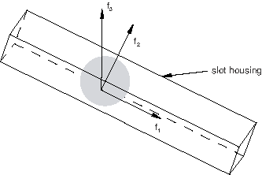

A reasonable estimate for the resulting contact force is 

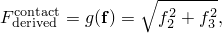

where  is the collection of connector forces and moments in the intrinsic components. The function  can be specified as a derived component.

Resultant forces that can be defined as derived components may take more complicated forms. Consider a BUSHING connection type for which a tensile (Mode I) damage mechanism with failure is to be specified in the 1-direction. You may wish to include the effects of the axial force  and of the resultant of the “flexural” moments  and  in defining an overall resultant force in the axial direction upon which damage initiation (and failure) can be triggered, as shown in [Figure 31.2.4--2](pt06ch31s02alm30.md#usb-elm-econnect-derivecompbush). 

**Figure 31.2.4–2** Resultant axial force in a BUSHING connector.

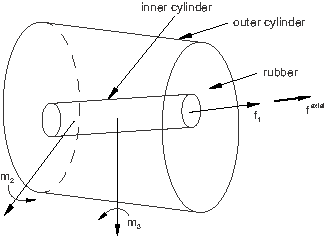

One choice would be to define the resultant axial force as 

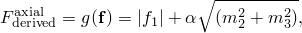

where  is a geometric factor relating translations to rotations with units of one over length. The function  can be specified as a derived component.

A derived component can also be interpreted as a user-specified direction that is not aligned with the connector component directions. For example, if the motion-based damage with failure criterion in a CARTESIAN connection with elastic behavior does not align with the intrinsic component directions, the damage criterion can be defined in terms of a derived component representing a different direction, as shown in [Figure 31.2.4--3](pt06ch31s02alm30.md#usb-elm-econnect-derivecompcart).

**Figure 31.2.4–3** User-defined direction in a CARTESIAN connector.


 One possible choice for the direction could be 


where  is the collection of connector relative motions in the components and , , and  can be interpreted as direction cosines (, , 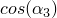). The function  can be specified as a derived component.

#### Functional form of the derived component

The functional form of a derived component 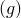 in Abaqus is quite general; you specify its exact form. The derived component is specified as a sum of terms

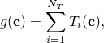

where  is a generic name for the connector intrinsic component values (such as forces, , or motions, ),  is the  term in the sum, and  is the number of terms. The appropriate component values for  are selected depending on the context in which the derived component is used.  is also a summation of several contributions and can take one of the following three forms: - a norm (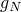-type) 
- a direct sum (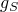-type) 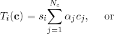
- a Macauley sum (-type) 

where  is the term's sign (plus or minus), 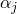 are scaling factors, 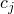 is the  component of , and  is the Macauley bracket (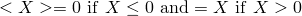). In general, the units of the scaling factors  depend on the context. In most cases they are either dimensionless, have units of length, or have units of one over length. The scaling factors should be chosen such that all the terms in the resulting derived component have the same units, and these units must be consistent with the use of the derived component later on in a connector potential or connector contact force.

#### Defining a derived component with only one term (*NT = 1*)

Connector derived components are identified by the names given to them. If one term () is sufficient to define the derived component *g*, specify only one connector derived component definition.

| **Input File Usage: ** | ``` [*CONNECTOR DERIVED COMPONENT](../key/key-link.md#usb-kws-mconnectorderivedcomp), NAME=*derived_component_name* ``` |
| --- | --- |

| **Abaqus/CAE Usage: ** | Connector derived component names are not supported in Abaqus/CAE; you define the individual derived component terms. |
| --- | --- |
|  | Use the following input to define a connector derived component term for a friction-generating user-defined contact force: Interaction module: connector section editor: ****Add****Friction****: **Friction model**: **User-defined**, **Contact Force**, **Specify component**: **Derived component**, click **Edit** to display the derived component editor: click **Add** and select components Use the following input to define a connector derived component term as an intermediate result in a connector potential function: Interaction module: connector section editor: ****Add****Friction****, **Plasticity**, or **Damage**: potential contribution editors: **Specify derived component**, click **Edit** to display the derived component editor: click **Add** and select components |

#### Defining a derived component containing multiple terms (*NT > 1*)

If several terms (, , etc.) are needed  in the overall definition of the derived component *g*, you must define the individual terms. 

| **Input File Usage: ** | You must specify  connector derived component definitions with the same name to define the individual terms. All definitions with the same name will be summed together to produce the desired derived component *g*. See the spot weld example below for an illustration. |
| --- | --- |
|  | ``` [*CONNECTOR DERIVED COMPONENT](../key/key-link.md#usb-kws-mconnectorderivedcomp), NAME=*derived_component_name* [*CONNECTOR DERIVED COMPONENT](../key/key-link.md#usb-kws-mconnectorderivedcomp), NAME=*derived_component_name* ... ``` |

| **Abaqus/CAE Usage: ** | Connector derived component names are not supported in Abaqus/CAE; you define the individual derived component terms. |
| --- | --- |
|  | Interaction module: derived component editor: click **Add** and select components. Repeat, adding terms as necessary. |

#### Specifying a term in the derived component as a norm

By default, a derived component term is computed as the square root of the sum of the squares of each intrinsic component contribution. If the term has only one contribution (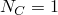), the norm has the same meaning as the absolute value.

| **Input File Usage: ** | ``` [*CONNECTOR DERIVED COMPONENT](../key/key-link.md#usb-kws-mconnectorderivedcomp), NAME=*derived_component_name*, OPERATOR=NORM (default) ``` |
| --- | --- |
|  | For example, the following input can be used to define the 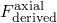 component discussed above: ``` [*CONNECTOR DERIVED COMPONENT](../key/key-link.md#usb-kws-mconnectorderivedcomp), NAME=axial 1 1.0, **  [*CONNECTOR DERIVED COMPONENT](../key/key-link.md#usb-kws-mconnectorderivedcomp), NAME=axial 5, 6 ,  **  ``` The `axial` derived component is . |

| **Abaqus/CAE Usage: ** | Interaction module: derived component editor: **Add**: **Term operator: Square root of sum of squares** |
| --- | --- |

#### Specifying a term in the derived component as a direct sum

Alternatively, you can choose to compute a derived component term as the direct sum of the intrinsic component contributions.

| **Input File Usage: ** | ``` [*CONNECTOR DERIVED COMPONENT](../key/key-link.md#usb-kws-mconnectorderivedcomp), NAME=*derived_component_name*, OPERATOR=SUM ``` |
| --- | --- |
|  | For example, the following input can be used to define the  component discussed above: ``` [*CONNECTOR DERIVED COMPONENT](../key/key-link.md#usb-kws-mconnectorderivedcomp), NAME=transf, OPERATOR=SUM 1, 2, 3 , ,  **  ``` The `transf` derived component is 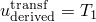. |

| **Abaqus/CAE Usage: ** | Interaction module: derived component editor: **Add**: **Term operator: Direct sum** |
| --- | --- |

#### Specifying a term in the derived component as a Macauley sum

Alternatively, you can choose to compute a derived component term as the Macauley sum of the intrinsic component contributions.

| **Input File Usage: ** | ``` [*CONNECTOR DERIVED COMPONENT](../key/key-link.md#usb-kws-mconnectorderivedcomp), NAME=*derived_component_name*, OPERATOR=MACAULEY SUM ``` |
| --- | --- |
|  | For example, the following input can be used to define the first term of the normal component of the force () in the spotweld example discussed below: ``` [*CONNECTOR DERIVED COMPONENT](../key/key-link.md#usb-kws-mconnectorderivedcomp), NAME=normal, OPERATOR=MACAULEY SUM 3 1.0 **  ``` |

| **Abaqus/CAE Usage: ** | Interaction module: derived component editor: **Add**: **Term operator: Macauley sum** |
| --- | --- |

#### Specifying the sign of a term

You can specify whether the sign of a derived component term should be positive or negative.

| **Input File Usage: ** | Use one of the following options: |
| --- | --- |
|  | ``` [*CONNECTOR DERIVED COMPONENT](../key/key-link.md#usb-kws-mconnectorderivedcomp), NAME=*derived_component_name*, SIGN=POSITIVE (default) [*CONNECTOR DERIVED COMPONENT](../key/key-link.md#usb-kws-mconnectorderivedcomp), NAME=*derived_component_name*, SIGN=NEGATIVE ``` |

| **Abaqus/CAE Usage: ** | Interaction module: derived component editor: **Add**: **Overall term sign: Positive** or **Negative** |
| --- | --- |

#### Defining the derived component contributions to depend on local directions

The scaling factors  used in the definition of the derived component can depend on the relative positions or constitutive displacements/rotations in several component directions, as described in ["Defining nonlinear connector behavior properties to depend on relative positions or constitutive displacements/rotations" in "Connector behavior," Section 31.2.1](pt06ch31s02alm27.md#usb-elm-econnectbehav-indcomps). See the first example in ["Connector friction behavior," Section 31.2.5](pt06ch31s02alm31.md), for an illustration.

| **Input File Usage: ** | Use the following option to define a connector derived component that depends on components of relative position: |
| --- | --- |
|  | ``` [*CONNECTOR DERIVED COMPONENT](../key/key-link.md#usb-kws-mconnectorderivedcomp), INDEPENDENT COMPONENTS=POSITION ``` Use the following option to define a connector derived component that depends on components of constitutive displacements or rotations: ``` [*CONNECTOR DERIVED COMPONENT](../key/key-link.md#usb-kws-mconnectorderivedcomp), INDEPENDENT COMPONENTS=CONSTITUTIVE MOTION ``` |

| **Abaqus/CAE Usage: ** | Interaction module: derived component editor: **Add**: **Use local directions: Independent position components** or **Independent constitutive motion components** |
| --- | --- |

#### Requirements for constructing a derived component used in plasticity or friction definitions

When a derived component is used to construct the yield function for a plasticity or friction definition, the following simple requirements must be satisfied:
- All  terms of a derived component must be of a compatible type (see ["Functional form of the derived component](pt06ch31s02alm30.md#usb-elm-econnbehav-cdc)"); norm-type terms (-type) cannot be mixed with direct sum-type terms (-type) in the same derived component definition but can be mixed with Macauley sum-type terms (-type).
- If all  terms are norm-type terms, the sign of each term must be positive (the default).

If  is greater than 1, the associated functions (potentials) in which the derived component is used may become non-smooth. More precisely, the normal to the hyper-surface defined by the potential may experience sudden changes in direction at certain locations. In these cases, Abaqus will automatically smooth-out the defined functions by slightly changing the derived component functional definition. These changes should be transparent to the user as the results of the analysis will change only by a small margin.

#### Example: spot weld

The spot weld shown in [Figure 31.2.4--4](pt06ch31s02alm30.md#usb-elm-econnect-weldexample-phist) is subjected to loading in the *F*-direction. 

**Figure 31.2.4–4** Loading of a spot weld connection.


The connector chosen to model the spot weld has six available components of relative motion: three translations (components 1–3) and three rotations (components 4–6). You have chosen this connection type because you are modeling a general deformation state. However, you would like to define inelastic behavior in the connection in terms of a normal and a shear force, as shown in [Figure 31.2.4--5](pt06ch31s02alm30.md#usb-elm-econnect-weldexample-der), since experimental data are available in this format. 

**Figure 31.2.4–5** Spot weld connection: derived component definitions.

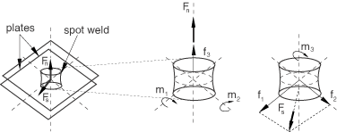

Therefore, you want to derive the normal and shear components of the force, for example, as follows:


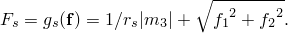

In these equations 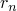 and  have units of length; their interpretation is relatively straightforward if you consider the spot weld as a short beam with the axis along the spot weld axis (3-direction). If the average cross-section area of the spot weld is *A* and the beam's second moment of inertia about one of the in-plane axes is  (or ),  can be interpreted as the square root of the ratio  (or 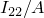). Furthermore, if the cross-section is considered to be circular,  becomes equal to a fraction of the spot weld radius. In all cases  can be taken to be . 

The reasoning above for the interpretation of the calibration constants in the equations is only a suggestion. In general, any combination of constants that would lead to good comparisons with other results (experimental, analytical, etc.) is equally valuable.

To define , you would specify the following two connector derived component definitions, each with the same name:

```
[*PARAMETER](../key/key-link.md#usb-kws-mparameter) 
=30.68 
*A*=19.63 
=sqrt(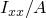) 
= 
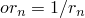 
 
[*CONNECTOR DERIVED COMPONENT](../key/key-link.md#usb-kws-mconnectorderivedcomp), NAME=normal, OPERATOR=MACAULEY SUM 
3 
1.0 
[*CONNECTOR DERIVED COMPONENT](../key/key-link.md#usb-kws-mconnectorderivedcomp), NAME=normal 
4, 5 
, 
```
The  symbols denote that 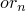 is specified using a parameter definition. The normal force derived component  is defined as the sum of two terms, 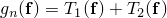. The first connector derived component defines the first term , while the second defines the second term .

Similarly, to define , you would specify the following two connector derived component definitions for the component `shear`:

```
[*CONNECTOR DERIVED COMPONENT](../key/key-link.md#usb-kws-mconnectorderivedcomp), NAME=shear 
6 
 
[*CONNECTOR DERIVED COMPONENT](../key/key-link.md#usb-kws-mconnectorderivedcomp), NAME=shear 
1, 2 
1.0, 1.0
```

### Defining connector potentials

Connector potentials are user-defined mathematical functions that represent yield surfaces, limiting surfaces, or magnitude measures in the space spanned by the components of relative motion in the connector. The functions can be quadratic, general elliptical, or maximum norms. The connector potential does not define a connector behavior by itself; instead, it is used to define the following coupled connector behaviors: 
- friction,
- plasticity, or
- damage.

Consider the case of a SLIDE-PLANE connection in which frictional sliding occurs in the connection plane, as shown in [Figure 31.2.4--6](pt06ch31s02alm30.md#usb-elm-econnect-derivecompslide).

**Figure 31.2.4–6** Friction in the SLIDE-PLANE connection.

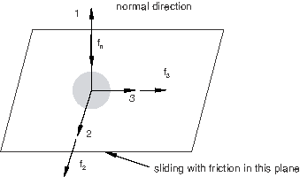

 The function governing the stick-slip frictional behavior (see ["Connector friction behavior," Section 31.2.5](pt06ch31s02alm31.md)) can be written as


 where  is the connector potential defining the pseudo-yield function (the magnitude of the frictional tangential tractions in the connector in a direction tangent to the connection plane on which contact occurs),  is the friction-producing normal (contact) force, and  is the friction coefficient. Frictional stick occurs if , and sliding occurs if . In this case the potential can be defined as the magnitude of the frictional tangential tractions,


Connector potentials can also be useful in defining connector damage with a force-based coupled damage initiation criterion. For example, in a connection type with six available components of relative motion you could define a potential

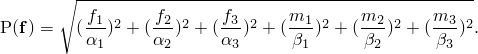

Damage (with failure) can be initiated when the value of the potential  is greater than a user-specified limiting value (usually 1.0). The units of the  and  coefficients must be consistent with the units of the final product. For example, if the intended units of  are newtons, the  coefficients are dimensionless while the  coefficients have units of one over length.

Connector potentials can take more complicated forms. Assume that coupled plasticity is to be defined in a spot weld, in which case a plastic yield criterion can be defined as 


where  is the connector potential defining the yield function and  is the yield force/moment. The potential could be defined as 


where  and  could be the named derived components `normal` and `shear` defined in the example in ["Defining derived components for connector elements](pt06ch31s02alm30.md#usb-elm-econnectbehav-derivedcomps)” above. If  has units of force and  and  also have units of force,  and  are dimensionless.

| **Input File Usage: ** | [*CONNECTOR POTENTIAL](../key/key-link.md#usb-kws-mconnectorpotential) |
| --- | --- |

| **Abaqus/CAE Usage: ** | Use the following input to define connector potentials for friction behavior: |
| --- | --- |
|  | Interaction module: connector section editor: ****Add****Friction****: **Friction model: User-defined**, **Slip direction: Compute using force potential**, **Force Potential** Use the following input to define connector potentials for plasticity behavior: Interaction module: connector section editor: ****Add****Plasticity****: **Coupling: Coupled**, **Force Potential** Use the following input to define connector potentials for damage behavior: Interaction module: connector section editor: ****Add****Damage****: **Coupling: Coupled**, **Initiation Potential** or **Evolution Potential** |

#### Functional form of the potential

The functional form of the potential  in Abaqus is quite general; you specify its exact form. The potential is specified as one of the following direct functions of several contributions:

a quadratic form


a general elliptical form


a maximum form


where  is a generic name for the connector intrinsic component values (such as forces, , or motions, ),  is the  contribution to the potential, 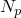 is the number of contributions,  and  are positive numbers (defaults  2.0, 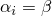), and  is the overall sign of the contribution (1.0 – default, or 1.0). The appropriate component values for  are selected depending on the context in which the potential is used in. The positive exponents (, ) and the sign  should be chosen such that the contribution  yields a real number.

 is a direct function of either an intrinsic connector component (1 through 6) or a derived connector component. Since derived components are ultimately a function of intrinsic components (see  ["Defining derived components for connector elements](pt06ch31s02alm30.md#usb-elm-econnectbehav-derivedcomps)”), the contribution  is ultimately a function of .  is defined as


where


is the function used to generate the contribution:
- absolute value (default, ),
- Macauley bracket (), or
- identity (*X*);


is the value of the identified component (intrinsic or derived);


is a shift factor (default 0.0); and


is a scaling factor (default 1.0).

The function  can be the identity function only if . The units of the various coefficients in the equations above depend on the context in which the potential is used. In most cases the coefficients in the equations above are either dimensionless, have units of length, or have units of one over length. In all cases you must be careful in defining potentials for which the units are consistent.

#### Defining the potential as a quadratic or general elliptical form

To define a general elliptical form of the potential, you must specify the inverse of the overall exponent, . You can also define the exponents  if they are different from the default value, which is the specified value of . 

| **Input File Usage: ** | To define a quadratic form of the potential, you can omit specifying  since its default value is 2.0. Use the following option: |
| --- | --- |
|  | ``` [*CONNECTOR POTENTIAL](../key/key-link.md#usb-kws-mconnectorpotential) *component name or number*, , , , ,  ... ``` Use the following option to define a general elliptical form of the potential: ``` [*CONNECTOR POTENTIAL](../key/key-link.md#usb-kws-mconnectorpotential), OPERATOR=SUM, EXPONENT= *component name or number*, , , , ,  ... ``` Each data line defines one contribution to the potential, . The function  can be ABS (absolute value and the default), MACAULEY (Macauley bracket), or NONE (identity). |

| **Abaqus/CAE Usage: ** | Interaction module: connector section editor: friction, plasticity, or damage behavior option: **Force Potential**, **Initiation Potential**, or **Evolution Potential**: **Operator: Sum**, **Exponent**: 2 (for quadratic form) or  (for elliptical form), select **Add** and enter data for the potential contribution. Repeat, adding contributions as necessary. |
| --- | --- |

#### Defining the potential as a maximum form

Alternatively, you can define the potential as a maximum form.

| **Input File Usage: ** | ``` [*CONNECTOR POTENTIAL](../key/key-link.md#usb-kws-mconnectorpotential), OPERATOR=MAX *component name or number*, , , , ,  ... ``` |
| --- | --- |
|  | Each data line defines one contribution to the potential, . The function  can be ABS (absolute value and the default), MACAULEY (Macauley bracket), or NONE (identity). |

| **Abaqus/CAE Usage: ** | Interaction module: connector section editor: friction, plasticity, or damage behavior option: **Force Potential**, **Initiation Potential**, or **Evolution Potential**: **Operator: Maximum**, select **Add** and enter data for the potential contribution. Repeat, adding contributions as necessary. |
| --- | --- |

#### Requirements for constructing a potential used in plasticity or friction definitions

The connector potential, 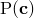, can be defined using intrinsic components of relative motion, derived components, or both. A particular contribution to the potential may be one of the following two types:
- A norm-type contribution (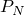) defined using the absolute value or the Macauley bracket functions or using a combination of norm-type  and Macauley sum-type  derived components (see ["Requirements for constructing a derived component used in plasticity or friction definitions](pt06ch31s02alm30.md#usb-elm-econnect-req-cdc)") with any of the available functions.
- A sum-type contribution () defined using an intrinsic component of relative motion or a derived component of type  (see ["Requirements for constructing a derived component used in plasticity or friction definitions](pt06ch31s02alm30.md#usb-elm-econnect-req-cdc)") together with the identity function.

When used in the context of connector plasticity or connector friction, the potential must be constructed such that the following requirements are satisfied:- All  contributions to the potential must be of the same type. Mixed  and  contributions are not allowed in the same potential definition.
- If all  terms are -type terms, the sign of each term must be positive (the default).
- The positive numbers  and  cannot be smaller than 1.0 and must be equal (the default).

#### Example: spot weld

Referring to the spot weld shown in [Figure 31.2.4--5](pt06ch31s02alm30.md#usb-elm-econnect-weldexample-der) and the yield function 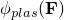 defined above, you would define this potential using the derived components `normal` and `shear` with the following input:

```
[*PARAMETER](../key/key-link.md#usb-kws-mparameter) 
=0.02 
=0.05 
=1.5 
[*CONNECTOR POTENTIAL](../key/key-link.md#usb-kws-mconnectorpotential), EXPONENT= 
normal, , , MACAULEY 
shear, , , ABS
```

### Output

The Abaqus/Explicit output variables available for connectors are listed in ["Abaqus/Explicit output variable identifiers," Section 4.2.2](pt02ch04s02xbv01.md). The following variables (available only in Abaqus/Explicit ) are of particular interest when defining connector functions for coupled behavior:

| CDERF | Connector derived force/moment with the connector derived component name appended to the output variable. If the connector derived component is used with connector plasticity, connector friction, and connector damage initiation (type force), the derived components used to form the potential represent forces and this quantity is available for both field and history output. If connector friction is used with contact force, the derived components are not used to form a potential, and the derived force is in fact the connector normal force CNF (which is available for connector history output.) |
| --- | --- |

| CDERU | Connector derived displacement/rotation with the connector derived component name appended to the output variable. If the connector derived component is used with motion type for the connector damage initiation and connector damage evolution, the derived components to form the potential represent displacements and this quantity is available for both field and history output. |
| --- | --- |


